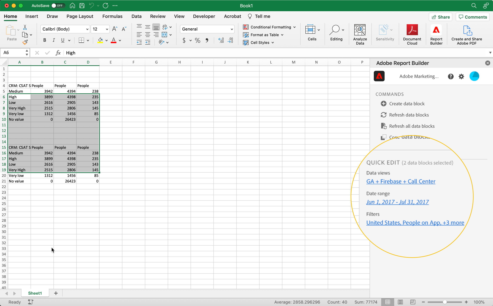

# Werken met filters in Report Builder

U kunt Filters toepassen wanneer u een nieuw gegevensblok creeert of wanneer u **uitgeeft gegevensblok** optie van het paneel van BEVELINGEN selecteert.

## Filters toepassen op een gegevensblok

Als u een filter op het volledige gegevensblok wilt toepassen, dubbelklikt u op een filter of sleept u filters uit de lijst met componenten naar de sectie Filters van de tabel.

## Filters toepassen op individuele metriek

Als u filters wilt toepassen op afzonderlijke maateenheden, sleept u een filter naar een metrische waarde in de tabel. U kunt ook op **klikken...** pictogram rechts van metrisch in de ruit van de Lijst en selecteer dan **metrisch** filtreren. Als u toegepaste filters wilt weergeven, plaatst u de muisaanwijzer boven of selecteert u een metrische waarde in het deelvenster Tabel. Metrische gegevens met toegepaste filters geven een filterpictogram weer.

<!--  -->

## Filters voor snel bewerken

Met het deelvenster Snel bewerken kunt u filters voor bestaande gegevensblokken toevoegen, verwijderen of vervangen.

Wanneer u een bereik cellen in het werkblad selecteert, wordt met de koppeling **Filters** in het deelvenster Snel bewerken een overzicht weergegeven van de filters die worden gebruikt door de gegevensblokken in die selectie.

Filters bewerken met het deelvenster Snel bewerken

1. Selecteer een bereik cellen uit een of meerdere gegevensblokken.

   

1. Klik op de koppeling Filters om het deelvenster Snel bewerken - Filters te starten.

   

### Een filter toevoegen of verwijderen

U kunt filters toevoegen of verwijderen met de opties Toevoegen/Verwijderen.

1. Selecteer het tabblad **Toevoegen/verwijderen** in het deelvenster Quick edit-filters.

   Alle filters die op de geselecteerde gegevensblokken worden toegepast, worden vermeld in het deelvenster Quick Edit-filters. Filters die op alle gegevensblokken in de selectie zijn toegepast, worden weergegeven onder de kop **Toegepast op alle geselecteerde gegevensblokken**. Filters die op sommige maar niet alle gegevensblokken worden toegepast, worden vermeld onder de kop **Toegepast op 1 of meer geselecteerde gegevensblokken**.

   Wanneer de geselecteerde gegevensblokken meerdere filters bevatten, kunt u naar specifieke filters zoeken met het zoekveld **Filter toevoegen**.

   

1. Voeg filters toe door filters van **Add filter** drop-down menu te selecteren.

   De lijst met doorzoekbare filters bevat alle filters die toegankelijk zijn voor de gegevensweergaven die aanwezig zijn in een of meer van de geselecteerde gegevensblokken, en alle filters die algemeen beschikbaar zijn in de organisatie.

   Wanneer u een filter toevoegt, wordt het filter toegepast op alle gegevensblokken in de selectie.

1. Als u filters wilt verwijderen, klikt u op het verwijderingspictogram **x** rechts van de filters in de lijst **Toegepaste filters**.

1. Klik **Toepassen** om veranderingen te bewaren en aan het hubpaneel terug te keren.

   Report Builder geeft een bericht weer ter bevestiging van de wijzigingen van het toegepaste filter.

### Een filter vervangen

U kunt een bestaand filter vervangen door een ander filter om te wijzigen hoe de gegevens worden gefilterd.

1. Selecteer het tabblad **Vervangen** in het deelvenster Quick edit-filters.

   

1. Gebruik het **Zoekoverzicht** onderzoeksgebied om van specifieke filters de plaats te bepalen.

1. Kies een of meer filters die u wilt vervangen.

1. Zoek een of meer filters in het veld Vervangen door.

   Als u een filter selecteert, wordt dit toegevoegd aan **Vervangen door**.. lijst.

   

1. Klik **Toepassen**.

   Report Builder werkt de lijst met filters bij om de vervanging te weerspiegelen.
