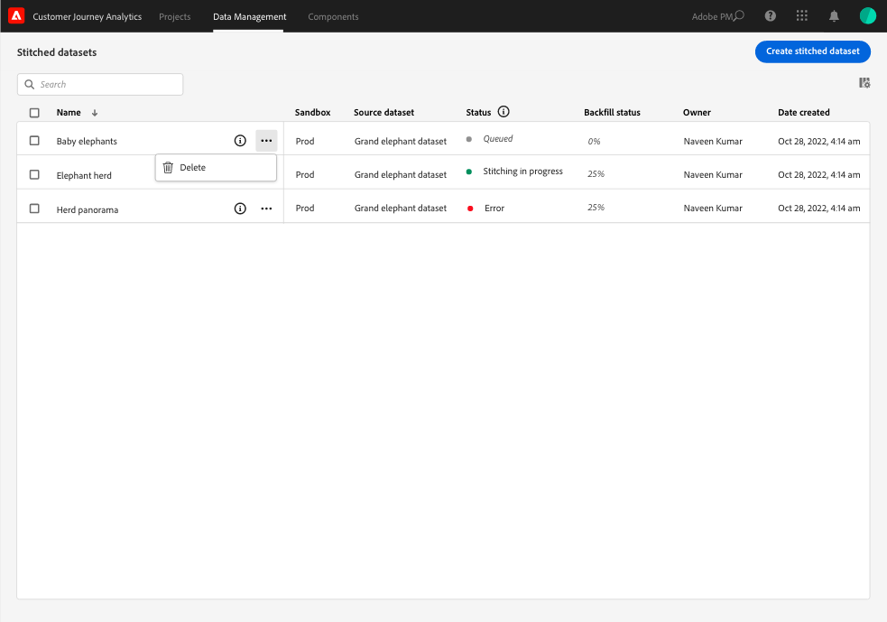

# Verstikte gegevenssets maken en beheren

{{select-package}}

Door middel van titelformaat kunnen beheerders identiteiten op gegevenssets die beschikbaar zijn in Customer Journey Analytics aan elkaar koppelen. Door gegevenssets in te stellen, vergroot u de nauwkeurigheid van de weergave van een profiel. Dit resulteert uiteindelijk in een betere analyse en rapportage.

Met het koppelingsproces kunt u een bestaande **blijvende id** in een gegevensset. Koppel die permanente id vervolgens aan voor een opgegeven afspeelvenster (dagelijks, wekelijks) met de meest accurate **transient ID** (persoon of voor authentiek verklaard herkenningsteken) beschikbaar voor die dataset. Voorbeelden van transient-id&#39;s zijn e-mail, telefoonnummer, CRM-id of andere id&#39;s die in de grafiek zijn opgeslagen. Zie [Overzicht](overview.md) voor meer informatie over stitching .

## Maken

Om het stitching in werking te stellen, creeert u één of meerdere gestikte datasets. Een gestikte dataset maken:

1. Selecteren **[!UICONTROL ** Stiksel **]** van **[!UICONTROL ** Gegevensbeheer **]** op de bovenste balk.

2. In de [!UICONTROL Stitched datasets] scherm, selecteren **[!UICONTROL ** Verstikte gegevensset maken **]**.

   Er wordt een dialoogvenster weergegeven met uitleg over uw verantwoordelijkheden.

3. Selecteren **[!UICONTROL ** Doorgaan **]** als u deze verantwoordelijkheden aanvaardt.

   >[!NOTE]
   >
   >    Als u **[!UICONTROL ** Annuleren **]**, kunt u geen gestikte dataset tot stand brengen.

4. In de [!UICONTROL Stitched datasets > Untitled stitched dataset] scherm:

   1. Een **[!UICONTROL ** Naam gegevensset **]** en (optioneel) **[!UICONTROL ** Beschrijving **]**,

   2. Selecteer de sandbox in het menu **[!UICONTROL ** Sandbox **]** lijst waar de gebeurtenisdataset wordt opgeslagen.

      

   3. Selecteer de **[!UICONTROL ** Brongegevensset selecteren **]** knop.

      In de [!UICONTROL Select one dataset to stitch] pop-upvenster:

      

      - Selecteer een gegevensset en selecteer **[!UICONTROL ** Selecteren **]** om door te gaan.

   4. Selecteer een permanente id in het menu **[!UICONTROL ** Blijvende id **]** lijst.

   5. Selecteer een tijdelijke id in het menu **[!UICONTROL ** Tijdelijke id **]** lijst.

      U ziet dat een voorvertoningsvenster wordt weergegeven voor het berekenen van de verzadigingssnelheden (het aantal keren dat er een waarde is voor elk van de opgegeven id&#39;s over het aantal gebeurtenissen) gedurende de laatste zeven dagen. Na het berekenen wordt in het deelvenster met kleuren weergegeven of aan de minimale voorwaarden voor stitching is voldaan (groen) of dat niet (rood).

      

      De minimumvoorwaarden zijn:

      - blijvende id-verzadiging: frequentie >= 95%

      - verzadiging van transient identifier: snelheid >= 5%

        Als aan de minimale voorwaarden wordt voldaan, kunt u experimenteren met samplewaarden.

      - Selecteren **[!UICONTROL ** Aan demo bevestigde id&#39;s maken **]**.

        In de [!UICONTROL Experiment with sample values] wordt een tabel weergegeven met de voorbeeldwaarde voor [!UICONTROL timestamp], [!UICONTROL Persistent ID], [!UICONTROL Transient ID], [!UICONTROL Stitched ID (Live)], [!UICONTROL Stitched ID (1-day replay)], en [!UICONTROL Stitched ID (7-day replay)].

            
            
            1.  Voer een waarde in voor de **[!UICONTROL **Persistent ID**]**.
            
            2.  Selecteren **[!UICONTROL **Refresh stitched IDs**]** om het effect van het stitching proces op de gegevens in de dataset te zien.
            
            3.  Selecteren **[!UICONTROL **Close**]** als u klaar bent met het experimenteren met samplewaarden.
        

        Terug in de [!UICONTROL Stitched datasets > _Naam gegevensset_] scherm:

   6. Selecteer een optie voor de frequentie en de periode waarin historische gegevens opnieuw moeten worden vermeld in het dialoogvenster **[!UICONTROL ** Venster opnieuw afspelen **]** lijst.

      U kunt kiezen tussen de standaardwaarde **[!UICONTROL ** Vorige dag, dag **]** of **[!UICONTROL ** Vorige 7 dagen, wekelijks **]**.

   7. Selecteer een waarde in het menu **[!UICONTROL ** Gemiddeld aantal dagelijkse gebeurtenissen **]** lijst.

   8. Voer een waarde in (tussen `0` en `12`) in **[!UICONTROL ** Aantal maanden dat moet worden hersteld **]**.

   9. Selecteren **[!UICONTROL ** Opslaan **]** om uw gestikte dataset te bewaren en het stitching in werking te stellen.

## Status weergeven

U kunt de status van stitching weergeven in het dialoogvenster [!UICONTROL Stitched datasets] lijst.

- Selecteren **[!UICONTROL ** Stiksel **]** van **[!UICONTROL ** Gegevensbeheer **]** op de bovenste balk.

  U ziet een lijst met gestikte gegevenssets, elk geïdentificeerd met [!UICONTROL Sandbox], [!UICONTROL Source dataset], [!UICONTROL Status], [!UICONTROL Backfill status], [!UICONTROL Owner], en [!UICONTROL Date created].

  

  Mogelijke waarden voor [!UICONTROL Status] zijn:

  | Waarde | Toelichting |
  |-----|-----|
  | **[!UICONTROL ** In wachtrij **]** | Het verzoek wordt ontvangen en verwerkt spoedig. |
  | **[!UICONTROL ** Maken **]** in uitvoering | De middelen en onlangs gestikte dataset zijn in creatie. |
  | **[!UICONTROL ** Telling wordt uitgevoerd **]** | De middelen en de stitching dataset bestaan en het stitching is lopend |
  | **[!UICONTROL ** Fout **]** | Er is een probleem met stitching. Mogelijk is een schema gewijzigd tussen de brondataset en de gebonden dataset, is het dagelijkse volume te groot, of... (_**meer informatie nodig...**_) |

  >[!INFO]
  >
  >    Wanneer een status verandert, wordt een melding verzonden met het bericht **[!UICONTROL ** Stitched dataset _naam van gegevensset_ is gewijzigd in status _naam van status _**]**.

  De [!UICONTROL Backfill status] U kunt de volgende waarden hebben: 0%, 25%, 50%, 75% of 100%.

  U kunt het informatiepictogram selecteren om een pop-up met meer details op de geselecteerde gestikte dataset te tonen.

## Verwijderen

>[!NOTE]
>
>U kunt alleen gegevenssets verwijderen die de status hebben [!UICONTROL Stitching in progress], [!UICONTROL Error], of [!UICONTROL Queued].

Eén verankerde gegevensset verwijderen:

- Selecteren **[!UICONTROL **...**]** voor de genormaliseerde gegevensset en selecteer **[!UICONTROL ** Verwijderen **]** in het menu.

  

Meerdere gestikte gegevens verwijderen:

- Selecteer veelvoudige gestikte datasets gebruikend checkbox bij het begin van elke vermelde dataset.

- Selecteren **[!UICONTROL **...**]** van één van de geselecteerde gestikte datasets en selecteer **[!UICONTROL ** Verwijderen **]** in het menu.
