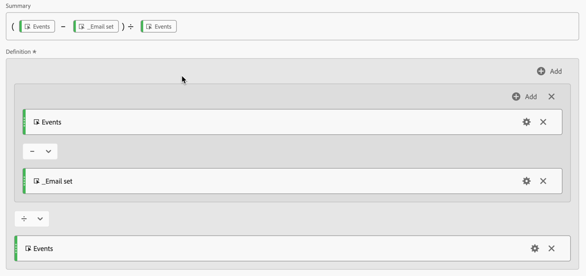

# Stikken valideren

Het doel van [ identiteit het stitching ](/help/stitching/overview.md) (of eenvoudig, het stitching) is de geschiktheid van een gebeurtenisdataset voor kanaalanalyse te verhogen. Deze verhoging wordt bereikt wanneer alle rijen van gegevens in de dataset de gewenste hoogste orde van identiteit bevatten die beschikbaar is. Deze verhoging staat u dan toe:

* Persoonlijke rapporten maken, zonder anonieme personen uit te sluiten.
* Meerdere apparaten aansluiten op één persoon.
* Verbind een persoon over kanalen.

Dit artikel schetst analysemethodes om de verhoging op één of meerdere nieuw gecreëerde gestikte datasets te meten en vertrouwen te verstrekken dat het stitching deze voordelen levert.

De analysemethodes impliceren {de montages van de de meningscomponent van 0} Gegevens ](/help/data-views/component-settings/overview.md) die typisch toegankelijk aan beheerders zijn. [ De methodes vereisen ook analisten, die in een project van Analysis Workspace werken, om berekende metriek en visualisaties tot stand te brengen.

Hoewel deze analysemethoden kunnen worden gebruikt voor stitching in het veld en op grafiek gebaseerde stitching, zijn sommige elementen mogelijk niet aanwezig in de dataset, vooral in een op grafiek gebaseerd stitching scenario. Deze ontbrekende elementen kunnen het moeilijk maken om de lift rechtstreeks in Analysis Workspace te berekenen.

>[!NOTE]
>
>Dit artikel richt niet de algemene waarde van een configuratie van Customer Journey Analytics die alle datasets in Experience Platform heeft die aan zelfde identiteitsnamespace worden gericht. En dat al deze datasets vriendschappelijk worden samengevoegd om analyse over een volledige klantenreis uit te voeren.

## Voorwaarden voor gegevensweergave

Voor het stitching de metingsplan van de bevestigingsbevestiging, moet u ervoor zorgen u alle vereiste afmetingen en metriek van uw gestikte dataset hebt die in een gegevensmening wordt bepaald. U moet controleren of de velden `stitchedID.id` en `stitchedId.namespace.code` als afmetingen zijn toegevoegd. Terwijl de gestikte dataset een nauwkeurige kopie van de originele dataset is, voegt het stitching proces deze twee nieuwe kolommen aan de dataset toe:

* Gebruik `stitchedID.namespace.code` om een **[!UICONTROL Stitched Namespace]** -dimensie te definiëren. Deze dimensie bevat de naamruimte van de identiteit waarnaar de rij is verheven, bijvoorbeeld `Email`, `Phone` . Of de naamruimte waarnaar het stitching-proces fallbacks uitvoert, zoals `ECID` .
  

* Gebruik `stitchedID.id` om een **[!UICONTROL Stitched ID value]** -dimensie te definiëren. Deze dimensie bevat de onbewerkte waarde van de identiteit. Bijvoorbeeld: hashed email, hashed phone, ECID. Deze waarde wordt gebruikt bij **[!UICONTROL Stitched Namespace]** .
  

Bovendien moet u twee stitching metriek toevoegen die op de aanwezigheid van waarden in een dimensie gebaseerd zijn.

1. Gebruik het gebied dat identiteitskaart van de Persoon van de gestikte dataset bevat om metrisch te vormen die bepaalt of identiteitskaart van de Persoon wordt geplaatst. Voeg deze persoon-id toe, zelfs als u op grafiek gebaseerde stitching gebruikt, aangezien de persoon-id helpt om een basislijn te bepalen. Als de persoon-id zich niet in de gegevensset bevindt, is de basislijn 0%.

   In het onderstaande voorbeeld fungeert `personalEmail.address` als de identiteit en wordt het gebruikt om de **[!UICONTROL  _Email set]** -parameter te maken.
   

1. Gebruik het veld `stitchedID.namespae.code` om een **[!UICONTROL Email stitched namespace]** -dimensie te maken. Verzeker u [ omvat omvat omvat de montages van de waardecomponent ](/help/data-views/component-settings/include-exclude-values.md), zodat overweegt u slechts waarden van namespace u probeert om rijen van gegevens op te heffen.
   1. Selecteer **[!UICONTROL Set include/exclude values]** .
   1. Selecteer **[!UICONTROL If all criteria are met]** als de **[!UICONTROL Match]** .
   1. Geef **[!UICONTROL Equals]** `email` op als de **[!UICONTROL Criteria]** om gebeurtenissen te selecteren die naar de naamruimte E-mail zijn verplaatst.

   

## Gestikte afmetingen

Met beide dimensies die aan de gegevensmening worden toegevoegd, gebruik [ Vrije lijsten ](/help/analysis-workspace/visualizations/freeform-table/freeform-table.md) in Analysis Workspace om de gegevens te controleren die elke dimensie heeft.

In de ** [!UICONTROL Stitched Namespace dimension**] lijst, ziet u typisch twee rijen voor elke dataset. Eén rij die aangeeft wanneer het koppelingsproces de fallback-methode (ECID) moest gebruiken. De andere rij bevat gebeurtenissen die zijn gekoppeld aan de gewenste naamruimte voor de identiteit (e-mail).

Voor de ** [!UICONTROL Stitched ID dimension**] lijst, ziet u de ruwe waarden die uit de gebeurtenissen komen. In deze tabel ziet u dat de waarden tussen de blijvende id en de gewenste persoon-id eindigen.

## Apparaatgecentreerde of persoonlijke rapportage

Wanneer u een Verbinding creeert, moet u bepalen welk gebied of identiteit voor Persoon identiteitskaart wordt gebruikt. Bijvoorbeeld, op een Webdataset, als u een apparatenidentiteitskaart als identiteitskaart van de Persoon kiest, dan creeert u apparaat centric rapporten en verliest de capaciteit om zich bij deze gegevens met andere off-line kanalen aan te sluiten. Als u een kanaaloverschrijdend veld of een identiteit selecteert, bijvoorbeeld een e-mailbericht, verliest u bij niet-geverifieerde gebeurtenissen. Om dit effect te begrijpen, moet u erachter komen hoeveel van het verkeer unauthenticated is en hoeveel van het verkeer voor authentiek verklaard is.

1. Maak een berekende metrische waarde **[!UICONTROL Unauthenticated events over total]**. Bepaal de regel in de regelbouwer als volgt:
   

1. Maak een berekende metrische waarde **[!UICONTROL Email authentication rate]** op basis van de **[!UICONTROL _Email set]** -waarde die u eerder hebt gedefinieerd. Bepaal de regel in de regelbouwer als volgt:
   

1. Gebruik **[!UICONTROL Unauthenticated events over total]** berekende metrisch, samen met **[!UICONTROL Email authentication rate]** berekende metrisch, om a  visualisatie van de Donut te creëren. De visualisatie toont het aantal gebeurtenissen in de dataset die unauthenticated zijn en voor authentiek verklaard zijn.

   

## Vastleggingscijfers

U wilt de identificatieprestaties vóór en na het stikken meten. Hiertoe maakt u drie extra berekende maatstaven:

1. Een **[!UICONTROL Stitched authentication rate]** berekende metrische waarde die het aantal gebeurtenissen berekent waar de gestikte naamruimte aan de gewenste identiteit over het totale aantal gebeurtenissen wordt geplaatst. Wanneer u de gegevensweergave instelt, hebt u een **[!UICONTROL Email stitched namespace]** -metrische code gemaakt die een filter bevat dat alleen moet worden geteld wanneer voor een gebeurtenis een naamruimte is ingesteld op e-mail. De berekende metrische waarde gebruikt deze **[!UICONTROL Email stitched namespace]** metrische waarde om een indicatie te geven van welk percentage van de gegevens de gewenste identiteit heeft.
   

1. Een **[!UICONTROL Percent increase]** berekende maatstaf die de onbewerkte percentagewijziging tussen de huidige en de gestikte identificatiesnelheid berekent.
   

1. Een **[!UICONTROL Lift]** berekende maatstaf die de lift berekent tussen de huidige identificatiesnelheid en de geneutraliseerde identificatiesnelheid.
   

## Conclusie

Als u alle gegevens in een Analysis Workspace Freeform-tabel combineert, kunt u de impact en de waarde zien die stitching biedt, inclusief:

* Huidige verificatiesnelheid: de basislijn van het aantal gebeurtenissen dat al de juiste persoon-id had over het totale aantal gebeurtenissen.
* Stitched authentication rate: Het nieuwe aantal gebeurtenissen die correcte Persoon identiteitskaart over het totale aantal gebeurtenissen hebben.
* Percentage verhoging: de ruwe percentageverhoging van het stitched authentificatiesnelheid minus het basislijnhuidige authentificatiesnelheid.
* Optillen: De procentuele wijziging ten opzichte van de huidige verificatiesnelheid van de basislijn.

Het belangrijkste voordeel van dit artikel is dat dit type stitching bevestiging en analyse u steunt om:

* Verstrek een uitvoerige douanemening van authentificatiedoeltreffendheid door stroom tegenover gestikte tarieven te vergelijken.
* Hiermee kunt u de verbetering duidelijk meten aan de hand van percentageverhogingen en liftmetriek.
* Help de ware impact van het implementeren van stitching op gebruikersverificatie te identificeren.
* Creeer een gestandaardiseerde manier om authentificatieprestaties over teams mee te delen.
* Gegevensgestuurde beslissingen over verificatiestrategie en optimalisatie toestaan.

Deze cijfers geven samen belanghebbenden een volledig beeld van hoe Customer Journey Analytics stitching authentificatiesuccespercentages en algemene prestaties van de persoonsidentificatie beïnvloedt.
