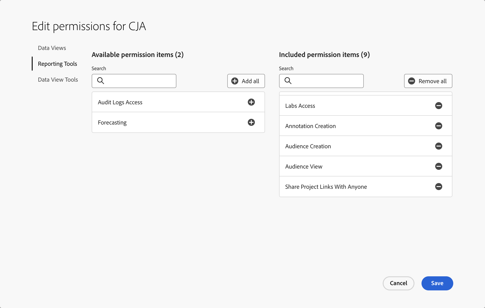

# Toegangsbeheer

Drie niveaus van toegang of drie rollen regeren Customer Journey Analytics: de rol van de systeembeheerder van het product, de rol van de de profielbeheerder van het Product, en gebruiker-vlakke toegang. In dit onderwerp worden deze rollen gedetailleerder beschreven.

Bovendien bespreekt dit artikel meer korrelige manieren om toegang, zoals de kromming van Workspace en rij-niveau evenals waarde-vlakke toegangsbeheer te beperken.

## Op rollen gebaseerd toegangsbeheer

De volgende op rol-gebaseerde toegangsbeheerniveaus zijn beschikbaar.

### De rol van productbeheerder

De gebruikers die de de beheerderrol worden toegewezen van het Product worden gegeven de noodzakelijke toestemmingen om de meeste taken binnen Customer Journey Analytics door gebrek uit te voeren. Voor sommige taken zijn echter aanvullende machtigingen vereist.

Een gebruiker toevoegen als productbeheerder:

1. Ga naar de [ Admin Console ](https://adminconsole.adobe.com/enterprise/).

1. Selecteer [!UICONTROL **Customer Journey Analytics**] > [!UICONTROL **Admins**] lusje > [!UICONTROL **Admin**] toevoegen.

   De gebruikers die u toevoegde worden gegeven de [ beheerder standaardtoestemmingen van het Product ](#product-admin-default-permissions). U kunt hen [ extra toestemmingen ](#product-admin-additional-permissions) ook verlenen indien nodig.

#### Standaardmachtigingen van productbeheerder

Productbeheerders hebben machtigingen om de meeste taken binnen de Customer Journey Analytics uit te voeren.

Productbeheerders krijgen standaard de benodigde machtigingen om de volgende taken uit te voeren:

* Gegevensweergaven maken, bijwerken en verwijderen
* Werk en schrap projecten, filters, berekende metriek, publiek, annotaties, of filters bij die door andere gebruikers worden gecreeerd
* Workspace-projecten delen met alle gebruikers
* Beheer rapporteringsactiviteit in de [ Rapporterende Manager van de Activiteit ](/help/reporting-activity-manager/reporting-activity-overview.md)
* [ de Uitvoer volledige lijsten ](/help/analysis-workspace/export/export-cloud.md) van Analysis Workspace

#### Aanvullende machtigingen voor productbeheerder

Naast wordt toegevoegd als beheerder van het Product in het **Profiel van het Product van de Customer Journey Analytics** in de [ Admin Console ](https://adminconsole.adobe.com/enterprise/), worden de extra toestemmingen vereist om de volgende taken binnen Customer Journey Analytics te voltooien:

* Creeer, werk, en schrap gegevens [ Verbindingen ](/help/connections/overview.md) bij

  Om deze taak uit te voeren, moeten de gebruikers deel uitmaken van een **Profiel van het Product van het Experience Platform** dat de volgende toestemmingen verstrekt:

  | Categorie | Machtiging | Beschrijving |
  |---|---|---|
  | [!UICONTROL Data Modeling] | [!UICONTROL View Schemas] | Alleen-lezen toegang tot schema&#39;s en gerelateerde bronnen. |
  | [!UICONTROL Data Modeling] | [!UICONTROL Manage Schemas] | Toegang tot het lezen, maken, bewerken en verwijderen van schema&#39;s en gerelateerde bronnen. |
  | [!UICONTROL Data Management] | [!UICONTROL View Datasets] | Alleen-lezen toegang voor gegevenssets en schema&#39;s. |
  | [!UICONTROL Data Management] | [!UICONTROL Manage Datasets] | Toegang tot het lezen, creëren, uitgeven, en schrappen datasets. Alleen-lezen toegang voor schema&#39;s. |
  | [!UICONTROL Data Ingestion] | [!UICONTROL Manage Sources] | Toegang tot bronnen lezen, maken, bewerken en uitschakelen. |
  | [!UICONTROL Identity Management] | [!UICONTROL View Identity Namespaces] | Alleen-lezen toegang voor naamruimten. |

  Voor meer informatie over de toestemmingen van het Experience Platform, zie [ toestemmingen voor een productprofiel ](https://experienceleague.adobe.com/en/docs/experience-platform/access-control/ui/permissions) beheren.

* De datasets van de uitvoer aan [ bestemmingen ](https://experienceleague.adobe.com/en/docs/experience-platform/destinations/ui/activate/export-datasets)

  Om deze taak uit te voeren, moeten de gebruikers deel uitmaken van een **Profiel van het Product van het Experience Platform** dat de volgende toestemmingen verstrekt:

  | Categorie | Machtiging | Beschrijving |
  |---|---|---|
  | [!UICONTROL Destinations] | [!UICONTROL Manage Destinations] | Toegang tot het lezen, creëren, en schrappen van bestemmingsverbindingen en bestemmingsrekeningen. |
  | [!UICONTROL Destinations] | [!UICONTROL Activate Destinations] | Sta gebruikers toe om segmenten aan bestaande bestemmingen te activeren. Hiermee schakelt u de toewijzingsstap in de activeringsworkflow in. Deze toestemming vereist ook de toestemming van de Doelen van de Mening die aan de gebruiker moet worden verleend die gegevens aan bestemmingen wil activeren. |

  Voor meer informatie over de toestemmingen van het Experience Platform, zie [ toestemmingen voor een productprofiel ](https://experienceleague.adobe.com/en/docs/experience-platform/access-control/ui/permissions) beheren.

* Gebruik de [ uitbreiding van BI ](../data-views/bi-extension.md)

  Voor gebruikers om de uitbreiding van BI te gebruiken, een beheerder van het Product

   * moet ervoor zorgen dat de Experience Platform toestemmingen voor de gebruiker een rol omvatten die het middel van de Dienst van de Vraag met de Manage Opties heeft van de Vragen en van de Dienst van de Vraag beheren de opties van de Integratie van de Vraag. Voor meer informatie over de toestemmingen van het Experience Platform, zie [ toestemmingen voor een productprofiel ](https://experienceleague.adobe.com/en/docs/experience-platform/access-control/ui/permissions) beheren.

     | Categorie | Machtiging | Beschrijving |
     |---|---|---| 
     | [!UICONTROL Query Service] | [!UICONTROL Manage Queries] | Toegang tot het lezen, creëren, uitgeven, en schrappen van gestructureerde SQL vragen voor de gegevens van het Platform. |
     | [!UICONTROL Query Service] | [!UICONTROL Manage Query Service Integration] | Toegang tot het creëren, bijwerken, en schrappen van niet-vervallende geloofsbrieven voor de toegang van de Dienst van de Vraag. |

   * moet de juiste machtigingen voor de Customer Journey Analytics voor de gebruiker garanderen:
      * toestemming voor toegang tot de relevante gegevensweergaven. Zie [!UICONTROL Data Views] in [ gebruiker-vlakke toegang ](#user-level-access).
      * toestemming om tot de uitbreiding van Customer Journey Analytics BI toegang te hebben. Zie [!UICONTROL Data View Tools] in [ gebruiker-vlakke toegang ](#user-level-access).

## Beheerdersrol voor productprofiel

Een productprofiel is een set machtigingen. Productbeheerders maken productprofielen en kunnen beheerders van productprofielen toewijzen om een of meer productprofielen te beheren. Een beheerder van het productprofiel kan dan:

* De toegewezen productprofielen beheren. U kunt bijvoorbeeld gebruikers of gebruikersgroepen toevoegen of verwijderen en de machtigingen voor de productprofielen wijzigen.

* In Customer Journey Analytics, geef gegevensmeningen uit die deel van een toegewezen productprofiel uitmaken. Beheerders van productprofielen kunnen geen nieuwe gegevensweergaven maken.

## Toegang op gebruikersniveau

In de onderstaande tabel worden de belangrijkste toegangsmachtigingen voor verschillende mogelijkheden van de Customer Journey Analytics beschreven die u voor de desbetreffende gebruikers kunt configureren. U kunt verschillende niveaus van gebruikerstoegang door productprofielen beheren. Een productprofiel combineert een aantal machtigingen die u vervolgens kunt toewijzen aan individuele gebruikers of gebruikersgroepen.

Het **[!UICONTROL Permissions]** lusje maakt deel uit van elk productprofiel in de [ Admin Console ](https://adminconsole.adobe.com/enterprise/).

| Categorie | Machtiging | Beschrijving |
| --- | --- | ---|
| [!UICONTROL Data Views] | *naam van de gegevensmening* | Als u **[!UICONTROL Auto-Include]** instelt op **[!UICONTROL On]** , kunnen gebruikers die deel uitmaken van dit productprofiel alle bestaande en nieuwe gegevensweergaven bekijken. Als deze instelling is ingesteld op **[!UICONTROL Off]** , kunt u specifieke gegevensweergaven selecteren waartoe gebruikers toegang hebben. |
| [!UICONTROL Reporting Tools] | [!UICONTROL Analysis Workspace Access] | Laat gebruikers tot [ Analysis Workspace ](/help/analysis-workspace/home.md) toegang hebben. |
| [!UICONTROL Reporting Tools] | [!UICONTROL Guided Analysis Access] | Laat gebruikers tot [ Geleide Analyse ](/help/guided-analysis/overview.md) toegang hebben. |
| [!UICONTROL Reporting Tools] | [!UICONTROL Calculated Metrics Creation] | Laat gebruikers [ berekende metriek ](/help/components/calc-metrics/calc-metr-overview.md) creëren. Gebruikers kunnen alleen de berekende metriek die zij maken of de met hen gedeelde berekeningsmethoden coderen, delen, verwijderen, hernoemen, goedkeuren of goedkeuren. |
| [!UICONTROL Reporting Tools] | [!UICONTROL Filter Creation] | Laat gebruikers [ filters ](/help/components/filters/filters-overview.md) tot stand brengen. Gebruikers kunnen alleen de filters die zij maken of de filters die met hen worden gedeeld, labelen, delen, verwijderen, hernoemen, goedkeuren of goedkeuren. |
| [!UICONTROL Reporting Tools] | [!UICONTROL Labs Access] | Laat gebruikers tot het [ lusje van Laboratoria ](/help/labs/labs.md) in Customer Journey Analytics toegang hebben. |
| [!UICONTROL Reporting Tools] | [!UICONTROL Annotation Creation] | Laat gebruikers [ annotaties ](/help/components/annotations/overview.md) tot stand brengen. Gebruikers kunnen alleen de annotaties die ze maken of annotaties die met hen worden gedeeld, labelen, delen, verwijderen en hernoemen. |
| [!UICONTROL Reporting Tools] | [!UICONTROL Audience Creation] | Laat gebruikers [ publiek ](/help/components/audiences/audiences-overview.md) tot stand brengen. |
| [!UICONTROL Reporting Tools] | [!UICONTROL Audit Logs Access] | Dwing de toestemmingscontrole op [ API ](https://developer.adobe.com/cja-apis/docs/endpoints/auditlogs/) en de controlelogboeken UI af. |
| [!UICONTROL Reporting Tools] | [!UICONTROL Share Project Links With Anyone] | Laat gebruikers [ projecten met iedereen delen.](https://experienceleague.adobe.com/en/docs/analytics-platform/using/cja-workspace/curate-share/share-projects) |
| [!UICONTROL Reporting Tools] | [!UICONTROL Forecasting] | Laat gebruikers tot de [ Voorspelling ](../analysis-workspace/c-forecast/forecasting.md) eigenschap in Analysis Workspace toegang hebben |
| [!UICONTROL Reporting Tools] | [!UICONTROL AI Assistant: Product Knowledge] | Laat gebruikers tot de [ Medewerker AI ](../ai-assistant.md) voor productkennis toegang hebben. |
| [!UICONTROL Reporting Tools] | [!UICONTROL Intelligent Captions] | Laat gebruikers tot [ Intelligente titels ](/help/analysis-workspace/visualizations/intelligent-captions.md) toegang hebben. |
| [!UICONTROL Data View Tools] | [!UICONTROL Full Table Export] | Laat gebruikers [ volledige lijsten naar de wolk ](/help/analysis-workspace/export/export-cloud.md) uitvoeren. |
| [!UICONTROL Data View Tools] | [!UICONTROL CJA BI Extension] | Laat gebruikers de [ uitbreiding van BI ](../data-views/bi-extension.md) gebruiken. |

{style="table-layout:auto"}

## Workspace project curation

Een ander niveau van toegangscontrole kan op het Workspace rapporteringsniveau worden gebruikt. U kunt de toegang tot specifieke componenten voor bepaalde gebruikers beperken. Voor meer informatie over hoe te om componenten (afmetingen, metriek, filters, datumwaaiers) op het het projectniveau van Workspace te beperken, en hoe de besnoeiing aan gegevensmeningen gebonden is, zie [ projecten van de Kromme ](/help/analysis-workspace/curate-share/curate.md).

## Toegang verlenen tot individuele metriek of dimensies

U kunt geen toestemmingen voor individuele metriek of dimensies in Customer Journey Analytics verlenen of ontkennen zoals u in traditionele Adobe Analytics kunt. De metriek en de afmetingen kunnen in [ gegevensmeningen ](/help/data-views/data-views.md) worden gewijzigd en zijn zo onderworpen aan verandering in Customer Journey Analytics. Als u ze wijzigt, wordt de rapportage ook met terugwerkende kracht gewijzigd.

## Gebruik hoofdletters

Hier zijn een paar gebruiksgevallen die illustreren hoe de toegangscontrole in real-life scenario&#39;s kan worden gebruikt.

### Toegang van derden

U kunt het beleid van het Profiel van het Product toegang tot een teamlood van een derde verstrekken die uw bedrijf werkt. Deze beheerder kan gebruikers van het team van het bedrijf aan dit productprofiel toevoegen. Deze systeembeheerder van het Productprofiel kan toegang tot specifieke gegevensmeningen geven en andere gebruikers binnen de derde aan dit productprofiel toevoegen. De beheerder van het Profiel van het Product kan gegevensmeningen wijzigen om de vereisten van het derde team te passen.

### Toegangsbeheer op rijniveau

Stel dat u gebruikers slechts vanaf één dag toegang wilt geven tot gegevens. Hieronder wordt beschreven hoe u de toegang tot die specifieke rijen beperkt:

1. Maak een filter in [!UICONTROL Settings] van een specifieke gegevensweergave, waarbij [!UICONTROL Day] gelijk is aan de datum waarop de gegevens toegankelijk moeten zijn. Zie [ gegevensmening ](/help/data-views/create-dataview.md#settings-filters) voor meer informatie creëren.
1. Sparen de gegevensmening, die het filter op het gegevensdeel van de datasets in de onderliggende verbinding toepast. Rijen die niet in de filterdefinitie passen, worden automatisch uitgesloten van de gegevensweergave en zijn niet beschikbaar voor Analysis Workspace wanneer deze gegevensweergave wordt gebruikt.
1. Creeer een nieuw [ profiel van het Product ](#product-profile-admin-role) in de Admin Console, voeg gebruikers aan het productprofiel toe, en omvat slechts deze specifieke gegevensmening aan het productprofiel.

### Toegangsbeheer op waardeniveau

Gebruikers die toegang hebben tot een gegevensweergave, kunnen alleen werken met de afmetingen en metriek die de beheerder in deze gegevensweergave heeft opgenomen. De beheerders kunnen [ gebruiken omvatten/uitsluiten functionaliteit ](/help/data-views/component-settings/include-exclude-values.md) of [ het knippen van de Waarde ](../data-views/component-settings/value-bucketing.md) componentenmontages in een gegevensmening om bepaalde afmetingswaarden van een gegevensmening uit te sluiten of samen te voegen.

Bijvoorbeeld: U creeert metrisch genoemd *Hypertensie* in een gegevensmening van een component die individuele patiëntgegevens van de dataset bevat. U gebruikt waarde het knippen om slechts toegang tot ingesloten waarden te verlenen, zodat zien de gebruikers van de gegevens de individuele patiëntgegevens niet.

