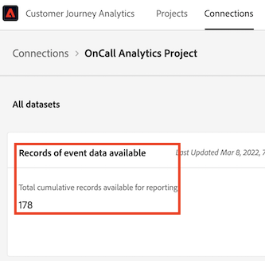

# Het gebruik van uw Customer Journey Analytics weergeven en beheren

U kunt op verschillende manieren het gebruik van uw Customer Journey Analytics weergeven:

* Voeg de rijen met gebeurtenisgegevens toe voor elke verbinding. Zie [ schatten verbindingsgrootte ](#estimate-connection-size) hieronder. Dit is een gemakkelijke manier om uw gegevens van de gebeurtenisrij, per verbinding, voor een specifieke timestamp te zien.

* Bekijk uw gebruik op drie manieren, elk die hieronder meer gedetailleerd wordt beschreven:
   * Gebruik Analysis Workspace om de gebeurtenissen van vorige maand te melden.
   * Gebruik Report Builder om de gebeurtenissen van vorige maand te rapporteren.
   * Gebruik Customer Journey Analytics API om een geautomatiseerd rapport tot stand te brengen.

Om het gebruik van uw Customer Journey Analytics te beheren:

* Definieer een schuivend gegevensvenster.

## De verbindingsgrootte schatten {#estimate-size}

Mogelijk moet u weten hoeveel rijen met gebeurtenisgegevens u momenteel in [!UICONTROL Customer Journey Analytics] hebt. Om een nauwkeurige rekening van de de gebeurtenisgegevensverslagen van uw organisatie (gegevensrijen) gebruik te krijgen, doe het volgende **voor elk van de verbindingen die door uw organisatie** worden gecreeerd.

>[!NOTE]
>
>Doe dit op de eerste vrijdag van elke maand, aangezien de Adobe uw recentste gebruiksrapport op die dag in werking stelt.

1. Klik in [!UICONTROL Customer Journey Analytics] op de tab **[!UICONTROL Connections]** .

   U kunt nu een lijst met al uw huidige verbindingen zien.

1. Klik op elke naam van de verbinding om deze weer te geven.

1. Voeg de **[!UICONTROL Records of event data available]** toe voor elke verbinding die uw organisatie heeft gemaakt. (Afhankelijk van de grootte van de verbinding kan het even duren voordat het nummer wordt weergegeven.)

   

   >[!CAUTION]
   >
   >   Deze telling is alleen van toepassing op gebeurtenisgegevens, niet op profiel- of opzoekgegevens. Als u profiel- en opzoekgegevens hebt, is het aantal iets hoger. Er is momenteel echter geen manier om het gebruik van profiel- en opzoekgegevens in de gebruikersinterface te rapporteren.

1. Zodra u een som alle rijen van gebeurtenisgegevens hebt, omhoog de &quot;Rijen van Gegevens&quot;rechten in het contract van de Customer Journey Analytics kijken dat uw bedrijf met Adobe ondertekende.

   Dit geeft u het maximumaantal rijen van gegevens die in de Orde van de Verkoop worden geautoriseerd. Als het aantal rijen gegevens dat uit Stap 3 is voortgekomen groter is dan dit aantal, gaat u over.

1. U kunt deze situatie op verschillende manieren verhelpen:

   * Verander uw [ montages van het gegevensbehoud ](https://experienceleague.adobe.com/docs/analytics-platform/using/cja-connections/manage-connections.html#set-rolling-window-for-connection-data-retention).
   * [ Schrap om het even welke ongebruikte verbindingen ](https://experienceleague.adobe.com/docs/analytics-platform/using/cja-overview/cja-faq.html#implications-of-deleting-data-components).
   * [ Schrap een dataset in Adobe Experience Platform ](https://experienceleague.adobe.com/docs/analytics-platform/using/cja-overview/cja-faq.html#implications-of-deleting-data-components).
   * Neem contact op met het accountteam van de Adobe om een licentie voor extra capaciteit te verkrijgen.

## Een Workspace-project maken met al uw gebeurtenisgegevens {#workspace-event-data}

Met deze methode kunt u uw gebruiksgegevens en de geschiedenis van uw gebruik nader analyseren.

1. Alvorens u het project in Workspace creeert, [ creeer een gegevensmening ](/help/data-views/create-dataview.md) voor elk van uw verbindingen, zonder enige toegepaste filters.

>[!WARNING]
>
>    Maak geen nieuwe verbinding die al uw gegevens alleen voor het meten van het gebruik omvat, omdat dat uw gebruik zou verdubbelen.

1. In Workspace maakt u nieuwe projecten op basis van elk van de gegevensweergaven en trekt u alle gebeurtenissen in (vanuit de vervolgkeuzelijst **[!UICONTROL Metrics]** ) die voorafgaan aan de eerste vrijdag van de maand, te beginnen met de eerste dag van uw huidige contract voor Customers Journey Analytics.

   

   Zo krijgt u een goed idee hoe uw gebruik maand tot maand wordt.

1. Afhankelijk van uw behoeften, kunt u neer door dataset, enz. boren.

## Een gegevensblok maken in de Report Builder {#arb}

In Report Builder, [ creeer één gegevensblok ](/help/report-builder/create-a-data-block.md) voor elke gegevensmening, dan som hen.

## Een automatisch rapport maken in de Customer Journey Analytics-API {#api-report}

1. Gebruik de [ Customer Journey Analytics die API ](https://developer.adobe.com/cja-apis/docs/api/#tag/Reporting-API) rapporteert om een rapport over al uw gebeurtenisgegevens in werking te stellen, **voor elke verbinding**. Opstelling dit zodat het rapport loopt

   * elke eerste vrijdag van elke maand.
   * Ga terug naar de eerste dag van je huidige contract voor Customers Journey Analytics.

   Zo krijgt u een goed idee hoe uw gebruik maand tot maand wordt. Het geeft u het totale aantal rijen op al uw verbindingen van de Customer Journey Analytics.

1. Gebruik Excel om dit rapport verder aan te passen.

## Uw gebruik beheren door een schuivend gegevensvenster te definiëren {#rolling}

Om uw gebruik te beheren, laat [ verbindingen UI ](/help/connections/create-connection.md) u het behoud van de gegevens van de Customer Journey Analytics als het rollen venster in maanden (1 maand, 3 maanden, 6 maanden, enz.), op het verbindingsniveau bepalen.

Het belangrijkste voordeel is dat u alleen gegevens opslaat of rapporteert die van toepassing zijn en nuttig zijn, en oudere gegevens verwijdert die niet meer nuttig zijn. Het helpt u onder uw contractgrenzen te blijven en vermindert het risico van overleeftijdskosten.

Als u de standaardinstelling (uitgeschakeld) verlaat, wordt de bewaarperiode vervangen door de bewaarinstelling voor Adobe Experience Platform-gegevens. Als je 25 maanden aan gegevens in Experience Platform hebt, zal Customer Journey Analytics 25 maanden aan gegevens door backfill krijgen. Als u 10 van die maanden in Platform schrapte, zou de Customer Journey Analytics de resterende 15 maanden behouden.

Het bewaren van gegevens is gebaseerd op de tijdstempels van de gebeurtenisdataset en is slechts op gebeurtenisdatasets van toepassing. Er bestaat geen instelling voor het schuivende gegevensvenster voor profiel- of opzoekgegevenssets, omdat er geen relevante tijdstempels zijn. Als uw verbinding om het even welk profiel of raadplegingsdatasets omvat, aangezien zij met gebeurtenisdatasets worden aangesloten, worden de gegevens bewaard in Customer Journey Analytics die op uw montages van het gegevensbehoud op de tijdstempels van de gebeurtenisdataset wordt gebaseerd.

