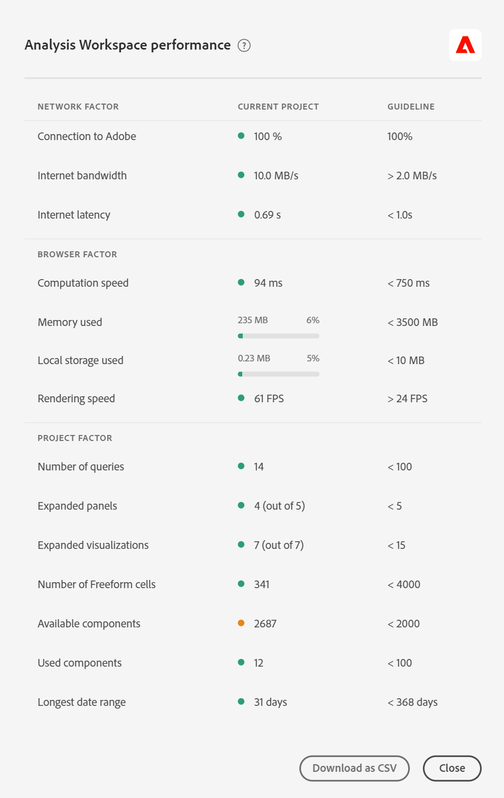

# Customer Journey Analytics en [!UICONTROL Analysis Workspace] prestaties optimaliseren

Verschillende factoren kunnen de algehele prestaties van de Customer Journey Analytics en de prestaties van een project in Analysis Workspace beïnvloeden. In Workspace wordt mogelijk een foutbericht weergegeven met de volgende tekst:

`This query is too complex. Please review best practices for building Analysis Workspace queries.`

Deze beste praktijken bespreken welke factoren tot deze fout kunnen leiden en hoe te om het rapport/project te vereenvoudigen.

## Query-factoren {#query}

Dit zijn de gemeenschappelijkste vraagfactoren die algemene Customer Journey Analytics prestaties beïnvloeden:

| Factor | Definitie | Beïnvloed door | Optimalisatie |
| --- | --- | --- | --- |
| **Aantal de rijen en kolommen van de Vrije vorm** | Het totale aantal cellen van de Freeform- lijst in het project, dat door rijen * kolommen over alle lijsten wordt berekend. Verborgen gegevensbronnen uitsluiten. Het richtsnoer is 4000. | | Verlaag het aantal kolommen in de tabel tot alleen de meest relevante gegevenspunten. Verminder het aantal rijen in de tabel door het aantal rijen aan te passen dat wordt weergegeven, een tabelfilter toe te passen of een filter toe te passen. |
| **Gebruikte componenten** | Het totale aantal componenten dat in het project wordt gebruikt. Het richtsnoer is 100. | Het aantal gebruikte componenten is geen directe invloed op de prestaties. De complexiteit van deze componenten zal echter bijdragen tot de prestaties van het project. Zie de optimalisaties in de sectie &quot;Aanvullende factoren&quot; hieronder. |
| **Langste datumwaaier** | Deze factor toont de langste datumwaaier gebruikte het project. Het richtsnoer is één jaar. |  | Trek waar mogelijk niet meer gegevens in dan u nodig hebt. Verfijn de paneelkalender aan de relevante data voor uw analyse of gebruik datumwaaiercomponenten (paarse componenten) in uw vrije vormlijsten. Datumbereiken die in een tabel worden gebruikt, overschrijven het datumbereik van het deelvenster. U kunt bijvoorbeeld vorige maand, vorige week en gisteren toevoegen aan de tabelkolommen om die specifieke gegevensbereiken aan te vragen. Voor meer informatie bij het werken met datumwaaiers in Analysis Workspace, bekijk [ deze video ](https://experienceleague.adobe.com/docs/analytics-learn/tutorials/analysis-workspace/calendar-and-date-ranges/date-ranges-and-calendar-in-analysis-workspace.html).    bovendien, minimaliseer het aantal jaar-over-jaar vergelijkingen die in het project worden gebruikt. Wanneer een jaar-over-jaar vergelijking wordt berekend, kijkt het over de volledige 13 maanden van gegevens tussen de maanden van rente. Dit heeft hetzelfde effect als het wijzigen van het datumbereik van het deelvenster in een datumbereik van 13 maanden. |
| **Complexiteit van de Filter** | Ingewikkelde filters kunnen een aanzienlijke invloed hebben op de projectprestaties. | Factoren die een filter complexer maken (in aflopende volgorde van impact) zijn: <ul><li>Operatoren van &quot;contains,&quot;, &quot;contains any of&quot;, &quot;match,&quot; &quot;start with&quot; of &quot;ends with&quot; </li><li>Opeenvolgend filteren, vooral wanneer dimensiebeperkingen (Within/After) worden gebruikt </li><li>Het aantal unieke dimensie-items binnen de afmetingen die in het filter worden gebruikt (pagina = &#39;A&#39; als pagina 10 unieke items bevat, is sneller dan Pagina = &#39;A&#39; als pagina 100000 unieke items bevat) </li><li>Aantal verschillende gebruikte afmetingen (bijvoorbeeld Pagina = &#39;Home&#39; en Pagina = &#39;Zoekresultaten&#39; zijn sneller dan eVar 1 = &#39;red&#39; en eVar 2 = &#39;blue&#39;)</li><li>Veel OR-operatoren (in plaats van AND)</li><li>Geneste containers die binnen het bereik variëren (bijv. &quot;Gebeurtenis&quot; in &quot;Sessie&quot; in &quot;Persoon&quot;)</li></ul> | Sommige complexiteitsfactoren kunnen niet worden voorkomen, maar zoek naar mogelijkheden om de complexiteit van uw filters te verminderen. Over het algemeen geldt dat hoe specifieker u kunt zijn met uw filtercriteria, des te beter. Bijvoorbeeld:<ul><li>Bij containers is het gebruik van één container boven aan het filter sneller dan een reeks geneste containers.</li><li>Met operatoren is &#39;equals&#39; sneller dan &#39;contains&#39; en is &#39;equals any of&#39; sneller dan &#39;contains any of&#39;.</li><li>Met vele criteria, EN operatoren is sneller dan een reeks OF exploitanten.</li></ul> Zoek naar kansen om vele OF verklaringen in één enkele &quot;evenaart om het even welk van&quot;verklaring te verminderen.  |
| **de ingewikkeldheid van de Visualisatie** (filters, metriek, filters) | Het type visualisatie (bv. fallout versus een vrije-vormlijst) dat op zich aan een project wordt toegevoegd, heeft niet veel invloed op de projectprestaties. Het is de complexiteit van de visualisatie die de verwerkingstijd verhoogt. | Factoren die complexiteit toevoegen aan een visualisatie zijn:<ul><li>Bereik van gevraagde gegevens</li><li>Aantal toegepaste filters; bijvoorbeeld, filters die als rijen van een vrije vormlijst worden gebruikt</li><li>Gebruik van complexe filters</li><li>[ Statische punt ](/help/analysis-workspace/visualizations/freeform-table/column-row-settings/manual-vs-dynamic-rows.md) rijen of kolommen in vrije vormlijsten</li><li>Filters die worden toegepast op rijen in vrije-vormtabellen</li><li>Aantal inbegrepen metriek, vooral berekende metriek die filters gebruiken</li></ul> |
| **de capaciteit van het centrum van Gegevens** | De hoeveelheid rapportagecapaciteit die u en andere klanten delen binnen een datacenter van de Adobe. | Dit wordt beïnvloed door het aantal gezamenlijke vragen die door uw organisatie en andere organisaties binnen uw gegevenscentrum worden gemaakt. | Uw organisatie heeft recht op een ingestelde capaciteit en als het systeem onder een lichte belasting staat, zal de Adobe meer capaciteit naar u verschuiven, boven en buiten uw recht om. |
| **Aantal gezamenlijke vragen** | Het aantal vragen dat tegelijkertijd door uw organisatie wordt gevraagd. Elke organisatie heeft recht op minimaal vijf gelijktijdige query&#39;s. Als een rapport lange tijd neemt, typisch is het toe te schrijven aan het feit dat het in een rij met andere rapporten is. Dit betekent dat uw organisatie een groot aantal gelijktijdige aanvragen probeert uit te voeren in een specifieke gegevensweergave. | De vragen kunnen van API verzoeken, rapporteringsUIs (Analysis Workspace, Report Builder, enz.), geplande projecten, gepland alarm, en gezamenlijke gebruikers komen die rapporteringsverzoeken indienen. | Verspreid uw verzoeken en programma&#39;s voor de gegevensmening gelijkmatiger door de dag. Verplaats uw verzoeken waar mogelijk naar tijden buiten de piek. Maandochtenden, dinsdagochtend en de eerste van elke maand zijn de hoogste rapportagetijden. |
| **grootte van de Verbinding** | De hoeveelheid gegevens die in uw Verbinding wordt verzameld. |  | Raadpleeg uw implementatieteam of Customer Journey Analytics-expert om te bepalen of er implementatieverbeteringen zijn die kunnen worden aangebracht om de algehele ervaring in de Customer Journey Analytics te verbeteren. |
| **Complexiteit van afmetingsmontages** | De hoogst complexe afmetingen kunnen een significante invloed op projectprestaties, specifiek dimensies of metriek hebben die op complexe douanegebieden worden gebaseerd. | | Verminder het aantal aangepaste velden of maak afzonderlijke afmetingen. |
| **Dimensionen met veel unieke waarden** | Deze afmetingen, ook wel bekend als afmetingen met een hoge kardinaliteit, kunnen van invloed zijn op de prestaties van de rapportage. | Zie [ high-cardinality afmetingen ](/help/components/dimensions/high-cardinality.md) | Zie [ high-cardinality afmetingen ](/help/components/dimensions/high-cardinality.md) |

## [!UICONTROL Help] > [!UICONTROL Performance] in Analysis Workspace

Verschillende factoren kunnen de prestaties van een project in Analysis Workspace beïnvloeden. Het is belangrijk om te weten wat die contribuanten zijn alvorens u begint een project te bouwen zodat u het project op de meest optimale manier kunt plannen en bouwen. Deze sectie bevat een lijst met factoren die van invloed zijn op de prestaties en optimalisaties die u kunt maken om ervoor te zorgen dat de prestaties in Analysis Workspace optimaal zijn.

Onder **Analysis Workspace > [!UICONTROL Help] >[!UICONTROL Performance]**, kunt u factoren zien die de prestaties van uw project, met inbegrip van netwerk, browser, en projectfactoren beïnvloeden. Voor de nauwkeurigste resultaten, sta het project toe om volledig te laden alvorens de pagina van Prestaties te openen.

* De Huidige kolom van het Project toont de resultaten voor uw huidige project en gebruikersmilieu.
* In de kolom Richtsnoer wordt de door de Adobe aanbevolen drempelwaarde voor elke factor weergegeven.

Bovendien, kunt u **Download als CSV** de prestatiesinhoud gemakkelijk met de Zorg van de Klant van de Adobe of uw interne teams van IT delen.

>[!NOTE]
>
>De informatie op de pagina Prestaties varieert telkens wanneer het modaal wordt geopend, aangezien de factoren aan verandering onderworpen zijn. Bovendien zal de Adobe de verstrekte richtsnoeren blijven verfijnen wanneer meer gegevens beschikbaar komen.

### Netwerkfactoren

[!UICONTROL Help] > [!UICONTROL Performance] netwerkfactoren zijn onder andere:

| Factor | Definitie | Beïnvloed door | Optimalisatie |
| --- | --- | --- | --- |
| **Verbinding aan Adobe** | De Adobe verzendt in 10 testvraag wanneer de prestatiespagina wordt geopend. Dit vertegenwoordigt het percentage van die vraag aan Adobe die slaagt. | De lokale netwerkkwesties of de kwesties van de Adobe zullen deze factor beïnvloeden. | Controleer status.adobe.com om te controleren of er bekende problemen zijn met de service. Vervolgens valideert u uw lokale netwerkverbinding. |
| **bandbreedte van Internet** | Alleen beschikbaar voor Google Chrome. De schatting door uw browser van de bandbreedte op uw locatie. De richtlijn is 2.0 MB/s. | Deze factor wordt beïnvloed door uw lokale netwerkverbinding. | Valideer uw lokale netwerkverbinding. |
| **de latentie van Internet** | De Adobe verzendt in 10 testvraag wanneer de prestatiespagina wordt geopend. Dit vertegenwoordigt de hoeveelheid tijd het gemiddelde voor elke verzoek om naar Adobe te gaan en is teruggekeerd. Eenvoudiger gezegd, het is een maat voor hoe snel het internet is tussen uw locatie en Adobe. De richtlijn is &lt; 1 seconde. | De lokale netwerkkwesties, vele open browser lusjes, of de kwesties van de Adobe zullen deze factor beïnvloeden. | Controleer status.adobe.com om te controleren of er bekende problemen zijn met de service. Vervolgens valideert u uw lokale netwerkverbinding en sluit u ongebruikte browsertabbladen. |

### Browserfactoren

[!UICONTROL Help] > [!UICONTROL Performance] browserfactoren zijn onder andere:

| Factor | Definitie | Beïnvloed door | Optimalisatie |
| --- | --- | --- | --- |
| **de snelheid van de Berekening** | Hoe snel uw computer een verwerkingstest uitvoert. De richtlijn is &lt; 750 ms. | Deze factor is van invloed op uw hardware en gelijktijdige programma&#39;s. | Open Taakbeheer (PC) of Activiteitencontrole (Mac) van uw computer om te bepalen of programma&#39;s kunnen worden gesloten. Sluit vervolgens ongebruikte browsertabbladen of andere programma&#39;s.    als die acties niet helpen, bespreek hardwaredetails met uw team van IT. |
| **Gebruikte Geheugen van het Geheugen** | Alleen beschikbaar voor Google Chrome. Op elk Workspace-tabblad in een Google Chrome-browser wordt in totaal 4 GB geheugen gedeeld. Dit vertegenwoordigt het percentage van dat geheugentoelage dat door het huidige project wordt verbruikt. De richtlijn is 3500 MB, dat is het punt waarop Workspace begint geheugenfouten op te lossen. | Als u op meerdere tabbladen werkt of 50000 rijen gegevens downloadt, wordt er meer geheugen gebruikt. | Als er een geheugenfout optreedt, sluit u andere Workspace-tabbladen en/of voert u 50000 rijen uit om deze één voor één te downloaden. |
| **Lokale gebruikte opslag** | Gegevens die lokaal op de computer zijn opgeslagen voor gebruik in de browser. Elke oorsprong (bijvoorbeeld experience.adobe.com) heeft een recht van 10 MB. | Analysis Workspace gebruikt lokale opslag voor verschillende functies, waaronder voor het opslaan van automatisch opgeslagen (bestaande) projecten, gebruikersinstellingen en functiemarkeringen. | Om ervoor te zorgen dat de Analysis Workspace-functies niet worden onderbroken, schakelt u de lokale opslag voor het domein experience.adobe.com uit. |
| **teruggevend snelheid** | FPS staat voor frames per seconde. Dit is het aantal keren per seconde dat de browser de pagina op het scherm tekent. 24 FPS is meestal wat het menselijke oog kan waarnemen; als FPS lager is dan dat, zult u weergaveproblemen in Workspace waarnemen. | FPS wordt beïnvloed door multitasking in vele Workspace-projecten tegelijk en door de grootte van het project dat wordt bekeken. Andere programma&#39;s die op uw computer worden uitgevoerd, kunnen van invloed zijn, zoals streaming, achtergrondscanners, enzovoort. Bovendien heeft uw hardware invloed op deze factor. | Open Taakbeheer (PC) of Activiteitencontrole (Mac) van uw computer om te bepalen of programma&#39;s kunnen worden gesloten. Sluit vervolgens ongebruikte browsertabbladen of andere programma&#39;s.    als die acties niet helpen, bespreek hardwaredetails met uw team van IT. |

### Projectfactoren

[!UICONTROL Help] > [!UICONTROL Performance] projectfactoren zijn:

| Factor | Definitie | Optimalisatie |
| --- | --- | --- |
| **Aantal vragen** | Het totale aantal vragen (verzoeken) die aan Adobe worden gemaakt om gegevens terug te winnen die in het project worden getoond. De vragen omvatten gerangschikte verzoeken om lijsten, anomalieopsporing, sparklines, componenten die in de linkerspoorstaaf worden getoond, en meer. Hiermee sluit u samengevouwen deelvensters en visualisaties uit. Het richtsnoer is 100. | Vereenvoudig waar mogelijk uw project door gegevens op te splitsen in verschillende projecten die een specifiek doel of een groep belanghebbenden dienen. De markeringen van het gebruik om projecten in thema&#39;s te organiseren, en gebruiken [ direct verbindend ](https://experienceleague.adobe.com/docs/analytics/analyze/analysis-workspace/curate-share/shareable-links.html) om een interne inhoudstafel tot stand te brengen zodat de belanghebbenden kunnen gemakkelijker vinden wat zij nodig hebben. |
| **Uitgebreide panelen (uit totale panelen)** | Het aantal uitgevouwen deelvensters in het totale aantal deelvensters in het project. Het richtsnoer is 5. | Nadat u stappen hebt ondernomen om uw project te vereenvoudigen, vouwt u deelvensters in uw project samen die u tijdens het laden niet hoeft te bekijken. Als het project wordt geopend, worden alleen uitgebreide deelvensters verwerkt. Samengevouwen deelvensters worden pas verwerkt wanneer de gebruiker deze uitbreidt. |
| **Uitgebreide visualisaties (uit totale visualisaties)** | Het aantal uitgevouwen tabellen en visualisaties van het totaal in het project, inclusief verborgen gegevensbronnen. Het richtsnoer is 15. | Nadat u stappen hebt ondernomen om uw project te vereenvoudigen, vouwt u visualisaties in uw project samen die niet tijdens het laden hoeven te worden bekeken. Prioriteit geven aan de visuals die het belangrijkst zijn voor de consument van het rapport en ondersteunende beelden zo nodig opsplitsen in een apart, gedetailleerder panel of project. |
| **Aantal vrije vormcellen** | Zie de tabel &quot;Query-factoren&quot; hierboven. | |
| **Gebruikte componenten** | Zie de tabel &quot;Query-factoren&quot; hierboven. | |
| **Langste datumwaaier** | Zie de tabel &quot;Query-factoren&quot; hierboven. | |

## Aanvraagfactoren

[!UICONTROL Help] > [!UICONTROL Performance] aanvraagfactoren

Gebruik het volgende diagram en de termijnen om te leren hoe de verzoeken en de diverse factoren worden verwerkt die verwerkingstijden beïnvloeden:

>[!NOTE]
>
>Aanbevolen richtlijnen voor deze factoren zijn gebaseerd op een complexiteitsscore van Medium voor het rapporteren van verzoeken.

### Verzoek om verwerkingsdiagram

### Verwerkingsvoorwaarden aanvragen

| Factor | Definitie | Optimalisatie |
| --- | --- | --- |
| [!UICONTROL **Gemiddelde verzoektijd**] | De tijd die vereist is vanaf het moment dat het verzoek wordt geïnitieerd tot het moment dat het is voltooid. De richtlijn is 15 seconden. 
In het [ verwerken van het Verzoek ](#request-processing-diagram) hierboven diagram, vertegenwoordigt de verzoektijd het volledige proces, van **Analysis Workspace verzoek dat** aan **Analysis Workspace verzoek** in werking wordt gesteld.
 |  |
| [!UICONTROL **Langste verzoektijd**] | De tijd die vereist is vanaf het moment dat het verzoek wordt geïnitieerd tot het moment dat het is voltooid. 
In het [ verwerken van het Verzoek ](#request-processing-diagram) hierboven diagram, vertegenwoordigt de verzoektijd het volledige proces, van **Analysis Workspace verzoek dat** aan **Analysis Workspace verzoek** in werking wordt gesteld.
 |  |
| [!UICONTROL **Gemiddelde raadplegingstijd**] | Omdat Analysis Workspace slechts de knoeiboel voor om het even welke koorden opslaat die in om het even welke segmenten worden gebruikt, telkens als u een project verwerkt, **Lookups** worden uitgevoerd om de knoeiboel met de aangewezen waarden aan te passen. De richtlijn is minder dan 2 seconden.
Dit kan een middel-intensief proces, afhankelijk van het aantal waarden zijn die potentieel de knoeiboel zouden kunnen aanpassen. 

In het [ verwerken van het Verzoek ](#request-processing-diagram) hierboven diagram, wordt de raadplegingstijd vertegenwoordigd in de **Lookups** fase (op het tijdstip van **de verwerkingsfase van de Motor van het Verzoek** fase).
 | Als de verzoeken hier vertragen, is het waarschijnlijk toe te schrijven aan het hebben van teveel koordsegmenten in uw project, of het hebben van koorden met overdreven generische waarden die teveel potentiële gelijken hebben. |
| [!UICONTROL **Gemiddelde rijtijd**] | De totale tijd die in rij wacht alvorens de verzoeken worden verwerkt. De richtlijn is 5 seconden.
In het [ verwerken van het Verzoek ](#request-processing-diagram) diagram hierboven, wordt de rijtijd vertegenwoordigd in de **de rij van de Motor van het Verzoek** fase en **de rij van de Server** fase.
 | Als de verzoeken hier vertragen, kan het toe te schrijven zijn aan teveel verzoeken die gelijktijdig in uw organisatie lopen. Probeer het verzoek uit te voeren buiten piektijd. |
| [!UICONTROL **Gemiddelde tijd van de serververwerking**] | De gemiddelde hoeveelheid tijd die nodig is om het verzoek te verwerken.
In het [ verwerken van het Verzoek ](#request-processing-diagram) hierboven diagram, wordt de gemiddelde tijd van de serververwerking vertegenwoordigd in de **de rij van de Server** fase en **de verwerkingsfase van de Server**. De richtlijn is 10 seconden | Als de verzoeken hier vertragen, is het waarschijnlijk dat het project te lange datumwaaiers of complexe visualisaties heeft. Verkort het datumbereik van uw project om de verwerkingstijd te verkorten. |
| [!UICONTROL **Complexiteit**] | Niet alle verzoeken vereisen de zelfde hoeveelheid tijd om te verwerken. De complexiteit van aanvragen kan u helpen een algemeen idee te geven van de tijd die nodig is om de aanvraag te verwerken. De richtlijn is Medium of lager. 
Mogelijke waarden zijn:
 <ul><li>[!UICONTROL **Laag**]</li><li>[!UICONTROL **Medium**]</li><li>[!UICONTROL **Hoog**]</li></ul>Deze waarde wordt beïnvloed door de waarden in de volgende kolommen:<ul><li>[!UICONTROL **grenzen van de Maand**]</li><li>[!UICONTROL **Kolommen**]</li><li>[!UICONTROL **Segmenten**]</li></ul> |  |
| [!UICONTROL **grenzen van de Maand**] | Het aantal maanden dat in een verzoek is opgenomen. Meer maandgrenzen vergroot de complexiteit van het verzoek. De richtlijn is 6 of minder. | Als de verzoeken hier vertragen, kan het zijn omdat de maandgrenzen in uw project te groot zijn. Verlaag het aantal maanden. |
| [!UICONTROL **Kolommen**] | Het aantal metriek en onderverdelingen in het verzoek. Meer kolommen maken de aanvraag complexer. De richtlijn is tien of minder. | Als de verzoeken hier vertragen, kan het zijn omdat er teveel kolommen in uw project zijn. Verminder het aantal kolommen. |
| [!UICONTROL **Segmenten**] | Het aantal segmenten dat op de aanvraag wordt toegepast. Meer segmenten maken de aanvraag complexer. De richtlijn is 5 of minder. | Als de verzoeken hier vertragen, kan het zijn omdat er teveel segmenten in uw project zijn. Verminder het aantal segmenten. |
