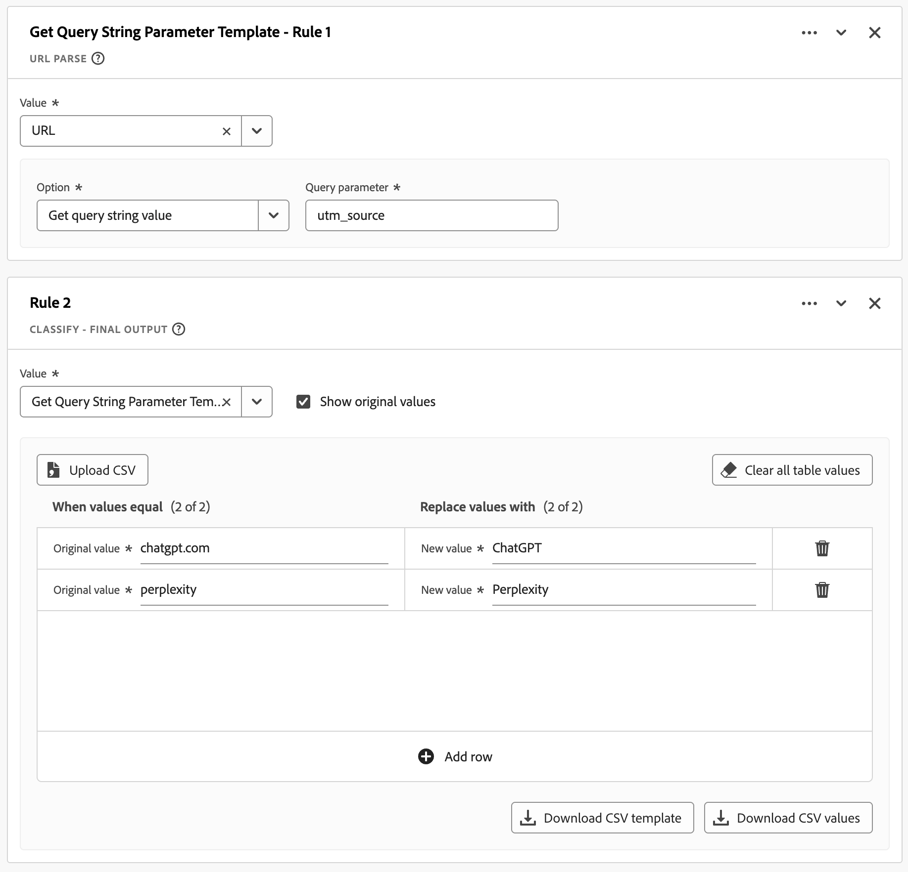
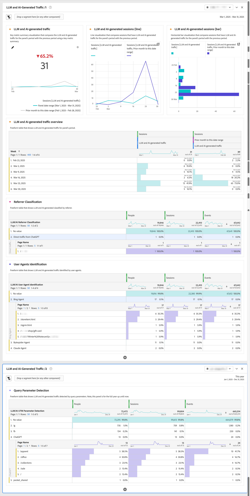

# Verslag over het door LLM en AI gegenereerde verkeer

Dit gebruikscase artikel verkent hoe te om het van Customer Journey Analytics afgeleide gebiedsvermogen als stichting te gebruiken om over LM (het Model van de Grote Taal) en AI-Gegenereerd verkeer te rapporteren.

## Detectiemethoden

Om LLM en AI geproduceerd verkeer te ontdekken, onderscheid tussen:

* **LLM kruipt**: Verzamel gegevens voor opleiding en herhaal verhoogde generatie (RAG).
* **AI agenten**: Functie als interfaces die taak namens mensen uitvoeren. AI-agents werken liever via API&#39;s, waardoor de methoden voor het bijhouden van webanalyses worden omzeild. Desalniettemin kunt u een aanzienlijk deel van het door AI gegenereerde verkeer nog steeds analyseren via websites.

Drie gemeenschappelijke kerndetectiemethodes om het door LLM en AI gegenereerde verkeer te identificeren en te controleren zijn:

* **de agentenidentificatie van de Gebruiker**: Wanneer een verzoek aan uw server wordt gemaakt, wordt de gebruiker-Agent van HTTP kopbal gehaald en tegen bekende AI kruippaden en agentenpatronen geanalyseerd. Deze server-zijmethode vereist toegang tot de kopballen van HTTP en is het meest effectief wanneer uitgevoerd bij de laag van de gegevensinzameling.
* **de classificatie van de Verwijzer**: De kopbal van de Verwijzing van HTTP bevat URL van vorige webpage die met het huidige verzoek verbonden. Deze header wordt weergegeven wanneer gebruikers via webinterfaces, zoals ChatGPT of Perplexiteit, naar uw site klikken.
* **de parameteropsporing van de Vraag**: De diensten AI kunnen parameters URL (met name parameters UTM) aan verbindingen toevoegen. Deze parameters blijven in URL bestaan en kunnen door standaard analytische implementaties worden ontdekt, die tot deze parameters URL waardevolle indicatoren zelfs in cliënt-zijvolgende scenario&#39;s maken.

In de volgende tabel wordt aangegeven hoe de detectiemethoden kunnen worden gebruikt voor verschillende LLM- en AI-interactiescenario&#39;s.

| Scenario | Identificatie van gebruikersagent | Rangschikking | Detectie query-parameter |
|---|---|---|---|
| **Opleiding van een model** | De agent (`GPTBot`, `ClaudeBot`, en meer) kan worden geïdentificeerd wanneer het server-zijregistreren wordt uitgevoerd. | Indeling is niet mogelijk. AI-crawlers genereren geen referentie tijdens de training. | Detectie is onmogelijk. AI-crawlers voegen geen parameters toe tijdens de training. |
| **het doorbladeren van de Agent** | De agent (`ChatGPT-User`, `claude-web`) kan worden geïdentificeerd wanneer server-kant registreren kopballen vangt. | Classificatie is mogelijk als de agent navigeert vanaf een AI-interface met behoud van referenties. | Detectie is soms mogelijk als de AI-service trackingparameters toevoegt. |
| **wint opgewaardeerde generatie (RAG) terug om vraag** te beantwoorden | De agent (`OAI-SearchBot`, `PerplexityBot`) kan met server-zijregistreren worden geïdentificeerd. | Een classificatie is doorgaans niet mogelijk omdat RAG-bewerkingen vaak de referentiemechanismen omzeilen. | Detectie is zelden mogelijk, tenzij dit specifiek door de AI-provider wordt geïmplementeerd. |
| **de Gebruiker klikt door** | De agent kan niet worden geïdentificeerd. AI-agent wordt weergegeven als een normale gebruikersagent. | De classificatie is mogelijk wanneer de gebruikers verbindingen van AI interfaces ([&#x200B; chatgpt.com &#x200B;](https://chatgpt.com), [&#x200B; claude.ai &#x200B;](https://claude.ai), en meer) klikken. | Detectie is mogelijk wanneer AI-services UTM-parameters toevoegen aan uitgaande koppelingen. |
| **de zichtbaarheidsvoorwaarden van het Verkeer** | Integratie van logbestanden aan de serverzijde met Customer Journey Analytics- of serverzijde vereist voor identificatie van de agent. | De classificatie is afhankelijk van het AI-platformverwijzingsbeleid en de juiste HTTP-headeroverdracht. | De opsporing vereist parameterbehoud door omleidingen en juiste URL parameterinzameling. |

### Uitdagingen

LLM- en AI-agents demonstreren complex en evoluerend gedrag bij het werken met digitale eigenschappen. Deze technologieën werken inconsistent op verschillende platforms en versies. Deze inconsistentie creëert unieke uitdagingen voor gegevensprofessionals. De gedragspatronen variëren aanzienlijk en zijn afhankelijk van het specifieke AI-platform, de versie en de interactiemodus die worden gebruikt. Deze operationele diversiteit bemoeilijkt de inspanningen om het door LLM en AI gegenereerde verkeer te traceren en te categoriseren binnen standaard analytische kaders. De complexe aard van deze interacties, in combinatie met hun snelle evolutie, vereist genuanceerde detectie- en classificatiemethoden om de gegevensintegriteit te handhaven:

* **Gedeeltelijke gegevensinzameling**: Sommige nieuwere AI agenten voeren beperkte JavaScript uit, resulterend in onvolledige analysegegevens voor cliënt-zijimplementaties. Hierdoor worden sommige interacties bijgehouden terwijl andere interacties worden overgeslagen.
* **Inconsistente zittingsgegevens**: De agenten AI zouden JavaScript over zittingen of paginatypen verschillend kunnen uitvoeren. Dit uitvoeringsverschil leidt tot gefragmenteerde gebruikersreizen in Customer Journey Analytics voor cliënt-zijimplementaties.
* **de uitdagingen van de Opsporing**: Met gedeeltelijke het volgen, wordt de opsporing onbetrouwbaar aangezien bepaalde touchpoints aan analyses onzichtbaar zouden kunnen zijn.

## Handtekeningen voor detectie

Vanaf augustus 2025 kunnen de volgende specifieke signalen voor elk van de detectiemethoden worden geïdentificeerd.

### Identificatie van gebruikersagent

<table>
<thead>
<tr>
<th>Crawler</th>
<th>Tekenreeks gebruikersagent</th>
<th>Doel/gedrag</th>
</tr>
</thead>
<tbody>
<tr>
<td><strong>GPTBot</strong></td>
<td><code>Mozilla/5.0 AppleWebKit/537.36 (KHTML, like Gecko); compatible; GPTBot/1.1; +<a href="https://openai.com/gptbot" target="_blank" rel="noopener nofollow noreferrer">https://openai.com/gptbot</a></code></td>
<td><a href="https://platform.openai.com/docs/bots/" target="_blank" rel="noopener nofollow noreferrer">De primaire webcrawler van OpenAI voor training in ChatGPT en taalmodellen</a></td>
</tr>
<tr>
<td><strong>ChatGPT-Gebruiker</strong></td>
<td><code>Mozilla/5.0 AppleWebKit/537.36 (KHTML, like Gecko); compatible; ChatGPT-User/1.0; +<a href="https://openai.com/bot" target="_blank" rel="noopener nofollow noreferrer">https://openai.com/bot</a></code></td>
<td><a href="https://platform.openai.com/docs/bots/" target="_blank" rel="noopener nofollow noreferrer">Wordt gebruikt wanneer ChatGPT websites bladert namens gebruikers (verouderd)</a></td>
</tr>
<tr>
<td><strong>ChatGPT-User v2</strong></td>
<td><code>Mozilla/5.0 AppleWebKit/537.36 (KHTML, like Gecko); compatible; ChatGPT-User/2.0; +<a href="https://openai.com/bot" target="_blank" rel="noopener nofollow noreferrer">https://openai.com/bot</a></code></td>
<td><a href="https://platform.openai.com/docs/bots/" target="_blank" rel="noopener nofollow noreferrer">De bijgewerkte versie van ChatGPT voor ophaalbewerkingen op aanvraag en opzoekacties in reactie</a></td>
</tr>
<tr>
<td><strong>OAI-SearchBot</strong></td>
<td><code>Mozilla/5.0 AppleWebKit/537.36 (KHTML, like Gecko); compatible; OAI-SearchBot/1.0; +<a href="https://openai.com/searchbot" target="_blank" rel="noopener nofollow noreferrer">https://openai.com/searchbot</a></code></td>
<td><a href="https://platform.openai.com/docs/bots/" target="_blank" rel="noopener nofollow noreferrer">Zoekgerichte zoekfunctie van ChatGPT voor het ontdekken van inhoud</a></td>
</tr>
<tr>
<td><strong>ClaudeBot</strong></td>
<td><code>Mozilla/5.0 AppleWebKit/537.36 (KHTML, like Gecko); compatible; ClaudeBot/1.0; +claudebot@anthropic.com</code></td>
<td><a href="https://support.claude.com/en/articles/8896518-does-anthropic-crawl-data-from-the-web-and-how-can-site-owners-block-the-crawler" target="_blank" rel="noopener nofollow noreferrer">Anthropic's crawler for training and update the Claude AI Assistant</a></td>
</tr>
<tr>
<td><strong>Claude-User</strong></td>
<td><code>Mozilla/5.0 AppleWebKit/537.36 (KHTML, like Gecko; compatible; Claude-User/1.0; +Claude-User@anthropic.com)</code></td>
<td><a href="https://support.claude.com/en/articles/8896518-does-anthropic-crawl-data-from-the-web-and-how-can-site-owners-block-the-crawler" target="_blank" rel="noopener nofollow noreferrer">Biedt ondersteuning voor Claude AI-gebruikers die vragen stellen aan Claude, maar heeft wel toegang tot websites met een Cl...</a></td>
</tr>
<tr>
<td><strong>Claude-SearchBot</strong></td>
<td><code>Mozilla/5.0 AppleWebKit/537.36 (KHTML, like Gecko; compatible; Claude-SearchBot/1.0; +Claude-SearchBot@anthropic.com)</code></td>
<td><a href="https://support.claude.com/en/articles/8896518-does-anthropic-crawl-data-from-the-web-and-how-can-site-owners-block-the-crawler" target="_blank" rel="noopener nofollow noreferrer">Navigeert het Web om de kwaliteit van het onderzoeksresultaat voor gebruikers van Claude AI te verbeteren door online inhoud te analyseren t...</a></td>
</tr>
<tr>
<td><strong>PerplexityBot</strong></td>
<td><code>Mozilla/5.0 AppleWebKit/537.36 (KHTML, like Gecko; compatible; PerplexityBot/1.0; +<a href="https://www.perplexity.ai/perplexitybot" target="_blank" rel="noopener nofollow noreferrer">https://perplexity.ai/perplexitybot</a>)</code></td>
<td><a href="https://docs.perplexity.ai/guides/bots" target="_blank" rel="noopener nofollow noreferrer">Perplexity.ai's crawler voor realtime webgegevensindexering</a></td>
</tr>
<tr>
<td><strong>Perplexiteit-gebruiker</strong></td>
<td><code>Mozilla/5.0 AppleWebKit/537.36 (KHTML, like Gecko; compatible; Perplexity-User/1.0; +<a href="https://www.perplexity.ai/useragent" target="_blank" rel="noopener nofollow noreferrer">https://www.perplexity.ai/useragent</a>)</code></td>
<td><a href="https://docs.perplexity.ai/guides/bots" target="_blank" rel="noopener nofollow noreferrer">Hiermee laadt u pagina's wanneer gebruikers op Perplexiteit-citaten klikken (bypass robots.txt)</a></td>
</tr>
<tr>
<td><strong>Google-Extended</strong></td>
<td><code>Mozilla/5.0 (compatible; Google-Extended/1.0; +<a href="https://support.google.com/webmasters/answer/182072" target="_blank" rel="noopener nofollow noreferrer">http://www.google.com/bot.html</a>)</code></td>
<td><a href="https://blog.google/technology/ai/an-update-on-web-publisher-controls/" target="_blank" rel="noopener nofollow noreferrer">Google-crawler met AI-focus voor Gemini apart van standaard Googlebot</a></td>
</tr>
<tr>
<td><strong>BingBot</strong></td>
<td><code>Mozilla/5.0 (compatible; BingBot/1.0; +<a href="http://www.bing.com/bot.html" target="_blank" rel="noopener nofollow noreferrer">http://www.bing.com/bot.html</a>)</code></td>
<td>Microsoft-crawler voor Bing Search and Bing Chat (Kopilot)</td>
</tr>
<tr>
<td><strong>DuckAssistBot</strong></td>
<td><code>Mozilla/5.0 (compatible; DuckAssistBot/1.0; +<a href="https://duckduckgo.com/bot.html" target="_blank" rel="noopener nofollow noreferrer">http://www.duckduckgo.com/bot.html</a>)</code></td>
<td><a href="https://duckduckgo.com/duckduckgo-help-pages/results/duckassistbot" target="_blank" rel="noopener nofollow noreferrer">Inhoud vastzetten voor DuckAssist, DuckDuckGo's persoonlijke AI-antwoordfunctie</a></td>
</tr>
<tr>
<td><strong>YouBot</strong></td>
<td><code>Mozilla/5.0 (compatible; YouBot (+<a href="http://www.you.com" target="_blank" rel="noopener nofollow noreferrer">http://www.you.com</a>))</code></td>
<td>Crawler achter de AI-zoekfunctie en browserassistent van You.com</td>
</tr>
<tr>
<td><strong>meta-extern agens</strong></td>
<td><code>Mozilla/5.0 (compatible; meta-externalagent/1.1 (+<a href="https://developers.facebook.com/docs/sharing/webmasters/web-crawlers" target="_blank" rel="noopener nofollow noreferrer">https://developers.facebook.com/docs/sharing/webmasters/crawler</a>))</code></td>
<td><a href="https://developers.facebook.com/docs/sharing/webmasters/web-crawlers#identify-2" target="_blank" rel="noopener nofollow noreferrer">Meta bot voor het verzamelen van gegevens om LLM's op te leiden of te verfijnen</a></td>
</tr>
<tr>
<td><strong>Amazonbot</strong></td>
<td><code>Mozilla/5.0 (Macintosh; Intel Mac OS X 10_10_1) AppleWebKit/600.2.5 (KHTML, like Gecko) Version/8.0.2 Safari/600.2.5 (Amazonbot/0.1; +<a href="https://developer.amazon.com/amazonbot" target="_blank" rel="noopener nofollow noreferrer">https://developer.amazon.com/support/amazonbot</a>)</code></td>
<td><a href="https://developer.amazon.com/amazonbot" target="_blank" rel="noopener nofollow noreferrer">Amazon crawler voor zoekopdrachten en AI-toepassingen</a></td>
</tr>
<tr>
<td><strong>Applebot</strong></td>
<td><code>Mozilla/5.0 (Macintosh; Intel Mac OS X 10_15_5) AppleWebKit/605.1.15 (KHTML, like Gecko) Version/13.1.1 Safari/605.1.15 (Applebot/0.1; +<a href="https://support.apple.com/kb/HT6619" target="_blank" rel="noopener nofollow noreferrer">http://www.apple.com/go/applebot</a>)</code></td>
<td><a href="https://support.apple.com/en-us/119829" target="_blank" rel="noopener nofollow noreferrer">Apple crawler voor Spotlight, Siri en Safari</a></td>
</tr>
<tr>
<td><strong>Applebot-Extended</strong></td>
<td><code>Mozilla/5.0 (compatible; Applebot-Extended/1.0; +<a href="https://www.apple.com/bot.html" target="_blank" rel="noopener nofollow noreferrer">http://www.apple.com/bot.html</a>)</code></td>
<td><a href="https://support.apple.com/en-us/119829" target="_blank" rel="noopener nofollow noreferrer">Apple-crawler met AI-focus voor toekomstige AI-modellen (opt-in)</a></td>
</tr>
<tr>
<td><strong>Bytespider</strong></td>
<td><code>Mozilla/5.0 (compatible; Bytespider/1.0; +<a href="https://www.bytedance.com/bot.html" target="_blank" rel="noopener nofollow noreferrer">http://www.bytedance.com/bot.html</a>)</code></td>
<td>De AI-gegevensverzamelaar van ByteDance voor TikTok en andere services</td>
</tr>
<tr>
<td><strong>MistralAI-gebruiker</strong></td>
<td><code>Mozilla/5.0 (compatible; MistralAI-User/1.0; +<a href="https://mistral.ai/bot" target="_blank" rel="noopener nofollow noreferrer">https://mistral.ai/bot</a>)</code></td>
<td><a href="https://docs.mistral.ai/robots/" target="_blank" rel="noopener nofollow noreferrer">Mistral's real-time aanhalingsteken voor "Le Chat"-assistent</a></td>
</tr>
<tr>
<td><strong>cohere-ai</strong></td>
<td><code>Mozilla/5.0 (compatible; cohere-ai/1.0; +<a href="http://www.cohere.ai/bot.html" target="_blank" rel="noopener nofollow noreferrer">http://www.cohere.ai/bot.html</a>)</code></td>
<td>Verzamelt tekstuele gegevens voor Cohere-taalmodellen</td>
</tr>
</tbody>
</table>

### Rangschikking

<table>
<thead>
<tr>
<th><strong>Bron</strong></th>
<th><strong>Referenter</strong></th>
<th><strong>Verkeerstype</strong></th>
</tr>
</thead>
<tbody>
<tr>
<td>ChatGPT</td>
<td>chatgpt.com</td>
<td>Directe verkeer van interface ChatGPT</td>
</tr>
<tr>
<td>Claude</td>
<td>claude.ai</td>
<td>Verkeer via de Claude-interface van Anthropic</td>
</tr>
<tr>
<td>Google Gemini</td>
<td>gemini.google.com</td>
<td>Verkeer van Google AI-assistent</td>
</tr>
<tr>
<td>Microsoft Copilot</td>
<td>copilot.microsoft.com</td>
<td>Verkeer van Microsoft AI-assistent</td>
</tr>
<tr>
<td>Microsoft Copilot</td>
<td>m365.cloud.microsoft</td>
<td>Verkeer van Microsoft AI-assistent (Microsoft 365-cloudservices)</td>
</tr>
<tr >
<td>Ingewikkeld AI</td>
<td>perplexity.ai</td>
<td>Verkeer van AI-zoekopdracht met citaten</td>
</tr>
<tr>
<td>META AI</td>
<td>meta.ai</td>
<td>Verkeer van Meta AI-assistent</td>
</tr>
</tbody>
</table>

### Detectie query-parameter

<table>
<thead>
<tr>
<th><strong>LLM-service</strong></th>
<th>Voorbeeld-URL</th>
<th><strong>Query-parameter</strong></th>
<th><strong>Voorbeeldwaarde</strong></th>
</tr>
</thead>
<tbody>
<tr>
<td>ChatGPT</td>
<td ><a href="https://www.yoursite.com/product?utm_source=chatgpt.com" target="_blank" rel="noopener nofollow noreferrer">https://www.yoursite.com/product?utm_source=chatgpt.com</a></td>
<td>utm_source</td>
<td>chatgpt.com</td>
</tr>
<tr>
<td>Ingewikkeld</td>
<td><a href="https://www.yoursite.com/article?utm_source=perplexity" target="_blank" rel="noopener nofollow noreferrer">https://www.yoursite.com/article?utm_source=perplexity</a></td>
<td>utm_source</td>
<td>verbijstering</td>
</tr>
</tbody>
</table>

## Implementatie

U kunt over LLM en het terug:geven-Gegenereerde verkeer binnen een typische opstelling van Customer Journey Analytics (verbinding, gegevensmening, werkruimteproject) door de specifieke opstelling en de configuratie van [&#x200B; afgeleide gebieden &#x200B;](#derived-fields), [&#x200B; segmenten &#x200B;](#segments), en [&#x200B; werkruimteprojecten &#x200B;](#workspace-project) melden.

### Afgeleide velden

Om opsporingsmethodes en opsporingssignalen te vormen gebruik afgeleide gebieden als stichting. U kunt bijvoorbeeld afgeleide velden definiëren voor de identificatie van gebruikersagenten, voor de detectie van queryparameters en voor de classificatie van referenties.

#### Identificatie van gebruikersagent voor LLM/AI

Gebruik het [&#x200B; Geval wanneer &#x200B;](/help/data-views/derived-fields/derived-fields.md#case-when) afgeleide gebiedsfuncties om een afgeleid gebied te bepalen dat gebruikersagenten LLM/AI identificeert.

{zoomable="yes"}

#### Detectie van LLM-/AI-queryparameters

Gebruik [&#x200B; URL ontleedt &#x200B;](/help/data-views/derived-fields/derived-fields.md#url-parse) en [&#x200B; classificeer &#x200B;](/help/data-views/derived-fields/derived-fields.md#classify) afgeleide gebiedsfuncties om een afgeleid gebied te bepalen dat UTM parameteropsporing ontdekt.

{zoomable="yes"}

#### LM/AI-referentie-indeling

Gebruik de functies Parseren en Afgeleide velden voor URL classificeren om een afgeleid veld te definiëren waarin verwijzingen worden ingedeeld.

{zoomable="yes"}

### Segmenten

Stel specifieke segmenten in die u helpen gebeurtenissen, sessies of personen te identificeren die verwant zijn aan het verkeer dat door LLM en AI wordt gegenereerd. Bijvoorbeeld, gebruik de afgeleide gebieden die u eerder creeerde om een segment te bepalen dat LLM en AI-Gegenereerd verkeer identificeert.

{zoomable="yes"}

### Workspace-project

Gebruik de afgeleide gebieden en de segmenten om op LLM en af te lezen verkeer te rapporteren en te analyseren. Zie bijvoorbeeld het onderstaande geannoteerde project.

{zoomable="yes"}

>[!MORELIKETHIS]
>
>Dit artikel van het gebruiksgeval is gebaseerd op het blogartikel [&#x200B; Volgend en Analyserend LLM en AI-Gegenereerd Verkeer in Adobe Customer Journey Analytics &#x200B;](https://experienceleaguecommunities.adobe.com/t5/adobe-analytics-blogs/tracking-and-analyzing-llm-and-ai-generated-traffic-in-adobe/ba-p/771967).
>
>
