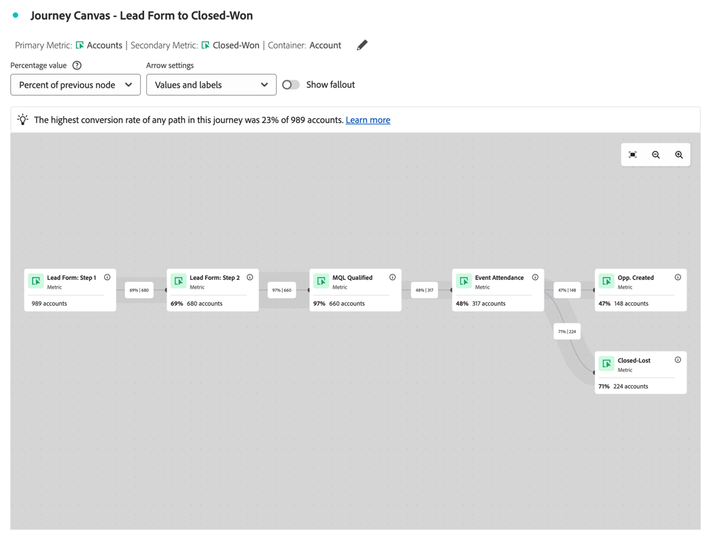
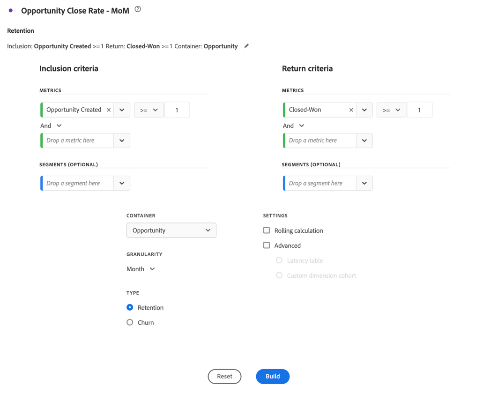
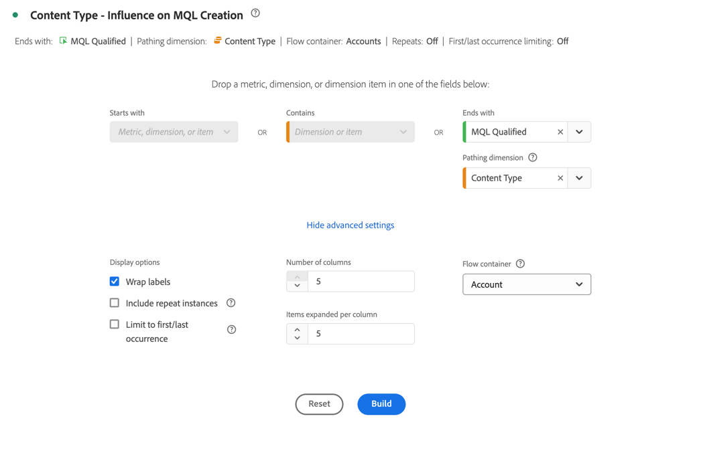

# Accountmarketing optimaliseren

{{draft-b2b}}

Een effectieve marketing op basis van accounts vereist een diepgaand inzicht in de koopreis op rekeningniveau. Zo, kunt u de meest impactful marketing activiteiten bepalen om overeenkomst dicht te drijven.

Voor dit begrip wilt u analyseren en onderzoeken:

* Marketing impact:

   * Via campagnes, kanalen en inhoud.
   * Bij het kopen van groepen binnen accounts,

* Voortgang van de verkooppijplijn.
* Upsell- en cross-sellmogelijkheden.
* Gezondheid van de klantenaccount.

Customer Journey Analytics B2B edition kan u ondersteunen bij het optimaliseren van accountmarketing. Zie de volgende secties voor voorbeelden.

## Op account gebaseerde marketingservice

U wilt weten welke ervaringen, zowel online als offline, het meest effect hebben op het stimuleren van gesloten mogelijkheden.

Gebruik het [ canvas van de Reis ](/help/analysis-workspace/visualizations/journey-canvas/journey-canvas.md) visualisatie om elke interactie over rekeningen, kansen, het kopen groepen, campagnes, en kanalen voor inzichten in in kaart te brengen wat in uw rekening marketing werkt en waar u kunt verbeteren.

Met een reiscanvasvisualisatie kunt u:

* Zie het volledige verhaal. Bijvoorbeeld, kunt u een gedetailleerde weg van a *specifieke* high-value rekening tonen of groep kopen die alle bekende online en off-line interactie omvat.
* Contextualiseer belangrijke momenten die tot kritieke mijlpalen leiden of volgen (bijvoorbeeld: een marketing gekwalificeerde aanlooptrekker, of opportuniteitsverwezenlijking).
* Steunt verkooppersoneel door de de interactiegeschiedenis van visualisatie op specifieke rekeningen. Zo&#39;n visualisatie maakt relevante gesprekken mogelijk.

### Voorbeeld

U wilt de reis van een loodformulier naar een gesloten won visualiseren.

1. [ creeer en vorm een het canvas van de Reis ](/help/analysis-workspace/visualizations/journey-canvas/configure-journey-canvas.md) visualisatie.
1. Configureer **[!UICONTROL Account]** als de **[!UICONTROL Primary metric]** .
1. Selecteer **[!UICONTROL Account]** als **[!UICONTROL Journey canvas container]** .

   

1. Selecteer **[!UICONTROL Build]** .
1. Sleep knooppunten naar het canvas en sluit de knooppunten aan om de reis van de account te illustreren. Bijvoorbeeld: van **[!UICONTROL Lead Form: Step 1]** formulier naar **[!UICONTROL Opp. Created]** .

   

## Cohortsegmentatie

Je wilt een sleutelgroep kopers identificeren, zodat je deze kopersgroepen activeert voor andere kanalen, zoals betaalde media, e-mail, sociale media.

Gebruik de [ lijst van het Cohort ](/help/analysis-workspace/visualizations/cohort-table/cohort-analysis.md) visualisatie aan groep B2B entiteiten (rekeningen, kansen, het kopen groepen) die op een gedeeld uitgangspunt (als een de looddatum van een marktkwalificatie (MQL) worden gebaseerd). En volg de voortgang van elk van deze entiteiten in de loop van de tijd in volgende fasen of mijlpalen.

Met behulp van een cohortabelvisualisatie kunt u:

* Analyseer hoe snel de cohorts van accounts of kansen belangrijke mijlpalen bereiken (bijvoorbeeld: van een gekwalificeerd marketingbedrijf naar een gekwalificeerd verkooplood leiden) over weken of maanden.
* Bepaal of bepaalde cohorten (per segment, campagnebron, type koopgroep) sneller door de verkoopcyclus bewegen dan andere cohorten.
* Evalueer of strategische initiatieven (bijvoorbeeld marketingcampagnes) correleren met kortere progressietermijnen voor volgende cohorten.

### Voorbeeld

Je wilt maandelijkse cohorten van gesloten kansen zien.

1. [ creeer en vorm een lijst van de Cohort ](/help/analysis-workspace/visualizations/cohort-table/t-cohort.md) visualisatie.
1. Gebruik **[!UICONTROL Opportunity Created]** als de **[!UICONTROL Inclusion criteria]** metrische waarde. Selecteer **[!UICONTROL >=]** als de operator en voer waarde `1` in.
1. Gebruik **[!UICONTROL Closed-Won]** als de **[!UICONTROL Return criteria]** metrische waarde. Selecteer **[!UICONTROL >=]** als de operator en voer waarde `1` in.
1. Selecteer **[!UICONTROL Opportunity]** als container.

   

1. Selecteer **[!UICONTROL Build]** . Zie hieronder voor een voorbeeld van een cohortabel.

   

## Persoonlijke gebeurtenissen

U wilt rapporteren over de betrokken account en weergaveactiviteiten voor meerdere persoonlijke gebeurtenissen. U kunt dus de impact van persoonlijke aanwezigheid van gebeurtenissen analyseren en optimaliseren.

A [ stroom ](/help/analysis-workspace/visualizations/c-flow/flow.md) visualisatie laat u de weggebruikers visualiseren, maar nu ook rekeningen of het kopen groep, nemen tussen interactie of stadia in tijd.

Met stroomvisualisatie kunt u:

* Identificeer de frequentste opeenvolgingen van touchpoints die door B2B entiteiten (bijvoorbeeld: van *het Bezoek van de Plaats* aan *Whitepaper Download* aan *het Verzoek van de Demo*) worden overgestoken.
* Visualiseer hoe de rekeningen of het kopen groepen niet lineair navigeren (bijvoorbeeld: lijn terug, overslaat stadia, of neemt onverwachte routes).
* Focus op de flow voor of na een kritieke interactie (bijvoorbeeld: een demo-verzoek) om te begrijpen welke factoren bijdragen tot of welke acties volgen na de interactie.

### Voorbeeld

U wilt de invloed op het genereren van MQL&#39;s (marketing gekwalificeerde leads) visualiseren.

1. [ creeer en vorm een Stroom ](/help/analysis-workspace/visualizations/c-flow/create-flow.md) visualisatie.
1. Selecteer **[!UICONTROL MQL Qualified]** voor **[!UICONTROL End with]** .
1. Selecteer **[!UICONTROL Content Type]** voor **[!UICONTROL Pathing dimension]** .
1. Selecteer **[!UICONTROL Show advanced settings]** .
1. Voer `5` in voor **[!UICONTROL Number of columns]** .
1. Selecteer **[!UICONTROL Account]** voor **[!UICONTROL Flow container]** .

   

1. Selecteer **[!UICONTROL Build]** .

   
