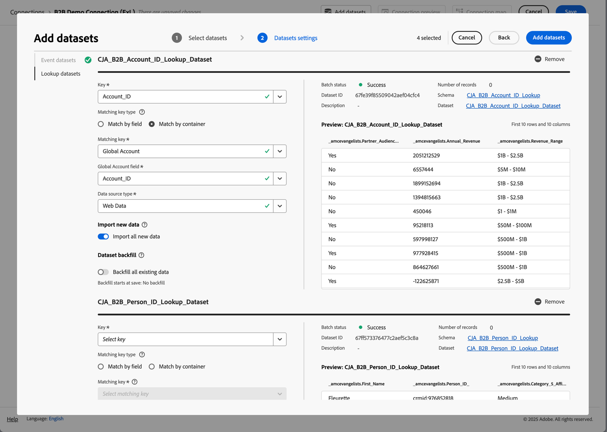
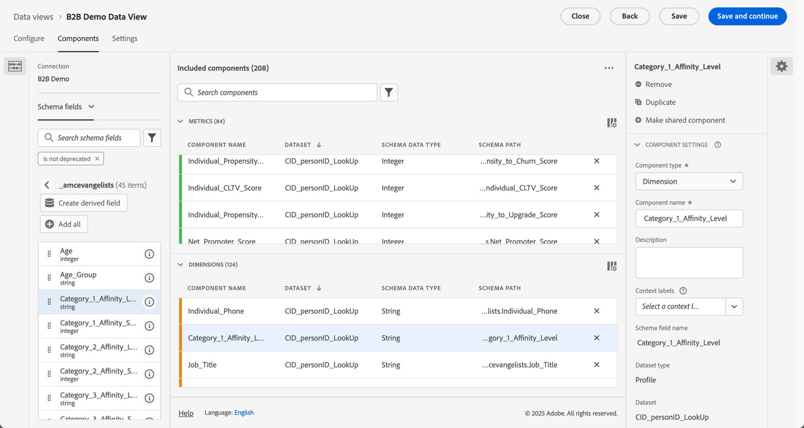
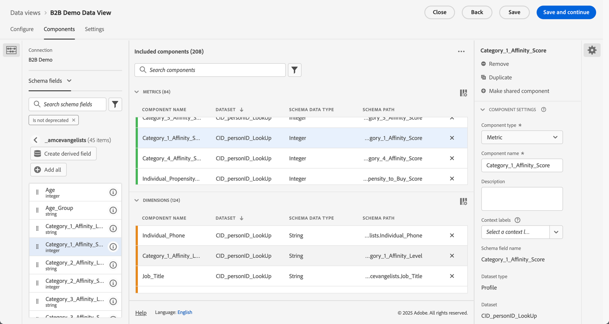

# Gebruiksgevallen voor B2B edition instellen

{{draft-b2b}}

In dit artikel wordt beschreven hoe Customer Journey Analytics B2B edition standaard wordt ingesteld ter ondersteuning van de volgende gebruiksgevallen:

* [Accountmarketing optimaliseren](optimize-account-marketing.md)
* [Sleutelaccounts vergroten](grow-key-accounts.md)
* [Productwaarde opbouwen](build-product-value.md)

>[!NOTE]
>
>De demonstratiegegevens en schermafbeeldingen die in deze gebruiksgevallen worden gebruikt, dienen alleen ter illustratie en geven geen echte gegevens weer.

## Overzicht van het ontwerp van oplossing

Voordat u Customer Journey Analytics B2B edition instelt, moet u ervoor zorgen dat u beschikt over een geschikte referentie voor het ontwerp van de oplossing die alle velden documenteert die u verzamelt.

Een verwijzing naar het ontwerp van een voorbeeldoplossing kan er als volgt uitzien:

+++ Gebeurtenisafmetingen

| Dimension-naam |
|---|
| Account-id |
| Accountnaam |
| Groep-id voor kopen |
| callcenter |
| Vertegenwoordiger-id van callcenter |
| Vraag-id |
| Code voor bijhouden campagne |
| Inhoud-id |
| Inhoudstype |
| Data Source |
| Apparaattype |
| Gebeurtenisdetails |
| Gebeurtenisnaam |
| Trechter |
| Interactiekanaal |
| ID lead |
| Marketingkanaal |
| Marketing Event ID |
| Type marketinggebeurtenis |
| Opportunity-id |
| Pagina |
| Paginagegevens |
| Referentiedomein |
| Verkoper-id |
| Naam verkoopwerkgebied |
| Nummer verkoopwerkgebied |
| Sectie Site |
| SKU |
| Id van secundaire account |
| Id van enquête |
| Toonaangenaam onderzoek |
| Type enquête |
| Gebruikers-id |

+++

+++ Metrische gebeurtenissen

| Metrische naam | Het type Event |
|---|---|
| Account maken: voltooid | Teller |
| Account maken: starten | Teller |
| Kosten bellen | Valuta |
| De Lengte van de vraag | Teller |
| De Score van de Tevredenheid van de vraag | Numeriek |
| De enquêtes van de vraag voltooide | Teller |
| Roept | Teller |
| Gesloten | Teller |
| Closed Won | Teller |
| Weergaven van inhoud | Teller |
| Weergavedoorklikbewerkingen voor valuta&#39;s van transactiegrootte | Teller |
| Afbeeldingen weergeven | Teller |
| E-mail verzonden | Teller |
| E-mail geklikt | Teller |
| E-mail bezorgd | Teller |
| E-mail geopend | Teller |
| E-mail verzonden | Teller |
| Aanwezigheid bij gebeurtenis | Teller |
| Gebeurtenisregistratie: voltooid | Teller |
| Registratie van gebeurtenis: Stap 1 | Teller |
| Registratie van gebeurtenis: Stap 2 | Teller |
| Registratie van gebeurtenis: Stap 3 | Teller |
| Globale Numerieke Binnenkomende Vraag van de Score van de Tevredenheid | Teller |
| Voorloopformulier: voltooid | Teller |
| Loodformulier: Stap 1 | Teller |
| Loodformulier: Stap 2 | Teller |
| Gegenereerde lead | Teller |
| Kwalificatie lead | Teller |
| Vergaderingen | Teller |
| MQL uitgeschakeld | Teller |
| MQL Gekwalificeerd | Teller |
| Evaluatie van behoeften | Teller |
| Onderhandeling | Teller |
| Bezwaren | Teller |
| Kansen | Teller |
| Opportunity maken | Teller |
| Orders | Teller |
| Uitgaande Vraag | Teller |
| Follow-up na verkoop | Teller |
| Indiening voorstel | Teller |
| Gesloten inkomsten | Valuta |
| Ontvangsten gesloten-Won | Valuta |
| Contact van de verkoop Vraag | Teller |
| Verkoopstadium gestart | Teller |
| SMS Click-through | Teller |
| SMS verzonden | Teller |
| Sociale doorklikmogelijkheden | Teller |
| Sociale indrukkingen | Teller |
| Oplossingspresentatie | Teller |
| SQL uitgeschakeld | Teller |
| SQL gekwalificeerd | Teller |
| Eenheden (niet zichtbaar maken) | Teller |
| VoC-enquêtetevredenheidsscore | Numeriek |
| VoC-enquêtes voltooid | Teller |

+++

+++ Persoonsgegevens

| Naam van gegevensweergaveveld | Veldtype |
|---|---|
| Leeftijd | Metrisch |
| Leeftijdsgroep | Dimension |
| Categorie 1 Aanwezigheidsniveau | Dimension |
| Categorie 1-affiniteitsscore | Metrisch |
| Categorie 2 Aanwezigheidsniveau | Dimension |
| Categorie 2-affiniteitsscore | Metrisch |
| Categorie 3 Aanwezigheidsniveau | Dimension |
| Categorie 3-affiniteitsscore | Metrisch |
| Categorie 4 Aanwezigheidsniveau | Dimension |
| Categorie 4-affiniteitsscore | Metrisch |
| Categorie 5 Aanwezigheidsniveau | Dimension |
| Categorie 5-affiniteitsscore | Metrisch |
| Advertising toestemming | Dimension |
| Alle communicatie goedkeuren | Dimension |
| Directe e-mail goedkeuren | Dimension |
| E-mail met toestemming | Dimension |
| GSM voor toestemming | Dimension |
| Personalization toestemming | Dimension |
| Gegevens voor delen met toestemming | Dimension |
| SMS-bericht | Dimension |
| E-mail | Dimension |
| Voornaam | Dimension |
| Geslacht | Dimension |
| Individuele stad | Dimension |
| Individueel CLTV-niveau | Dimension |
| Individuele CLTV-score | Metrisch |
| Individueel land | Dimension |
| Individuele telefoon | Dimension |
| Individuele postcode | Dimension |
| Individuele mate waarin u op Aankoopniveau wilt | Dimension |
| Individuele mate waarin je score kunt kopen | Metrisch |
| Individuele intensiteit tot Churn-niveau | Dimension |
| Afzonderlijke intensiteit van chron-score | Metrisch |
| Individuele geschiktheid voor upgradeniveau | Dimension |
| Individuele prestaties voor upgradescore | Metrisch |
| Individuele staat | Dimension |
| Individueel adres | Dimension |
| Functie | Dimension |
| Achternaam | Dimension |
| Net Score voor promotor | Metrisch |
| Netto-promotiestatus | Dimension |
| Roltype | Dimension |

+++

+++ Accountgegevens

| Naam van gegevensweergaveveld | Veldtype |
|---|---|
| Jaarlijkse inkomsten | Metrisch |
| Plaats bedrijf | Dimension |
| Bedrijfs CLTV-niveau | Dimension |
| Bedrijfs-CLTV-score | Metrisch |
| Land van bedrijf | Dimension |
| Bedrijfsnaam | Dimension |
| Bedrijfstelefoonnummer | Dimension |
| Postcode bedrijf | Dimension |
| Bedrijfseigenschap om niveau te kopen | Dimension |
| Bedrijfseigenschap voor het kopen van score | Metrisch |
| Bedrijfseigenschap naar Churn-niveau | Dimension |
| Bedrijfseigenschap voor Churn Score | Metrisch |
| Bedrijfseigenschap om het niveau op te waarderen | Dimension |
| Bedrijfseigenschap voor upgradescore | Metrisch |
| Bedrijfsomvang | Dimension |
| Vennootschapsstaat | Dimension |
| Adres van bedrijf | Dimension |
| Industrie | Dimension |
| Aantal werknemers | Metrisch |
| Publiek van de partner - de Klanten van de Hardware | Dimension |
| Publiek van de partner - Snelle Groei | Dimension |
| Publiek van de partner - de Nodig Diensten | Dimension |
| Publiek van de partner - de Klanten van de Software | Dimension |
| Opbrengstbereik | Dimension |
| Website | Dimension |

+++

+++ SKU-records

| Naam van gegevensweergaveveld | Veldtype |
|---|---|
| Hardwareproductcategorie | Dimension |
| Hardwareproductnaam | Dimension |
| Servicecategorie | Dimension |
| Servicenaam | Dimension |
| Software-productcategorie | Dimension |
| Naam softwareproduct | Dimension |

+++

## Schema&#39;s en datasets

De gegevens die de verwijzing van het oplossingsontwerp steunen zijn gestructureerd gebruikend de volgende schema&#39;s en datasets.

### Gebeurtenisgegevens

De gebeurtenisafmetingen en metriek worden gesteund door een op tijd-reeks (gebeurtenis) gebaseerd schema en één of meerdere datasets die gebeurtenisgegevens bevatten.

<!--For example: the Account ID field is mapped to **[!UICONTROL Account ID]**. See below for a preview of the data typically available in such a dataset.

-->

### Persoonsgegevens

De persoonverslagen worden gesteund door een verslag (profiel) gebaseerd schema en één of meerdere datasets die persoongegevens bevatten. Zie hieronder voor een voorbeeld van persoongegevens (die op de verwijzing van het ontwerp van de voorbeeldoplossing worden gebaseerd) typisch beschikbaar in zulk een dataset.

### Accountgegevens

De rekeningsverslagen worden gesteund door een verslag (raadpleging) op verslag gebaseerd schema en één of meerdere datasets die rekeningsgegevens bevatten. Zie hieronder voor een voorbeeld van rekeningsgegevens (die op de verwijzing van het ontwerp van de voorbeeldoplossing worden gebaseerd) typisch beschikbaar in zulk een dataset.

### SKU-gegevens

De verslagen van SKU worden gesteund door een verslag (raadpleging) gebaseerd schema en één of meerdere datasets die SKU gegevens bevatten. Zie hieronder voor een voorbeeld van gegevens van SKU (die op de verwijzing van het ontwerp van de voorbeeldoplossing worden gebaseerd) typisch beschikbaar in zulk een dataset.

## Verbinding

Bepaal een op rekening-gebaseerde verbinding in Customer Journey Analytics om verslagen van de gebeurtenis, de rekening, de persoon en de datasets van SKU in te nemen en zich bij te voegen.

1. [ creeer een nieuwe verbinding ](/help/connections/create-connection.md) in Customer Journey Analytics.
1. Voer een beschrijvende naam en beschrijving in voor de verbinding.
1. Selecteer  **[!UICONTROL Account]** als **[!UICONTROL Primary ID]**.
1. Selecteer alles **[!UICONTROL Optional containers]** .
1. Selecteer de voorkeurssandbox en geef een schatting van het gemiddelde aantal dagelijkse gebeurtenissen.

   

1. Selecteer **[!UICONTROL Add datasets]** en voeg de B2B datasets toe die de gegevens voor gebeurtenissen, rekeningen, personen en SKUs bevatten.

    toe

1. Selecteer **[!UICONTROL Next]** om de montages voor elk van de geselecteerde datasets te vormen.
1. Selecteer voor de gebeurtenisdataset de juiste eVars die overeenkomen met de id&#39;s voor **[!UICONTROL Account ID]** , **[!UICONTROL Global Account ID]** , **[!UICONTROL Opportunity ID]** , **[!UICONTROL Buying Group ID]** en **[!UICONTROL Person ID]** .

    toe.

1. De rol neer om de gegevensreeks van rekeningsverslagen te vormen. Zorg ervoor dat u de juiste id (**[!UICONTROL Account_ID]**) selecteert, zodat deze overeenkomt met de account in de **[!UICONTROL Global Account]** -container. Selecteer de juiste id (**[!UICONTROL Account_ID]**) als de **[!UICONTROL Global Account field]** .

    toe

1. De rol neer om de dataset van persoonverslagen te vormen. Zorg ervoor dat u de juiste sleutel (**[!UICONTROL Person_ID]**) selecteert, zodat deze overeenkomt met de persoon in de **[!UICONTROL Person]** -container. Selecteer de juiste identiteit (**[!UICONTROL Profile_Account_ID_Individual]**) die moet overeenkomen met het veld **[!UICONTROL Global Account]** .

    toe

1. De rol neer om de de recorddataset van SKU te vormen. Zorg ervoor u de correcte sleutel (**[!UICONTROL Sku]**) selecteert. Selecteer **[!UICONTROL Match by field]** omdat er geen container is geconfigureerd of beschikbaar voor deze gegevens. Selecteer het gebied SKU in de gebeurtenisdataset (**[!UICONTROL SKU (event datasets)]**) als passende sleutel.

    toe

1. Selecteer **[!UICONTROL Add datasets]** om de datasets en hun gevormde montages te bewaren.

1. Selecteer **[!UICONTROL Save]** om de verbinding op te slaan.

## Gegevens, weergave

Nadat de gegevens in Customer Journey Analytics worden opgenomen, wilt u een gegevensmening tot stand brengen die alle componenten omvat u in uw verwijzing van het oplossingsontwerp hebt bepaald.

### Configureren

1. [ creeer een nieuwe gegevensmening ](/help/data-views/data-views.md) in Customer Journey Analytics.
1. Selecteer de verbinding die u eerder hebt gemaakt (bijvoorbeeld: **[!UICONTROL B2B Demo Connection (ExL)]**).
1. Geef een naam op voor de gegevensweergave. Bijvoorbeeld: `B2B Demo Data view (ExL)` en optioneel een beschrijving.
1. Wijzig desgewenst de naam van de containers. Of blijf bij de standaardcontainernamen.

   
1. Selecteer **[!UICONTROL Save and continue]** .

### Onderdelen

Door gebrek, zijn alle [ standaardcomponenten ](/help/data-views/component-reference.md) reeds inbegrepen in uw gegevensmening. Deze standaardcomponenten omvatten de B2B specifieke metriek voor Rekeningen, het Kopen Groepen, Globale Rekeningen, en Kansen.

1. Voeg alle gebeurtenisafmetingen toe die u in de [ verwijzing van het oplossingsontwerp ](#solution-design-reference), aan de afmetingscomponenten in uw gegevensmening hebt bepaald. Het veld **[!UICONTROL Event Name]** dat bijvoorbeeld de **[!UICONTROL Event Name]** -dimensie vertegenwoordigt. Verzeker u de afmetingscomponent door de beschikbare [ montages van de Component ](/help/data-views/component-settings/overview.md) vormt.

   

1. Voeg alle gebeurtenismetriek toe die u in de [ verwijzing van het oplossingsontwerp ](#solution-design-reference) aan de metrieke componenten in uw gegevensmening hebt bepaald. Het veld **[!UICONTROL SQL Qualified]** vertegenwoordigt bijvoorbeeld de **[!UICONTROL SQL Qualified]** metrische waarde. Verzeker u de afmetingscomponent door de beschikbare [ montages van de Component ](/help/data-views/component-settings/overview.md) vormt.

   

1. Voeg alle rekeningsafmetingen toe die u in de [ verwijzing van het oplossingsontwerp ](#solution-design-reference) aan de afmetingscomponenten in uw gegevensmening hebt bepaald. Het veld **[!UICONTROL Industry]** dat bijvoorbeeld de **[!UICONTROL Industry]** -dimensie vertegenwoordigt. Verzeker u de afmetingscomponent door de beschikbare [ montages van de Component ](/help/data-views/component-settings/overview.md) vormt.

   

1. Voeg alle rekeningsmetriek toe die u in de [ verwijzing van het oplossingsontwerp ](#solution-design-reference) aan de metrieke componenten in uw gegevensmening hebt bepaald. Het veld **[!UICONTROL Number_of_Employees]** vertegenwoordigt bijvoorbeeld de **[!UICONTROL Number_of_Employees]** metrische waarde. Verzeker u de afmetingscomponent door de beschikbare [ montages van de Component ](/help/data-views/component-settings/overview.md) vormt.

   

1. Voeg alle persoondimensies toe die u in de [ verwijzing van het oplossingsontwerp ](#solution-design-reference) aan de afmetingscomponenten in uw gegevensmening hebt bepaald. Het veld **[!UICONTROL Category_1_Affinity_Level]** dat bijvoorbeeld de **[!UICONTROL Category_1_Affinity_Level]** -dimensie vertegenwoordigt. Verzeker u de afmetingscomponent door de beschikbare [ montages van de Component ](/help/data-views/component-settings/overview.md) vormt.

   

1. Voeg al persoonmetriek toe die u in de [ verwijzing van het oplossingsontwerp ](#solution-design-reference) aan de metrieke componenten in uw gegevensmening hebt bepaald. Het veld **[!UICONTROL Category_1_Affinity_Score]** vertegenwoordigt bijvoorbeeld de **[!UICONTROL Category_1_Affinity_Score]** metrische waarde. Verzeker u de afmetingscomponent door de beschikbare [ montages van de Component ](/help/data-views/component-settings/overview.md) vormt.

   

1. Voeg alle afmetingen van SKU toe die u in de [ verwijzing van het oplossingsontwerp ](#solution-design-reference) aan de afmetingscomponenten in uw gegevensmening hebt bepaald. Het veld **[!UICONTROL Service Category]** dat bijvoorbeeld de **[!UICONTROL Service Category]** -dimensie vertegenwoordigt. Verzeker u de afmetingscomponent door de beschikbare [ montages van de Component ](/help/data-views/component-settings/overview.md) vormt.

   

1. Selecteer **[!UICONTROL Save and Continue]** .

### Instellingen

1. U kunt naar keuze specifieke [ montages ](/help/data-views/create-dataview.md#settings-1) voor de gegevensmening bepalen:

   * Voeg segmenten toe aan de gegevensweergave.
   * Gebruik (berekende) metrisch om zittingsmontages te bepalen.

1. Selecteer **[!UICONTROL Save and continue]** .

## Segmenten

U kunt één of meerdere B2B specifieke op container-gebaseerde segmenten voorbereiden die u in uw project van Workspace kunt gebruiken.

Bijvoorbeeld:

* Accounts met event registration segment.

  

* De rekeningen van de V.S. bij het Kopen van Groepen en stadium 5 opportuniteitssegment.

  

## Overige

U kunt naar keuze andere componenten voor uw gebruiksgevallen, als [ berekende metriek ](/help/components/calc-metrics/calc-metr-overview.md), [ datumwaaiers ](/help/components/date-ranges/overview.md), of [ alarm ](/help/components/c-intelligent-alerts/intelligent-alerts.md) bepalen.
