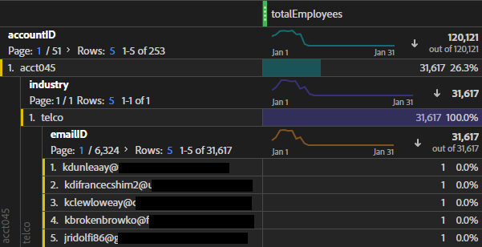

# Gegevens op accountniveau toevoegen als een opzoekgegevensset

In deze B2B-gebruikscase ziet u hoe u uw gegevens op accountniveau kunt opgeven in plaats van op persoonlijke niveau voor analyse. Analyse op accountniveau kan vragen zoals

* Welke bedrijfsnaam wordt aangepast aan deze account?
* Hoeveel werknemers worden geassocieerd met dit rekening/bedrijf?
* Welke rollen worden in deze rekening vertegenwoordigd?
* Hoe presteert deze rekening als geheel met betrekking tot een specifieke marketingcampagne, in vergelijking met een andere rekening?
* Werken bepaalde rollen (zoals IT Manager) bij één account anders dan dezelfde rol bij een andere account?

U bereikt dit alles door de gegevens op accountniveau als een [opzoeken](/help/getting-started/cja-glossary.md) dataset.

U creeert eerst een raadplegingsschema in Adobe Experience Platform, dan creeer een dataset van de raadplegingstafel door op .csv-Gebaseerde rekening-vlakke gegevens in te voeren. Dan gaat u te werk om een verbinding in Customer Journey Analytics (Customer Journey Analytics) tot stand te brengen die verschillende datasets, met inbegrip van de raadpleging combineert u creeerde. Vervolgens maakt u een gegevensweergave en ten slotte kunt u al deze gegevens gebruiken in Workspace.

>[!NOTE]
>
>Tabellen opzoeken kunnen een formaat hebben van maximaal 1 GB.

## 1. Opzoekschema maken (Experience Platform)

Uw eigen schema voor het [opzoeken](/help/getting-started/cja-glossary.md) de lijst zorgt ervoor dat de gebruikte dataset in Customer Journey Analytics met de correcte opstelling (verslagtype) beschikbaar zal zijn. De beste praktijken zijn [een aangepaste schema-klasse maken](https://experienceleague.adobe.com/docs/experience-platform/xdm/tutorials/create-schema-ui.html#create-new-class) genoemd &quot;Opzoeken&quot;, leeg van om het even welk element, dat voor alle raadplegingslijsten kan worden opnieuw gebruikt.

## 2. Opzoekgegevensset maken (Experience Platform)

Zodra het schema is gecreeerd, moet u een raadplegingsdataset van dat schema, in Experience Platform tot stand brengen. Deze raadplegingsdataset bevat account-vlakke marketing informatie, zoals: bedrijfsnaam, totaal aantal werknemers, domeinnaam, welke industrie zij tot behoren, jaarlijkse opbrengst, of zij huidige klanten van de Experience Platform of niet zijn, welke verkoopstadium zij binnen zijn, welk team binnen de rekening Customer Journey Analytics, enz. gebruikt.

1. Ga in Adobe Experience Platform naar **[!UICONTROL Data Management > Datasets]**.
1. Klik op **[!UICONTROL + Create dataset]**.
1. Klik op **[!UICONTROL Create dataset from schema]**.
1. Selecteer de klasse Lookup Schema die u hebt gemaakt.
1. Klik op **[!UICONTROL Next]**.
1. Geef de gegevensset een naam (in ons voorbeeld B2B Info) en geef een beschrijving op.
1. Klik op **[!UICONTROL Finish]**.

## 3. Gegevens in Experience Platform opnemen

Instructies over hoe [Een CSV-bestand toewijzen aan een XDM-schema](https://experienceleague.adobe.com/docs/experience-platform/ingestion/tutorials/map-a-csv-file.html) moet u helpen als u een CSV-bestand gebruikt.

[Andere methoden](https://experienceleague.adobe.com/docs/experience-platform/ingestion/home.html) zijn ook beschikbaar.

Het aan boord nemen van de gegevens en het bepalen van de raadpleging duurt ongeveer 2 tot 4 uur, afhankelijk van de grootte van de raadplegingstabel.

## 4. Gegevensreeksen in een verbinding combineren (Customer Journey Analytics)

Voor dit voorbeeld, combineren wij 3 datasets in één verbinding van de Customer Journey Analytics:

| Naam gegevensset | Beschrijving | Adobe Experience Platform Schema, klasse | Gegevens over gegevensset |
| --- | --- | --- | --- |
| B2B-impressie | Bevat klikstroom, gebeurtenis-vlakke gegevens op het rekeningsniveau. Het bevat bijvoorbeeld de e-mail-id en de bijbehorende account-id en de marketingnaam voor marketingadvertenties. Het omvat ook de indrukkingen voor die advertenties, per gebruiker. | Gebaseerd op de XDM ExperienceEvent-schemaklasse | De `emailID` wordt gebruikt als primaire identiteit en toegewezen aan `Customer ID` naamruimte. Als gevolg hiervan wordt deze standaard weergegeven **[!UICONTROL Person ID]** in de Customer Journey Analytics.  |
| B2B-profiel | Deze profieldataset vertelt u meer over de gebruikers in een rekening, zoals hun baantitel, tot welke rekening zij behoren, hun profiel van LinkedIn, etc. | Gebaseerd op de XDM-klasse Individueel profielschema | Selecteren `emailID` als primaire id in dit schema. |
| B2B-info | Zie &quot;Opzoekgegevensset maken&quot; hierboven. | B2BAccount (aangepaste opzoekschema-klasse) | De relatie tussen `accountID` en de B2B dataset van de Indrukking is automatisch gecreeerd door de B2B dataset van Info met de B2B dataset van de Indrukking in Customer Journey Analytics te verbinden, zoals die in de hieronder stappen wordt beschreven.  |

Hier is hoe u de datasets combineert:

1. Selecteer in Customer Journey Analytics de optie **[!UICONTROL Connections]** tab.
1. Selecteer de datasets (in ons voorbeeld, de drie hierboven) u wilt combineren.
1. Selecteer voor de B2B-gegevensset Info de `accountID` die in uw raadplegingslijst zal worden gebruikt. Selecteer vervolgens de overeenkomende sleutel (corresponderende dimensie), ook `accountID` in uw gebeurtenisdataset.
1. Klik op **[!UICONTROL Next]**.
1. Naam en beschrijf de verbinding en vorm het volgens [deze instructies](/help/connections/create-connection.md).
1. Klik op **[!UICONTROL Save]**.

## 5. Een gegevensweergave maken vanuit deze verbinding

Volg de instructies op [gegevensweergaven maken](/help/data-views/create-dataview.md).

* Voeg alle componenten (afmetingen en metriek) toe die u van de datasets nodig hebt.

## 6. De gegevens in Workspace analyseren

U kunt de projecten van de Werkruimte nu tot stand brengen die op de gegevens van alle 3 datasets worden gebaseerd.

U vindt bijvoorbeeld antwoorden op de antwoorden in de inleiding:

* Verdeel de e-mailid op accountID om te bepalen tot welk bedrijf een e-mailid behoort.
* Hoeveel werknemers worden toegewezen aan een specifieke account-id?
* Tot welke branche behoort een account-id?

