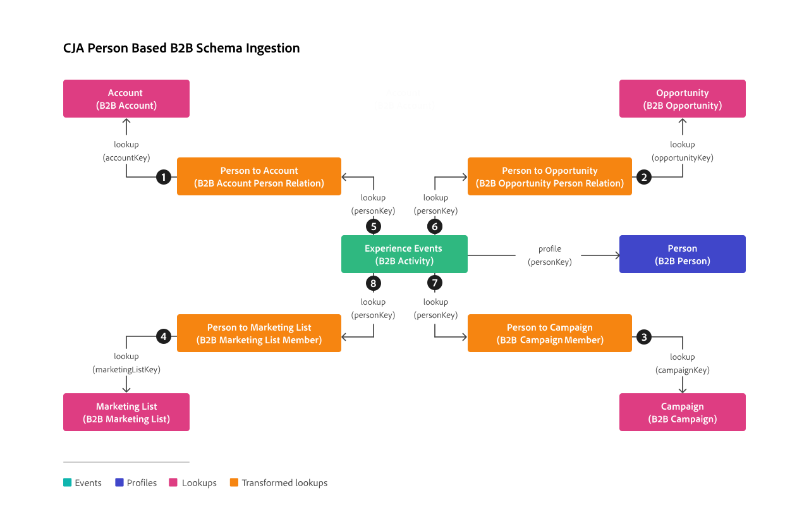

# Een B2B-voorbeeldproject

In dit artikel wordt uitgelegd hoe u op profielniveau gebaseerde B2B-gegevens in Customer Journey Analytics instelt, configureert en rapporteert.

## Verbinding

Bepaal uw verbinding om alle relevante B2B datasets van Experience Platform te omvatten. Gegevensbestanden die u kunt toevoegen aan uw verbinding:

| Gegevensset | Schema | Type schema | Basisklasse | Beschrijving |
|---|---|---|---|---|
| B2B-activiteitengegevens | B2B Activiteitsschema | Gebeurtenis | XDM ExperienceEvent | Een ExperienceEvent is een feitenverslag van wat voorkwam, met inbegrip van het tijdstip en de identiteit van het betrokken individu. ExperienceEvents kunnen expliciete (direct waarneembare menselijke acties) of impliciete (opgewekte zonder directe menselijke actie) zijn en worden geregistreerd zonder aggregatie of interpretatie. De gebeurtenissen van de ervaring zijn kritiek voor tijd-domeinanalyse aangezien zij voor waarneming en analyse van veranderingen toestaan die in een bepaald venster van tijd en de vergelijking tussen veelvoudige vensters van tijd voorkomen om tendensen te volgen. |
| B2B-persoonsgegevensset | B2B Personenschema | Profiel | Afzonderlijk XDM-profiel | Een XDM Individueel Profiel vormt een enkelvoudige vertegenwoordiging van de attributen en de belangen van zowel geïdentificeerde als gedeeltelijk geïdentificeerde individuen. Minder geïdentificeerde profielen kunnen alleen anonieme gedragssignalen bevatten, zoals browsercookies, terwijl sterk geïdentificeerde profielen gedetailleerde persoonlijke gegevens kunnen bevatten zoals naam, geboortedatum, locatie en e-mailadres. Naarmate een profiel groeit, wordt het een robuuste opslagplaats voor persoonlijke gegevens, identificatiegegevens, contactgegevens en communicatievoorkeuren voor een individu. |
| B2B-accountgegevens | B2B-accountschema | Opzoeken | XDM Business Account | Een XDM Business Account is een standaard XDM-klasse (Experience Data Model) waarmee de minimaal vereiste eigenschappen van een zakelijke account worden vastgelegd. Deze XDM-klasse kan alleen worden opgenomen in het profiel voor klanten met de B2B- of B2P-editie. |
| B2B-opportuniteitsgegevensset | B2B-opportuniteitsschema | Opzoeken | XDM Business Opportunity | XDM Business Opportunity is een standaard XDM-klasse (Experience Data Model) waarmee de minimaal vereiste eigenschappen van een zakelijke opportuniteit worden vastgelegd. Deze XDM-klasse kan alleen worden opgenomen in het profiel voor klanten met de B2B- of B2P-editie. |
| Gegevensset voor B2B-campagne | B2B-campagnereschema | Opzoeken | XDM Business Campaign | XDM Business Campaign is een standaard XDM-klasse (Experience Data Model) waarmee de minimaal vereiste eigenschappen van een zakelijke campagne worden vastgelegd. Deze XDM-klasse kan alleen worden opgenomen in het profiel voor klanten met de B2B- of B2P-editie. |
| Gegevensset voor B2B-marketinglijst | B2B-schema voor marketinglijsten | Opzoeken | XDM Business Marketing List | XDM Business Marketing List is een standaard XDM-klasse (Experience Data Model) waarmee de minimaal vereiste eigenschappen van een marketinglijst worden vastgelegd. Op de markt brengende lijsten staan u toe om aan potentiële cliënten voorrang te geven die zeer waarschijnlijk uw product zullen kopen. Deze XDM-klasse kan alleen worden opgenomen in het profiel voor klanten met de B2B- of B2P-editie. |
| B2B-gegevensset betreffende de relatie van rekeningpersonen | B2B-relatieschema van rekeningpersonen | Opzoeken | XDM Zakelijke account Person Relatie | De Verhouding van de Persoon van de Rekening van XDM van de BedrijfsRekening is een standaardklasse van de Gegevens van de Ervaring (XDM) die de minimum vereiste eigenschappen van een persoon vangt die met een bedrijfsrekening wordt geassocieerd. |
| B2B Dataset van de Betrekking van de Kans van de Persoon | B2B Opportunity Person Relatie Schema | Opzoeken | XDM Business Opportunity Person Relatie | De Relatie van de Persoon van de Kans van de Onderneming XDM is een standaardKlasse van de Gegevens van de Ervaring Model (XDM) die de minimum vereiste eigenschappen van een persoon vangt die met een bedrijfskans wordt geassocieerd. |
| B2B Marketing List Member Data | B2B Marketing List Member Schema | Opzoeken | Leden van XDM-marketinglijst | De Leden van de Lijst van de Bedrijfs XDM is een standaardGegevensmodel van de Ervaring (XDM) klasse die leden, personen, of contacten verbonden aan een marketing lijst beschrijft. |
| Gegevensset voor B2B-campagnegelid | B2B Campagne Member Schema | Opzoeken | XDM Business Campaign-leden | XDM Business Campaign-leden zijn een standaard XDM-klasse (Experience Data Model) waarmee een contactpersoon of lead wordt beschreven die aan een zakelijke campagne is gekoppeld. |

<!--
| B2B Account Dataset | B2B Account Schema | Lookup | XDM Business Account | XDM Business Account is a standard Experience Data Model (XDM) class that captures the minimum required properties of a business account.  |
| B2B Opportunity Dataset | B2B Opportunity Schema | Lookup | XDM Business Opportunity | XDM Business Opportunity is a standard Experience Data Model (XDM) class that captures the minimum required properties of a business opportunity.  |
| B2B Campaign Dataset | B2B Campaign Schema | Lookup | XDM Business Campaign | XDM Business Campaign is a standard Experience Data Model (XDM) class that captures the minimum required properties of a business campaign.  |
| B2B Marketing List Dataset | B2B Marketing List Schema | Lookup | XDM Marketing List | XDM Business Marketing List is a standard Experience Data Model (XDM) class that captures the minimum required properties of a marketing list. Marketing lists allow you to prioritize on prospect clients who are most likely to buy your product.  |
-->

De verhouding tussen de B2B raadplegingsschema&#39;s, profielschema, en gebeurtenisschema wordt bepaald in de B2B opstelling binnen Experience Platform. Zie Schema&#39;s in [ Real-time Customer Data Platform B2B Uitgave ](https://experienceleague.adobe.com/en/docs/experience-platform/rtcdp/schemas/b2b) en [ bepalen een vele-aan-één verhouding tussen twee schema&#39;s in de Uitgave van Real-time Customer Data Platform B2B ](https://experienceleague.adobe.com/en/docs/experience-platform/xdm/tutorials/relationship-b2b).

Om een correcte opstelling van een verbinding te verzekeren die op persoon-gebaseerde raadplegingen van uw B2B gegevens steunt, gebruik de volgende illustratie voor een overzicht en volg deze stappen:

1. Voeg datasets van de lijst hierboven aan uw verbinding toe.
1. Voor elke opzoekgegevensset die u toevoegt aan uw verbinding, moet u de relatie met een gebeurtenisdataset expliciet definiëren met de dialoogvensters **[!UICONTROL Key]** en **[!UICONTROL Matching key]** in **[!UICONTROL Edit dataset]** .
1. Voor elke raadplegingsdataset die u voor op persoon-gebaseerde B2B raadplegingen wilt omzetten, laat **[!UICONTROL Transform dataset]** toe om ervoor te zorgen dat de gegevens voor op persoon-gebaseerde raadplegingen worden omgezet. Zie [ datasets van de Transformatie voor B2B raadplegingen ](/help/connections/transform-datasets-b2b-lookups.md) voor extra informatie.

   

   In de onderstaande tabel vindt u een voorbeeld van de waarden [!UICONTROL Person ID] , [!UICONTROL Key] en [!UICONTROL Matching key] voor elk van de gegevenssets.

   | Gegevensset | Persoon-id | Sleutel | Overeenkomende sleutel   (in gebeurtenisdataset) |
   |---|---|---|---| 
   | B2B-activiteitengegevens | `personKey.sourceKey` | | |
   | B2B-persoonsgegevensset | `b2b.personKey.sourceKey` | | |
   | B2B-accountgegevens | | `accountKey.sourceKey` ❶   Sleutel van Source | `b2b.accountKey.sourceKey` ❶   (B2B Dataset van de Persoon) |
   | B2B-opportuniteitsgegevensset | | `opportunityKey.sourceKey` ❷   Sleutel van Source | `opportunityKey.sourceKey` ❷   (B2B Dataset van de Verhouding van de Kans) |
   | Gegevensset voor B2B-campagne | | `campaignKey.sourceKey` ❸   Sleutel van Source | `campaignKey.sourceKey` ❸   (B2B Dataset van het Lid van de Campagne) |
   | Gegevensset voor B2B-marketinglijst | | `marketingListKey.sourceKey` ❹   Sleutel van Source | `marketingListKey.sourceKey` ❹   (B2B de Dataset van het Lid van de Lijst van de Marketing) |
   | B2B-gegevensset betreffende de relatie van rekeningpersonen | | `personKey.sourceKey` ❺   Sleutel van Source | `personKey.sourceKey` ❺   Sleutel van Source (de datasets van de Gebeurtenis) |
   | B2B Dataset van de Betrekking van de Kans van de Persoon | | `personKey.sourceKey` ❻   Sleutel van Source | `personKey.sourceKey` ❻   Sleutel van Source (de datasets van de Gebeurtenis) |
   | Gegevensset voor B2B-campagnegelid | | `personKey.sourceKey` ❼   Sleutel van Source | `personKey.sourceKey` ❼   Sleutel van Source (de datasets van de Gebeurtenis) |
   | B2B Marketing List Member Data | | `personKey.sourceKey` ❽   Sleutel van Source | `personKey.sourceKey` ❽   Sleutel van Source (de datasets van de Gebeurtenis) |

{style="table-layout:auto"}

Zie [ datasets ](../../connections/create-connection.md) voor meer informatie toevoegen en vormen over hoe te om montages voor een dataset te vormen.

## Gegevens, weergave

Als u toegang wilt hebben tot relevante B2B-afmetingen en maateenheden wanneer u uw Workspace-project maakt, moet u de gegevensweergave op basis daarvan definiëren.

U kunt bijvoorbeeld de volgende componenten aan de gegevensweergave toevoegen om ervoor te zorgen dat u op persoonlijk niveau op uw B2B-gegevens kunt rapporteren. De componentennamen worden soms gewijzigd voor duidelijkheid van hun originele schemanamen.

+++Metrisch

| Componentnaam | Gegevensset | Gegevenstype | Schemapad |
|---|---|---|---|
| Jaarrekening | B2B-accountgegevens | Dubbel | accountOrganization.annualRevenue.amount |
| Aantal werknemers | B2B-accountgegevens | Geheel | accountOrganization.numberOfEmployees |
| Werkelijke campagnekosten | Gegevensset voor B2B-campagne | Dubbel | actualCost.amount |
| Kosten van gerichte campagne | Gegevensset voor B2B-campagne | Dubbel | budgetedCost.amount |
| Verwachte opportuniteitsontvangsten | B2B-opportuniteitsgegevensset | Dubbel | expectedRevenue.amount |
| Verwachte campagneopbrengst | Gegevensset voor B2B-campagne | Dubbel | expectedRevenue.amount |
| Aantal kansen | B2B-opportuniteitsgegevensset | Dubbel | opportunityAmount.amount |

+++

+++Dimensionen

| Componentnaam | Gegevensset | Gegevenstype | Schemapad |
|---|---|---|---|
| Accountnaam | B2B-accountgegevens | String | accountName |
| Campagnenaam | Gegevensset voor B2B-campagne | String | campagneName |
| Kanaalnaam | Gegevensset voor B2B-campagne | String | channelName |
| Land | B2B-accountgegevens | String | accountBillingAddress.country |
| Naam van voorspelde categorie | B2B-opportuniteitsgegevensset | String | expectedCategoryName |
| Industrie | B2B-accountgegevens | String | accountOrganization.industry |
| Achternaam | B2B-persoonsgegevensset | String | person.name.lastName |
| Naam van marketinglijst | Gegevensset voor B2B-marketinglijst | String | marketingListName |
| Naam opportunity | B2B-opportuniteitsgegevensset | String | opportunityName |
| Opportunity Stage | B2B-opportuniteitsgegevensset | String | opportunityStage |
| Type opportunity | B2B-gegevensset voor opportuniteitstype | String | opportunityType |
| Webinar Session Name | Gegevensset voor B2B-campagne | String | webinarSessionName |

+++

## Workspace

Met uw componenten die correct in de gegevensmening worden bepaald, kunt u specifieke B2B- rapporten en visualisaties in uw project van Workspace nu bouwen.

Hieronder ziet u een schermafbeelding van een voorbeeldproject dat gebruikmaakt van de hierboven beschreven verbinding en gegevensweergave. De visualisatiebeschrijvingen verklaren welke van de vrije lijstvisualisatie op de getransformeerde B2B raadplegingsgegevens baseert.

