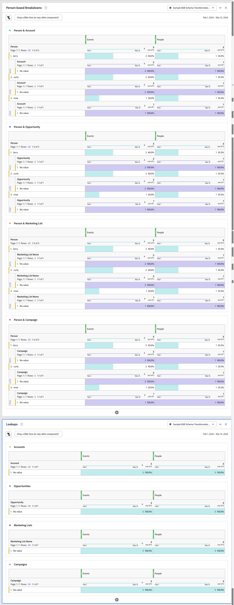

# Een B2B-voorbeeldproject

In dit artikel wordt uitgelegd hoe u op profielniveau gebaseerde B2B-gegevens in Customer Journey Analytics instelt, configureert en rapporteert.

## Verbinding

Bepaal uw verbinding om alle relevante B2B datasets van Experience Platform te omvatten. Zorg ervoor dat u alle relevante opzoekgegevenssets opneemt en transformeert die zijn vereist voor een standaard B2B-rapporteringsscenario voor personen. Zie [ B2B raadplegingsdatasets van de Transformatie ](/help/connections/transform-datasets-b2b-lookups.md) voor meer informatie.

Gegevensbestanden die u kunt toevoegen aan uw verbinding:

| Gegevensset | Schema | Type schema | Basisklasse | Beschrijving |
|---|---|---|---|---|
| B2B-activiteitengegevens | B2B Activiteitsschema | Gebeurtenis | XDM ExperienceEvent | Een ExperienceEvent is een feitenverslag van wat voorkwam, met inbegrip van het tijdstip en de identiteit van het betrokken individu. ExperienceEvents kunnen expliciete (direct waarneembare menselijke acties) of impliciete (opgewekte zonder directe menselijke actie) zijn en worden geregistreerd zonder aggregatie of interpretatie. Zij zijn kritiek voor tijd-domein analyses aangezien zij voor waarneming en analyse van veranderingen toestaan die in een bepaald venster van tijd en de vergelijking tussen veelvoudige vensters van tijd voorkomen om tendensen te volgen. |
| B2B-persoonsgegevensset | B2B Personenschema | Profiel | Afzonderlijk XDM-profiel | Een XDM Individueel Profiel vormt een enkelvoudige vertegenwoordiging van de attributen en de belangen van zowel geïdentificeerde als gedeeltelijk geïdentificeerde individuen. Minder geïdentificeerde profielen kunnen alleen anonieme gedragssignalen bevatten, zoals browsercookies, terwijl sterk geïdentificeerde profielen gedetailleerde persoonlijke gegevens kunnen bevatten zoals naam, geboortedatum, locatie en e-mailadres. Naarmate een profiel groeit, wordt het een robuuste opslagplaats voor persoonlijke gegevens, identificatiegegevens, contactgegevens en communicatievoorkeuren voor een individu. |
| B2B-gegevensset betreffende de relatie van rekeningpersonen | B2B-relatieschema van rekeningpersonen | Opzoeken | XDM Zakelijke account Person Relatie | De Verhouding van de Persoon van de Rekening van XDM van de BedrijfsRekening is een standaardklasse van de Gegevens van de Ervaring (XDM) die de minimum vereiste eigenschappen van een persoon vangt die met een bedrijfsrekening wordt geassocieerd. |
| B2B Dataset van de Betrekking van de Kans van de Persoon | B2B Opportunity Person Relatie Schema | Opzoeken | XDM Business Opportunity Person Relatie | De Relatie van de Persoon van de Kans van de Onderneming XDM is een standaardKlasse van de Gegevens van de Ervaring Model (XDM) die de minimum vereiste eigenschappen van een persoon vangt die met een bedrijfskans wordt geassocieerd. |
| Gegevensset voor B2B-marketinglijsten | B2B-schema Leden op marketinglijst | Opzoeken | Leden van XDM-marketinglijst | De Leden van de Lijst van de Bedrijfs XDM is een standaardGegevensmodel van de Ervaring (XDM) klasse die leden, personen, of contacten verbonden aan een marketing lijst beschrijft. |
| Gegevensset voor B2B-campagnegelid | B2B Campagne Member Schema | Opzoeken | XDM Business Campaign-leden | XDM Business Campaign-leden zijn een standaard XDM-klasse (Experience Data Model) waarmee een contactpersoon of lead wordt beschreven die aan een zakelijke campagne is gekoppeld. |

<!--
| B2B Account Dataset | B2B Account Schema | Lookup | XDM Business Account | XDM Business Account is a standard Experience Data Model (XDM) class that captures the minimum required properties of a business account.  |
| B2B Opportunity Dataset | B2B Opportunity Schema | Lookup | XDM Business Opportunity | XDM Business Opportunity is a standard Experience Data Model (XDM) class that captures the minimum required properties of a business opportunity.  |
| B2B Campaign Dataset | B2B Campaign Schema | Lookup | XDM Business Campaign | XDM Business Campaign is a standard Experience Data Model (XDM) class that captures the minimum required properties of a business campaign.  |
| B2B Marketing List Dataset | B2B Marketing List Schema | Lookup | XDM Marketing List | XDM Business Marketing List is a standard Experience Data Model (XDM) class that captures the minimum required properties of a marketing list. Marketing lists allow you to prioritize on prospect clients who are most likely to buy your product.  |
-->

De verhouding tussen de raadplegingsschema&#39;s, het profielschema, en gebeurtenisschema wordt bepaald in B2B opstelling binnen Experience Platform. Zie Schema&#39;s in [ Real-time Customer Data Platform B2B Uitgave ](https://experienceleague.adobe.com/docs/experience-platform/rtcdp/schemas/b2b.html) en [ bepalen een vele-aan-één verhouding tussen twee schema&#39;s in de Uitgave van Real-time Customer Data Platform B2B ](https://experienceleague.adobe.com/docs/experience-platform/xdm/tutorials/relationship-b2b.html) voor meer details.

Voor elke opzoekgegevensset die u toevoegt aan uw verbinding, moet u de relatie met een gebeurtenisdataset expliciet definiëren met **[!UICONTROL Key]** en **[!UICONTROL Matching key]** in het dialoogvenster **[!UICONTROL Edit dataset]** . Bijvoorbeeld:

Vier schema&#39;s worden uitdrukkelijk gebruikt om het schema van de Persoon aan andere relevante schema&#39;s te verbinden: Rekening, Kans, Campagne en de Lijst van de Marketing. Deze schema&#39;s zijn gebaseerd op de volgende schemaklassen:

* XDM Zakelijke account Person Relatie
* XDM Business Opportunity Person Relatie
* Leden van XDM Business Marketing List
* XDM Business Campaign-leden

Voor elke raadplegingsdataset, voor een schema dat op zulk een schemaklasse wordt gebaseerd, laat u **[!UICONTROL Transform dataset]** ook toe om ervoor te zorgen dat de gegevens voor op persoon-gebaseerde raadplegingen worden getransformeerd. Zie [ datasets van de Transformatie voor B2B raadplegingen ](/help/connections/transform-datasets-b2b-lookups.md) voor meer informatie.

In de onderstaande tabel vindt u een voorbeeld van de waarden [!UICONTROL Person ID] , [!UICONTROL Key] en [!UICONTROL Matching key] voor elk van de gegevenssets.

| Gegevensset | Persoon-id | Sleutel | Overeenkomende sleutel (in gegevensset voor gebeurtenissen) |
|---|---|---|---|
| B2B-activiteitengegevens | `personKey.sourceKey` | | |
| B2B-persoonsgegevensset | `b2b.personKey.sourceKey` | | |
| Gegevensset over B2B-accountpersoon | | `personKey.sourceKey` | `personKey.sourceKey` |
| B2B-opportuniteitsgegevensset | | `personKey.sourceKey` | `personKey.sourceKey` |
| Gegevensset voor B2B-campagneleden | | `personKey.sourceKey` | `personKey.sourceKey` |
| Gegevensset voor B2B-marketinglijst | | `personKey.sourceKey` | `personKey.sourceKey` |

{style="table-layout:auto"}

Zie [ datasets ](../../connections/create-connection.md) voor meer informatie toevoegen en vormen over hoe te om montages voor een dataset te vormen.

## Gegevens, weergave

Als u toegang wilt hebben tot relevante B2B-afmetingen en -gegevens wanneer u uw Workspace-project maakt, moet u de gegevensweergave dienovereenkomstig definiëren.

U kunt de volgende componenten als afmetingen aan uw gegevensmening toevoegen om ervoor te zorgen u op persoon-gebaseerd niveau op uw B2B gegevens kunt melden. De componentnamen worden voor de duidelijkheid gewijzigd.

| Componentnaam | Gegevensset | Schema, gegevenstype | Schemapad |
|---|---|---|---|
| Persoon | B2B-activiteit | String | `personID` |
| Account | B2B-rekeningpersoon | String | `accountKey.sourceID` |
| Campaign | B2B Campagne-lid | String | `campaignKey.sourceKey` |
| Naam van marketinglijst | B2B-marketinglijst | String | `marketingListID` |
| Opportunity | B2B-opportuniteitspersoon | String | `opportunityKey.sourceID` |

<!--
This section provides recommendations and suggestions on what dimensions and metrics to include when defining the [components](../../data-views/create-dataview.md#components) for B2B datasets in your data view.

For each component, the name, schema type, schema path, and (when applicable) details about the configuration are provided.

+++ B2B Activity dataset

### Metrics

| Component Name | Schema data type | Schema path | Configuration |
|---|---|---|---|
| Add To Campaign | String | `eventType` | **[!UICONTROL Set include/exclude values]** **[!UICONTROL Case sensitive]** Match: **[!UICONTROL If all criteria are met]** Criteria: **[!UICONTROL Equals]** `leadOperation.addToCampaign` |
| Add To Opportunity | String | `eventType` | **[!UICONTROL Set include/exclude values]** **[!UICONTROL Case sensitive]** Match: **[!UICONTROL If all criteria are met]** Criteria: **[!UICONTROL Equals]** `opportunityEvent.addToOpportunity` |
| Application Closed | String | `eventType` | **[!UICONTROL Set include/exclude values]** **[!UICONTROL Case sensitive]** Match: **[!UICONTROL If all criteria are met]** Criteria: **[!UICONTROL Equals]** `application.close` |
| Application Launch | String | `eventType` | **[!UICONTROL Set include/exclude values]** **[!UICONTROL Case sensitive]** Match: **[!UICONTROL If all criteria are met]** Criteria: **[!UICONTROL Equals]** `application.launch` |
| Campaign Stream | String | `eventType` | **[!UICONTROL Set include/exclude values]** **[!UICONTROL Case sensitive]** Match: **[!UICONTROL If all criteria are met]** Criteria: **[!UICONTROL Equals]** ` leadOperation.changeCampaignStream` |
| Checkout | String | `eventType` | **[!UICONTROL Set include/exclude values]** **[!UICONTROL Case sensitive]** Match: **[!UICONTROL If all criteria are met]** Criteria: **[!UICONTROL Equals]** `commerce.checkouts` |
| Convert Lead | String | `eventType` | **[!UICONTROL Set include/exclude values]** **[!UICONTROL Case sensitive]** Match: **[!UICONTROL If all criteria are met]** Criteria: **[!UICONTROL Equals]** `leadOperation.convertLead` |
| Email Clicked | String | `eventType` | **[!UICONTROL Set include/exclude values]** **[!UICONTROL Case sensitive]** Match: **[!UICONTROL If all criteria are met]** Criteria: **[!UICONTROL Equals]** `directMarketing.emailClicked` |
| Email Delivered | String | `eventType` | **[!UICONTROL Set include/exclude values]** **[!UICONTROL Case sensitive]** Match: **[!UICONTROL If all criteria are met]** Criteria: **[!UICONTROL Equals]** `directMarketing.emailDelivered` |
| Email Opened | String | `eventType` | **[!UICONTROL Set include/exclude values]** **[!UICONTROL Case sensitive]** Match: **[!UICONTROL If all criteria are met]** Criteria: **[!UICONTROL Equals]** `directMarketing.emailOpened` |
| Email Sent | String | eventType | **[!UICONTROL Set include/exclude values]** **[!UICONTROL Case sensitive]** Match: **[!UICONTROL If all criteria are met]** Criteria: **[!UICONTROL Equals]** `directMarketing.emailSent` |
| Email Unsubscribed | String | `eventType` | **[!UICONTROL Set include/exclude values]** **[!UICONTROL Case sensitive]** Match: **[!UICONTROL If all criteria are met]** Criteria: **[!UICONTROL Equals]** `directMarketing.emailUnsubscribed` |
| Form Filled Out | String | `eventType` | **[!UICONTROL Set include/exclude values]** **[!UICONTROL Case sensitive]** Match: **[!UICONTROL If all criteria are met]** Criteria: **[!UICONTROL Equals]** `web.formFilledOut` |
| Form Started | String | `web.fillOutForm.webFormName` | |
| Leads | String | eventType | **[!UICONTROL Set include/exclude values]** **[!UICONTROL Case sensitive]** Match: **[!UICONTROL If all criteria are met]** Criteria: **[!UICONTROL Equals]** `leadOperation.newLead` |
| Opportunity Updated | String | `eventType` | **[!UICONTROL Set include/exclude values]** **[!UICONTROL Case sensitive]** Match: **[!UICONTROL If all criteria are met]** Criteria: **[!UICONTROL Equals]** `opportunityEvent.opportunityUpdated` |
| Price | Double | *_organizationID*`.interactions.products.price` |  |
| Priority | Integer | `leadOperation.changeScore.priority` |  |
| Prod List Add | String | `eventType` |  **[!UICONTROL Set include/exclude values]** **[!UICONTROL Case sensitive]** Match: **[!UICONTROL If all criteria are met]** Criteria: **[!UICONTROL Equals]** `commerce.productListAdds.value` |
| Prod List Open | String | `eventType` |  **[!UICONTROL Set include/exclude values]** **[!UICONTROL Case sensitive]** Match: **[!UICONTROL If all criteria are met]** Criteria: **[!UICONTROL Equals]** `commerce.productListOpens.value` |
| Prod View | String | `eventType` |  **[!UICONTROL Set include/exclude values]** **[!UICONTROL Case sensitive]** Match: **[!UICONTROL If all criteria are met]** Criteria: **[!UICONTROL Equals]** `commerce.productViews.value` |
| Purchases | String | `eventType` |  **[!UICONTROL Set include/exclude values]** **[!UICONTROL Case sensitive]** Match: **[!UICONTROL If all criteria are met]** Criteria: **[!UICONTROL Equals]** `commerce.purchases.value` |
| Remove From Opportunity | String | `eventType` |  **[!UICONTROL Set include/exclude values]** **[!UICONTROL Case sensitive]** Match: **[!UICONTROL If all criteria are met]** Criteria: **[!UICONTROL Equals]** `opportunityEvent.removeFromOpportunity` |
| Save for Laters | String | eventType |  **[!UICONTROL Set include/exclude values]** **[!UICONTROL Case sensitive]** Match: **[!UICONTROL If all criteria are met]** Criteria: **[!UICONTROL Equals]** `commerce.productViews.value` |

{style="table-layout:auto"}

### Dimensions

| Component Name | Schema data type | Schema path | Configuration |
|---|---|---|---|
| Account Key (Source Key) | String | *_organizationID*`.Interactions.accountKey.sourceKey` | |
| Converted Status | String | `leadOperation.convertLead.convertedStatus` | |
| Event Type | String | `eventType` | |
| Form Name | String | `leadOperation.newLead.formName` | |
| Identifier | String | `_id` | |
| Is Sent Notification | Boolean | `leadOperation.convertLead.isSentNotificationEmail` | |
| Keywords | String | `search.keywords` | |
| List ID | String | `listOperations.listID` | |
| List Name | String | `leadOperation.newLead.listName` | |
| Page Name | String | `web.webPageDetails.name` | |
| Person Key (Source Key) | String | `personKey.sourceKey` | |
| Produced By | String | producedBy | |
| Product Name | String | *_organizationID*`.Interactions.products.name` | |
| Role | String | `opportunityEvent.role` | | 
| Timestamp | Date-time | `timestamp` | Date-Time format: **[!UICONTROL Day]** |
| URL | String | `web.webPageDetails.URL` | |
| Web Form Name | String | `web.fillOutForm.webFormName` | |
| Product URL | String | *_organizationID*`.Interactions.products.url` | |

{style="table-layout:auto"}

+++

+++ B2B Person dataset

### Metrics

No metric components are defined as part of this dataset.

### Dimensions

| Component Name | Schema data type | Schema path | Configuration |
|---|---|---|---|
| Last Activity Date | Date-time | `extSourceSystemAudit.lastActivityDate` | Date-Time format: **[!UICONTROL Day]** |
| Person ID | String | `personID` | |

{style="table-layout:auto"}

+++

+++ B2B Account Person dataset

### Metrics

| Component Name | Schema data type | Schema path | Configuration |
|---|---|---|---|
| Annual Revenue | Double | `accountOrganization.annualRevenue.amount` | |
| Number of employees | Integer | `accountOrganization.numberOfEmployees` | |

{style="table-layout:auto"}

### Dimensions

| Component Name | Schema data type | Schema path | Configuration |
|---|---|---|---|
| Acount | String | `accountKey.sourceID` | 

{style="table-layout:auto"}

| Account Identifier | String | `accountID` | |
| Account Type | String | `accountType` | |
| City | String | `accountBillingAddress.city` | |
| Country | String | `accountBillingAddress.country` | |
| Industry | String | `accountOrganization.industry` | |
| Region | String | `accountBillingAddress.region` | |
| Source ID | String | `accountKey.sourceID` | |
| Source Instance ID | String | `accountKey.sourceInstanceID` | |
| Source Key | String | `accountKey.sourceKey` | |
| Source Type | String | `accountKey.sourceType` | |

+++

+++  B2B Opportunity Person dataset

### Metrics

| Component Name | Schema data type | Schema path | Configuration |
|---|---|---|---|
| Expected Revenue | Double | `expectedRevenue.amount` | Behavior: **[!UICONTROL Count values]** |
| Opportunity Amount | Double | `opportunityAmount.amount` | Behavior: **[!UICONTROL Count values]** |
| Opportunity Stage - Closed Book | String | `opportunityStage` | **[!UICONTROL Set include/exclude values]** **[!UICONTROL Case sensitive]** Match: **[!UICONTROL If all criteria are met]** Criteria: **[!UICONTROL Equals]** `Closed - Booked` |
| Opportunity Stage - Prospect | String | `opportunityStage` | **[!UICONTROL Set include/exclude values]** **[!UICONTROL Case sensitive]** Match: **[!UICONTROL If all criteria are met]** Criteria: **[!UICONTROL Equals]** `Prospect` |
| Opportunity Stage - Qualification | String | `opportunityStage` | **[!UICONTROL Set include/exclude values]** **[!UICONTROL Case sensitive]** Match: **[!UICONTROL If all criteria are met]** Criteria: **[!UICONTROL Equals]** `Opportunity Qualification` |
| Opportunity Stage - Solution Definition | String | `opportunityStage` | **[!UICONTROL Set include/exclude values]** **[!UICONTROL Case sensitive]** Match: **[!UICONTROL If all criteria are met]** Criteria: **[!UICONTROL Equals]** `Solution Definition and Validation` |

{style="table-layout:auto"}

### Dimensions

| Component Name | Schema data type | Schema path | Configuration |
|---|---|---|---|
| Closed Flag | Boolean | `isClosed` | |
| Company ID | String | `opportunityID` | |
| Forecast Category | String | `forecastCategoryName` | |
| Last Activity Date | Date-time | `lastActivityDate` | Date-time format: **[!UICONTROL Day]** |
| Lead Source | String | `leadSource` | |
| Opportunity Name | String | `opportunityName` | | 
| Opportunity Status | String | `opportunityStage` | |
| Won Flag | Boolean | `isWon` | |

{style="table-layout:auto"}

+++

+++ B2B Campaign Member dataset

### Metrics

| Component Name | Schema data type | Schema path | Configuration |
|---|---|---|---|
| Bounced | Long | *_organizationID*`.campaignBounced` | Behavior: **[!UICONTROL Count values]** |
| Clicked | Long | *_organizationID*`.campaignClicked` | Behavior: **[!UICONTROL Count values]** |
| Opened | Long | *_organizationID*`.CampaignOpened` | Behavior: **[!UICONTROL Count values]** |
| Sent | Long | *_organizationID*`.campaignSent` | Behavior: **[!UICONTROL Count values]** |
| Subscribed | Long | *_organizationID*`.campaignSubscribed` | Behavior: **[!UICONTROL Count values]** |
| Webinar Registrations | Long | *_organizationID*`.Registrations` | Behavior: **[!UICONTROL Count values]** |

{style="table-layout:auto"}

### Dimensions

| Component Name | Schema data type | Schema path | Configuration |
|---|---|---|---|
| Campaign ID | String | `campaignID` | |
| Campaign Member ID | String | `campaignMemberID` | |
| Campaign Member Status | String | `memberStatus` | |
| Campaign Member Status Reason | String | `memberStatusReason` | |
| Created Date | Date-time | `extSourceSystemAudit.createdDate` | Date-time format: **[!UICONTROL Day]** |
| First Responded Date | String | `firstRespondedDate` | Date-time format: **[!UICONTROL Day]** |
| Has Reached Success | Boolean | `hasReachedSuccess` | |
| Has Responded | Boolean | `hasResponded` | |
| Last Status | String | `lastStatus` | |
| Last Updated Date | Date-time | `extSourceSystemAudit.lastUpdatedDate` | Date-time format: **[!UICONTROL Day]** |
| Membership Date | Date-time | `membershipDate` | Date-time format: **[!UICONTROL Day]** |
| Nurture Cadence | String | `nurtureCadence` | |
| Nurture Track Name | String | `nurtureTrackName` | |
| Person ID | String | `personID` | |
| Reached Success Date | Date-time | `reachedSuccessDate` | Date-time format: **[!UICONTROL Day]** |
| Webinar Registration ID | String | `webinarRegistrationID` | |
| Webinar Registration URL | String | `webinarConfirmationUrl` | |
| isExhausted | Boolean | isExhausted | |

{style="table-layout:auto"}

+++

+++ B2B Marketing List Member dataset

### Metrics

### Dimensions

+++

-->

## Workspace

Met uw componenten die correct in de gegevensmening worden bepaald, kunt u specifieke B2B- rapporten en visualisaties in uw project van Workspace nu bouwen.

Hieronder ziet u een voorbeeldproject dat afhankelijk is van de hierboven beschreven verbinding en gegevensweergave.

<!-- See the descriptions for each visualization for more details.

+++ Example project

+++
-->
