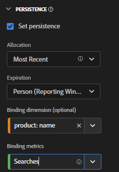

# Het gebruiken van bindende dimensies en metriek in CJA

Customer Journey Analytics biedt verschillende manieren om waarden van dimensies aan te houden voorbij de hit waarop ze zijn ingesteld. Een van de persistentiemethoden die Adobe aanbiedt, wordt Binding genoemd. In vorige versies van Adobe Analytics werd dit concept ook wel &#39;merchandising&#39; genoemd.

Hoewel u bindingsdimensies kunt gebruiken met gebeurtenisgegevens op hoofdniveau, kunt u dit concept het beste gebruiken wanneer u werkt met [Objectarrays](object-arrays.md). U kunt een dimensie aan één deel van een objecten serie zonder het op alle attributen in een bepaalde gebeurtenis toe te passen toeschrijven. U kunt bijvoorbeeld een zoekterm aan één product in de array met winkelwagentobjecten toewijzen zonder die zoekterm aan de gehele gebeurtenis te binden.

## Voorbeeld 1: Bindingsdimensies gebruiken om aanvullende productkenmerken aan een aankoop toe te wijzen

U kunt dimensie-items binnen een objectarray aan een andere dimensie binden. Wanneer het gebonden afmetingspunt verschijnt, herinnert CJA de gebonden dimensie en omvat het in de gebeurtenis voor u. Overweeg de volgende klantenreis:

1. Een bezoeker bekijkt een productpagina op een wasmachine.

   ```json
   {
       "PersonID": "1",
       "product_views": 1,
       "product": [
           {
               "name": "Washing Machine 2000",
               "color": "white",
               "type": "front loader",
           },
       ],
       "timestamp": 1534219229
   }
   ```

1. De bezoeker bekijkt dan een productpagina op een droger.

   ```json
   {
       "PersonID": "1",
       "product_views": 1,
       "product": [
           {
               "name": "Dryer 2000",
               "color": "neon orange",
           },
       ],
       "timestamp": 1534219502
   }
   ```

1. Uiteindelijk kopen ze. De kleur van elk product is niet opgenomen in de aankoopgebeurtenis.

   ```json
   {
       "PersonID": "1",
       "orders": 1,
       "product": [
           {
               "name": "Washing Machine 2000",
               "price": 1600,
           },
           {
               "name": "Dryer 2000",
               "price": 499
           }
       ],
       "timestamp": 1534219768
   }
   ```

Als u omzet door kleur zonder een bindende dimensie wilt bekijken, de dimensie `product.color` De kleur van de droger blijft behouden en krijgt een onjuiste waarde:

| product.color | omzet |
| --- | --- |
| neonoranje | 2099 |

U kunt in de Manager van de Mening van Gegevens gaan en productkleur binden aan productnaam:


Wanneer u dit persistentiemodel instelt, neemt Adobe de productnaam in wanneer de productkleur wordt ingesteld. Wanneer het de zelfde productnaam in een volgende gebeurtenis voor deze bezoeker herkent, wordt de productkleur ook gebracht. Dezelfde gegevens wanneer u een productkleur bindt aan de productnaam, zien er als volgt uit:

| product.color | omzet |
| --- | --- |
| wit | 1600 |
| neonoranje | 499 |

## Voorbeeld 2: Gebruik bindingsmetriek om zoekterm aan een productaankoop te koppelen

Een van de meest gebruikte handelsmethoden in Adobe Analytics is het binden van een zoekterm aan een product, zodat elke zoekterm krediet krijgt voor het juiste product. Overweeg de volgende klantenreis:

1. Een bezoeker arriveert op uw site en zoekt naar &quot;bokshandschoenen&quot;.

   ```json
   {
       "PersonID": "1",
       "page_name": "Search results",
       "search": "1",
       "search_term": "boxing gloves",
       "product": [
           {
               "name": "Beginner gloves",
               "color": "Red",
               "price": "25.69"
           },
           {
               "name": "Tier 3 gloves",
               "color": "Black",
               "price": "89.99"
           },
           {
               "name": "Professional gloves",
               "color": "Blue",
               "price": "224.99"
           }
       ]
   }
   ```

1. Ze vinden een paar handschoenen die ze leuk vinden en voegen het toe aan hun kar.

   ```json
   {
       "PersonID": "1",
       "page_name": "Shopping cart",
       "cart_add": "1",
       "product": [
           {
               "name": "Tier 3 gloves",
               "color": "Black",
               "price": "89.99"
           }
       ]
   }
   ```

1. De bezoeker zoekt vervolgens naar &quot;tennisracket&quot;.

   ```json
   {
       "PersonID": "1",
       "page_name": "Search results",
       "search": "1",
       "search_term": "tennis racket",
       "product": [
           {
               "name": "Shock absorb racket",
               "price": "34.99"
           },
           {
               "name": "Women's open racket",
               "price": "49.99"
           },
           {
               "name": "Extreme racket",
               "price": "134.99"
           }
       ]
   }
   ```

1. Ze vinden een racket die ze leuk vinden en voegen het toe aan hun winkelwagen.

   ```json
   {
       "PersonID": "1",
       "page_name": "Shopping cart",
       "cart_add": "1",
       "product": [
           {
               "name": "Tier 3 gloves",
               "color": "Black",
               "price": "89.99"
           },
           {
               "name": "Shock absorb racket",
               "price": "34.99"
           }
       ]
   }
   ```

1. De bezoeker zoekt een derde keer naar &quot;schoenen&quot;.

   ```json
   {
       "PersonID": "1",
       "page_name": "Search results",
       "search": "1",
       "search_term": "shoes",
       "product": [
           {
               "name": "Men's walking shoes",
               "color": "Grey",
               "price": "54.95"
           },
           {
               "name": "Tennis shoes",
               "color": "White",
               "price": "42.59"
           },
           {
               "name": "Skate shoes",
               "color": "Black",
               "price": "79.99"
           }
       ]
   }
   ```

1. Ze vinden een paar schoenen die ze leuk vinden en voegen het toe aan hun winkelwagen.

   ```json
   {
       "PersonID": "1",
       "page_name": "Shopping cart",
       "cart_add": "1",
       "product": [
           {
               "name": "Tier 3 gloves",
               "color": "Black",
               "price": "89.99"
           },
           {
               "name": "Shock absorb racket",
               "price": "34.99"
           },
           {
               "name": "Skate shoes",
               "color": "Black",
               "price": "79.99"
           }
       ]
   }
   ```

1. De bezoeker doorloopt het afrekenproces en koopt deze drie objecten.

   ```json
   {
       "PersonID": "1",
       "page_name": "Thank you for your purchase",
       "purchase": "1",
       "product": [
           {
               "name": "Tier 3 gloves",
               "color": "Black",
               "price": "89.99"
           },
           {
               "name": "Shock absorb racket",
               "price": "34.99"
           },
           {
               "name": "Skate shoes",
               "color": "Black",
               "price": "79.99"
           }
       ]
   }
   ```

Als u een traditioneel toewijzingsmodel met zoekterm gebruikt, wijzen alle drie producten inkomsten aan slechts één enkele onderzoekstermijn toe. Bijvoorbeeld, als u eerste toewijzing met de dimensie van de onderzoeksterreep gebruikte:

| search_term | omzet |
| --- | --- |
| bokshandschoenen | $ 204,97 |

Als u laatste toewijzing met de dimensie van de onderzoekstermijn gebruikte, kenmerken alle drie producten nog opbrengst aan één enkele onderzoekstermijn:

| search_term | omzet |
| --- | --- |
| schoenen | $ 204,97 |

Hoewel dit voorbeeld slechts één bezoeker omvat, kunnen veel bezoekers die naar verschillende dingen zoeken, zoektermen verkeerd aan verschillende producten toeschrijven, waardoor het moeilijk wordt te bepalen wat de beste zoekresultaten eigenlijk zijn.

Met een bindende dimensie, neemt Adobe nota van het afmetingspunt dat het aan verbindend is. Wanneer die zelfde bindende waarde in een verdere gebeurtenis wordt gezien, brengt het over het afmetingspunt zodat u gewenste metrisch aan het kunt toeschrijven. In dit voorbeeld, kunnen wij de bindende afmeting voor search_term aan productnaam plaatsen. Wanneer wij deze afmeting in de Manager van de Mening van Gegevens plaatsen, worden wij ook vereist om bindende metrisch te plaatsen omdat de bindende afmeting in een objecten serie is. Een bindende metrische handelingen als trekker voor een bindende afmeting, zodat bindt het zich slechts aan gebeurtenissen waar metrisch binden aanwezig is. In deze voorbeeldimplementatie, omvat de pagina van onderzoeksresultaten altijd een onderzoeksterm dimensie en metrisch onderzoek. We kunnen zoektermen aan productnaam binden wanneer de metrische zoekopdracht wordt uitgevoerd.



Als u de zoekterm instelt op dit persistentiemodel, wordt de volgende logica uitgevoerd:

* Wanneer search_term in een gebeurtenis is, controleer de aanwezigheid van productnaam.
* Als de productnaam er niet is, doet u niets.
* Als de productnaam er is, controleer de aanwezigheid van metrisch onderzoek.
* Als de metrische zoekopdracht er niet is, doet u niets.
* Als metrische zoekopdrachten daar zijn, bindt u de zoekterm aan alle productnamen. Het doet alsof het op het zelfde niveau zoals productnaam voor die gebeurtenis handelt. In dit voorbeeld wordt het behandeld als product.search_term.
* Als dezelfde productnaam in een volgende gebeurtenis wordt weergegeven, bestaat de gebonden zoekterm daar ook.

In Analysis Workspace zou het resulterende verslag er als volgt uitzien:

| search_term | omzet |
| --- | --- |
| bokshandschoenen | $ 89,99 |
| tennisracket | $ 34,99 |
| schoenen | $ 79,99 |
