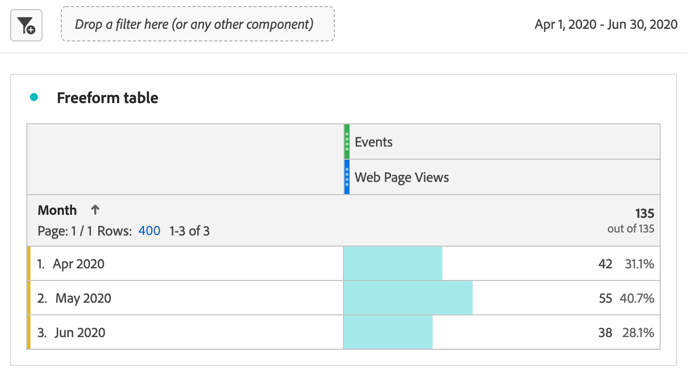
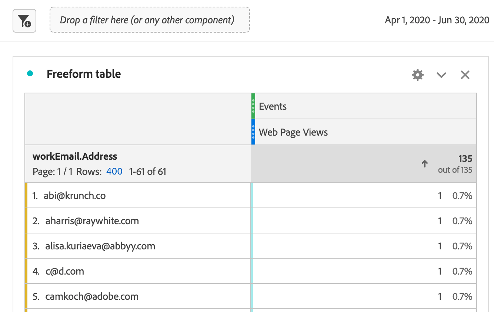

# Verslag over gegevens van Marketo&#39;s Engage

U kunt de nieuw beschikbare datasets van het Marketo Engage in Adobe Experience Platform (Adobe Experience Platform) gebruiken om waardevolle analyses en rapporteringsoplossingen aan B2B marketers te verstrekken. Geef vervolgens verslag over deze gegevenssets in Adobe Customer Journey Analytics.

## Stap 1: Wijs Marketo-brongegevensvelden toe aan hun XDM-doelen

Wijs de [ Personen ](https://experienceleague.adobe.com/docs/experience-platform/sources/connectors/adobe-applications/mapping/marketo.html#persons) en [ Activiteiten ](https://experienceleague.adobe.com/docs/experience-platform/sources/connectors/adobe-applications/mapping/marketo.html#activities) voorwerpen aan hun respectieve XDM gebieden van het schemadoel in kaart.

## Stap 2: Marketo-gegevens in Adobe Experience Platform opnemen

Gebruik de [ schakelaar van het Marketo Engage ](https://experienceleague.adobe.com/docs/experience-platform/sources/connectors/adobe-applications/marketo/marketo.html) om gegevens van Marketo aan Experience Platform te brengen en dit gegeven bijgewerkt te houden gebruikend Platform-verbonden toepassingen.

## Stap 3: Opstelling een verbinding aan deze dataset in Customer Journey Analytics

Om over de datasets van het Experience Platform te rapporteren, moet u eerst een verband tussen datasets in Experience Platform en Customer Journey Analytics vestigen. Zie voor meer informatie [ creeer of geef een verbinding ](https://experienceleague.adobe.com/docs/analytics-platform/using/cja-connections/create-connection.html) uit.

## Stap 4: Een of meer gegevensweergaven maken

A [ gegevensmening ](/help/data-views/data-views.md) is een container specifiek voor Customer Journey Analytics die u laat bepalen hoe te om gegevens van een verbinding te interpreteren. Het specificeert alle afmetingen en metriek beschikbaar in Analysis Workspace - in dit geval, metriek en dimensies specifiek voor Marketo. Het specificeert ook welke kolommen die afmetingen en metriek hun gegevens van verkrijgen. Gegevensweergaven worden gedefinieerd ter voorbereiding op rapportage in Analysis Workspace.

## Stap 5: Rapport in Analysis Workspace

Een gebruiksgeval dat u zou kunnen onderzoeken is: hoeveel webpagina-bezoeken door leads hebben we in april-juni 2020 gehad?

1. Open [ Analytics Workspace ](/help/analysis-workspace/home.md) en creeer een nieuw project.
Klanten met B2B/B2P CDP kunnen B2C-stijlanalyse in Customer Journey Analytics uitvoeren. B2B-objecten zijn nog niet beschikbaar.

1. Creeer a [ filter ](/help/components/filters/create-filters.md) voor Web-pagina meningen als volgt - het Type van Gebeurtenis = web.webpagedetails.pageViews:

   

1. Trek in de tabel Vrije vorm het filter dat u hebt gemaakt - Weergaven webpagina&#39;s en trek vervolgens het datumbereik Maand in. Dit geeft u Webpagina bezoeken door lood elke maand:

   

1. Of trek in de volgende afmetingen: Person sleutel of Werk-e-mailadres. Dit geeft u de Webpagina bezoeken door elke lood:

   
