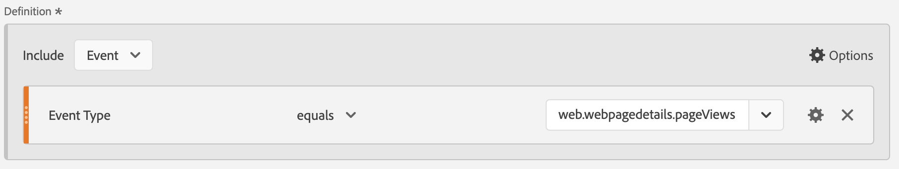

# Rapport over Marketo Engage-gegevens

U kunt beschikbare Marketo Engage-gegevenssets in Experience Platform gebruiken om waardevolle analyses en rapporteringsoplossingen aan B2B-marketers te bieden. Geef vervolgens verslag over deze gegevenssets in Customer Journey Analytics.

Let erop dat:

* Marketo Engage-rapportage is het meest geschikt voor het direct meten en optimaliseren van marketingprogramma&#39;s in Marketo en is snel, voorgeschreven en markeerbaar.
* De Analyse van de Reis van de klant verstrekt een veel bredere, klantgerichte analyseoplossing voor klantenreizen die veelvoudige kanalen, producten, en bedrijfseenheden, met inbegrip van, maar niet beperkt tot, de gegevens van Marketo overspannen.

Zie [ rapporterend vergelijking ](#reporting-comparison) voor meer details.

>[!NOTE]
>
>U zou kunnen overwegen [ Customer Journey Analytics B2B edition ](/help/getting-started/cja-b2b-edition.md) om veel meer waarde van de gegevens van Marketo Engage te krijgen. U kunt de datasets van Marketo Engage met rekening en raadplegingsdatasets combineren. En rapporteren over het account- en opportuniteitsniveau in Customer Journey Analytics B2B edition.
>

Rapporten over Marketo Engage-gegevens in Customer Journey Analytics:

+++ &#x200B;1. Wijs Marketo-brongegevensvelden toe aan hun XDM-doelen

Wijs de [ Personen ](https://experienceleague.adobe.com/en/docs/experience-platform/sources/connectors/adobe-applications/mapping/marketo) en [ Activiteiten ](https://experienceleague.adobe.com/en/docs/experience-platform/sources/connectors/adobe-applications/mapping/marketo) voorwerpen aan hun respectieve XDM gebieden van het schemadoel in kaart.

+++

+++ &#x200B;2. Verzamel Marketo-gegevens naar Adobe Experience Platform

Gebruik de [ schakelaar van Marketo Engage ](https://experienceleague.adobe.com/en/docs/experience-platform/sources/connectors/adobe-applications/marketo/marketo) om gegevens van Marketo aan Experience Platform te brengen en dit gegeven bijgewerkt te houden gebruikend Platform-verbonden toepassingen.

+++

+++ &#x200B;3. Een verbinding met deze gegevensset instellen in Customer Journey Analytics

Om over de datasets van Experience Platform te rapporteren, moet u eerst een verband tussen datasets in Experience Platform en Customer Journey Analytics vestigen. Zie [ creeer of geef een verbinding ](https://experienceleague.adobe.com/en/docs/analytics-platform/using/cja-connections/create-connection) uit.

+++

+++ &#x200B;4. Maak een of meer gegevensweergaven

A [ gegevensmening ](/help/data-views/data-views.md) is een container specifiek voor Customer Journey Analytics die u laat bepalen hoe te om gegevens van een verbinding te interpreteren. Het specificeert alle afmetingen en metriek beschikbaar in Analysis Workspace - in dit geval, metriek en dimensies specifiek voor Marketo. Het specificeert ook welke kolommen die afmetingen en metriek hun gegevens van verkrijgen. Gegevensweergaven worden gedefinieerd ter voorbereiding op rapportage in Analysis Workspace.

+++

+++ &#x200B;5. Rapport in Analysis Workspace

Een gebruiksgeval dat u zou kunnen onderzoeken is: hoeveel webpagina-bezoeken door leads hebt u in april-juni 2020 gehad?

1. Open [ Analytics Workspace ](/help/analysis-workspace/home.md) en creeer een nieuw project.
Klanten met B2B/B2P CDP kunnen in Customer Journey Analytics een B2C-analyse uitvoeren. B2B-objecten zijn nog niet beschikbaar.

1. Creeer a [ segment ](/help/components/segments/seg-create.md) voor Web-pagina meningen als volgt - het Type van gebeurtenis = web.webpagedetails.pageViews:

   

1. Trek in het segment dat u in de lijst van de Vrije vorm - de Mening van de Web-pagina creeerde, dan trek in de de datumwaaier van de Maand. Deze actie geeft u Webpagina bezoeken door lood elke maand:

   

1. Of trek in de volgende afmetingen: Person sleutel of Werk-e-mailadres. Deze actie geeft u de Webpagina bezoeken door elke lood:

   

Marketo Engage-gegevens in Customer Journey Analytics kunnen afwijken van wat u ziet in de rapporten in Marketo Engage.

+++

## Rapportvergelijking

In de volgende vergelijking tussen rapportage in Customer Journey Analytics en Marketo Engage worden enkele belangrijke verschillen in analytische mogelijkheden, flexibiliteit, bronnen van waarheid en gebruiksgevallen beschreven.

### Customer Journey Analytics

Customer Journey Analytics is een geavanceerd hulpprogramma voor kanaalanalyse dat is gebaseerd op Adobe Experience Platform. Customer Journey Analytics is ontworpen voor bedrijfsteams die krachtige, flexibele en aanpasbare rapportering over digitale en offlinegegevensbronnen nodig hebben.

#### Belangrijkste mogelijkheden

* **Gegevensbronnen**: Kan veelvoudige datasets (Web, CRM, e-mail, vraagcentrum, off-line, Marketo, enz.) voor 360° klantenreis combineren rapportering.
* **Zelfbediening analyse**: belemmering-en-dalingswerkruimte met hoogst interactieve, klantgerichte dashboards en visualisaties.
* **Geavanceerde attributie**: Steunt complexe, multi-aanraking en modellen van de douaneattributie over alle verbonden gegevens, niet alleen marketing programma&#39;s.
* **Publiek &amp; het kleven analyse**: Diepe segmentatie, cohort, en het kleven analyse over koperstransporten.
* **Handelbare inzichten**: Laat gegeven-gedreven orchestratie toe (bijvoorbeeld, verzend inzichten terug naar marketing of verpersoonlijkingsmotoren).
* **schaal van de Onderneming**: Geschikt voor organisaties die ondernemingsbestuur, veelvoudige merken, en hoog gegevensvolume vereisen.

#### Gebruiksscenario&#39;s voor Customer Journey Analytics

* Geavanceerde mogelijkheden voor het in kaart brengen van de klantentransmissie over meerdere kanalen en aanraakpunten.
* Complexe segmentering en overvloeiing van online- en offlinegegevens.
* Aangepaste KPI-dashboards voor rapportage op uitvoeringsniveau en operationele verslaglegging.
* Holistische attributiemodellen (meer dan alleen digitaal of e-mail).

### Marketo Engage

Marketo Engage biedt in-app rapportages die zijn gericht op KPI&#39;s voor marketingautomatisering, programma- en campagnemeting en marketingeffectrapportage. Al deze rapportage is rechtstreeks gekoppeld aan activiteiten binnen Marketo.

#### Belangrijkste mogelijkheden

* **inheemse marketing analyses**: De standaardrapporten voor e-mail, landende pagina&#39;s, campagnes, lood, kansen, pijpleiding, en opbrengstattributie (eerste, laatste, multi-aanraking).
* **Geavanceerde analysemogelijkheden van BI (toe:voegen-op)**: Belemmering &amp; daling, punt-en-klik de bouwer van het douanerapport voor het analyseren van programma/rekening/loodgegevens (zie onlangs het Geavanceerde Overzicht van de Analyse van BI).
* **Prebuilt dashboards**: Voor campagneprestaties, kanaaldoeltreffendheid, pijpleiding/opbrengstbijdrage.
* **Programma en kanaalanalyse**: Attributie en ROI specifiek voor Marketo-geleide reizen.
* **marketing-centric**: Gericht op gebruikers die transparantie in de marketing trechter nodig hebben: e-mailstaten, vormen, slimme campagnes, en opbrengsteffect.

#### Gebruiksscenario&#39;s voor Marketo Engage

* Houd e-mail-, programma- en campagneprestaties bij en optimaliseer deze.
* Kenmerk leidt en leidt tot marketingtactieken.
* Bewaak de trends in de betrokkenheid en score.
* Deel inzichten met verkoop/marketing teams zonder gegevens technische middelen.
* Toegang tot kant-en-klare, markeringsvriendelijke rapporten.

Zie hieronder voor een snelle vergelijkingstabel over rapportagefuncties tussen Marketo Engage en Customer Journey Analytics:

| Functie | Marketo Engage | Customer Journey Analytics |
|---|---|---|
| **Primaire nadruk** | Marketingprogramma en campagnegerichte rapportage. | Holistische, omni-channel analyse en rapportage van het gedrag. |
| **de bronnen van Gegevens** | In en via Marketo Engage gegenereerde gegevens. | Hiermee combineert u gegevens uit Experience Platform-gegevens, zoals Marketo, website, mobiele app, offlinekanalen en nog veel meer. |
| **Attributie** | Enkelvoudige en multi-touchattributie op Marketo-gegevens. | Aangepaste toewijzing via meerdere kanalen voor alle gegevens die beschikbaar zijn in de oplossing. |
| **de rapporten van de Douane en flexibiliteit** | Advanced BI (add-on) voor programma en account deep duves. | Zeer flexibel in hoe u aangepaste werkruimten, dashboards of rapporten maakt met gebruik van alle beschikbare gegevens. |
| **analyse van het publiek** | Filter- en segmentprogrammalijsten, betrokkenheid en slimme lijsten. | Rijke persona- en reisvisualisaties, publiek plakken en segmenten overlappen elkaar. |
| **Beoogde gebruikers** | Marketers, marketingbedrijven, werknemers die de vraag genereren, inkomstenambtenaren. | Analysten, gegevenswetenschappers, marketingstrategen, klantervaring professionals. |
| **Metrische deduplicatie** | Voor rapporten over e-mailprestaties worden metrische gegevens automatisch gededupliceerd door id voor leads, campagne-id en e-mailmiddel. Als er meerdere e-mails worden gemaakt van hetzelfde e-mailmiddel en vanuit hetzelfde programma naar dezelfde lead worden verzonden, worden deze e-mails slechts als één e-mail geteld. | Zonder extra toegepaste filters en metriek, wordt e-mail die gegevens melden gemeld als totaal aantal e-mailprestaties zonder [ metrische deduplicatie ](/help/data-views/component-settings/metric-deduplication.md). |

{style="table-layout:fixed"}
