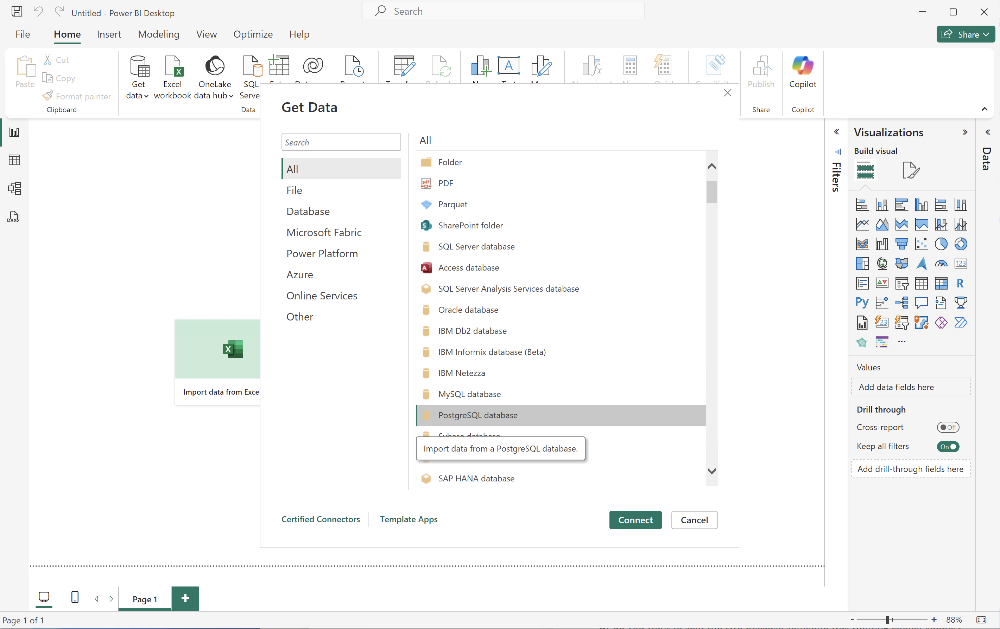
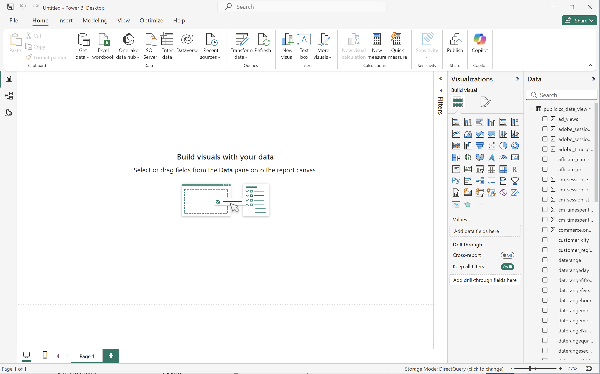

# Gebruikskwesties voor extensie BI

Dit artikel bevat een aantal gebruiksgevallen die illustreren hoe u de functionaliteit van de BI-extensie in verschillende BI-gereedschappen kunt gebruiken.

De volgende gebruiksgevallen worden gedocumenteerd:

1. [ verbind en lijstgegevensmeningen ](#connect-and-list-data-views).
1. [ Dagelijkse trend ](#daily-trend).
1. [ Zuurmatige trend ](#hourly-trend).
1. [ maandelijkse trend ](#monthly-trend).
1. [ Enige gerangschikte afmeting ](#single-dimension-ranked).
1. [ Veelvoudige gerangschikte afmeting ](#multiple-dimension-ranked).
1. [ Telling verschillende afmetingswaarden ](#count-distinct-dimension-values).
1. [ namen van de datumwaaier van het Gebruik aan filter ](#use-date-range-names-to-filter).
1. [ de filternamen van het Gebruik aan filter ](#use-filter-names-to-filter).
1. [ de afmetingswaarden van het Gebruik aan filter ](#use-dimension-values-to-filter).
1. [ Soort ](#sort).
1. [ Beperkingen ](#limits).
1. [ aan FLATTEN of niet ](#to-flatten-or-not).
1. [ Dimension en metrische transformaties ](#dimension-and-metric-transformations).
1. [ Visualisaties en interactie ](#visualizations-and-interactions).

Voor elk gebruiksgeval, zijn de instructies beschikbaar voor de volgende hulpmiddelen van BI binnen de **sectie van Details**:

* Power BI Desktop (versie 2.136.1478.0 64-bits (september 2024))
* Tableau Desktop (versie 2024.1.5 (20241.24.0705.0334) 64-bits)

De instructies verwijzen naar een voorbeeldgegevensweergave met de naam **[!UICONTROL public.cc_data_view]** , twee voorbeeldafmetingen (**[!UICONTROL Product Name]** en **[!UICONTROL Product Category]** ) en twee voorbeeldmetriek (**[!UICONTROL Purchases]** en **[!UICONTROL Purchase Revenue]**). Wanneer u de instructies doorloopt, wijzigt u deze voorbeeldobjecten waar nodig voor uw specifieke omgeving.

## Weergaven van Connect- en lijstgegevens

Met deze gebruiksaanwijzing stelt u de verbinding van het gereedschap BI met Customer Journey Analytics in en geeft u de beschikbare gegevensweergaven weer om de verbinding te testen.

+++ Details

>[!BEGINTABS]

>[!TAB  Desktop van de Power BI ]

1. Heb toegang tot de vereiste geloofsbrieven en de parameters van de Dienst UI van de Vraag van het Experience Platform.

   1. Navigeer naar de sandbox van uw Experience Platform.
   1. Selecteer  **[!UICONTROL Queries]** van het linkerspoor.
   1. Selecteer de tab **[!UICONTROL Credentials]** in de interface van **[!UICONTROL Queries]** .
   1. Selecteer `prod:cja` in het vervolgkeuzemenu **[!UICONTROL Database]** .

      

1. Open Power BI Desktop.
1. Selecteer **[!UICONTROL Get data from other sources]** in de hoofdinterface.
1. In het dialoogvenster **[!UICONTROL Get Data]** :
   
   1. Zoek en selecteer **[!UICONTROL PostgreSQL database]** .
   1. Selecteer **[!UICONTROL Connect]** .
1. In het dialoogvenster **[!UICONTROL PostgreSQL database]** :
   
   1. Gebruik  om de **[!UICONTROL Host]** en **[!UICONTROL Port]** waarden van het Experience Platform **[!UICONTROL Query]** **[!UICONTROL Expiring Credentials]** te kopiëren en te kleven, die door `:` als waarde voor **[!UICONTROL Server]** wordt gescheiden. Bijvoorbeeld: `examplecompany.platform-query.adobe.io:80` .
   1. Gebruik  om de **[!UICONTROL Database]** waarde van het Experience Platform **[!UICONTROL Query]** te kopiëren en te kleven **[!UICONTROL Expiring Credentials]**. Voeg `?FLATTEN` toe aan de waarde die u plakt. Bijvoorbeeld `prod:cja?FLATTEN` .
   1. Selecteer **[!UICONTROL DirectQuery]** als de [!UICONTROL Data connectivity mode] .
   1. Selecteer **[!UICONTROL OK]** .
1. In het dialoogvenster **[!UICONTROL PostgreSQL database]** - **[!UICONTROL Database]** :
   
   1. Gebruik  om de **[!UICONTROL Username]** en **[!UICONTROL Password]** waarden van het Experience Platform **[!UICONTROL Query]** te kopiëren **[!UICONTROL Expiring Credentials]** paneel in de **[!UICONTROL User name]** en **[!UICONTROL Password]** gebieden. Als u a [ niet-uitbreidende credentie ](https://experienceleague.adobe.com/en/docs/experience-platform/query/ui/credentials?lang=en#use-credential-to-connect) gebruikt, gebruik het wachtwoord van uw niet-expiring referentie.
   1. Zorg ervoor dat het vervolgkeuzemenu voor **[!UICONTROL Select which level to apply these settings to]** is ingesteld op de **[!UICONTROL Server]** die u eerder hebt gedefinieerd.
   1. Selecteer **[!UICONTROL Connect]** .
1. In het dialoogvenster **[!UICONTROL Navigator]** worden de gegevensweergaven opgehaald. Dit kan enige tijd duren. Na ophalen:
   
   1. Selecteer **[!UICONTROL public.cc_data_view]** in de lijst in het linkerdeelvenster.
   1. Selecteer **[!UICONTROL Load]** .
1. Na enige tijd worden de beschikbare metriek en afmetingen weergegeven in het deelvenster **[!UICONTROL Data]** .
   

>[!TAB  Desktop Tableau ]

1. Heb toegang tot de vereiste geloofsbrieven en de parameters van de Dienst UI van de Vraag van het Experience Platform.

   1. Navigeer naar de sandbox van uw Experience Platform.
   1. Selecteer  **[!UICONTROL Queries]** van het linkerspoor.
   1. Selecteer de tab **[!UICONTROL Credentials]** in de interface van **[!UICONTROL Queries]** .
   1. Selecteer `prod:cja` in het vervolgkeuzemenu **[!UICONTROL Database]** .

      

1. Open Tabel.
1. Selecteer **[!UICONTROL PostgreSQL]** in de linkertrack onder **[!UICONTROL To a Server]** . Als deze optie niet beschikbaar is, selecteert u **[!UICONTROL More...]** en selecteert u **[!UICONTROL PostgreSQL]** in het menu **[!UICONTROL Installed Connectors]** .
   
1. Ga in het dialoogvenster **[!UICONTROL PostgreSQL]** op het tabblad **[!UICONTROL General]** naar:
   
   1. Gebruik  om **[!UICONTROL Host]** van het Experience Platform **[!UICONTROL Query]** **[!UICONTROL Expiring Credentials]** aan **[!UICONTROL Server]** te kopiëren en te kleven.
   1. Gebruik  om **[!UICONTROL Port]** van het Experience Platform **[!UICONTROL Query]** **[!UICONTROL Expiring Credentials]** aan **[!UICONTROL Port]** te kopiëren en te kleven.
   1. Gebruik  om **[!UICONTROL Database]** van het Experience Platform **[!UICONTROL Query]** **[!UICONTROL Expiring Credentials]** aan **[!UICONTROL Database]** te kopiëren en te kleven. Voeg `%3FFLATTEN` toe aan de waarde die u plakt. Bijvoorbeeld: `prod:cja%3FFLATTEN` .
   1. Selecteer **[!UICONTROL Username and Password]** in het vervolgkeuzemenu **[!UICONTROL Authentication]** .
   1. Gebruik  om **[!UICONTROL Username]** van het Experience Platform **[!UICONTROL Query]** **[!UICONTROL Expiring Credentials]** aan **[!UICONTROL Username]** te kopiëren en te kleven.
   1. Gebruik  om **[!UICONTROL Password]** van het Experience Platform **[!UICONTROL Query]** **[!UICONTROL Expiring Credentials]** aan **[!UICONTROL Password]** te kopiëren en te kleven. Als u a [ niet-uitbreidende credentie ](https://experienceleague.adobe.com/en/docs/experience-platform/query/ui/credentials?lang=en#use-credential-to-connect) gebruikt, gebruik het wachtwoord van uw niet-uitbreidende referentie.
   1. Controleer of **[!UICONTROL Require SSL]** is ingeschakeld.
   1. Selecteer **[!UICONTROL Sign In]** .

   U ziet een dialoogvenster **[!UICONTROL Progressing Request]** terwijl Tableau Desktop de verbinding valideert.
1. In het hoofdvenster ziet u in de weergave Data Source in het linkervenster:
   * De naam van de verbinding, onder **[!UICONTROL Connections]** .
   * De naam van de database, onder **[!UICONTROL Database]** .
   * Een lijst met tabellen, onder **[!UICONTROL Table]** .
     
   1. Sleep het item **[!UICONTROL cc_data_view]** en zet het neer in de hoofdweergave die **[!UICONTROL Drag tables]** hier leest.
1. In het hoofdvenster worden nu de details van de gegevensweergave van **[!UICONTROL cc_data_view]** weergegeven.
   

>[!ENDTABS]

+++

## Dagelijkse trend

In dit geval, wilt u een lijst en eenvoudige lijnvisualisatie tonen die een dagelijkse trend van voorkomen van 1 Januari, 2023 tot 31 Januari, 2023 toont.

+++ Details

>[!PREREQUISITES]
>
>Verzeker u a [ succesvolle verbinding hebt bevestigd en kan van gegevensmeningen ](#connect-and-list-data-views) voor het hulpmiddel een lijst maken BI waarvoor u dit gebruiksgeval wilt uitproberen.
>

>[!BEGINTABS]

>[!TAB  Desktop van de Power BI ]

1. In het deelvenster **[!UICONTROL Data]** :
   1. Selecteer de **[!UICONTROL daterangeday]** -dimensie.
   1. Selecteer de metrische waarde **[!UICONTROL occurrences]** .

   Er wordt een tabel weergegeven met de exemplaren voor de huidige maand. Vergroot de tabelvisualisatie voor een betere zichtbaarheid.

1. In het deelvenster **[!UICONTROL Filters]** :

   1. Selecteer de **[!UICONTROL daterangeday is (All)]** van **[!UICONTROL Filters on this visual]**.
   1. Selecteer **[!UICONTROL Advanced filtering]** als de **[!UICONTROL Filter type]** .
   1. Definieer het filter op **[!UICONTROL Show items when the value]** **[!UICONTROL is on or after]** `1/1/2023` **[!UICONTROL And]** **[!UICONTROL is before]** `1/2/2023.` U kunt het kalenderpictogram gebruiken om datums te selecteren en te selecteren.
   1. Selecteer **[!UICONTROL Apply filter]** .

   De tabel wordt bijgewerkt met het toegepaste filter **[!UICONTROL daterangeday]** .

1. In het deelvenster **[!UICONTROL Visualizations]** :

   1. Selecteer de **[!UICONTROL Line chart]** visualisatie.

   Een lijngrafiekvisualisatie vervangt de lijst terwijl het gebruiken van de zelfde gegevens zoals de lijst.

   

1. Op de het grafiekvisualisatie van de Lijn:

   1. Selecteer .
   1. Selecteer **[!UICONTROL Show as a table]** in het contextmenu.

   De hoofdweergave wordt bijgewerkt om zowel een lijnvisualisatie als een tabel weer te geven.

   

>[!TAB  Desktop Tableau ]

1. Selecteer de tab **[!UICONTROL Sheet 1]** onderaan om te schakelen van **[!UICONTROL Data source]** . In de weergave **[!UICONTROL Sheet 1]** :
   1. Sleep de vermelding **[!UICONTROL Daterange]** uit de lijst **[!UICONTROL Tables]** in het deelvenster **[!UICONTROL Data]** en zet deze op de **[!UICONTROL Filters]** shelf neer.
   1. Selecteer **[!UICONTROL Range of Dates]** in het dialoogvenster **[!UICONTROL Next >]** van **[!UICONTROL Filters Field \[Daterange\]]** .
   1. Selecteer **[!UICONTROL Range of dates]** in het dialoogvenster **[!UICONTROL Filter \[Daterange]]** en geef een punt op van `01/01/2023` - `01/02/2023` .

      

   1. Sleep **[!UICONTROL Daterangeday]** vanuit de lijst **[!UICONTROL Tables]** in het deelvenster **[!UICONTROL Data]** en zet de vermelding in het veld naast **[!UICONTROL Columns]** neer.
      * Selecteer **[!UICONTROL Day]** in de vervolgkeuzelijst **[!UICONTROL Daterangeday]** , zodat de waarde wordt bijgewerkt naar **[!UICONTROL DAY(Daterangeday)]** .
   1. De belemmering en laat vallen **[!UICONTROL Occurrences]** van de **[!UICONTROL Tables (*Namen van de Maatregel *)]**lijst in de **[!UICONTROL Data]**ruit en laat vallen de ingang op het gebied naast **[!UICONTROL Rows]**.
      * De waarden worden automatisch omgezet in **[!UICONTROL SUM(Occurrences)]** .
   1. Wijzig **[!UICONTROL Standard]** in **[!UICONTROL Entire View]** in het vervolgkeuzemenu in de werkbalk.

      De weergave van blad 1 ziet er hieronder ongeveer zo uit.

      

1. Selecteer **[!UICONTROL Duplicate]** in het contextmenu van de tab **[!UICONTROL Sheet 1]** om een tweede blad te maken.
1. Selecteer **[!UICONTROL Rename]** in het contextmenu van de tab **[!UICONTROL Sheet 1]** om de naam van het werkblad te wijzigen in `Graph` .
1. Selecteer **[!UICONTROL Rename]** in het contextmenu van de tab **[!UICONTROL Sheet 1 (2)]** om de naam van het werkblad te wijzigen in `Data` .
1. Zorg ervoor dat het **[!UICONTROL Data]** -werkblad is geselecteerd. In de weergave Gegevens:
   1. Selecteer **[!UICONTROL Show me]** rechtsboven en selecteer **[!UICONTROL Text table]** (bovenste visualisatie linksboven) om de inhoud van de gegevensweergave te wijzigen in een tabel.
   1. Sleep **[!UICONTROL DAY(Daterangeday)]** van **[!UICONTROL Columns]** naar **[!UICONTROL Rows]** .
   1. Wijzig **[!UICONTROL Standard]** in **[!UICONTROL Entire View]** in het vervolgkeuzemenu in de werkbalk.

      De weergave **[!UICONTROL Data]** ziet er hieronder ongeveer zo uit.

      

1. Selecteer **[!UICONTROL New Dashboard]** tabknop (onder) om een nieuwe **[!UICONTROL Dashboard 1]** -weergave te maken. In de weergave **[!UICONTROL Dashboard 1]** :
   1. Sleep en laat vallen het **[!UICONTROL Graph]** blad van **[!UICONTROL Sheets]** plank op de **[!UICONTROL Dashboard 1]** mening die *Dropbladen hier* leest.
   1. Sleep het **[!UICONTROL Data]** -werkblad van de **[!UICONTROL Sheets]** -plank onder het **[!UICONTROL Graph]** -werkblad naar de **[!UICONTROL Dashboard 1]** -weergave.
   1. Selecteer het **[!UICONTROL Data]** -werkblad in de weergave en wijzig **[!UICONTROL Entire View]** in **[!UICONTROL Fix Width]** .

      De weergave **[!UICONTROL Dashboard 1]** ziet er hieronder ongeveer zo uit.

      

>[!ENDTABS]

+++

## Uurtrend

In dit geval wilt u een tabel en een eenvoudige lijnvisualisatie weergeven die een trend per uur van voorvallen weergeeft voor 1 januari 2023.

+++ Details

>[!PREREQUISITES]
>
>Verzeker u a [ succesvolle verbinding hebt bevestigd en kan van gegevensmeningen ](#connect-and-list-data-views) voor het hulpmiddel een lijst maken BI waarvoor u dit gebruiksgeval wilt uitproberen.
>

>[!BEGINTABS]

>[!TAB  Desktop van de Power BI ]

 Power BI **begrijpt niet** hoe te om datum-tijd kolommen te behandelen, zodat de dimensies zoals **[!UICONTROL daterangehour]** en **[!UICONTROL daterangeminute]** niet worden gesteund.

>[!TAB  Desktop Tableau ]

1. Selecteer de tab **[!UICONTROL Sheet 1]** onderaan om te schakelen van **[!UICONTROL Data source]** . In de weergave **[!UICONTROL Sheet 1]** :
   1. Sleep de vermelding **[!UICONTROL Daterange]** uit de lijst **[!UICONTROL Tables]** in het deelvenster **[!UICONTROL Data]** en zet deze op de **[!UICONTROL Filters]** shelf neer.
   1. Selecteer **[!UICONTROL Range of Dates]** in het dialoogvenster **[!UICONTROL Next >]** van **[!UICONTROL Filters Field \[Daterange\]]** .
   1. Selecteer **[!UICONTROL Range of dates]** in het dialoogvenster **[!UICONTROL Filter \[Daterange]]** en geef een punt op van `01/01/2023` - `02/01/2023` .

      

   1. Sleep **[!UICONTROL Daterangehour]** vanuit de lijst **[!UICONTROL Tables]** in het deelvenster **[!UICONTROL Data]** en zet de vermelding in het veld naast **[!UICONTROL Columns]** neer.
      * Selecteer **[!UICONTROL More]** > **[!UICONTROL Hours]** in de vervolgkeuzelijst **[!UICONTROL Daterangeday]** , zodat de waarde wordt bijgewerkt naar **[!UICONTROL HOUR(Daterangeday)]** .
   1. De belemmering en laat vallen **[!UICONTROL Occurrences]** van de **[!UICONTROL Tables (*Namen van de Maatregel *)]**lijst in de **[!UICONTROL Data]**ruit en laat vallen de ingang op het gebied naast **[!UICONTROL Rows]**.
      * De waarden worden automatisch omgezet in **[!UICONTROL SUM(Occurrences)]** .
   1. Wijzig **[!UICONTROL Standard]** in **[!UICONTROL Entire View]** in het vervolgkeuzemenu in de werkbalk.

      De weergave van blad 1 ziet er hieronder ongeveer zo uit.

      

1. Selecteer **[!UICONTROL Duplicate]** in het contextmenu van de tab **[!UICONTROL Sheet 1]** om een tweede blad te maken.
1. Selecteer **[!UICONTROL Rename]** in het contextmenu van de tab **[!UICONTROL Sheet 1]** om de naam van het werkblad te wijzigen in `Graph` .
1. Selecteer **[!UICONTROL Rename]** in het contextmenu van de tab **[!UICONTROL Sheet 1 (2)]** om de naam van het werkblad te wijzigen in `Data` .
1. Zorg ervoor dat het **[!UICONTROL Data]** -werkblad is geselecteerd. In de weergave Gegevens:
   1. Selecteer **[!UICONTROL Show me]** rechtsboven en selecteer **[!UICONTROL Text table]** (bovenste visualisatie linksboven) om de inhoud van de gegevensweergave te wijzigen in een tabel.
   1. Sleep **[!UICONTROL HOUR(Daterangeday)]** van **[!UICONTROL Columns]** naar **[!UICONTROL Rows]** .
   1. Wijzig **[!UICONTROL Standard]** in **[!UICONTROL Entire View]** in het vervolgkeuzemenu op de werkbalk.

      Uw **[!UICONTROL Data]** -weergave moet er als volgt uitzien.

      

1. Selecteer **[!UICONTROL New Dashboard]** tabknop (onder) om een nieuwe **[!UICONTROL Dashboard 1]** -weergave te maken. In de weergave **[!UICONTROL Dashboard 1]** :
   1. Sleep en laat vallen het **[!UICONTROL Graph]** blad van **[!UICONTROL Sheets]** plank op de **[!UICONTROL Dashboard 1]** mening die *Dropbladen hier* leest.
   1. Sleep het **[!UICONTROL Data]** -werkblad van de **[!UICONTROL Sheets]** -plank onder het **[!UICONTROL Graph]** -werkblad naar de **[!UICONTROL Dashboard 1]** -weergave.
   1. Selecteer het **[!UICONTROL Data]** -werkblad in de weergave en wijzig **[!UICONTROL Entire View]** in **[!UICONTROL Fix Width]** .

      De weergave **[!UICONTROL Dashboard 1]** ziet er hieronder ongeveer zo uit.

      

>[!ENDTABS]

+++

## Maandelijkse trend

In dit geval wilt u een tabel en eenvoudige lijnvisualisatie weergeven met een maandelijkse trend van voorvallen voor 1 januari 2023 - 1 januari 2024.

+++ Details

>[!PREREQUISITES]
>
>Verzeker u a [ succesvolle verbinding hebt bevestigd en kan van gegevensmeningen ](#connect-and-list-data-views) voor het hulpmiddel een lijst maken BI waarvoor u dit gebruiksgeval wilt uitproberen.
>

>[!BEGINTABS]

>[!TAB  Desktop van de Power BI ]

1. In het deelvenster **[!UICONTROL Data]** :
   1. Selecteer de **[!UICONTROL daterangemonth]** -dimensie.
   1. Selecteer de metrische waarde **[!UICONTROL occurrences]** .

   Er wordt een tabel weergegeven met de exemplaren voor de huidige maand. Vergroot de tabelvisualisatie voor een betere zichtbaarheid.

1. In het deelvenster **[!UICONTROL Filters]** :

   1. Selecteer de **[!UICONTROL daterangemonth is (All)]** van **[!UICONTROL Filters on this visual]**.
   1. Selecteer **[!UICONTROL Advanced filtering]** als de **[!UICONTROL Filter type]** .
   1. Definieer het filter op **[!UICONTROL Show items when the value]** **[!UICONTROL is on or after]** `1/1/2023` **[!UICONTROL And]** **[!UICONTROL is before]** `1/1/2024.` U kunt het kalenderpictogram gebruiken om datums te selecteren en te selecteren.
   1. Selecteer **[!UICONTROL Apply filter]** .

   De tabel wordt bijgewerkt met het toegepaste filter **[!UICONTROL daterangeday]** .

1. In het deelvenster **[!UICONTROL Visualizations]** :

   1. Selecteer de **[!UICONTROL Line chart]** visualisatie.

   Een lijngrafiekvisualisatie vervangt de lijst terwijl het gebruiken van de zelfde gegevens zoals de lijst.

   

1. Op het grafiekvisualisatie van de Lijn:

   1. Selecteer .
   1. Selecteer **[!UICONTROL Show as a table]** in het contextmenu.

   De hoofdweergave wordt bijgewerkt en toont zowel een lijnvisualisatie als een tabel.

   

>[!TAB  Desktop van Tableau ]

1. Selecteer de tab **[!UICONTROL Sheet 1]** onderaan om te schakelen van **[!UICONTROL Data source]** . In de weergave **[!UICONTROL Sheet 1]** :
   1. Sleep de vermelding **[!UICONTROL Daterange]** uit de lijst **[!UICONTROL Tables]** in het deelvenster **[!UICONTROL Data]** en zet deze op de **[!UICONTROL Filters]** shelf neer.
   1. Selecteer **[!UICONTROL Range of Dates]** in het dialoogvenster **[!UICONTROL Next >]** van **[!UICONTROL Filters Field \[Daterange\]]** .
   1. Selecteer **[!UICONTROL Range of dates]** in het dialoogvenster **[!UICONTROL Filter \[Daterange]]** en geef een punt op van `01/01/2023` - `01/01/2024` .

      

   1. Sleep **[!UICONTROL Daterangeday]** vanuit de lijst **[!UICONTROL Tables]** in het deelvenster **[!UICONTROL Data]** en zet de vermelding in het veld naast **[!UICONTROL Columns]** neer.
      * Selecteer **[!UICONTROL MONTH]** in de vervolgkeuzelijst **[!UICONTROL Daterangeday]** , zodat de waarde wordt bijgewerkt naar **[!UICONTROL MONTH(Daterangeday)]** .
   1. De belemmering en laat vallen **[!UICONTROL Occurrences]** van de **[!UICONTROL Tables (*Namen van de Maatregel *)]**lijst in de **[!UICONTROL Data]**ruit en laat vallen de ingang op het gebied naast **[!UICONTROL Rows]**.
      * De waarden worden automatisch omgezet in **[!UICONTROL SUM(Occurrences)]** .
   1. Wijzig **[!UICONTROL Standard]** in **[!UICONTROL Entire View]** in het vervolgkeuzemenu in de werkbalk.

      De weergave van blad 1 ziet er hieronder ongeveer zo uit.

      

1. Selecteer **[!UICONTROL Duplicate]** in het contextmenu van de tab **[!UICONTROL Sheet 1]** om een tweede blad te maken.
1. Selecteer **[!UICONTROL Rename]** in het contextmenu van de tab **[!UICONTROL Sheet 1]** om de naam van het werkblad te wijzigen in `Graph` .
1. Selecteer **[!UICONTROL Rename]** in het contextmenu van de tab **[!UICONTROL Sheet 1 (2)]** om de naam van het werkblad te wijzigen in `Data` .
1. Zorg ervoor dat het **[!UICONTROL Data]** -werkblad is geselecteerd. In de weergave Gegevens:
   1. Selecteer **[!UICONTROL Show me]** rechtsboven en selecteer **[!UICONTROL Text table]** (bovenste visualisatie linksboven) om de inhoud van de gegevensweergave te wijzigen in een tabel.
   1. Sleep **[!UICONTROL MONTH(Daterangeday)]** van **[!UICONTROL Columns]** naar **[!UICONTROL Rows]** .
   1. Wijzig **[!UICONTROL Standard]** in **[!UICONTROL Entire View]** in het vervolgkeuzemenu in de werkbalk.

      De weergave **[!UICONTROL Data]** ziet er hieronder ongeveer zo uit.

      

1. Selecteer **[!UICONTROL New Dashboard]** tabknop (onder) om een nieuwe **[!UICONTROL Dashboard 1]** -weergave te maken. In de weergave **[!UICONTROL Dashboard 1]** :
   1. Sleep en laat vallen het **[!UICONTROL Graph]** blad van **[!UICONTROL Sheets]** plank op de **[!UICONTROL Dashboard 1]** mening die *hier Dropbladen* leest.
   1. Sleep het **[!UICONTROL Data]** -blad van de **[!UICONTROL Sheets]** -hoes onder het **[!UICONTROL Graph]** -blad naar de **[!UICONTROL Dashboard 1]** -weergave.
   1. Selecteer het **[!UICONTROL Data]** -werkblad in de weergave en wijzig **[!UICONTROL Entire View]** in **[!UICONTROL Fix Width]** .

      Uw **[!UICONTROL Dashboard 1]** -weergave moet er als volgt uitzien.

      

>[!ENDTABS]

+++

## Eén dimensie, gerangschikt

Synopsis van het gebruik

+++ Details

>[!PREREQUISITES]
>
>Verzeker u a [ succesvolle verbinding hebt bevestigd en kan van gegevensmeningen ](#connect-and-list-data-views) voor het hulpmiddel een lijst maken BI waarvoor u dit gebruiksgeval wilt uitproberen.
>

>[!BEGINTABS]

>[!TAB  Desktop van de Power BI ]

Stappen

>[!TAB  Desktop Tableau ]

Stappen

>[!ENDTABS]

+++

## Meerdere dimensies gerangschikt

Synopsis van het gebruik

+++ Details

>[!BEGINTABS]

>[!TAB  Desktop van de Power BI ]

Stappen

>[!TAB  Desktop Tableau ]

Stappen

>[!ENDTABS]

+++

## Waarden voor verschillende dimensies tellen

Synopsis van het gebruik

+++ Details

>[!BEGINTABS]

>[!TAB  Desktop van de Power BI ]

Stappen

>[!TAB  Desktop Tableau ]

Stappen

>[!ENDTABS]

+++

## Namen van datumbereik gebruiken om te filteren

Synopsis van het gebruik

+++ Details

>[!BEGINTABS]

>[!TAB  Desktop van de Power BI ]

Stappen

>[!TAB  Desktop van Tableau ]

Stappen

>[!ENDTABS]

+++

## Filternamen gebruiken om te filteren

Synopsis van gebruikscase

+++ Details

>[!BEGINTABS]

>[!TAB  Desktop van de Power BI ]

Stappen

>[!TAB  Desktop Tableau ]

Stappen

>[!ENDTABS]

+++

## Dimensiewaarden gebruiken om te filteren

Synopsis van het gebruik

+++ Details

>[!BEGINTABS]

>[!TAB  Desktop van de Power BI ]

Stappen

>[!TAB  Desktop Tableau ]

Stappen

>[!ENDTABS]

+++

## Sorteren

Synopsis van het gebruik

+++ Details

>[!BEGINTABS]

>[!TAB  Desktop van de Power BI ]

Stappen

>[!TAB  Desktop Tableau ]

Stappen

>[!ENDTABS]

+++

## Limieten

Synopsis van het gebruik

+++ Details

>[!BEGINTABS]

>[!TAB  Desktop van de Power BI ]

Stappen

>[!TAB  Desktop Tableau ]

Stappen

>[!ENDTABS]

+++

## Naar FLATTEN of niet

Synopsis van gebruikscase

+++ Details

>[!BEGINTABS]

>[!TAB  Desktop van de Power BI ]

Stappen

>[!TAB  Desktop Tableau ]

Stappen

>[!ENDTABS]

+++

## Dimension- en metrische transformaties

Synopsis van het gebruik

+++ Details

>[!BEGINTABS]

>[!TAB  Desktop van de Power BI ]

Stappen

>[!TAB  Desktop Tableau ]

Stappen

>[!ENDTABS]

+++

## Visualisaties en interacties

Synopsis van het gebruik

+++ Details

>[!BEGINTABS]

>[!TAB  Desktop van de Power BI ]

Stappen

>[!TAB  Desktop Tableau ]

Stappen

>[!ENDTABS]

+++

