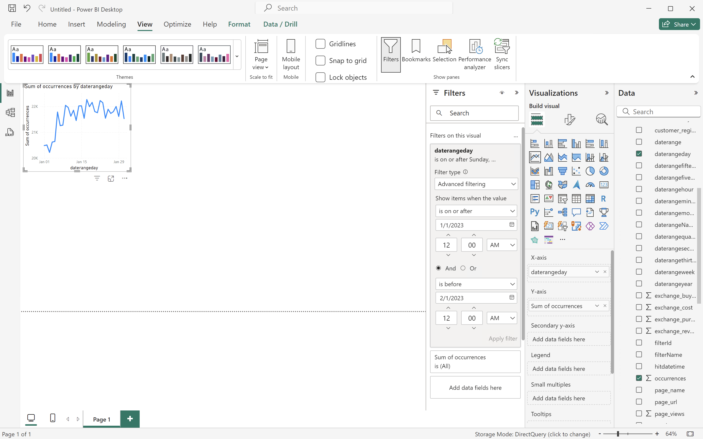

# Gebruikskwesties voor extensie BI

Dit artikel documenteert hoe te om een aantal gebruiksgevallen te verwezenlijken gebruikend de uitbreiding van Customer Journey Analytics BI. In elke gebruikszaak wordt de functionaliteit van de Customer Journey Analytics uitgelegd, gevolgd door de details van elk van de ondersteunde BI-gereedschappen:

* **Desktop van de Power BI**. De gebruikte versie is 2.137.1102.0 64-bits (oktober 2024).
* **Desktop van Tableau**. De gebruikte versie is 2024.1.5 (20241.24.0705.0334) 64-bits.

De volgende gebruiksgevallen worden gedocumenteerd:

* **verbind**
   * [Weergaven van Connect- en lijstgegevens](#connect-and-validate)
   * [Naar FLATTEN of niet](#to-flatten-or-not)

* **Rapport en analyseer**
   * [Dagelijkse trend](#daily-trend)
   * [Uurtrend](#hourly-trend)
   * [Maandelijkse trend](#monthly-trend)
   * [Eén dimensie, gerangschikt](#single-dimension-ranked)
   * [Meerdere dimensies gerangschikt](#multiple-dimension-ranked)
   * [Waarden voor verschillende dimensies tellen](#count-distinct-dimension-values)
   * [Namen van datumbereik gebruiken om te filteren](#use-date-range-names-to-filter)
   * [Filternamen gebruiken om te filteren](#use-filter-names-to-filter)
   * [Dimensiewaarden gebruiken om te filteren](#use-dimension-values-to-filter)
   * [Sorteren](#sort)
   * [Limieten](#limits)

* **Begrijp**

   * [Transformaties](#transformations)
   * [Visualisaties](#visualizations)
   * [Caveats](#caveats)

**verbind** gebruiksgeval concentreert zich op hoe te om de hulpmiddelen van BI te verbinden gebruikend de uitbreiding van Customer Journey Analytics BI.

Het **rapport en de analyse** gebruiksgevallen instrueren hoe te om gelijkaardige Customer Journey Analytics visualisaties in de momenteel gesteunde hulpmiddelen van BI te verwezenlijken.

**begrijpt** gebruiksgevallen meer details op verstrekken:

* Transformaties die voorkomen wanneer u een hulpmiddel van BI gebruikt om te melden en te analyseren.
* Visualisatieovereenkomsten en verschillen tussen Customer Journey Analytics- en BI-gereedschappen.
* Voorzie van elk van de hulpmiddelen van BI u zou moeten op de hoogte zijn.


## Verbinding maken en valideren

Met deze gebruiksaanwijzing stelt u de verbinding van het gereedschap BI naar Customer Journey Analytics in, geeft u de beschikbare gegevensweergaven weer en selecteert u een gegevensweergave die u wilt gebruiken.

+++ Customer Journey Analytics

De instructies verwijzen naar een voorbeeldomgeving met de volgende objecten:

* Gegevensweergave: **[!UICONTROL C&C - Data View]** ?..
* Dimensionen: **[!UICONTROL Product Name]** ?? en **[!UICONTROL Product Category]** ?..
* Metrisch: **[!UICONTROL Purchase Revenue]** ?? en **[!UICONTROL Purchases]** ?..
* Filter: **[!UICONTROL Fishing Products]** ?..


Wanneer u de gebruiksgevallen doorloopt, vervangt u deze voorbeeldobjecten door objecten die geschikt zijn voor uw specifieke omgeving.

+++

+++ BI-gereedschappen

>[!BEGINTABS]

>[!TAB  Desktop van de Power BI ]

1. Heb toegang tot de vereiste geloofsbrieven en de parameters van de Dienst UI van de Vraag van het Experience Platform.

   1. Navigeer naar de sandbox van uw Experience Platform.
   1. Selecteer  **[!UICONTROL Queries]** van het linkerspoor.
   1. Selecteer de tab **[!UICONTROL Credentials]** in de interface van **[!UICONTROL Queries]** .
   1. Selecteer `prod:cja` in het vervolgkeuzemenu **[!UICONTROL Database]** .

      

1. Start Power BI Desktop.
   1. Selecteer **[!UICONTROL Get data from other sources]** in de hoofdinterface.
   1. In het dialoogvenster **[!UICONTROL Get Data]** :
      
      1. Zoek en selecteer **[!UICONTROL PostgreSQL database]** .
      1. Selecteer **[!UICONTROL Connect]** .
   1. In het dialoogvenster **[!UICONTROL PostgreSQL database]** :
      
      1. Gebruik  om de **[!UICONTROL Host]** en **[!UICONTROL Port]** waarden van het Experience Platform **[!UICONTROL Query]** te kopiëren en te kleven **[!UICONTROL Expiring Credentials]** paneel, dat door `:` als waarde voor **[!UICONTROL Server]** wordt gescheiden. Bijvoorbeeld: `examplecompany.platform-query.adobe.io:80` .
      1. Gebruik  om de **[!UICONTROL Database]** waarde van het Experience Platform **[!UICONTROL Query]** te kopiëren en te kleven **[!UICONTROL Expiring Credentials]** paneel. Voeg `?FLATTEN` toe aan de waarde die u plakt. Bijvoorbeeld `prod:cja?FLATTEN` .
      1. Selecteer **[!UICONTROL DirectQuery]** als de **[!UICONTROL Data connectivity mode]** .
      1. Selecteer **[!UICONTROL OK]** .
   1. In het dialoogvenster **[!UICONTROL PostgreSQL database]** - **[!UICONTROL Database]** :
      
      1. Gebruik  om de **[!UICONTROL Username]** en **[!UICONTROL Password]** waarden van het Experience Platform **[!UICONTROL Query]** te kopiëren **[!UICONTROL Expiring Credentials]** paneel in **[!UICONTROL User name]** en **[!UICONTROL Password]** gebieden. Als u a [ niet-uitbreidende credentie ](https://experienceleague.adobe.com/en/docs/experience-platform/query/ui/credentials?lang=en#use-credential-to-connect) gebruikt, gebruik het wachtwoord van uw niet-uitbreidende referentie.
      1. Zorg ervoor dat het vervolgkeuzemenu voor **[!UICONTROL Select which level to apply these settings to]** is ingesteld op de **[!UICONTROL Server]** die u eerder hebt gedefinieerd.
      1. Selecteer **[!UICONTROL Connect]** .
   1. In het dialoogvenster **[!UICONTROL Navigator]** worden de gegevensweergaven opgehaald. Dit kan enige tijd duren. Zodra teruggewonnen, ziet u het volgende in de Desktop van Power BI.
      
      1. Selecteer **[!UICONTROL public.cc_data_view]** in de lijst in het linkerdeelvenster.
      1. U hebt twee opties:
         1. Selecteer **[!UICONTROL Load]** om door te gaan en de installatie te voltooien.
         1. Selecteer **[!UICONTROL Transform Data]** . Er wordt een dialoogvenster weergegeven waarin u desgewenst transformaties kunt toepassen als onderdeel van de configuratie.
            
            * Selecteer **[!UICONTROL Close & Apply]** .
   1. Na enige tijd wordt **[!UICONTROL public.cc_data_view]** weergegeven in het deelvenster **[!UICONTROL Data]** . Selecteer  om afmetingen en metriek te tonen.
      


>[!TAB  Desktop Tableau ]

1. Heb toegang tot de vereiste geloofsbrieven en de parameters van de Dienst UI van de Vraag van het Experience Platform.

   1. Navigeer naar de sandbox van uw Experience Platform.
   1. Selecteer  **[!UICONTROL Queries]** van het linkerspoor.
   1. Selecteer de tab **[!UICONTROL Credentials]** in de interface van **[!UICONTROL Queries]** .
   1. Selecteer `prod:cja` in het vervolgkeuzemenu **[!UICONTROL Database]** .

      

1. Start Tableau.
   1. Selecteer **[!UICONTROL PostgreSQL]** in de linkertrack onder **[!UICONTROL To a Server]** . Als deze optie niet beschikbaar is, selecteert u **[!UICONTROL More...]** en selecteert u **[!UICONTROL PostgreSQL]** in het menu **[!UICONTROL Installed Connectors]** .
      
   1. Ga in het dialoogvenster **[!UICONTROL PostgreSQL]** op het tabblad **[!UICONTROL General]** naar:
      
      1. Gebruik  om **[!UICONTROL Host]** van het Experience Platform **[!UICONTROL Query]** te kopiëren en te kleven **[!UICONTROL Expiring Credentials]** paneel aan **[!UICONTROL Server]**.
      1. Gebruik  om **[!UICONTROL Port]** van het Experience Platform **[!UICONTROL Query]** te kopiëren en te kleven **[!UICONTROL Expiring Credentials]** paneel aan **[!UICONTROL Port]**.
      1. Gebruik  om **[!UICONTROL Database]** van het Experience Platform **[!UICONTROL Query]** te kopiëren en te kleven **[!UICONTROL Expiring Credentials]** paneel aan **[!UICONTROL Database]**. Voeg `%3FFLATTEN` toe aan de waarde die u plakt. Bijvoorbeeld: `prod:cja%3FFLATTEN` .
      1. Selecteer **[!UICONTROL Username and Password]** in het vervolgkeuzemenu **[!UICONTROL Authentication]** .
      1. Gebruik  om **[!UICONTROL Username]** van het Experience Platform **[!UICONTROL Query]** te kopiëren en te kleven **[!UICONTROL Expiring Credentials]** paneel aan **[!UICONTROL Username]**.
      1. Gebruik  om **[!UICONTROL Password]** van het Experience Platform **[!UICONTROL Query]** te kopiëren en te kleven **[!UICONTROL Expiring Credentials]** paneel aan **[!UICONTROL Password]**. Als u a [ niet-uitbreidende credentie ](https://experienceleague.adobe.com/en/docs/experience-platform/query/ui/credentials?lang=en#use-credential-to-connect) gebruikt, gebruik het wachtwoord van uw niet-uitbreidende referentie.
      1. Controleer of **[!UICONTROL Require SSL]** is ingeschakeld.
      1. Selecteer **[!UICONTROL Sign In]** .

      U ziet een dialoogvenster **[!UICONTROL Progressing Request]** terwijl Tableau Desktop de verbinding valideert.
   1. In het hoofdvenster ziet u op de pagina **[!UICONTROL Data Source]** in het linkervenster:
      * De naam van de verbinding, onder **[!UICONTROL Connections]** .
      * De naam van de database, onder **[!UICONTROL Database]** .
      * Een lijst met tabellen, onder **[!UICONTROL Table]** .
        
      1. Sleep het item **[!UICONTROL cc_data_view]** en zet het neer in de hoofdweergave die **[!UICONTROL Drag tables]** hier leest.
   1. In het hoofdvenster worden de details van de gegevensweergave van **[!UICONTROL cc_data_view]** weergegeven.
      

>[!ENDTABS]

+++

## Naar FLATTEN of niet

In dit geval, wilt u begrijpen of u een extra `FLATTEN` parameter voor het gegevensbestand moet gebruiken wanneer u met Customer Journey Analytics gebruikend de uitbreiding van BI verbindt.

+++ Customer Journey Analytics

Customer Journey Analytics verstrekt informatie over hoe te in de interface van het Experience Platform te verbinden.

1. Navigeer naar de sandbox van uw Experience Platform.
1. Selecteer  **[!UICONTROL Queries]** van het linkerspoor.
1. Selecteer de tab **[!UICONTROL Credentials]** in de interface van **[!UICONTROL Queries]** .
1. Selecteer `prod:cja` in het vervolgkeuzemenu **[!UICONTROL Database]** .


+++

+++ BI-gereedschappen

>[!PREREQUISITES]
>
>Verzeker u [ een succesvolle verbinding, gegevensmeningen, en gebruik een gegevensmening ](#connect-and-validate) voor het hulpmiddel van BI hebt bevestigd waarvoor u dit gebruiksgeval wilt uitproberen. Zie de BI-gereedschapssectie voor welke expliciete `FLATTEN` parameteropties vereist zijn voor een juiste verbinding.
>

>[!BEGINTABS]

>[!TAB  Desktop van de Power BI ]

Power BI Desktop ondersteunt de volgende scenario&#39;s voor de parameter `FLATTEN` .

| FLATTEN, parameter | Voorbeeld | Ondersteund | Opmerkingen |
|---|---|:---:|---|
| Geen | `prod:cja` |  | |
| `?FLATTEN` | `prod:cja?FLATTEN` |  | |
| `%3FFLATTEN` | `prod:cja%3FFLATTEN` |  | Fout in weergave van Power BI Desktop: **[!UICONTROL We couldn't authenticate with the credentials provided. Please try again.]** |

>[!TAB  Desktop Tableau ]

Tableau Desktop ondersteunt de volgende scenario&#39;s voor de parameter `FLATTEN` .

| FLATTEN, parameter | Voorbeeld | Ondersteund | Opmerkingen |
|---|---|:---:|---|
| Geen | `prod:cja` |  | |
| `?FLATTEN` | `prod:cja?FLATTEN` |  | |
| `%3FFLATTEN` | `prod:cja%3FFLATTEN` |  | |

>[!ENDTABS]

+++


## Dagelijkse trend

In dit geval wilt u een tabel en eenvoudige lijnvisualisatie weergeven met een dagelijkse trend van voorvallen (gebeurtenissen) van 1 januari 2023 tot 31 januari 2023.

+++ Customer Journey Analytics

Een voorbeeldvenster **[!UICONTROL Daily Trend]** voor het hoofdlettergebruik:


+++

+++ BI-gereedschappen

>[!PREREQUISITES]
>
>Verzeker u a [ succesvolle verbinding en kunt gegevensmeningen ](#connect-and-validate) voor het hulpmiddel bevestigen en gebruiken BI waarvoor u dit gebruiksgeval wilt uitproberen.
>

>[!BEGINTABS]

>[!TAB  Desktop van de Power BI ]

1. In het deelvenster **[!UICONTROL Data]** :
   1. Selecteer **[!UICONTROL daterangeday]** .
   1. Selecteer **[!UICONTROL ∑ occurrences]** .

   Er wordt een tabel weergegeven met de exemplaren voor de huidige maand. Vergroot de visualisatie voor een betere zichtbaarheid.

1. In het deelvenster **[!UICONTROL Filters]** :

   1. Selecteer de **[!UICONTROL daterangeday is (All)]** van **[!UICONTROL Filters on this visual]**.
   1. Selecteer **[!UICONTROL Advanced filtering]** als de **[!UICONTROL Filter type]** .
   1. Definieer het filter op **[!UICONTROL Show items when the value]** **[!UICONTROL is on or after]** `1/1/2023` **[!UICONTROL And]** **[!UICONTROL is before]** `2/1/2023.` U kunt het kalenderpictogram gebruiken om datums te selecteren en te selecteren.
   1. Selecteer **[!UICONTROL Apply filter]** .

   De tabel wordt bijgewerkt met het toegepaste filter **[!UICONTROL daterangeday]** .

1. Selecteer in het deelvenster **[!UICONTROL Visualizations]** de **[!UICONTROL Line chart]** visualisatie.

   Een lijngrafiekvisualisatie vervangt de lijst terwijl het gebruiken van de zelfde gegevens zoals de lijst. Uw Power BI Desktop zou hieronder moeten kijken als.

   

1. Op het grafiekvisualisatie van de Lijn:

   1. Selecteer .
   1. Selecteer **[!UICONTROL Show as a table]** in het contextmenu.

   De hoofdweergave wordt bijgewerkt om zowel een lijnvisualisatie als een tabel weer te geven. Uw Power BI Desktop zou hieronder moeten kijken als.

   

>[!TAB  Desktop Tableau ]

1. Selecteer de tab **[!UICONTROL Sheet 1]** onderaan om te schakelen van de weergave **[!UICONTROL Data source]** . In de weergave **[!UICONTROL Sheet 1]** :
   1. Sleep de vermelding **[!UICONTROL Daterange]** uit de lijst **[!UICONTROL Tables]** in het deelvenster **[!UICONTROL Data]** en zet deze op de **[!UICONTROL Filters]** shelf neer.
   1. Selecteer **[!UICONTROL Range of Dates]** in het dialoogvenster **[!UICONTROL Next >]** van **[!UICONTROL Filters Field \[Daterange\]]** .
   1. Selecteer **[!UICONTROL Range of dates]** in het dialoogvenster **[!UICONTROL Filter \[Daterange]]** en geef een punt op van `01/01/2023` - `01/02/2023` .

      

   1. Sleep **[!UICONTROL Daterangeday]** vanuit de lijst **[!UICONTROL Tables]** in het deelvenster **[!UICONTROL Data]** en zet de vermelding in het veld naast **[!UICONTROL Columns]** neer.
      * Selecteer **[!UICONTROL Day]** in de vervolgkeuzelijst **[!UICONTROL Daterangeday]** , zodat de waarde wordt bijgewerkt naar **[!UICONTROL DAY(Daterangeday)]** .
   1. De belemmering en laat vallen **[!UICONTROL Occurrences]** van de **[!UICONTROL Tables (*Namen van de Maatregel *)]**lijst in de **[!UICONTROL Data]**ruit en laat vallen de ingang op het gebied naast **[!UICONTROL Rows]**.
      * De waarden worden automatisch omgezet in **[!UICONTROL SUM(Occurrences)]** .
   1. Wijzig **[!UICONTROL Standard]** aan **[!UICONTROL Entire View]** van **[IUICONTROL]** dropdown menu van de Passendheid {in de toolbar.

      Uw Tableau Desktop moet er hieronder uitzien.

      

1. Selecteer **[!UICONTROL Duplicate]** in het contextmenu van de tab **[!UICONTROL Sheet 1]** om een tweede blad te maken.
1. Selecteer **[!UICONTROL Rename]** in het contextmenu van de tab **[!UICONTROL Sheet 1]** om de naam van het werkblad te wijzigen in `Graph` .
1. Selecteer **[!UICONTROL Rename]** in het contextmenu van de tab **[!UICONTROL Sheet 1 (2)]** om de naam van het werkblad te wijzigen in `Data` .
1. Zorg ervoor dat het **[!UICONTROL Data]** -werkblad is geselecteerd. In de weergave **[!UICONTROL Data]** :
   1. Selecteer **[!UICONTROL Show me]** rechtsboven en selecteer **[!UICONTROL Text table]** (bovenste visualisatie linksboven) om de inhoud van de gegevensweergave te wijzigen in een tabel.
   1. Selecteer **[!UICONTROL Swap Rows and Columns]** op de werkbalk.
   1. Wijzig **[!UICONTROL Standard]** aan **[!UICONTROL Entire View]** van **[IUICONTROL]** dropdown menu van de Passendheid {in de toolbar.

      Uw Tableau Desktop moet er hieronder uitzien.

      

1. Selecteer de tabknop **[!UICONTROL New Dashboard]** (onder) om een nieuwe **[!UICONTROL Dashboard 1]** -weergave te maken. In de weergave **[!UICONTROL Dashboard 1]** :
   1. Sleep en laat vallen het **[!UICONTROL Graph]** blad van **[!UICONTROL Sheets]** plank op de **[!UICONTROL Dashboard 1]** mening die *Dropbladen hier* leest.
   1. Sleep het **[!UICONTROL Data]** -werkblad van de **[!UICONTROL Sheets]** -plank onder het **[!UICONTROL Graph]** -werkblad naar de **[!UICONTROL Dashboard 1]** -weergave.
   1. Selecteer het **[!UICONTROL Data]** -werkblad in de weergave en wijzig **[!UICONTROL Entire View]** in **[!UICONTROL Fix Width]** .

      Uw Tableau Desktop moet er hieronder uitzien.

      

>[!ENDTABS]

+++


## Uurtrend

In dit gebruiksgeval wilt u een tabel en eenvoudige lijnvisualisatie weergeven met een trend per uur van voorkomen(gebeurtenissen) voor 1 januari 2023.

+++ Customer Journey Analytics

Een voorbeeldvenster **[!UICONTROL Hourly Trend]** voor het hoofdlettergebruik:


+++

+++ BI-gereedschappen

>[!PREREQUISITES]
>
>Verzeker u [ een succesvolle verbinding, gegevensmeningen, en gebruik een gegevensmening ](#connect-and-validate) voor het hulpmiddel van BI hebt bevestigd waarvoor u dit gebruiksgeval wilt uitproberen.
>

>[!BEGINTABS]

>[!TAB  Desktop van de Power BI ]

 Power BI **begrijpt niet** hoe te om datum-tijd gebieden te behandelen, zodat de dimensies zoals **[!UICONTROL daterangehour]** en **[!UICONTROL daterangeminute]** niet worden gesteund.

>[!TAB  Desktop Tableau ]

1. Selecteer de tab **[!UICONTROL Sheet 1]** onderaan om te schakelen van **[!UICONTROL Data source]** . In de weergave **[!UICONTROL Sheet 1]** :
   1. Sleep de vermelding **[!UICONTROL Daterange]** uit de lijst **[!UICONTROL Tables]** in het deelvenster **[!UICONTROL Data]** en zet deze op de **[!UICONTROL Filters]** shelf neer.
   1. Selecteer **[!UICONTROL Range of Dates]** in het dialoogvenster **[!UICONTROL Next >]** van **[!UICONTROL Filters Field \[Daterange\]]** .
   1. Selecteer **[!UICONTROL Range of dates]** in het dialoogvenster **[!UICONTROL Filter \[Daterange]]** en geef een punt op van `01/01/2023` - `02/01/2023` .

      

   1. Sleep **[!UICONTROL Daterangehour]** vanuit de lijst **[!UICONTROL Tables]** in het deelvenster **[!UICONTROL Data]** en zet de vermelding in het veld naast **[!UICONTROL Columns]** neer.
      * Selecteer **[!UICONTROL More]** > **[!UICONTROL Hours]** in de vervolgkeuzelijst **[!UICONTROL Daterangeday]** , zodat de waarde wordt bijgewerkt naar **[!UICONTROL HOUR(Daterangeday)]** .
   1. De belemmering en laat vallen **[!UICONTROL Occurrences]** van de **[!UICONTROL Tables (*Namen van de Maatregel *)]**lijst in de **[!UICONTROL Data]**ruit en laat vallen de ingang op het gebied naast **[!UICONTROL Rows]**.
      * De waarden worden automatisch omgezet in **[!UICONTROL SUM(Occurrences)]** .
   1. Wijzig **[!UICONTROL Standard]** aan **[!UICONTROL Entire View]** van **[IUICONTROL]** dropdown menu van de Passendheid {in de toolbar.

      Uw Tableau Desktop moet er hieronder uitzien.

      

1. Selecteer **[!UICONTROL Duplicate]** in het contextmenu van de tab **[!UICONTROL Sheet 1]** om een tweede blad te maken.
1. Selecteer **[!UICONTROL Rename]** in het contextmenu van de tab **[!UICONTROL Sheet 1]** om de naam van het werkblad te wijzigen in `Graph` .
1. Selecteer **[!UICONTROL Rename]** in het contextmenu van de tab **[!UICONTROL Sheet 1 (2)]** om de naam van het werkblad te wijzigen in `Data` .
1. Zorg ervoor dat het **[!UICONTROL Data]** -werkblad is geselecteerd. In de weergave **[!UICONTROL Data]** :
   1. Selecteer **[!UICONTROL Show me]** rechtsboven en selecteer **[!UICONTROL Text table]** (bovenste visualisatie linksboven) om de inhoud van de gegevensweergave te wijzigen in een tabel.
   1. Sleep **[!UICONTROL HOUR(Daterangeday)]** van **[!UICONTROL Columns]** naar **[!UICONTROL Rows]** .
   1. Wijzig **[!UICONTROL Standard]** aan **[!UICONTROL Entire View]** van **[IUICONTROL]** dropdown menu van de Passendheid {in de toolbar.

      Uw Tableau Desktop moet er hieronder uitzien.

      

1. Selecteer **[!UICONTROL New Dashboard]** tabknop (onder) om een nieuwe **[!UICONTROL Dashboard 1]** -weergave te maken. In de weergave **[!UICONTROL Dashboard 1]** :
   1. Sleep en laat vallen het **[!UICONTROL Graph]** blad van **[!UICONTROL Sheets]** plank op de **[!UICONTROL Dashboard 1]** mening die *Dropbladen hier* leest.
   1. Sleep het **[!UICONTROL Data]** -werkblad van de **[!UICONTROL Sheets]** -plank onder het **[!UICONTROL Graph]** -werkblad naar de **[!UICONTROL Dashboard 1]** -weergave.
   1. Selecteer het **[!UICONTROL Data]** -werkblad in de weergave en wijzig **[!UICONTROL Entire View]** in **[!UICONTROL Fix Width]** .

      De weergave **[!UICONTROL Dashboard 1]** ziet er hieronder ongeveer zo uit.

      


>[!ENDTABS]

+++


## Maandelijkse trend

In dit gebruiksgeval, wilt u een lijst en eenvoudige lijnvisualisatie tonen die een maandelijkse trend van voorkomen (gebeurtenissen) voor 2023 toont.

+++ Customer Journey Analytics

Een voorbeeldvenster **[!UICONTROL Monthly Trend]** voor het hoofdlettergebruik:


+++

+++ BI-gereedschappen

>[!PREREQUISITES]
>
>Verzeker u [ een succesvolle verbinding, gegevensmeningen, en gebruik een gegevensmening ](#connect-and-validate) voor het hulpmiddel van BI hebt bevestigd waarvoor u dit gebruiksgeval wilt uitproberen.
>

>[!BEGINTABS]

>[!TAB  Desktop van de Power BI ]

1. In het deelvenster **[!UICONTROL Data]** :
   1. Selecteer **[!UICONTROL daterangemonth]** .
   1. Selecteer **[!UICONTROL ∑ occurrences]** .

   Er wordt een tabel weergegeven met de exemplaren voor de huidige maand. Vergroot de visualisatie voor een betere zichtbaarheid.

1. In het deelvenster **[!UICONTROL Filters]** :

   1. Selecteer de **[!UICONTROL daterangemonth is (All)]** van **[!UICONTROL Filters on this visual]**.
   1. Selecteer **[!UICONTROL Advanced filtering]** als de **[!UICONTROL Filter type]** .
   1. Definieer het filter op **[!UICONTROL Show items when the value]** **[!UICONTROL is on or after]** `1/1/2023` **[!UICONTROL And]** **[!UICONTROL is before]** `1/1/2024.` U kunt het kalenderpictogram gebruiken om datums te selecteren en te selecteren.
   1. Selecteer **[!UICONTROL Apply filter]** .

   De tabel wordt bijgewerkt met het toegepaste filter **[!UICONTROL daterangemonth]** .

1. In het deelvenster **[!UICONTROL Visualizations]** :

   1. Selecteer de **[!UICONTROL Line chart]** visualisatie.

   Een lijngrafiekvisualisatie vervangt de lijst terwijl het gebruiken van de zelfde gegevens zoals de lijst. Uw Power BI Desktop zou hieronder moeten kijken als.

   

1. Op het grafiekvisualisatie van de Lijn:

   1. Selecteer .
   1. Selecteer **[!UICONTROL Show as a table]** in het contextmenu.

   De hoofdweergave wordt bijgewerkt om zowel een lijnvisualisatie als een tabel weer te geven. Uw Power BI Desktop zou hieronder moeten kijken als.

   

>[!TAB  Desktop Tableau ]

1. Selecteer de tab **[!UICONTROL Sheet 1]** onderaan om te schakelen van **[!UICONTROL Data source]** . In de weergave **[!UICONTROL Sheet 1]** :
   1. Sleep de vermelding **[!UICONTROL Daterange]** uit de lijst **[!UICONTROL Tables]** in het deelvenster **[!UICONTROL Data]** en zet deze op de **[!UICONTROL Filters]** shelf neer.
   1. Selecteer **[!UICONTROL Range of Dates]** in het dialoogvenster **[!UICONTROL Next >]** van **[!UICONTROL Filters Field \[Daterange\]]** .
   1. Selecteer **[!UICONTROL Range of dates]** in het dialoogvenster **[!UICONTROL Filter \[Daterange]]** en geef een punt op van `01/01/2023` - `01/01/2024` .

      

   1. Sleep **[!UICONTROL Daterangeday]** vanuit de lijst **[!UICONTROL Tables]** in het deelvenster **[!UICONTROL Data]** en zet de vermelding in het veld naast **[!UICONTROL Columns]** neer.
      * Selecteer **[!UICONTROL MONTH]** in de vervolgkeuzelijst **[!UICONTROL Daterangeday]** , zodat de waarde wordt bijgewerkt naar **[!UICONTROL MONTH(Daterangeday)]** .
   1. De belemmering en laat vallen **[!UICONTROL Occurrences]** van de **[!UICONTROL Tables (*Namen van de Maatregel *)]**lijst in de **[!UICONTROL Data]**ruit en laat vallen de ingang op het gebied naast **[!UICONTROL Rows]**.
      * De waarden worden automatisch omgezet in **[!UICONTROL SUM(Occurrences)]** .
   1. Wijzig **[!UICONTROL Standard]** aan **[!UICONTROL Entire View]** van **[IUICONTROL]** dropdown menu van de Passendheid {in de toolbar.

      Uw Tableau Desktop moet er hieronder uitzien.

      

1. Selecteer **[!UICONTROL Duplicate]** in het contextmenu van de tab **[!UICONTROL Sheet 1]** om een tweede blad te maken.
1. Selecteer **[!UICONTROL Rename]** in het contextmenu van de tab **[!UICONTROL Sheet 1]** om de naam van het werkblad te wijzigen in `Graph` .
1. Selecteer **[!UICONTROL Rename]** in het contextmenu van de tab **[!UICONTROL Sheet 1 (2)]** om de naam van het werkblad te wijzigen in `Data` .
1. Zorg ervoor dat het **[!UICONTROL Data]** -werkblad is geselecteerd. In de weergave Gegevens:
   1. Selecteer **[!UICONTROL Show me]** rechtsboven en selecteer **[!UICONTROL Text table]** (bovenste visualisatie linksboven) om de inhoud van de gegevensweergave te wijzigen in een tabel.
   1. Sleep **[!UICONTROL MONTH(Daterangeday)]** van **[!UICONTROL Columns]** naar **[!UICONTROL Rows]** .
   1. Wijzig **[!UICONTROL Standard]** aan **[!UICONTROL Entire View]** van **[IUICONTROL]** dropdown menu van de Passendheid {in de toolbar.

      Uw Tableau Desktop moet er hieronder uitzien.

      

1. Selecteer **[!UICONTROL New Dashboard]** tabknop (onder) om een nieuwe **[!UICONTROL Dashboard 1]** -weergave te maken. In de weergave **[!UICONTROL Dashboard 1]** :
   1. Sleep en laat vallen het **[!UICONTROL Graph]** blad van **[!UICONTROL Sheets]** plank op de **[!UICONTROL Dashboard 1]** mening die *Dropbladen hier* leest.
   1. Sleep het **[!UICONTROL Data]** -werkblad van de **[!UICONTROL Sheets]** -plank onder het **[!UICONTROL Graph]** -werkblad naar de **[!UICONTROL Dashboard 1]** -weergave.
   1. Selecteer het **[!UICONTROL Data]** -werkblad in de weergave en wijzig **[!UICONTROL Entire View]** in **[!UICONTROL Fix Width]** .

      Uw Tableau Desktop moet er hieronder uitzien.

      

>[!ENDTABS]

+++


## Eén dimensie, gerangschikt

In dit gebruiksgeval wilt u een tabel en eenvoudige streepjesvisualisatie weergeven met de aankoop- en aankoopopbrengsten voor productnamen over 2023.

+++ Customer Journey Analytics

Een voorbeeldvenster **[!UICONTROL Single Dimension Ranked]** voor het hoofdlettergebruik:


+++

+++ BI-gereedschappen

>[!PREREQUISITES]
>
>Verzeker u [ een succesvolle verbinding, gegevensmeningen, en gebruik een gegevensmening ](#connect-and-validate) voor het hulpmiddel van BI hebt bevestigd waarvoor u dit gebruiksgeval wilt uitproberen.
>

>[!BEGINTABS]

>[!TAB  Desktop van de Power BI ]

1. In het deelvenster **[!UICONTROL Data]** :
   1. Selecteer **[!UICONTROL daterange]** .
   1. Selecteer **[!UICONTROL product_name]** .
   1. Selecteer **[!UICONTROL ∑ purchase_revenue]** .
   1. Selecteer **[!UICONTROL ∑ purchases]** .

   Er wordt een lege tabel weergegeven met alleen de kolomkoppen voor het geselecteerde element. Vergroot de visualisatie voor een betere zichtbaarheid.

1. In het deelvenster **[!UICONTROL Filters]** :

   1. Selecteer de **[!UICONTROL daterange is (All)]** van **[!UICONTROL Filters on this visual]**.
   1. Selecteer **[!UICONTROL Relative date]** als de **[!UICONTROL Filter type]** .
   1. Definieer het filter naar **[!UICONTROL Show items when the value]** **[!UICONTROL is in the last]** `1` **[!UICONTROL calendar years]** .
   1. Selecteer **[!UICONTROL Apply filter]** .

   De tabel wordt bijgewerkt met het toegepaste filter **[!UICONTROL daterange]** .

1. In het deelvenster **[!UICONTROL Visualization]** :

   1. Gebruik  om **[!UICONTROL daterange]** uit **[!UICONTROL Columns]** te verwijderen.
   1. Sleep **[!UICONTROL Sum of purchases_revenue]** onder **[!UICONTROL Sum of purchases]** in **[!UICONTROL Columns]** .

1. Voor de visualisatie van de Lijst:

   1. Selecteer **[!UICONTROL Sum of purchase_revenue]** om de productnamen te sorteren in aflopende volgorde van inkoopopbrengsten. Uw Power BI Desktop zou hieronder moeten kijken als.

   

1. In het deelvenster **[!UICONTROL Filters]** :

   1. Selecteer **[!UICONTROL product_name is (All)]** .
   1. Stel **[!UICONTROL Filter type]** in op **[!UICONTROL Top N]** .
   1. Definieer het filter naar **[!UICONTROL Show items]** **[!UICONTROL Top]** `10` **[!UICONTROL By value]** .
   1. Sleep **[!UICONTROL purchase_revenue]** naar **[!UICONTROL By value]** **[!UICONTROL Add data fields here]** .
   1. Selecteer **[!UICONTROL Apply filter]** .

   U ziet de tabel die is bijgewerkt met waarden voor de aankoopopbrengsten, in overeenstemming met de visualisatie van de tabel Freeform in Analysis Workspace.

1. In het deelvenster **[!UICONTROL Visualizations]** :

   1. Selecteer de **[!UICONTROL Line and stacked column chart]** visualisatie.

   Een lijn en gestapelde kolomgrafiekvisualisatie vervangen de lijst terwijl het gebruiken van de zelfde gegevens zoals de lijst.

1. Sleep **[!UICONTROL purchases]** naar **[!UICONTROL Line y-axis]** in het deelvenster **[!UICONTROL Visualizations]** .

   De lijn en gestapelde kolomgrafiek worden bijgewerkt. Uw Power BI Desktop zou hieronder moeten kijken als.

   

1. Op de Lijn en gestapelde kolomgrafiekvisualisatie:

   1. Selecteer .
   1. Selecteer **[!UICONTROL Show as a table]** in het contextmenu.

   De hoofdweergave wordt bijgewerkt om zowel een lijnvisualisatie als een tabel weer te geven.

   

>[!TAB  Desktop Tableau ]

1. Selecteer de tab **[!UICONTROL Sheet 1]** onderaan om te schakelen van **[!UICONTROL Data source]** . In de weergave **[!UICONTROL Sheet 1]** :
   1. Sleep de vermelding **[!UICONTROL Daterange]** uit de lijst **[!UICONTROL Tables]** in het deelvenster **[!UICONTROL Data]** en zet deze op de **[!UICONTROL Filters]** shelf neer.
   1. Selecteer **[!UICONTROL Range of Dates]** in het dialoogvenster **[!UICONTROL Next >]** van **[!UICONTROL Filters Field \[Daterange\]]** .
   1. Selecteer **[!UICONTROL Range of dates]** in het dialoogvenster **[!UICONTROL Filter \[Daterange]]** en geef een punt op van `01/01/2023` - `31/12/2024` . Selecteer **[!UICONTROL Apply]** en **[!UICONTROL OK]** .

      

   1. Sleep **[!UICONTROL Product Name]** vanuit de lijst **[!UICONTROL Tables]** in het deelvenster **[!UICONTROL Data]** en zet de vermelding in het veld naast **[!UICONTROL Rows]** neer.
   1. De belemmering en laat vallen **[!UICONTROL Purchases]** van de **[!UICONTROL Tables (*Namen van de Maatregel *)]**lijst in de **[!UICONTROL Data]**ruit en laat vallen de ingang op het gebied naast **[!UICONTROL Rows]**.
      * De waarden worden automatisch omgezet in **[!UICONTROL SUM(Purchases)]** .
   1. De belemmering en laat vallen **[!UICONTROL Purchase Revenue]** van de **[!UICONTROL Tables (*Namen van de Maatregel *)]**lijst in de **[!UICONTROL Data]**ruit en laat vallen de ingang op het gebied naast **[!UICONTROL Columns]**en verlaten van **[!UICONTROL SUM(Purchases)]**.
      * De waarden worden automatisch omgezet in **[!UICONTROL SUM(Purchase Revenue)]** .
   1. Als u beide grafieken wilt bestellen in aflopende volgorde van inkoopopbrengsten, plaatst u de muisaanwijzer op de titel van **[!UICONTROL Purchase Revenue]** en selecteert u het sorteerpictogram.
   1. Als u het aantal items in de grafieken wilt beperken, selecteert u **[!UICONTROL SUM(Purchase Revenue)]** in **[!UICONTROL Rows]** en kiest u **[!UICONTROL Filter]** in het vervolgkeuzemenu.
   1. Selecteer **[!UICONTROL Range of values]** in het dialoogvenster **[!UICONTROL Filter \[Purchase Revenue\]]** en voer de gewenste waarden in. Bijvoorbeeld: `1,000,000` - `2,000,000` . Selecteer **[!UICONTROL Apply]** en **[!UICONTROL OK]** .
   1. Als u de twee staafdiagrammen wilt omzetten in een combinatieschema, selecteert u **[!UICONTROL SUM(Purchases)]** in **[!UICONTROL Rows]** en kiest u **[!UICONTROL Dual Axis]** in het vervolgkeuzemenu. De staafdiagrammen worden omgezet in een spreidingsgrafiek.
   1. U wijzigt het spreidingsperceel als volgt in een staafdiagram:
      1. Selecteer **[!UICONTROL SUM(Purchases)]** in het **[!UICONTROL Marks]** gebied en selecteer **[!UICONTROL Line]** in het vervolgkeuzemenu.
      1. Selecteer **[!UICONTROL SUM(Purchase Revenue)]** in het **[!UICONTROL Marks]** gebied en selecteer **[!UICONTROL Bar]** in het vervolgkeuzemenu.

   Uw Tableau Desktop moet er hieronder uitzien.

   

1. Selecteer **[!UICONTROL Duplicate]** in het contextmenu van de tab **[!UICONTROL Sheet 1]** om een tweede blad te maken.
1. Selecteer **[!UICONTROL Rename]** in het contextmenu van de tab **[!UICONTROL Sheet 1]** om de naam van het werkblad te wijzigen in `Data` .
1. Selecteer **[!UICONTROL Rename]** in het contextmenu van de tab **[!UICONTROL Sheet 1 (2)]** om de naam van het werkblad te wijzigen in `Graph` .
1. Zorg ervoor dat het **[!UICONTROL Data]** -werkblad is geselecteerd.
   1. Selecteer **[!UICONTROL Show me]** rechtsboven en selecteer **[!UICONTROL Text table]** (visualisatie linksboven) om de inhoud van de twee grafieken aan een tabel aan te passen.
   1. Om koopopbrengst in dalende orde te opdracht geven, houd over **[!UICONTROL Purchase Revenue]** in de lijst en selecteer .
   1. Selecteer **[!UICONTROL Entire View]** in het vervolgkeuzemenu **[!UICONTROL Fit]** .

   Uw Tableau Desktop moet er hieronder uitzien.

   

1. Selecteer **[!UICONTROL New Dashboard]** tabknop (onder) om een nieuwe **[!UICONTROL Dashboard 1]** -weergave te maken. In de weergave **[!UICONTROL Dashboard 1]** :
   1. Sleep en laat vallen het **[!UICONTROL Graph]** blad van **[!UICONTROL Sheets]** plank op de **[!UICONTROL Dashboard 1]** mening die *Dropbladen hier* leest.
   1. Sleep het **[!UICONTROL Data]** -werkblad van de **[!UICONTROL Sheets]** -plank onder het **[!UICONTROL Graph]** -werkblad naar de **[!UICONTROL Dashboard 1]** -weergave.
   1. Selecteer het **[!UICONTROL Data]** -werkblad in de weergave en wijzig **[!UICONTROL Entire View]** in **[!UICONTROL Fix Width]** .

   De weergave **[!UICONTROL Dashboard 1]** ziet er hieronder ongeveer zo uit.

   

>[!ENDTABS]

+++


## Meerdere dimensies gerangschikt

In dit geval wilt u een tabel weergeven die de aankoopopbrengsten en -aankopen voor productnamen in productcategorieën opsplitst in 2023. Bovendien wilt u een aantal visualisaties gebruiken om zowel de distributie van de productcategorie als de bijdragen voor productnamen binnen elke productcategorie te illustreren.

+++ Customer Journey Analytics

Een voorbeeldvenster **[!UICONTROL Multiple Dimension Ranked]** voor het hoofdlettergebruik:


+++

+++ BI-gereedschappen

>[!PREREQUISITES]
>
>Verzeker u [ een succesvolle verbinding, gegevensmeningen, en gebruik een gegevensmening ](#connect-and-validate) voor het hulpmiddel van BI hebt bevestigd waarvoor u dit gebruiksgeval wilt uitproberen.
>

>[!BEGINTABS]

>[!TAB  Desktop van de Power BI ]

1. Sleep **[!UICONTROL daterangeday]** van het deelvenster **[!UICONTROL Data]** aan **[!UICONTROL Filters on this page]** om ervoor te zorgen dat het datumbereik van toepassing is op alle visualisaties.
   1. Selecteer de **[!UICONTROL daterangeday is (All)]** van **[!UICONTROL Filters on this page]**.
   1. Selecteer **[!UICONTROL Relative date]** als de **[!UICONTROL Filter type]** .
   1. Definieer het filter naar **[!UICONTROL Show items when the value]** **[!UICONTROL is in the last]** `1` **[!UICONTROL calendar years]** .
   1. Selecteer **[!UICONTROL Apply filter]** .

1. In het deelvenster **[!UICONTROL Data]** :
   1. Selecteer **[!UICONTROL datarangeday]** .
   1. Selecteer **[!UICONTROL product_category]** .
   1. Selecteer **[!UICONTROL product_name]** .
   1. Selecteren **[!UICONTROL ∑ purchase_revenue]**
   1. Selecteren **[!UICONTROL ∑ purchases]**

1. Als u het verticale staafdiagram wilt wijzigen in een tabel, zorgt u dat de tabel is geselecteerd en selecteert u **[!UICONTROL Matrix]** in het deelvenster **[!UICONTROL Visualizations]** .
   * Sleep **[!UICONTROL product_name]** vanuit **[!UICONTROL Columns]** en zet het veld onder **[!UICONTROL product_categor] **y neer in **[!UICONTROL Rows]** in het deelvenster **[!UICONTROL Visualization]** .

1. Selecteer **[!UICONTROL product_name is (All)]** in het deelvenster **[!UICONTROL Filters]** om het aantal weergegeven producten in de tabel te beperken.

   1. Selecteer **[!UICONTROL Advanced filtering]** .
   1. Selecteer **[!UICONTROL Filter type]** **[!UICONTROL Top N]** **[!UICONTROL Show items]** **[!UICONTROL Top]** `15` **[!UICONTROL By Value]** .
   1. Sleep **[!UICONTROL purchases]** vanuit het deelvenster **[!UICONTROL Data]** naar het deelvenster **[!UICONTROL Add data fields here]** .
   1. Selecteer **[!UICONTROL Apply filter]** .

1. Als u de leesbaarheid wilt verbeteren, selecteert u **[!UICONTROL View]** in het bovenste menu, selecteert u **[!UICONTROL Page View]** > **[!UICONTROL Actual size]** en wijzigt u de grootte van de tabelvisualisatie.

1. Selecteer **[!UICONTROL +]** op productcategorieniveau om elke categorie in de tabel op te splitsen. Uw Power BI Desktop zou hieronder moeten kijken als.

   

1. Selecteer **[!UICONTROL Home]** in het bovenste menu en selecteer **[!UICONTROL New visual]** . Een nieuwe visuele wordt toegevoegd aan uw rapport.

1. In het deelvenster **[!UICONTROL Data]** :
   1. Selecteer **[!UICONTROL product_category]** .
   1. Selecteer **[!UICONTROL product_name]** .
   1. Selecteer **[!UICONTROL purchase_revenue]** .

1. Als u de visuele weergave wilt wijzigen, selecteert u het staafdiagram en selecteert u **[!UICONTROL Treemap]** in het deelvenster **[!UICONTROL Visualizations]** .
1. Zorg ervoor dat **[!UICONTROL product_category]** onder **[!UICONTROL Category]** en **[!UICONTROL product_name]** onder **[!UICONTROL Details]** in het deelvenster **[!UICONTROL Visualizations]** wordt weergegeven.

   Uw Power BI Desktop zou hieronder moeten kijken als.

   

1. Selecteer **[!UICONTROL Home]** in het bovenste menu en selecteer **[!UICONTROL New visual]** . Een nieuwe visuele wordt toegevoegd aan uw rapport.

1. In het deelvenster **[!UICONTROL Data]** :
   1. Selecteer **[!UICONTROL product_category]** .
   1. Selecteer **[!UICONTROL purchase_revenue]** .
   1. Selecteer **[!UICONTROL purchase]** .

1. In het deelvenster **[!UICONTROL Visualizations]** :
   1. Selecteer **[!UICONTROL Line and stacked column chart]** als u de visualisatie wilt wijzigen.
   1. Sleep **[!UICONTROL sum_of_purchases]** van **[!UICONTROL Column y-axis]** naar **[!UICONTROL Line y-axis]** .

1. Wijzig in het rapport de volgorde van de afzonderlijke visualisaties.

   Uw Power BI Desktop zou hieronder moeten kijken als.

   


>[!TAB  Desktop Tableau ]

1. Selecteer de tab **[!UICONTROL Sheet 1]** onderaan om te schakelen van **[!UICONTROL Data source]** . In de weergave **[!UICONTROL Sheet 1]** :
   1. Sleep de vermelding **[!UICONTROL Daterange]** uit de lijst **[!UICONTROL Tables]** in het deelvenster **[!UICONTROL Data]** en zet deze op de **[!UICONTROL Filters]** shelf neer.
   1. Selecteer **[!UICONTROL Range of Dates]** in het dialoogvenster **[!UICONTROL Next >]** van **[!UICONTROL Filters Field \[Daterange\]]** .
   1. Selecteer **[!UICONTROL Relative dates]** in het dialoogvenster **[!UICONTROL Filter \[Daterange]]** , selecteer **[!UICONTROL Years]** en geef **[!UICONTROL Previous year]** op. Selecteer **[!UICONTROL Apply]** en **[!UICONTROL OK]** .

      Uw Tableau Desktop moet er hieronder uitzien.

      

   1. Sleep **[!UICONTROL Product Category]** en zet de muisknop los naast **[!UICONTROL Columns]** .
   1. Sleep **[!UICONTROL Purchase Revenue]** en zet de muisknop los naast **[!UICONTROL Rows]** . De waarde verandert in **[!UICONTROL SUM(Purchase Revenue)]** .
   1. Sleep Aankopen en zet ze neer naast **[!UICONTROL Rows]** . De waarde verandert in **[!UICONTROL SUM(Purchases)]** .
   1. Selecteer **[!UICONTROL SUM(Purchases)]** en selecteer **[!UICONTROL Dual Axis]** in het vervolgkeuzemenu.
   1. Selecteer **[!UICONTROL SUM(Purchases)]** in **[!UICONTROL Marks]** en selecteer **[!UICONTROL Line]** in het vervolgkeuzemenu.
   1. Selecteer **[!UICONTROL SUM(Purchase Revenue)]** in **[!UICONTROL Marks]** en selecteer **[!UICONTROL Bar]** in het vervolgkeuzemenu.
   1. Selecteer **[!UICONTROL Entire View]** in het menu **[!UICONTROL Fit]** .
   1. Selecteer de titel **[!UICONTROL Purchase Revenue]** in het diagram en controleer of de aankoopopbrengsten oplopend zijn.

      Uw Tableau Desktop moet er hieronder uitzien.

      

1. Wijzig de naam van het huidige **[!UICONTROL Sheet 1]** blad in `Category` .
1. Selecteer **[!UICONTROL New Worksheet]** om een nieuw blad te maken en wijzig de naam in `Data` .

   1. Sleep de vermelding **[!UICONTROL Daterange]** uit de lijst **[!UICONTROL Tables]** in het deelvenster **[!UICONTROL Data]** en zet deze op de **[!UICONTROL Filters]** shelf neer.
   1. Selecteer **[!UICONTROL Range of Dates]** in het dialoogvenster **[!UICONTROL Next >]** van **[!UICONTROL Filters Field \[Daterange\]]** .
   1. Selecteer **[!UICONTROL Relative dates]** in het dialoogvenster **[!UICONTROL Filter \[Daterange]]** , selecteer **[!UICONTROL Years]** en geef **[!UICONTROL Previous year]** op. Selecteer **[!UICONTROL Apply]** en **[!UICONTROL OK]** .
   1. Sleep **[!UICONTROL Purchase Revenue]** van **[!UICONTROL Data]** deelvenster naar **[!UICONTROL Columns]** . De waarde verandert in **[!UICONTROL SUM(Purchase Revenue)]** .
   1. Sleep **[!UICONTROL Purchase]** van **[!UICONTROL Data]** deelvenster naar **[!UICONTROL Columns]** naast **[!UICONTROL Purchase Revenue]** . De waarde verandert in **[!UICONTROL SUM(Purchases)]** .
   1. Sleep **[!UICONTROL Product Category]** van het **[!UICONTROL Data]** deelvenster naar **[!UICONTROL Rows]** .
   1. Sleep **[!UICONTROL Product Name]** van het **[!UICONTROL Data]** deelvenster naar **[!UICONTROL Rows]** , naast **[!UICONTROL Product Category]** .
   1. Als u de twee horizontale balken in een tabel wilt wijzigen, selecteert u **[!UICONTROL Text Table]** in **[!UICONTROL Show Me]** .
   1. Selecteer **[!UICONTROL Purchases]** in **[!UICONTROL Measure Values]** om het aantal producten te beperken. Selecteer **[!UICONTROL Filter]** in het vervolgkeuzemenu.
   1. Selecteer **[!UICONTROL At least]** in het dialoogvenster **[!UICONTROL Filter \[Purchases\]]** en voer `7000` in. Selecteer **[!UICONTROL Apply]** en **[!UICONTROL OK]** .
   1. Selecteer **[!UICONTROL Fit Width]** in het vervolgkeuzemenu **[!UICONTROL the]** Passend.

      Uw Tableau Desktop moet er hieronder uitzien.

      

1. Selecteer **[!UICONTROL New worksheet]** om een nieuw blad te maken en de naam ervan te wijzigen in **[!UICONTROL Treemap]** .
   1. Sleep de vermelding **[!UICONTROL Daterange]** uit de lijst **[!UICONTROL Tables]** in het deelvenster **[!UICONTROL Data]** en zet deze op de **[!UICONTROL Filters]** shelf neer.
   1. Selecteer **[!UICONTROL Range of Dates]** in het dialoogvenster **[!UICONTROL Next >]** van **[!UICONTROL Filters Field \[Daterange\]]** .
   1. Selecteer **[!UICONTROL Relative dates]** in het dialoogvenster **[!UICONTROL Filter \[Daterange]]** , selecteer **[!UICONTROL Years]** en geef **[!UICONTROL Previous year]** op. Selecteer **[!UICONTROL Apply]** en **[!UICONTROL OK]** .
   1. Sleep **[!UICONTROL Purchase Revenue]** van het **[!UICONTROL Data]** deelvenster naar **[!UICONTROL Rows]** . De waarden veranderen in **[!UICONTROL SUM(Purchase Revenue)]** .
   1. Sleep **[!UICONTROL Purchase]** van het **[!UICONTROL Data]** deelvenster naar **[!UICONTROL Rows]** , naast **[!UICONTROL Purchase Revenue]** . De waarde verandert in **[!UICONTROL SUM(Purchases)]** .
   1. Sleep **[!UICONTROL Product Category]** van het **[!UICONTROL Data]** deelvenster naar **[!UICONTROL Columns]** .
   1. Sleep **[!UICONTROL Product Name]** van het **[!UICONTROL Data]** deelvenster naar **[!UICONTROL Columns]** .
   1. Als u de twee verticale staafdiagrammen wilt wijzigen in een driehoek, selecteert u **[!UICONTROL Treemap]** in **[!UICONTROL Show Me]** .
   1. Selecteer **[!UICONTROL Purchases]** in **[!UICONTROL Measure Values]** om het aantal producten te beperken. Selecteer **[!UICONTROL Filter]** in het vervolgkeuzemenu.
   1. Selecteer **[!UICONTROL At least]** in het dialoogvenster **[!UICONTROL Filter \[Purchases\]]** en voer `7000` in. Selecteer **[!UICONTROL Apply]** en **[!UICONTROL OK]** .
   1. Selecteer **[!UICONTROL Fit Width]** in het vervolgkeuzemenu **[!UICONTROL Fit]** .

      Uw Tableau Desktop moet er hieronder uitzien.

      

1. Selecteer **[!UICONTROL New Dashboard]** tabknop (onder) om een nieuwe **[!UICONTROL Dashboard 1]** -weergave te maken. In de weergave **[!UICONTROL Dashboard 1]** :
   1. Sleep en laat vallen het **[!UICONTROL Category]** blad van **[!UICONTROL Sheets]** plank op de **[!UICONTROL Dashboard 1]** mening die *Dropbladen hier* leest.
   1. Sleep het **[!UICONTROL Treemap]** -werkblad van de **[!UICONTROL Sheets]** -plank onder het **[!UICONTROL Category]** -werkblad naar de **[!UICONTROL Dashboard 1]** -weergave.
   1. Sleep het **[!UICONTROL Data]** -werkblad van de **[!UICONTROL Sheets]** -plank onder het **[!UICONTROL Treemap]** -werkblad naar de **[!UICONTROL Dashboard 1]** -weergave.
   1. Wijzig de grootte van elk blad in de weergave.

   De weergave **[!UICONTROL Dashboard 1]** ziet er hieronder ongeveer zo uit.

   

>[!ENDTABS]

+++


## Waarden voor verschillende dimensies tellen

U wilt het duidelijke aantal productnamen krijgen waarop in januari 2023 is gerapporteerd.

+++ Customer Journey Analytics

Als u een duidelijke telling van productnamen wilt rapporteren, stelt u een berekende metrische waarde in Customer Journey Analytics in met **[!UICONTROL Title]** `Product Name (Count Distinct)` en **[!UICONTROL External Id]** `product_name_count_distinct` .

{de Naam van het Product van 0} Customer Journey Analytics (Afzonderlijke Telling) berekende metrisch ](assets/cja-calc-metric-distinct-count-product-names.png)![

Vervolgens kunt u die metrische waarde gebruiken in een voorbeeldvenster van **[!UICONTROL Count Distinct Dimension Values]** voor het gebruik van hoofdletters en kleine letters:


+++

+++ BI-gereedschappen

>[!PREREQUISITES]
>
>Verzeker u [ een succesvolle verbinding, gegevensmeningen, en gebruik een gegevensmening ](#connect-and-validate) voor het hulpmiddel van BI hebt bevestigd waarvoor u dit gebruiksgeval wilt uitproberen.
>

>[!BEGINTABS]

>[!TAB  Desktop van de Power BI ]

1. Sleep **[!UICONTROL daterangeday]** van het deelvenster **[!UICONTROL Data]** aan **[!UICONTROL Filters]** op deze pagina om ervoor te zorgen dat het datumbereik van toepassing is op alle visualisaties.
   1. Selecteer de **[!UICONTROL daterangeday is (All)]** van **[!UICONTROL Filters on this page]**.
   1. Selecteer **[!UICONTROL Advanced filtering]** als de **[!UICONTROL Filter type]** .
   1. Definieer het filter naar **[!UICONTROL Show items when the value]** **[!UICONTROL is on or after]** `1/1/2023` **[!UICONTROL And]** **[!UICONTROL is before]** `2/1/2023` .
   1. Selecteer **[!UICONTROL Apply filter]** .

1. In het deelvenster **[!UICONTROL Data]** :
   1. Selecteer **[!UICONTROL datarangeday]** .
   1. Selecteer **[!UICONTROL ∑ cm_product_name_count_distinct]** . Dit is de berekende metrische waarde die in Customer Journey Analytics wordt gedefinieerd.

1. Als u het verticale staafdiagram wilt wijzigen in een tabel, zorgt u ervoor dat het diagram is geselecteerd en selecteert u **[!UICONTROL Table]** in het deelvenster **[!UICONTROL Visualizations]** .

   Uw Power BI Desktop zou hieronder moeten kijken als.

   

1. Selecteer de tabelvisualisatie. Selecteer **[!UICONTROL Copy]** > **[!UICONTROL Copy visual]** in het contextmenu.
1. Plak de visualisatie met **[!UICONTROL ctrl-v]** . De exacte kopie van de visualisatie overlapt de originele versie. Verplaats het naar rechts in het rapportgebied.
1. Selecteer **[!UICONTROL Card]** in **[!UICONTROL Visualizations]** om de gekopieerde visualisatie van een tabel naar een kaart te wijzigen.

   Uw Power BI Desktop zou hieronder moeten kijken als.

   

>[!TAB  Desktop Tableau ]

1. Selecteer de tab **[!UICONTROL Sheet 1]** onderaan om te schakelen van **[!UICONTROL Data source]** . In de weergave **[!UICONTROL Sheet 1]** :
   1. Sleep de vermelding **[!UICONTROL Daterange]** uit de lijst **[!UICONTROL Tables]** in het deelvenster **[!UICONTROL Data]** en zet deze op de **[!UICONTROL Filters]** shelf neer.
   1. Selecteer **[!UICONTROL Range of Dates]** in het dialoogvenster **[!UICONTROL Next >]** van **[!UICONTROL Filter Field \[Daterange\]]** .
   1. Selecteer **[!UICONTROL Range of dates]** in het dialoogvenster **[!UICONTROL Filter \[Daterange]]** en selecteer `01/01/2023` - `31/1/2023` . Selecteer **[!UICONTROL Apply]** en **[!UICONTROL OK]** .
   1. Sleep **[!UICONTROL Cm Product Name Count Distinct]** naar **[!UICONTROL Rows]** . De waarde verandert in **[!UICONTROL SUM(Cm Product Name Count Distinct)]** . Dit gebied is berekende metrisch die u in Customer Journey Analytics hebt bepaald.
   1. Sleep **[!UICONTROL Daterangeday]** en zet de muisknop los naast **[!UICONTROL Columns]** . Selecteer **[!UICONTROL Daterangeday]** en selecteer **[!UICONTROL Day]** in het vervolgkeuzemenu.
   1. Als u de lijnvisualisatie wilt wijzigen in een tabel, selecteert u **[!UICONTROL Text Table]** in **[!UICONTROL Show Me]** .
   1. Selecteer **[!UICONTROL Swap Rows and Columns]** op de werkbalk.
   1. Selecteer **[!UICONTROL Fit Width]** in het vervolgkeuzemenu **[!UICONTROL Fit]** .

      Uw Tableau Desktop moet er hieronder uitzien.

      

1. Selecteer **[!UICONTROL Duplicate]** in het contextmenu van de tab **[!UICONTROL Sheet 1]** om een tweede blad te maken.
1. Selecteer **[!UICONTROL Rename]** in het contextmenu van de tab **[!UICONTROL Sheet 1]** om de naam van het werkblad te wijzigen in `Data` .
1. Selecteer **[!UICONTROL Rename]** in het contextmenu van de tab **[!UICONTROL Sheet 1 (2)]** om de naam van het werkblad te wijzigen in `Card` .

1. Controleer of u de weergave **[!UICONTROL Card]** hebt geselecteerd.
1. Selecteer **[!UICONTROL DAY(Daterangeday)]** en selecteer **[!UICONTROL Month]** in het vervolgkeuzemenu. De waarde verandert in **[!UICONTROL MONTH(Daterangeday)]** .
1. Selecteer **[!UICONTROL SUM(Cm Product Name Count Distinct)]** in **[!UICONTROL Marks]** en selecteer **[!UICONTROL Format]** in het vervolgkeuzemenu.
1. Als u de tekengrootte wilt wijzigen, selecteert u in het deelvenster **[!UICONTROL Format SUM(CM Product Name Count Distinct)]** de optie **[!UICONTROL Font]** within **[!UICONTROL Default]** en selecteert u **[!UICONTROL 72]** voor de tekengrootte.
1. Als u het getal wilt uitlijnen, selecteert u **[!UICONTROL Automatic]** naast **[!UICONTROL Alignment]** en stelt u **[!UICONTROL Horizontal]** in op gecentreerd.
1. Als u hele getallen wilt gebruiken, selecteert u **[!UICONTROL 123.456]** naast **[!UICONTROL Numbers]** en selecteert u **[!UICONTROL Number (Custom)]** . Stel **[!UICONTROL Decimal places]** in op `0` .

   Uw Tableau Desktop moet er hieronder uitzien.

   

1. Selecteer **[!UICONTROL New Dashboard]** tabknop (onder) om een nieuwe **[!UICONTROL Dashboard 1]** -weergave te maken. In de weergave **[!UICONTROL Dashboard 1]** :
   1. Sleep en laat vallen het **[!UICONTROL Card]** blad van **[!UICONTROL Sheets]** plank op de **[!UICONTROL Dashboard 1]** mening die *Dropbladen hier* leest.
   1. Sleep het **[!UICONTROL Data]** -werkblad van de **[!UICONTROL Sheets]** -plank onder het **[!UICONTROL Card]** -werkblad naar de **[!UICONTROL Dashboard 1]** -weergave.

   De weergave **[!UICONTROL Dashboard 1]** ziet er hieronder ongeveer zo uit.

   

>[!ENDTABS]

+++


## Namen van datumbereik gebruiken om te filteren

U wilt een datumbereik gebruiken dat u in Customer Journey Analytics hebt gedefinieerd om gebeurtenissen (gebeurtenissen) in het laatste jaar te filteren en te rapporteren.

+++ Customer Journey Analytics

Als u een datumbereik wilt rapporteren, stelt u een datumbereik in Customer Journey Analytics in met **[!UICONTROL Title]** `Last Year 2023` .


Vervolgens kunt u dat datumbereik gebruiken in een voorbeelddeelvenster **[!UICONTROL Using Date Range Names To Filter]** voor het gebruik van hoofdletters en kleine letters:


Bedenk hoe het datumbereik dat in de visualisatie van de tabel Freeform is gedefinieerd, het datumbereik overtreft dat op het deelvenster wordt toegepast.

+++

+++ BI-gereedschappen

>[!PREREQUISITES]
>
>Verzeker u [ een succesvolle verbinding, gegevensmeningen, en gebruik een gegevensmening ](#connect-and-validate) voor het hulpmiddel van BI hebt bevestigd waarvoor u dit gebruiksgeval wilt uitproberen.
>

>[!BEGINTABS]

>[!TAB  Desktop van de Power BI ]

1. In het deelvenster **[!UICONTROL Data]** :
   1. Selecteer **[!UICONTROL daterangemonth]** .
   1. Selecteer **[!UICONTROL daterangeName]** .
   1. Selecteer **[!UICONTROL ∑ occurrences]** .

   Er wordt een visualisatie weergegeven **[!UICONTROL Error fetching data for this visual]** .

1. In het deelvenster **[!UICONTROL Filters]** :

   1. Selecteer de **[!UICONTROL daterangeName is (All)]** van **[!UICONTROL Filters on this visual]**.
   1. Selecteer **[!UICONTROL Basic filtering]** als de **[!UICONTROL Filter type]** .
   1. Onder het veld **[!UICONTROL Search]** selecteert u **[!UICONTROL Last Year 2023]** . Dit is de naam van het datumbereik dat in de Customer Journey Analytics is gedefinieerd.
   1. Selecteer  om **[!UICONTROL daterangeName]** uit **[!UICONTROL Columns]** te verwijderen.

   De tabel wordt bijgewerkt met het toegepaste filter **[!UICONTROL daterangeName]** . Uw Power BI Desktop zou hieronder moeten kijken als.

   

>[!TAB  Desktop Tableau ]

1. Selecteer de tab **[!UICONTROL Sheet 1]** onderaan om te schakelen van **[!UICONTROL Data source]** . In de weergave **[!UICONTROL Sheet 1]** :
   1. Sleep de vermelding **[!UICONTROL Daterange Name]** uit de lijst **[!UICONTROL Tables]** in de lijst **[!UICONTROL Filters]** .
   1. Controleer in het dialoogvenster **[!UICONTROL Filter \[Daterange Name\]]** of **[!UICONTROL Select from list]** is geselecteerd en selecteer **[!UICONTROL Last Year 2023]** in de lijst. Selecteer **[!UICONTROL Apply]** en **[!UICONTROL OK]** .
   1. Sleep **[!UICONTROL Daterangemonth]** -item uit de **[!UICONTROL Tables]** -lijst en zet de vermelding in het veld naast **[!UICONTROL Rows]** . Selecteer **[!UICONTROL Daterangemonth]** en selecteer **[!UICONTROL Month]** . De waarde verandert in **[!UICONTROL MONTH(Daterangemonth)]** .
   1. Sleep **[!UICONTROL Occurrences]** -item uit de **[!UICONTROL Tables]** -lijst en zet de vermelding in het veld naast **[!UICONTROL Columns]** . De waarde verandert in **[!UICONTROL SUM(Occurrences)]** .
   1. Selecteer **[!UICONTROL Text Table]** in **[!UICONTROL Show Me]** .
   1. Selecteer **[!UICONTROL Swap Rows and Columns]** op de werkbalk.
   1. Selecteer **[!UICONTROL Fit Width]** in het vervolgkeuzemenu **[!UICONTROL Fit]** .

      Uw Tableau Desktop moet er hieronder uitzien.

      

>[!ENDTABS]

+++


## Filternamen gebruiken om te filteren

U wilt een bestaand filter gebruiken voor de categorie visserijproducten die u in de Customer Journey Analytics hebt gedefinieerd, om productnamen en voorvallen (gebeurtenissen) in januari 2023 te filteren en te rapporteren.

+++ Customer Journey Analytics

Inspect het filter dat u in Customer Journey Analytics wilt gebruiken.


Vervolgens kunt u dat filter in een voorbeeldvenster van **[!UICONTROL Using Date Range Names To Filter]** gebruiken voor het gebruik van hoofdletters en kleine letters:


+++

+++ BI-gereedschappen

>[!PREREQUISITES]
>
>Verzeker u [ een succesvolle verbinding, gegevensmeningen, en gebruik een gegevensmening ](#connect-and-validate) voor het hulpmiddel van BI hebt bevestigd waarvoor u dit gebruiksgeval wilt uitproberen.
>

>[!BEGINTABS]

>[!TAB  Desktop van de Power BI ]

1. In het deelvenster **[!UICONTROL Data]** :
   1. Selecteer **[!UICONTROL daterange]** .
   1. Selecteer **[!UICONTROL filterName]** .
   1. Selecteer **[!UICONTROL product_name]** .
   1. Selecteer **[!UICONTROL ∑ occurrences]** .

Er wordt een visualisatie weergegeven **[!UICONTROL Error fetching data for this visual]** .

1. In het deelvenster **[!UICONTROL Filters]** :

   1. Selecteer **[!UICONTROL filterName is (All)]** in **[!UICONTROL Filters on this visual]** .
   1. Selecteer **[!UICONTROL Basic filtering]** als de **[!UICONTROL Filter type]** .
   1. Onder het veld **[!UICONTROL Search]** selecteert u **[!UICONTROL Fishing Products]** . Dit is de naam van het bestaande filter dat in de Customer Journey Analytics is gedefinieerd.
   1. Selecteer **[!UICONTROL daterange is (All)]** in **[!UICONTROL Filters on this visual]** .
   1. Selecteer **[!UICONTROL Advanced filtering]** als de **[!UICONTROL Filter type]** .
   1. Definieer het filter naar **[!UICONTROL Show items when the value]** **[!UICONTROL is on or after]** `1/1/2023` **[!UICONTROL And]** **[!UICONTROL is before]** `2/1/2023` .
   1. Selecteer  om **[!UICONTROL filterName]** uit **[!UICONTROL Columns]** te verwijderen.
   1. Selecteer  om **[!UICONTROL daterange]** uit **[!UICONTROL Columns]** te verwijderen.

   De tabel wordt bijgewerkt met het toegepaste filter **[!UICONTROL filterName]** . Uw Power BI Desktop zou hieronder moeten kijken als.

   


>[!TAB  Desktop Tableau ]

1. Selecteer de tab **[!UICONTROL Sheet 1]** onderaan om te schakelen van **[!UICONTROL Data source]** . In de weergave **[!UICONTROL Sheet 1]** :
   1. Sleep de vermelding **[!UICONTROL Filter Name]** uit de lijst **[!UICONTROL Tables]** in de lijst **[!UICONTROL Filters]** .
   1. Controleer in het dialoogvenster **[!UICONTROL Filter \[Filter Name\]]** of **[!UICONTROL Select from list]** is geselecteerd en selecteer **[!UICONTROL Fishing Products]** in de lijst. Selecteer **[!UICONTROL Apply]** en **[!UICONTROL OK]** .
   1. Sleep **[!UICONTROL Daterange]** -item uit de lijst **[!UICONTROL Tables]** in de **[!UICONTROL Filters]** -lijst.
   1. Selecteer **[!UICONTROL Range of Dates]** in het dialoogvenster **[!UICONTROL Next >]** van **[!UICONTROL Filter Field \[Daterange\]]** .
   1. Selecteer **[!UICONTROL Range of dates]** in het dialoogvenster **[!UICONTROL Filter \[Daterange]]** en selecteer `01/01/2023` - `01/02/2023` . Selecteer **[!UICONTROL Apply]** en **[!UICONTROL OK]** .
   1. Sleep **[!UICONTROL Product Name]** van de **[!UICONTROL Tables]** lijst aan **[!UICONTROL Rows]**.
   1. Sleep **[!UICONTROL Occurrences]** -item uit de **[!UICONTROL Tables]** -lijst en zet de vermelding in het veld naast **[!UICONTROL Columns]** . De waarde verandert in **[!UICONTROL SUM(Occurrences)]** .
   1. Selecteer **[!UICONTROL Text Table]** in **[!UICONTROL Show Me]** .
   1. Selecteer **[!UICONTROL Fit Width]** in het vervolgkeuzemenu **[!UICONTROL Fit]** .

      Uw Tableau Desktop moet er hieronder uitzien.

      

>[!ENDTABS]

+++


## Dimensiewaarden gebruiken om te filteren

U maakt een nieuw filter in de Customer Journey Analytics dat op producten uit de categorie jachtproducten filtert. Vervolgens wilt u het nieuwe filter gebruiken om productnamen en voorvallen (voorvallen) te rapporteren voor producten uit de jachtcategorie in januari 2023.

+++ Customer Journey Analytics

Maak een nieuw filter met **[!UICONTROL Title]** `Hunting Products` in Customer Journey Analytics.

 te filtreren

Vervolgens kunt u dat filter in een voorbeeldvenster van **[!UICONTROL Using Dimension Values To Filter]** gebruiken voor het gebruik van hoofdletters en kleine letters:


+++

+++ BI-gereedschappen

>[!PREREQUISITES]
>
>Verzeker u [ een succesvolle verbinding, gegevensmeningen, en gebruik een gegevensmening ](#connect-and-validate) voor het hulpmiddel van BI hebt bevestigd waarvoor u dit gebruiksgeval wilt uitproberen.
>

>[!BEGINTABS]

>[!TAB  Desktop van de Power BI ]

1. Selecteer **[!UICONTROL Home]** in het menu en selecteer vervolgens **[!UICONTROL Refresh]** op de werkbalk. U moet de verbinding vernieuwen om het nieuwe filter op te halen dat u net in Customer Journey Analytics hebt gedefinieerd.

1. In het deelvenster **[!UICONTROL Data]** :
   1. Selecteer **[!UICONTROL daterange]** .
   1. Selecteer **[!UICONTROL filterName]** .
   1. Selecteer **[!UICONTROL product_name]** .
   1. Selecteer **[!UICONTROL ∑ occurrences]** .

Er wordt een visualisatie weergegeven **[!UICONTROL Error fetching data for this visual]** .

1. In het deelvenster **[!UICONTROL Filters]** :
   1. Selecteer **[!UICONTROL filterName is (All)]** in **[!UICONTROL Filters on this visual]** .
   1. Selecteer **[!UICONTROL Basic filtering]** als de **[!UICONTROL Filter type]** .
   1. Onder het veld **[!UICONTROL Search]** selecteert u **[!UICONTROL Hunting Products]** . Dit is de naam van het bestaande filter dat in de Customer Journey Analytics is gedefinieerd.
   1. Selecteer **[!UICONTROL daterange is (All)]** in **[!UICONTROL Filters on this visual]** .
   1. Selecteer **[!UICONTROL Advanced filtering]** als de **[!UICONTROL Filter type]** .
   1. Definieer het filter naar **[!UICONTROL Show items when the value]** **[!UICONTROL is on or after]** `1/1/2023` **[!UICONTROL And]** **[!UICONTROL is before]** `2/1/2023` .
   1. Selecteer  om **[!UICONTROL filterName]** uit **[!UICONTROL Columns]** te verwijderen.
   1. Selecteer  om **[!UICONTROL daterange]** uit **[!UICONTROL Columns]** te verwijderen.

   De tabel wordt bijgewerkt met het toegepaste filter **[!UICONTROL filterName]** . Uw Power BI Desktop zou hieronder moeten kijken als.

   


>[!TAB  Desktop Tableau ]

1. Selecteer **[!UICONTROL Refresh]** onder **[!UICONTROL Data]** in de **[!UICONTROL Data Source]** -weergave in het contextmenu op **[!UICONTROL cc_data_view(prod:cja%3FFLATTEN)]** . U moet de verbinding vernieuwen om het nieuwe filter op te halen dat u net in Customer Journey Analytics hebt gedefinieerd.
1. Selecteer de tab **[!UICONTROL Sheet 1]** onderaan om te schakelen van **[!UICONTROL Data source]** . In de weergave **[!UICONTROL Sheet 1]** :
   1. Sleep de vermelding **[!UICONTROL Filter Name]** uit de lijst **[!UICONTROL Tables]** in de lijst **[!UICONTROL Filters]** .
   1. Controleer in het dialoogvenster **[!UICONTROL Filter \[Filter Name\]]** of **[!UICONTROL Select from list]** is geselecteerd en selecteer **[!UICONTROL Hunting Products]** in de lijst. Selecteer **[!UICONTROL Apply]** en **[!UICONTROL OK]** .
   1. Sleep **[!UICONTROL Daterange]** -item uit de lijst **[!UICONTROL Tables]** in de **[!UICONTROL Filters]** -lijst.
   1. Selecteer **[!UICONTROL Range of Dates]** in het dialoogvenster **[!UICONTROL Next >]** van **[!UICONTROL Filter Field \[Daterange\]]** .
   1. Selecteer **[!UICONTROL Range of dates]** in het dialoogvenster **[!UICONTROL Filter \[Daterange]]** en selecteer `01/01/2023` - `1/2/2023` . Selecteer **[!UICONTROL Apply]** en **[!UICONTROL OK]** .
   1. Sleep **[!UICONTROL Product Name]** van de **[!UICONTROL Tables]** lijst aan **[!UICONTROL Rows]**.
   1. Sleep **[!UICONTROL Occurrences]** -item uit de **[!UICONTROL Tables]** -lijst en zet de vermelding in het veld naast **[!UICONTROL Columns]** . De waarde verandert in **[!UICONTROL SUM(Occurrences)]** .
   1. Selecteer **[!UICONTROL Text Table]** in **[!UICONTROL Show Me]** .
   1. Selecteer **[!UICONTROL Fit Width]** in het vervolgkeuzemenu **[!UICONTROL Fit]** .

      Uw Tableau Desktop moet er hieronder uitzien.

      

>[!ENDTABS]

+++


## Sorteren

U wilt in januari 2023 een rapport opstellen over de aankoopinkomsten en -aankopen voor productnamen, gesorteerd in aflopende inkooporders.

+++ Customer Journey Analytics

Een voorbeeldvenster **[!UICONTROL Sort]** voor het hoofdlettergebruik:


+++

+++ BI-gereedschappen

>[!PREREQUISITES]
>
>Verzeker u [ een succesvolle verbinding, gegevensmeningen, en gebruik een gegevensmening ](#connect-and-validate) voor het hulpmiddel van BI hebt bevestigd waarvoor u dit gebruiksgeval wilt uitproberen.
>

>[!BEGINTABS]

>[!TAB  Desktop van de Power BI ]

1. In het deelvenster **[!UICONTROL Data]** :
   1. Selecteer **[!UICONTROL daterange]** .
   1. Selecteer **[!UICONTROL product_namr]** .
   1. Selecteer **[!UICONTROL ∑ purchase_revenue]** .
   1. Selecteer **[!UICONTROL ∑ purchases]** .

1. In het deelvenster **[!UICONTROL Filters]** :
   1. Selecteer **[!UICONTROL daterange is (All)]** in **[!UICONTROL Filters on this visual]** .
   1. Selecteer **[!UICONTROL Advanced filtering]** als de **[!UICONTROL Filter type]** .
   1. Definieer het filter naar **[!UICONTROL Show items when the value]** **[!UICONTROL is on or after]** `1/1/2023` **[!UICONTROL And]** **[!UICONTROL is before]** `2/1/2023` .

1. In het deelvenster Visualisaties:
   1. Selecteer  om daterange uit Kolommen te verwijderen.
   1. Sleep **[!UICONTROL Sum of purchase_revenue]** naar de onderkant van **[!UICONTROL Column]** -items.

1. Selecteer in het rapport **[!UICONTROL Sum of purchase_revenue]** om de tabel in aflopende volgorde van aankoop-inkomsten te sorteren.

   Uw Power BI Desktop zou hieronder moeten kijken als.

   

De query die wordt uitgevoerd door Power BI Desktop met de BI-extensie bevat geen `sort` -instructie. Het ontbreken van een instructie `sort` betekent dat de sortering aan de clientzijde wordt uitgevoerd.

```sql
select "_"."product_name",
    "_"."a0",
    "_"."a1"
from 
(
    select "rows"."product_name" as "product_name",
        sum("rows"."purchases") as "a0",
        sum("rows"."purchase_revenue") as "a1"
    from 
    (
        select "_"."daterangeName",
            "_"."daterange",
            "_"."filterId",
            "_"."filterName",
            "_"."timestamp",
            "_"."affiliate_name",
            "_"."affiliate_url",
            "_"."commerce.order.priceTotal",
            "_"."customer_city",
            "_"."customer_region",
            "_"."daterangeday",
            "_"."daterangefifteenminute",
            "_"."daterangefiveminute",
            "_"."daterangehour",
            "_"."daterangeminute",
            "_"."daterangemonth",
            "_"."daterangequarter",
            "_"."daterangesecond",
            "_"."daterangethirtyminute",
            "_"."daterangeweek",
            "_"."daterangeyear",
            "_"."hitdatetime",
            "_"."page_name",
            "_"."page_url",
            "_"."product_category",
            "_"."product_name",
            "_"."product_short_review",
            "_"."product_subCategory",
            "_"."referrer_url",
            "_"."search_engine",
            "_"."search_keywords",
            "_"."store_city",
            "_"."store_name",
            "_"."store_region",
            "_"."store_type",
            "_"."timepartdayofmonth",
            "_"."timepartdayofweek",
            "_"."timepartdayofyear",
            "_"."timeparthourofday",
            "_"."timepartminuteofhour",
            "_"."timepartmonthofyear",
            "_"."timepartquarterofyear",
            "_"."timepartweekofyear",
            "_"."cm_session_end_rate_defaultmetric",
            "_"."cm_session_person_defaultmetric",
            "_"."cm_session_start_rate_defaultmetric",
            "_"."cm_timespent_person_defaultmetric",
            "_"."cm_timespent_session_defaultmetric",
            "_"."cm_product_name_count_distinct",
            "_"."ad_views",
            "_"."adobe_sessionends",
            "_"."adobe_sessionstarts",
            "_"."adobe_timespent",
            "_"."exchange_buybacks",
            "_"."exchange_cost",
            "_"."exchange_purchases",
            "_"."exchange_revenue",
            "_"."occurrences",
            "_"."page_views",
            "_"."product_quantity",
            "_"."product_reviews",
            "_"."product_views",
            "_"."purchase_revenue",
            "_"."purchases",
            "_"."visitors",
            "_"."visits"
        from "public"."cc_data_view" "_"
        where "_"."daterange" < date '2023-02-01' and "_"."daterange" >= date '2023-01-01'
    ) "rows"
    group by "product_name"
) "_"
where not "_"."a0" is null or not "_"."a1" is null
limit 1000001
```


>[!TAB  Desktop Tableau ]

1. Selecteer de tab **[!UICONTROL Sheet 1]** onderaan om te schakelen van **[!UICONTROL Data source]** . In de weergave **[!UICONTROL Sheet 1]** :
   1. Sleep **[!UICONTROL Daterange]** -item uit de lijst **[!UICONTROL Tables]** in de **[!UICONTROL Filters]** -lijst.
   1. Selecteer **[!UICONTROL Range of Dates]** in het dialoogvenster **[!UICONTROL Next >]** van **[!UICONTROL Filter Field \[Daterange\]]** .
   1. Selecteer **[!UICONTROL Range of dates]** in het dialoogvenster **[!UICONTROL Filter \[Daterange]]** en selecteer `01/01/2023` - `1/2/2023` . Selecteer **[!UICONTROL Apply]** en **[!UICONTROL OK]** .
   1. Sleep **[!UICONTROL Product Name]** uit de lijst **[!UICONTROL Tables]** en zet de vermelding neer in het veld naast **[!UICONTROL Rows]** .
   1. Sleep **[!UICONTROL Purchases]** -item uit de **[!UICONTROL Tables]** -lijst en zet de vermelding in het veld naast **[!UICONTROL Columns]** . De waarde verandert in **[!UICONTROL SUM(Purchases)]** .
   1. Sleep **[!UICONTROL Purchase Revenue]** -item uit de **[!UICONTROL Tables]** -lijst en zet de vermelding in het veld naast **[!UICONTROL Columns]** , naast **[!UICONTROL SUM(Purchases)]** . De waarde verandert in **[!UICONTROL SUM(Purchase Revenue)]** .
   1. Selecteer **[!UICONTROL Text Table]** in **[!UICONTROL Show Me]** .
   1. Selecteer **[!UICONTROL Fit Width]** in het vervolgkeuzemenu **[!UICONTROL Fit]** .
   1. Selecteer de kolomkop **[!UICONTROL Purchase Revenue]** en sorteer de tabel in deze kolom in aflopende volgorde.

      Uw Tableau Desktop moet er hieronder uitzien.

      

De query die wordt uitgevoerd door Tableau Desktop met de BI-extensie bevat geen `sort` -instructie. Het ontbreken van deze instructie `sort` betekent dat de sortering aan de clientzijde wordt uitgevoerd.

```sql
SELECT CAST("cc_data_view"."product_name" AS TEXT) AS "product_name",
  SUM("cc_data_view"."occurrences") AS "sum:occurrences:ok",
  SUM("cc_data_view"."purchase_revenue") AS "sum:purchase_revenue:ok",
  SUM("cc_data_view"."purchases") AS "sum:purchases:ok"
FROM "public"."cc_data_view" "cc_data_view"
WHERE (("cc_data_view"."daterange" >= (DATE '2023-01-01')) AND ("cc_data_view"."daterange" <= (DATE '2023-02-01')))
GROUP BY 1
```

>[!ENDTABS]

+++

## Limieten

U wilt in 2023 melding maken van de vijf meest voorkomende productnamen.

+++ Customer Journey Analytics

Een voorbeeldvenster **[!UICONTROL Limit]** voor het hoofdlettergebruik:


+++

+++ BI-gereedschappen

>[!PREREQUISITES]
>
>Verzeker u [ een succesvolle verbinding, gegevensmeningen, en gebruik een gegevensmening ](#connect-and-validate) voor het hulpmiddel van BI hebt bevestigd waarvoor u dit gebruiksgeval wilt uitproberen.
>

>[!BEGINTABS]

>[!TAB  Desktop van de Power BI ]

1. In het deelvenster **[!UICONTROL Data]** :
   1. Selecteer **[!UICONTROL daterange]** .
   1. Selecteer **[!UICONTROL product_name]** .
   1. Selecteer **[!UICONTROL ∑ occurrences]** .

1. In het deelvenster **[!UICONTROL Filters]** :
   1. Selecteer **[!UICONTROL daterange is (All)]** in **[!UICONTROL Filters on this visual]** .
   1. Selecteer **[!UICONTROL Relative date]** als de **[!UICONTROL Filter type]** .
   1. Definieer het filter naar **[!UICONTROL Show items when the value]** **[!UICONTROL is in the last]** `1` **[!UICONTROL calendar years]** .
   1. Selecteer **[!UICONTROL Apply filter]** .
   1. Selecteer **[!UICONTROL product_name is (All)]** in **[!UICONTROL Filters on this visual]** .
   1. Selecteer **[!UICONTROL Top N]** als de **[!UICONTROL Filter type]** .
   1. Selecteer **[!UICONTROL Show Items]** **[!UICONTROL Top]** `5` **[!UICONTROL By value]** .
   1. Sleep **[!UICONTROL ∑ occurrences]** vanuit het deelvenster **[!UICONTROL Data]** en zet het neer op **[!UICONTROL Add data fields here]** .
   1. Selecteer **[!UICONTROL Apply filter]** .

1. In het deelvenster Visualisatie:
   * Selecteer  om daterange uit Kolommen te verwijderen.

   Uw Power BI Desktop zou hieronder moeten kijken als.

   

De query die wordt uitgevoerd door Power BI Desktop met de BI-extensie bevat een `limit` -instructie, maar niet de instructie die wordt verwacht. De beperking tot top 5 voorkomen wordt afgedwongen door Desktop gebruikend expliciete productnaamresultaten.

```sql
select "_"."product_name",
    "_"."a0"
from 
(
    select "rows"."product_name" as "product_name",
        sum("rows"."occurrences") as "a0"
    from 
    (
        select "_"."daterangeName",
            "_"."daterange",
            "_"."filterId",
            "_"."filterName",
            "_"."timestamp",
            "_"."affiliate_name",
            "_"."affiliate_url",
            "_"."commerce.order.priceTotal",
            "_"."customer_city",
            "_"."customer_region",
            "_"."daterangeday",
            "_"."daterangefifteenminute",
            "_"."daterangefiveminute",
            "_"."daterangehour",
            "_"."daterangeminute",
            "_"."daterangemonth",
            "_"."daterangequarter",
            "_"."daterangesecond",
            "_"."daterangethirtyminute",
            "_"."daterangeweek",
            "_"."daterangeyear",
            "_"."hitdatetime",
            "_"."page_name",
            "_"."page_url",
            "_"."product_category",
            "_"."product_name",
            "_"."product_short_review",
            "_"."product_subCategory",
            "_"."referrer_url",
            "_"."search_engine",
            "_"."search_keywords",
            "_"."store_city",
            "_"."store_name",
            "_"."store_region",
            "_"."store_type",
            "_"."timepartdayofmonth",
            "_"."timepartdayofweek",
            "_"."timepartdayofyear",
            "_"."timeparthourofday",
            "_"."timepartminuteofhour",
            "_"."timepartmonthofyear",
            "_"."timepartquarterofyear",
            "_"."timepartweekofyear",
            "_"."cm_session_end_rate_defaultmetric",
            "_"."cm_session_person_defaultmetric",
            "_"."cm_session_start_rate_defaultmetric",
            "_"."cm_timespent_person_defaultmetric",
            "_"."cm_timespent_session_defaultmetric",
            "_"."cm_product_name_count_distinct",
            "_"."ad_views",
            "_"."adobe_sessionends",
            "_"."adobe_sessionstarts",
            "_"."adobe_timespent",
            "_"."exchange_buybacks",
            "_"."exchange_cost",
            "_"."exchange_purchases",
            "_"."exchange_revenue",
            "_"."occurrences",
            "_"."page_views",
            "_"."product_quantity",
            "_"."product_reviews",
            "_"."product_views",
            "_"."purchase_revenue",
            "_"."purchases",
            "_"."visitors",
            "_"."visits"
        from "public"."cc_data_view" "_"
        where (("_"."product_name" in ('Saltwater Monofilament Line', 'Pop-Up Beach Tent', 'Instant Pop-Up Tent', 'Envelop Sleeping Bag', 'Waterproof Tackle Bag')) and "_"."daterange" < date '2024-01-01') and "_"."daterange" >= date '2023-01-01'
    ) "rows"
    group by "product_name"
) "_"
where not "_"."a0" is null
limit 1000001
```

>[!TAB  Desktop Tableau ]

1. Selecteer de tab **[!UICONTROL Sheet 1]** onderaan om te schakelen van **[!UICONTROL Data source]** . In de weergave **[!UICONTROL Sheet 1]** :
   1. Sleep **[!UICONTROL Daterange]** -item uit de lijst **[!UICONTROL Tables]** in de **[!UICONTROL Filters]** -lijst.
   1. Selecteer **[!UICONTROL Range of Dates]** in het dialoogvenster **[!UICONTROL Next >]** van **[!UICONTROL Filter Field \[Daterange\]]** .
   1. Selecteer **[!UICONTROL Relative dates]** in het dialoogvenster **[!UICONTROL Filter \[Daterange]]** , selecteer **[!UICONTROL Years]** en selecteer **[!UICONTROL Previous years]** . Selecteer **[!UICONTROL Apply]** en **[!UICONTROL OK]** .
   1. Sleep **[!UICONTROL Product Name]** van de **[!UICONTROL Tables]** lijst aan **[!UICONTROL Rows]**.
   1. Sleep **[!UICONTROL Occurrences]** -item uit de **[!UICONTROL Tables]** -lijst en zet de vermelding in het veld naast **[!UICONTROL Columns]** . De waarde verandert in **[!UICONTROL SUM(Occurrences)]** .
   1. Selecteer **[!UICONTROL Text Table]** in **[!UICONTROL Show Me]** .
   1. Selecteer **[!UICONTROL Fit Width]** in het vervolgkeuzemenu **[!UICONTROL Fit]** .
   1. Selecteer **[!UICONTROL Product Name]** in **[!UICONTROL Rows]** . Selecteer **[!UICONTROL Filter]** in het vervolgkeuzemenu.
      1. Selecteer de tab **[!UICONTROL Top]** in het dialoogvenster **[!UICONTROL Filter \[Product Name\]]** .
      1. Selecteer **[!UICONTROL By field:]** **[!UICONTROL Top]** `5` **[!UICONTROL by Occurrences]** **[!UICONTROL Sum]** .
      1. Selecteer **[!UICONTROL Apply]** en **[!UICONTROL OK]** .

          u merkt dat de lijst verdwijnt. Het selecteren van top 5 productnamen door voorkomen werkt **niet** behoorlijk gebruikend deze filter.
      1. Selecteer **[!UICONTROL Product Name]** in de **[!UICONTROL Filter]** plank en van het drop-down menu uitgezocht **[!UICONTROL Remove]**. De tabel wordt opnieuw weergegeven.
   1. Selecteer **[!UICONTROL SUM(Occurrences)]** in de **[!UICONTROL Marks]** -plank. Selecteer **[!UICONTROL Filter]** in het vervolgkeuzemenu.
      1. Selecteer **[!UICONTROL At least]** in het dialoogvenster **[!UICONTROL Filter \[Occurrences\]]** .
      1. Voer `47.799` in als waarde. Deze waarde zorgt ervoor dat alleen de bovenste 5 items in de tabel worden weergegeven. Selecteer **[!UICONTROL Apply]** en **[!UICONTROL OK]** .

         Uw Tableau Desktop moet er hieronder uitzien.

         

Zoals hierboven getoond, ontbreekt deze vraag die door Desktop van Tableau wordt uitgevoerd, wanneer het bepalen van Hoogste 5 voorvalenfilter op productnamen, ontbreekt.

```sql
SELECT CAST("cc_data_view"."product_name" AS TEXT) AS "product_name",
  SUM("cc_data_view"."occurrences") AS "sum:occurrences:ok"
FROM "public"."cc_data_view" "cc_data_view"
  INNER JOIN (
  SELECT CAST("cc_data_view"."product_name" AS TEXT) AS "product_name",
    SUM("cc_data_view"."occurrences") AS "$__alias__0"
  FROM "public"."cc_data_view" "cc_data_view"
  GROUP BY 1
  ORDER BY 2 DESC,
    1 ASC
  LIMIT 5
) "t0" ON (CAST("cc_data_view"."product_name" AS TEXT) = "t0"."product_name")
WHERE (("cc_data_view"."daterange" >= (TIMESTAMP '2023-01-01 00:00:00.000')) AND ("cc_data_view"."daterange" < (TIMESTAMP '2024-01-01 00:00:00.000')))
GROUP BY 1
```

De vraag die door Desktop Tableau wordt uitgevoerd, wanneer het bepalen van Hoogste 5 filter op voorkomen, wordt hieronder getoond. De limiet is niet zichtbaar in de query en wordt toegepast op de client.

```sql
SELECT CAST("cc_data_view"."product_name" AS TEXT) AS "product_name",
  SUM("cc_data_view"."occurrences") AS "sum:occurrences:ok"
FROM "public"."cc_data_view" "cc_data_view"
WHERE (("cc_data_view"."daterange" >= (TIMESTAMP '2023-01-01 00:00:00.000')) AND ("cc_data_view"."daterange" < (TIMESTAMP '2024-01-01 00:00:00.000')))
GROUP BY 1
```

>[!ENDTABS]

+++

## Transformaties

U wilt de transformaties van de voorwerpen van de Customer Journey Analytics zoals afmetingen, metriek, filters, berekende metriek, en datumwaaiers door de diverse hulpmiddelen van BI begrijpen.

+++ Customer Journey Analytics

In Customer Journey Analytics, bepaalt u in a [ gegevensmening ](/help/data-views/data-views.md), die en hoe de componenten van uw datasets als [ dimensies ](/help/components/dimensions/overview.md) en [ metriek ](/help/components/apply-create-metrics.md) worden blootgesteld. Die definitie van dimensie en metriek wordt blootgesteld aan de hulpmiddelen van BI gebruikend de uitbreiding van BI.
U gebruikt componenten zoals [ Filters ](/help/components/filters/filters-overview.md), [ Berekende metriek ](/help/components/calc-metrics/calc-metr-overview.md), en [ de waaiers van de Datum ](/help/components/date-ranges/overview.md) als deel van uw projecten van Workspace. Deze componenten worden ook blootgesteld aan de hulpmiddelen van BI gebruikend de uitbreiding van BI.

+++

+++ BI-gereedschappen

>[!PREREQUISITES]
>
>Verzeker u [ een succesvolle verbinding, gegevensmeningen, en gebruik een gegevensmening ](#connect-and-validate) voor het hulpmiddel van BI hebt bevestigd waarvoor u dit gebruiksgeval wilt uitproberen.
>

>[!BEGINTABS]

>[!TAB  Desktop van de Power BI ]

De objecten Customer Journey Analytics zijn beschikbaar in het deelvenster **[!UICONTROL Data]** en worden opgehaald uit de tabel die u hebt geselecteerd in Power BI Desktop. Bijvoorbeeld **[!UICONTROL public.cc_data_view]** . De naam van de tabel is gelijk aan de externe id die u voor de gegevensweergave in Customer Journey Analytics hebt gedefinieerd. Gegevens worden bijvoorbeeld weergegeven met **[!UICONTROL Title]** `C&C - Data View` en **[!UICONTROL External ID]** `cc_data_view` .

**Dimensionen**
Dimensionen van Customer Journey Analytics worden geïdentificeerd door [!UICONTROL Component ID]. [!UICONTROL Component ID] wordt bepaald in uw de gegevensmening van de Customer Journey Analytics. Dimensies **[!UICONTROL Product Name]** in Customer Journey Analytics hebben bijvoorbeeld een [!UICONTROL Component ID] **[!UICONTROL product_name]** . Dit is de naam voor de dimensie in Power BI Desktop.
De datumbereikafmetingen van Customer Journey Analytics, zoals **[!UICONTROL Day]** , **[!UICONTROL Week]** , **[!UICONTROL Month]** en meer, zijn beschikbaar als **[!UICONTROL daterangeday]** , **[!UICONTROL daterangeweek]** , **[!UICONTROL daterangemonth]** en meer.

**Metriek**
Metrische gegevens van Customer Journey Analytics worden geïdentificeerd door de [!UICONTROL Component ID] . [!UICONTROL Component ID] wordt bepaald in uw de gegevensmening van de Customer Journey Analytics. Metrisch **[!UICONTROL Purchase Revenue]** in Customer Journey Analytics heeft bijvoorbeeld een [!UICONTROL Component ID] **[!UICONTROL purchase_revenue]** . Dit is de naam voor de metrische waarde in Power BI Desktop. Een **[!UICONTROL ∑]** geeft metriek aan. Wanneer u metrisch in om het even welke visualisatie gebruikt, wordt metrisch anders genoemd aan **[!UICONTROL Sum of *metrisch *]**.

**Filters**
Filters die u in de Customer Journey Analytics definieert, zijn beschikbaar als onderdeel van het veld **[!UICONTROL filterName]** . Wanneer u een veld **[!UICONTROL filterName]** in het bureaublad van Power BI gebruikt, kunt u opgeven welk filter u wilt gebruiken.

**Berekende metriek**
De berekende metriek die u in Customer Journey Analytics bepaalt worden geïdentificeerd door [!UICONTROL External ID] u voor berekende metrisch hebt bepaald. Berekende metrische waarde **[!UICONTROL Product Name (Count Distinct)]** heeft bijvoorbeeld [!UICONTROL External ID] **[!UICONTROL product_name_count_distinct]** en wordt weergegeven als **[!UICONTROL cm_product_name_count_distinc]**t in Power BI Desktop.

**waaiers van de Datum**
Datumbereiken die u in de Customer Journey Analytics definieert, zijn beschikbaar als onderdeel van het veld **[!UICONTROL daterangeName]** . Wanneer u een veld **[!UICONTROL daterangeName]** gebruikt, kunt u opgeven welk datumbereik u wilt gebruiken.

**de transformaties van de Douane**
De Desktop van de Power BI verstrekt de functionaliteit van de douanetransformatie gebruikend [ Uitdrukkingen van de Analyse van Gegevens (DAX) ](https://learn.microsoft.com/en-us/dax/dax-overview). Als voorbeeld, wilt u het Enige afmetingsgerangschikte gebruiksgeval met productnamen in kleine letters uitvoeren.

1. Selecteer in de rapportweergave de streepjesvisualisatie.
1. Selecteer product_name in de ruit van Gegevens.
1. Selecteer Nieuwe kolom op de werkbalk.
1. Definieer in de formule-editor een nieuwe kolom met de naam `product_name_lower` , net als `product_name_lower = LOWER('public.cc_data_view[product_name])` .
   
1. Zorg ervoor dat u de nieuwe kolom product_name_lower selecteert in het venster Gegevens in plaats van de kolom product_name.
1. Selecteer Rapport als Lijst van  in de lijstvisualisatie.

   Uw Power BI Desktop zou hieronder moeten kijken als.
   

De aangepaste transformatie resulteert in updates van SQL-query&#39;s. Zie het gebruik van de functie `lower` in het volgende SQL-voorbeeld:

```sql
select "_"."product_name_lower",
    "_"."a0",
    "_"."a1"
from 
(
    select "rows"."product_name_lower" as "product_name_lower",
        sum("rows"."purchases") as "a0",
        sum("rows"."purchase_revenue") as "a1"
    from 
    (
        select "_"."daterange" as "daterange",
            "_"."product_name" as "product_name",
            "_"."purchase_revenue" as "purchase_revenue",
            "_"."purchases" as "purchases",
            lower("_"."product_name") as "product_name_lower"
        from 
        (
            select "_"."daterange",
                "_"."product_name",
                "_"."purchase_revenue",
                "_"."purchases"
            from 
            (
                select "daterange",
                    "product_name",
                    "purchase_revenue",
                    "purchases"
                from "public"."cc_data_view" "$Table"
            ) "_"
            where ("_"."daterange" < date '2024-01-01' and "_"."daterange" >= date '2023-01-01') and ("_"."product_name" in ('4G Cellular Trail Camera', '4K Wildlife Trail Camera', 'Wireless Trail Camera', '8-Person Cabin Tent', '20MP No-Glow Trail Camera', 'HD Wildlife Camera', '4-Season Mountaineering Tent', 'Trail Camera', '16MP Trail Camera with Solar Panel', '10-Person Family Tent'))
        ) "_"
    ) "rows"
    group by "product_name_lower"
) "_"
where not "_"."a0" is null or not "_"."a1" is null
limit 1000001
```

>[!TAB  Desktop Tableau ]

De objecten Customer Journey Analytics zijn beschikbaar in de zijbalk van **[!UICONTROL Data]** wanneer u in een werkblad werkt. En worden opgehaald uit de tabel die u hebt geselecteerd als onderdeel van de pagina **[!UICONTROL Data source]** in Tableau. Bijvoorbeeld **[!UICONTROL cc_data_view]** . De naam van de tabel is gelijk aan de externe id die u voor de gegevensweergave in Customer Journey Analytics hebt gedefinieerd. Gegevens worden bijvoorbeeld weergegeven met **[!UICONTROL Title]** `C&C - Data View` en **[!UICONTROL External ID]** `cc_data_view` .

**Dimensionen**
Dimensionen van Customer Journey Analytics worden geïdentificeerd door [!UICONTROL Component name]. [!UICONTROL Component name] wordt bepaald in uw de gegevensmening van de Customer Journey Analytics. Dimensies **[!UICONTROL Product Name]** in Customer Journey Analytics hebben bijvoorbeeld een [!UICONTROL Component name] **[!UICONTROL Product Name]** . Dit is de naam voor de dimensie in Tableau. Alle dimensies worden geïdentificeerd door **[!UICONTROL Abc]** .
De datumbereikafmetingen van Customer Journey Analytics, zoals **[!UICONTROL Day]** , **[!UICONTROL Week]** , **[!UICONTROL Month]** en meer, zijn beschikbaar als **[!UICONTROL Daterangeday]** , **[!UICONTROL Daterangeweek]** , **[!UICONTROL Daterangemonth]** en meer. Wanneer u een dimensie van het datumbereik gebruikt, moet u een aangewezen definitie van datum of tijd selecteren om op die afmeting van het datumbereik van het drop-down menu toe te passen. Bijvoorbeeld **[!UICONTROL Year]**, **[!UICONTROL Quarter]**, **[!UICONTROL Month]**, **[!UICONTROL Day]** .

**Metriek**
Metrische gegevens van Customer Journey Analytics worden geïdentificeerd door de [!UICONTROL Component Name] . [!UICONTROL Component Name] wordt bepaald in uw de gegevensmening van de Customer Journey Analytics. Metrisch **[!UICONTROL Purchase Revenue]** in Customer Journey Analytics heeft bijvoorbeeld een [!UICONTROL Component Name] **[!UICONTROL Purchase Revenue]** . Dit is de naam voor de metrische waarde in Tableau. Alle metriek worden geïdentificeerd door **[!UICONTROL #]**. Wanneer u metrisch in om het even welke visualisatie gebruikt, wordt metrisch anders genoemd aan **[!UICONTROL Sum(*metrisch *)]**.

**Filters**
Filters die u in de Customer Journey Analytics definieert, zijn beschikbaar als onderdeel van het veld **[!UICONTROL Filter Name]** . Wanneer u een veld **[!UICONTROL Filter Name]** in Tableau gebruikt, kunt u opgeven welk filter u wilt gebruiken.

**Berekende metriek**
De berekende metriek die u in Customer Journey Analytics bepaalt worden geïdentificeerd door [!UICONTROL Title] u voor berekende metrisch hebt bepaald. Berekende metrische waarde **[!UICONTROL Product Name (Count Distinct)]** heeft bijvoorbeeld [!UICONTROL Title] **[!UICONTROL Product Name (Count Distinct)]** en wordt weergegeven als **[!UICONTROL Cm Product Name Count Distinct]** in Tableau.

**waaiers van de Datum**
Datumbereiken die u in de Customer Journey Analytics definieert, zijn beschikbaar als onderdeel van het veld **[!UICONTROL Daterange Name]** . Wanneer u een veld **[!UICONTROL Daterange Name]** gebruikt, kunt u opgeven welk datumbereik u wilt gebruiken.

**de transformaties van de Douane**
De Desktop van tableau verstrekt de functionaliteit van de douanetransformatie gebruikend [ Berekende Gebieden ](https://help.tableau.com/current/pro/desktop/en-us/calculations_calculatedfields_create.htm). Als voorbeeld, wilt u het Enige afmetingsgerangschikte gebruiksgeval met productnamen in kleine letters uitvoeren.

1. Selecteer **[!UICONTROL Analysis]** > **[!UICONTROL Create Calculated Field]** in het hoofdmenu.
   1. Definieer **[!UICONTROL Lowercase Product Name]** met de functie `LOWER([Product Name])` .
      
   1. Selecteer **[!UICONTROL OK]** .
1. Selecteer het **[!UICONTROL Data]** blad.
   1. Sleep **[!UICONTROL Lowercase Product Name]** van **[!UICONTROL Tables]** en laat vallen de ingang in het gebied naast **[!UICONTROL Rows]**.
   1. Verwijder **[!UICONTROL Product Name]** uit **[!UICONTROL Rows]** .
1. Selecteer **[!UICONTROL Dashboard 1]** weergave.

Uw Tableau Desktop moet er hieronder uitzien.


De aangepaste transformatie resulteert in updates van SQL-query&#39;s. Zie het gebruik van de functie `LOWER` in het volgende SQL-voorbeeld:

```sql
SELECT LOWER(CAST(CAST("cc_data_view"."product_name" AS TEXT) AS TEXT)) AS "Calculation_1562467608097775616",
  SUM("cc_data_view"."purchase_revenue") AS "sum:purchase_revenue:ok",
  SUM("cc_data_view"."purchases") AS "sum:purchases:ok"
FROM "public"."cc_data_view" "cc_data_view"
WHERE (("cc_data_view"."daterange" >= (DATE '2023-01-01')) AND ("cc_data_view"."daterange" <= (DATE '2023-12-31')))
GROUP BY 1
HAVING ((SUM("cc_data_view"."purchase_revenue") >= 999999.99999998999) AND (SUM("cc_data_view"."purchase_revenue") <= 2000000.00000002))
```

>[!ENDTABS]

+++


## Visualisaties

In dit gebruiksgeval wil ik begrijpen hoe de visualisaties, beschikbaar in de Customer Journey Analytics, op dezelfde manier kunnen worden gecreeerd gebruikend de beschikbare visualisaties in de hulpmiddelen van BI.

+++ Customer Journey Analytics

Customer Journey Analytics heeft een aantal visualisaties. Zie [ Visualisaties ](/help/analysis-workspace/visualizations/freeform-analysis-visualizations.md) voor een inleiding en een overzicht van alle mogelijke visualisaties.

+++

+++ BI-gereedschappen

>[!BEGINTABS]

>[!TAB  Desktop van de Power BI ]

### Vergelijking

Voor de meeste visualisaties van de Customer Journey Analytics, biedt de Desktop gelijkwaardige ervaringen. Zie de onderstaande tabel.

| Pictogram | Customer Journey Analytics visualisatie | Power BI Desktop visualisatie |
| :---: | --- | ---| 
|  | [ Gebied ](/help/analysis-workspace/visualizations/area.md) | [ grafiek van het Gebied, gestapelde gebiedsgrafiek en 100% gebiedsgrafiek ](https://learn.microsoft.com/en-us/power-bi/visuals/power-bi-visualization-types-for-reports-and-q-and-a#area-charts-basic-layered-and-stacked) |
|  | [ Bar ](/help/analysis-workspace/visualizations/bar.md) | [ Gegroepeerd kolomgrafiek ](https://learn.microsoft.com/en-us/power-bi/visuals/power-bi-visualization-types-for-reports-and-q-and-a#bar-and-column-charts) |
|  | [ Gestapelde Bar ](/help/analysis-workspace/visualizations/bar.md) | [ Gestapelde kolomgrafiek en 100% gestapelde kolomgrafiek ](https://learn.microsoft.com/en-us/power-bi/visuals/power-bi-visualization-types-for-reports-and-q-and-a#bar-and-column-charts) |
| </p> | [ Opsommingsteken ](/help/analysis-workspace/visualizations/bullet-graph.md) |  |
|  | [ Lijst van de Cohort ](/help/analysis-workspace/visualizations/cohort-table/cohort-analysis.md) |  |
|  | [ Combo ](/help/analysis-workspace/visualizations/combo-charts.md) | [ Lijn en gestapelde kolomgrafiek en Lijn en gegroepeerde kolomgrafiek ](https://learn.microsoft.com/en-us/power-bi/visuals/power-bi-visualization-types-for-reports-and-q-and-a#combo-charts) |
|  | [Cirkeldiagram](/help/analysis-workspace/visualizations/donut.md) | [ grafiek van de Donut ](https://learn.microsoft.com/en-us/power-bi/visuals/power-bi-visualization-types-for-reports-and-q-and-a#doughnut-charts) |
|  | [Uitval](/help/analysis-workspace/visualizations/fallout/fallout-flow.md) | [ Trechter ](https://learn.microsoft.com/en-us/power-bi/visuals/power-bi-visualization-types-for-reports-and-q-and-a#funnel-charts). |
|  | [Stroom](/help/analysis-workspace/visualizations/c-flow/flow.md) | Boom ontbinden? |
| </p> | [Vrije-vormentabel](/help/analysis-workspace/visualizations/freeform-table/freeform-table.md) | [ Lijst ](https://learn.microsoft.com/en-us/power-bi/visuals/power-bi-visualization-types-for-reports-and-q-and-a#tables) en [ Matrijs ](https://learn.microsoft.com/en-us/power-bi/visuals/power-bi-visualization-types-for-reports-and-q-and-a#matrix) |
|  | [Histogram](/help/analysis-workspace/visualizations/histogram.md) |  |
|  | [ Horizontale bar ](/help/analysis-workspace/visualizations/horizontal-bar.md) | [ Gegroepeerd staafdiagram ](https://learn.microsoft.com/en-us/power-bi/visuals/power-bi-visualization-types-for-reports-and-q-and-a#bar-and-column-charts) |
|  | [ Horizontale gestapelde bar ](/help/analysis-workspace/visualizations/horizontal-bar.md) | [ Gestapeld staafdiagram en 100% gestapeld staafdiagram ](https://learn.microsoft.com/en-us/power-bi/visuals/power-bi-visualization-types-for-reports-and-q-and-a#bar-and-column-charts) |
|  | [ het canvas van de Reis ](/help/analysis-workspace/visualizations/journey-canvas/journey-canvas.md) | [ Decomposition boom ](https://learn.microsoft.com/en-us/power-bi/visuals/power-bi-visualization-types-for-reports-and-q-and-a#decomposition-tree) |
|  | [ Zeer belangrijke metrische samenvatting ](/help/analysis-workspace/visualizations/key-metric.md) |  |
|  | [Lijn](/help/analysis-workspace/visualizations/line.md) | [ grafiek van de Lijn ](https://learn.microsoft.com/en-us/power-bi/visuals/power-bi-visualization-types-for-reports-and-q-and-a#line-charts) |
|  | [ Spreiding ](/help/analysis-workspace/visualizations/scatterplot.md) | [ Spreidingsgrafiek ](https://learn.microsoft.com/en-us/power-bi/visuals/power-bi-visualization-types-for-reports-and-q-and-a#scatter) |
|  | [ kopbal van de Sectie ](/help/analysis-workspace/visualizations/section-header.md) | [ doos van de Tekst ](https://learn.microsoft.com/en-us/power-bi/paginated-reports/report-design/textbox/add-move-or-delete-a-text-box-report-builder-and-service) |
|  | [ Summiere verandering ](/help/analysis-workspace/visualizations/summary-number-change.md) | [ Kaart ](https://learn.microsoft.com/en-us/power-bi/visuals/power-bi-visualization-types-for-reports-and-q-and-a#cards) |
| </p> | [ Summiere aantal ](/help/analysis-workspace/visualizations/summary-number-change.md) | [ Kaart ](https://learn.microsoft.com/en-us/power-bi/visuals/power-bi-visualization-types-for-reports-and-q-and-a#cards) |
|  | [Tekst](/help/analysis-workspace/visualizations/text.md) | [ doos van de Tekst ](https://learn.microsoft.com/en-us/power-bi/paginated-reports/report-design/textbox/add-move-or-delete-a-text-box-report-builder-and-service) |
|  | [Boomstructuur](/help/analysis-workspace/visualizations/treemap.md)<p> | [Boomstructuur](https://learn.microsoft.com/en-us/power-bi/visuals/power-bi-visualization-types-for-reports-and-q-and-a#treemaps) |
|  | [Venn](/help/analysis-workspace/visualizations/venn.md) | |


### Boor omlaag

Power BI steunt [ boor wijze ](https://learn.microsoft.com/en-us/power-bi/consumer/end-user-drill) om diepgaande details op bepaalde visualisaties te onderzoeken. In het onderstaande voorbeeld analyseert u de aankoopopbrengsten voor productcategorieën. In het contextmenu van een balk die een productcategorie voorstelt, kunt u **[!UICONTROL Drill down]** selecteren.


Met de optie Omlaag bogen wordt de visualisatie bijgewerkt met aankoopopbrengsten voor producten binnen de geselecteerde productcategorie.


De boor neer resulteert in de volgende SQL vraag die een `WHERE` clausule gebruikt:

```sql
select "_"."product_category" as "c25",
    "_"."product_name" as "c26",
    "_"."a0" as "a0"
from 
(
    select "_"."product_category",
        "_"."product_name",
        "_"."a0"
    from 
    (
        select "_"."product_category",
            "_"."product_name",
            "_"."a0"
        from 
        (
            select "rows"."product_category" as "product_category",
                "rows"."product_name" as "product_name",
                sum("rows"."purchase_revenue") as "a0"
            from 
            (
                select "_"."product_category",
                    "_"."product_name",
                    "_"."purchase_revenue"
                from "public"."cc_data_view" "_"
                where ("_"."daterange" >= date '2023-01-01' and "_"."product_category" = 'Fishing') and "_"."daterange" < date '2024-01-01'
            ) "rows"
            group by "product_category",
                "product_name"
        ) "_"
        where not "_"."a0" is null
    ) "_"
) "_"
order by "_"."product_category",
        "_"."product_name"
limit 1001
```

>[!TAB  Desktop Tableau ]

### Vergelijking

Voor de meeste visualisaties van Customers Journey Analytics biedt Tableau vergelijkbare ervaringen. Zie de onderstaande tabel.

| Pictogram | Customer Journey Analytics visualisatie | Power BI Desktop visualisatie |
| :---: | --- | ---| 
|  | [ Gebied ](/help/analysis-workspace/visualizations/area.md) | [ Grafiek van het Gebied ](https://help.tableau.com/current/pro/desktop/en-us/qs_area_charts.htm) |
|  | [ Bar ](/help/analysis-workspace/visualizations/bar.md) | [ Grafiek van de Bar ](https://help.tableau.com/current/pro/desktop/en-us/buildexamples_bar.htm) |
|  | [ Gestapelde Bar ](/help/analysis-workspace/visualizations/bar.md) |  |
| </p> | [ Opsommingsteken ](/help/analysis-workspace/visualizations/bullet-graph.md) | [Grafiek met opsommingstekens](https://help.tableau.com/current/pro/desktop/en-us/qs_bullet_graphs.htm) |
|  | [ Lijst van de Cohort ](/help/analysis-workspace/visualizations/cohort-table/cohort-analysis.md) |  |
|  | [ Combo ](/help/analysis-workspace/visualizations/combo-charts.md) | [ de Grafieken van de Combinatie ](https://help.tableau.com/current/pro/desktop/en-us/qs_combo_charts.htm) |
|  | [Cirkeldiagram](/help/analysis-workspace/visualizations/donut.md) | |
|  | [Uitval](/help/analysis-workspace/visualizations/fallout/fallout-flow.md) | |
|  | [Stroom](/help/analysis-workspace/visualizations/c-flow/flow.md) |  |
| </p> | [Vrije-vormentabel](/help/analysis-workspace/visualizations/freeform-table/freeform-table.md) | [ Lijst van de Tekst ](https://help.tableau.com/current/pro/desktop/en-us/buildexamples_text.htm) |
|  | [Histogram](/help/analysis-workspace/visualizations/histogram.md) | [Histogram](https://help.tableau.com/current/pro/desktop/en-us/buildexamples_histogram.htm) |
|  | [ Horizontale bar ](/help/analysis-workspace/visualizations/horizontal-bar.md) | [ Grafiek van de Bar ](https://help.tableau.com/current/pro/desktop/en-us/buildexamples_bar.htm) |
|  | [ Horizontale gestapelde bar ](/help/analysis-workspace/visualizations/horizontal-bar.md) | [ Grafiek van de Bar ](https://help.tableau.com/current/pro/desktop/en-us/buildexamples_bar.htm) |
|  | [ het canvas van de Reis ](/help/analysis-workspace/visualizations/journey-canvas/journey-canvas.md) | |
|  | [ Zeer belangrijke metrische samenvatting ](/help/analysis-workspace/visualizations/key-metric.md) |  |
|  | [Lijn](/help/analysis-workspace/visualizations/line.md) | [ Grafiek van de Lijn ](https://help.tableau.com/current/pro/desktop/en-us/buildexamples_line.htm) |
|  | [ Spreiding ](/help/analysis-workspace/visualizations/scatterplot.md) | [ Verstrooiingspal ](https://help.tableau.com/current/pro/desktop/en-us/buildexamples_scatter.htm) |
|  | [ kopbal van de Sectie ](/help/analysis-workspace/visualizations/section-header.md) |  |
|  | [ Summiere verandering ](/help/analysis-workspace/visualizations/summary-number-change.md) | |
| </p> | [ Summiere aantal ](/help/analysis-workspace/visualizations/summary-number-change.md) | |
|  | [Tekst](/help/analysis-workspace/visualizations/text.md) | |
|  | [Boomstructuur](/help/analysis-workspace/visualizations/treemap.md)<p> | [Boomstructuur](https://help.tableau.com/current/pro/desktop/en-us/buildexamples_treemap.htm) |
|  | [Venn](/help/analysis-workspace/visualizations/venn.md) | |


### Boor omlaag

Tableau steunt [ boor wijze ](https://learn.microsoft.com/en-us/power-bi/consumer/end-user-drill) door [ hiërarchieën ](https://help.tableau.com/current/pro/desktop/en-us/qs_hierarchies.htm). In het onderstaande voorbeeld maakt u een hiërarchie wanneer u het veld Productnaam in Tabellen selecteert en deze boven Productcategorie sleept. Vervolgens kunt u **[!UICONTROL + Drill down]** selecteren in het contextmenu van een balk die een productcategorie voorstelt.


Met de optie Omlaag bogen wordt de visualisatie bijgewerkt met aankoopopbrengsten voor producten binnen de geselecteerde productcategorie.


De boor neer resulteert in de volgende SQL vraag die een GROUP DOOR clausule gebruikt:

```sql
SELECT CAST("cc_data_view"."product_category" AS TEXT) AS "product_category",
  CAST("cc_data_view"."product_name" AS TEXT) AS "product_name",
  SUM("cc_data_view"."purchase_revenue") AS "sum:purchase_revenue:ok"
FROM "public"."cc_data_view" "cc_data_view"
WHERE (("cc_data_view"."daterange" >= (TIMESTAMP '2023-01-01 00:00:00.000')) AND ("cc_data_view"."daterange" < (TIMESTAMP '2024-01-01 00:00:00.000')))
GROUP BY 1,
  2
```

De vraag beperkt **** niet de resultaten tot de geselecteerde productcategorie; slechts toont visualisatie de geselecteerde productcategorie.


U kunt ook een dashboard maken voor de boor omlaag, waarbij de ene visuele weergave het resultaat is van de selectie in een andere visuele weergave. In het onderstaande voorbeeld wordt de **[!UICONTROL Product Categories]** visualisatie gebruikt als een filter om de **[!UICONTROL Product Names]** -tabel bij te werken. Dit visualisatiefilter is alleen client en leidt niet tot een extra SQL-query.


>[!ENDTABS]

+++


## Caveats

Elk van de gesteunde hulpmiddelen van BI heeft sommige bedenkingen in het werken met de uitbreiding van Customer Journey Analytics BI.

+++ BI-gereedschappen

>[!BEGINTABS]

>[!TAB  Desktop van de Power BI ]

* Filteren van datumbereik via Power BI Desktop Advanced is exclusief.  Voor uw einddatum moet u een andere datum selecteren dan de dag waarop u wilt rapporteren. Bijvoorbeeld **[!UICONTROL is on or after]** `1/1/2023` **[!UICONTROL and before]** `1/2/2023` .
* Power BI Desktop wordt standaard ingesteld op **[!UICONTROL Import]** wanneer u een verbinding maakt. Gebruik **[!UICONTROL Direct Query]** niet.
* Power BI Desktop stelt gegevenstransformaties beschikbaar via Power Query.  De Vraag van de macht werkt hoofdzakelijk met het type van de Invoer verbindingen zodat veel transformaties u als datum of koordfuncties toepast zal een fout veroorzaken die u zegt moet overschakelen op een het typeverbinding van de Invoer.  Als u gegevens bij vraagtijd moet omzetten, zou u afgeleide dimensies en metriek moeten gebruiken zodat te hoeven de Power BI niet om de transformaties zelf te doen.
* De Desktop van de Power BI begrijpt niet hoe te om datum-tijd typekolommen te behandelen zodat worden de **[!UICONTROL daterange*X *]**dimensies zoals **[!UICONTROL daterangehour]**en **[!UICONTROL daterangeminute]**niet gesteund.
* De Desktop van de Power BI probeert door gebrek om veelvoudige verbindingen te maken die omhoog meer zittingen van de Dienst van de Vraag gebruiken.  U zou in de montages van de Power BI voor uw project moeten gaan en parallelle vragen onbruikbaar maken.
* De Desktop van de Power BI sorteert en beperkt cliënt-kant, en heeft ook verschillende semantiek voor hoogste *X* het filtreren die gebonden waarden omvat zodat kunt u niet het nauwkeurige zelfde sorteren en het beperken tot stand brengen aangezien u in Analysis Workspace kunt doen.
* Eerdere versies van de release van Power BI Desktop Oktober 2024 breken PostSQL-gegevensbronnen af. Gebruik de versie die in dit artikel wordt vermeld.

>[!TAB  Desktop Tableau ]

* Het filtreren van de Waaier van de Waaier van de Desktop van Tableau van Daten is exclusief. Voor uw einddatum moet u een andere datum selecteren dan de dag waarop u wilt rapporteren.
* Wanneer u een datum- of datum-tijddimensie zoals **[!UICONTROL Daterangemonth]** toevoegt aan de rijen van een blad, plaatst Tableau Desktop het veld standaard in een **[!UICONTROL YEAR()]** -functie.  Om te krijgen wat u wilt, moet u die afmeting selecteren en van het drop-down menu selecteren de datumfunctie u wilt gebruiken.  Wijzig **[!UICONTROL Year]** bijvoorbeeld in **[!UICONTROL Month]** wanneer u **[!UICONTROL Daterangemonth]** wilt gebruiken.
* Het beperken van resultaten tot Top *X* is niet duidelijk in de Desktop van Tableau. U kunt de resultaten expliciet beperken of een berekend veld en de functie **[!UICONTROL INDEX()]** gebruiken.  Het toevoegen van een Hoogste *X* filter aan een afmeting produceert complexe SQL gebruikend binnen-sluit zich aan dat niet wordt gesteund.

>[!ENDTABS]

+++
