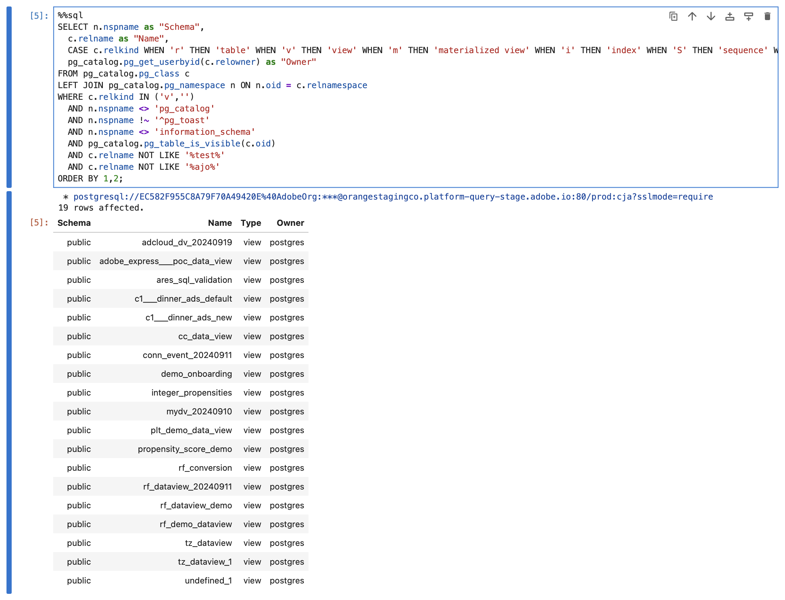

# Verbinding maken en valideren


Met deze gebruiksaanwijzing stelt u de verbinding van het gereedschap BI naar Customer Journey Analytics in, geeft u de beschikbare gegevensweergaven weer en selecteert u een gegevensweergave die u wilt gebruiken.

+++ Customer Journey Analytics

De instructies verwijzen naar een voorbeeldomgeving met de volgende objecten:

* Gegevensweergave: **[!UICONTROL C&C - Data View]** 🅐 .
* Dimensies: **[!UICONTROL Product Name]** 🅑 en **[!UICONTROL Product Category]** 🅒 .
* Metrisch: **[!UICONTROL Purchase Revenue]** 🅓 en **[!UICONTROL Purchases]** 🅔 .
* Filter: **[!UICONTROL Fishing Products]** 🅕 .


Wanneer u de gebruiksgevallen doorloopt, vervangt u deze voorbeeldobjecten door objecten die geschikt zijn voor uw specifieke omgeving.

+++

+++ BI-gereedschappen

>[!BEGINTABS]

>[!TAB  Desktop van Power BI ]

1. Open de vereiste referenties en parameters via de gebruikersinterface van de Experience Platform Query Service.

   1. Navigeer naar uw Experience Platform-sandbox.
   1. Selecteer  **[!UICONTROL Queries]** van het linkerspoor.
   1. Selecteer de tab **[!UICONTROL Credentials]** in de interface van **[!UICONTROL Queries]** .
   1. Selecteer `prod:cja` in de vervolgkeuzelijst **[!UICONTROL Database]** .

      

1. Start Power BI Desktop.
   1. Selecteer **[!UICONTROL Get data from other sources]** in de hoofdinterface.
   1. In het dialoogvenster **[!UICONTROL Get Data]** :
      
      1. Zoek en selecteer **[!UICONTROL PostgreSQL database]** .
      1. Selecteer **[!UICONTROL Connect]**.
   1. In het dialoogvenster **[!UICONTROL PostgreSQL database]** :
      
      1. Gebruik  om de **[!UICONTROL Host]** en **[!UICONTROL Port]** waarden van het paneel van Experience Platform **[!UICONTROL Query]** te kopiëren en te kleven **[!UICONTROL Expiring Credentials]**, die door `:` als waarde voor **[!UICONTROL Server]** wordt gescheiden. Bijvoorbeeld: `examplecompany.platform-query.adobe.io:80` .
      1. Gebruik  om de **[!UICONTROL Database]** waarde van het Experience Platform **[!UICONTROL Query]** **[!UICONTROL Expiring Credentials]** paneel te kopiëren en te kleven. Voeg `?FLATTEN` toe aan de waarde die u plakt. Bijvoorbeeld `prod:cja?FLATTEN` .
      1. Selecteer **[!UICONTROL DirectQuery]** als de **[!UICONTROL Data connectivity mode]** .
      1. Selecteer **[!UICONTROL OK]**.
   1. In het dialoogvenster **[!UICONTROL PostgreSQL database]** - **[!UICONTROL Database]** :
      
      1. Gebruik  om de **[!UICONTROL Username]** en **[!UICONTROL Password]** waarden van het Experience Platform **[!UICONTROL Query]** te kopiëren **[!UICONTROL Expiring Credentials]** paneel in **[!UICONTROL User name]** en **[!UICONTROL Password]** gebieden. Als u a [ niet-uitbreidende credentie ](https://experienceleague.adobe.com/en/docs/experience-platform/query/ui/credentials?lang=en#use-credential-to-connect) gebruikt, gebruik het wachtwoord van uw niet-uitbreidende referentie.
      1. Zorg ervoor dat het vervolgkeuzemenu voor **[!UICONTROL Select which level to apply these settings to]** is ingesteld op de **[!UICONTROL Server]** die u eerder hebt gedefinieerd.
      1. Selecteer **[!UICONTROL Connect]**.
   1. In het dialoogvenster **[!UICONTROL Navigator]** worden de gegevensweergaven opgehaald. Dit kan enige tijd duren. Zodra teruggewonnen, ziet u het volgende in de Desktop van Power BI.
      
      1. Selecteer **[!UICONTROL public.cc_data_view]** in de lijst in het linkerdeelvenster.
      1. U hebt twee opties:
         1. Selecteer **[!UICONTROL Load]** om door te gaan en de installatie te voltooien.
         1. Selecteer **[!UICONTROL Transform Data]** . Er wordt een dialoogvenster weergegeven waarin u desgewenst transformaties kunt toepassen als onderdeel van de configuratie.
            
            * Selecteer **[!UICONTROL Close & Apply]**.
   1. Na enige tijd wordt **[!UICONTROL public.cc_data_view]** weergegeven in het deelvenster **[!UICONTROL Data]** . Selecteer  om afmetingen en metriek te tonen.
      


## Naar FLATTEN of niet

Power BI Desktop ondersteunt de volgende scenario&#39;s voor de parameter `FLATTEN` . Zie [ genestelde gegevens ](https://experienceleague.adobe.com/en/docs/experience-platform/query/key-concepts/flatten-nested-data) voor meer informatie afvlakken.

| FLATTEN, parameter | Voorbeeld | Ondersteund | Opmerkingen |
|---|---|:---:|---|
| Geen | `prod:cja` |  | |
| `?FLATTEN` | `prod:cja?FLATTEN` |  | **geadviseerde optie om te gebruiken!** |
| `%3FFLATTEN` | `prod:cja%3FFLATTEN` |  | Fout in weergave Power BI Desktop: **[!UICONTROL We couldn't authenticate with the credentials provided. Please try again.]** |

### Meer informatie

* [Vereisten](/help/data-views/bi-extension.md#prerequisites)
* [ gids van Geloofsbrieven ](https://experienceleague.adobe.com/en/docs/experience-platform/query/ui/credentials)
* [ verbind Power BI met de Dienst van de Vraag ](https://experienceleague.adobe.com/en/docs/experience-platform/query/clients/power-bi).


>[!TAB  Desktop Tableau ]

1. Open de vereiste referenties en parameters via de gebruikersinterface van de Experience Platform Query Service.

   1. Navigeer naar uw Experience Platform-sandbox.
   1. Selecteer  **[!UICONTROL Queries]** van het linkerspoor.
   1. Selecteer de tab **[!UICONTROL Credentials]** in de interface van **[!UICONTROL Queries]** .
   1. Selecteer `prod:cja` in de vervolgkeuzelijst **[!UICONTROL Database]** .

      

1. Start Tableau.
   1. Selecteer **[!UICONTROL PostgreSQL]** in de linkertrack onder **[!UICONTROL To a Server]** . Als deze optie niet beschikbaar is, selecteert u **[!UICONTROL More...]** en selecteert u **[!UICONTROL PostgreSQL]** in het menu **[!UICONTROL Installed Connectors]** .
      
   1. Ga in het dialoogvenster **[!UICONTROL PostgreSQL]** op het tabblad **[!UICONTROL General]** naar:
      
      1. Gebruik  om **[!UICONTROL Host]** van het paneel van Experience Platform **[!UICONTROL Query]** te kopiëren en te kleven **[!UICONTROL Expiring Credentials]** aan **[!UICONTROL Server]**.
      1. Gebruik  om **[!UICONTROL Port]** van het paneel van Experience Platform **[!UICONTROL Query]** te kopiëren en te kleven **[!UICONTROL Expiring Credentials]** aan **[!UICONTROL Port]**.
      1. Gebruik  om **[!UICONTROL Database]** van het paneel van Experience Platform **[!UICONTROL Query]** te kopiëren en te kleven **[!UICONTROL Expiring Credentials]** aan **[!UICONTROL Database]**. Voeg `%3FFLATTEN` toe aan de waarde die u plakt. Bijvoorbeeld: `prod:cja%3FFLATTEN` .
      1. Selecteer **[!UICONTROL Username and Password]** in de vervolgkeuzelijst **[!UICONTROL Authentication]** .
      1. Gebruik  om **[!UICONTROL Username]** van het paneel van Experience Platform **[!UICONTROL Query]** te kopiëren en te kleven **[!UICONTROL Expiring Credentials]** aan **[!UICONTROL Username]**.
      1. Gebruik  om **[!UICONTROL Password]** van het paneel van Experience Platform **[!UICONTROL Query]** te kopiëren en te kleven **[!UICONTROL Expiring Credentials]** aan **[!UICONTROL Password]**. Als u a [ niet-uitbreidende credentie ](https://experienceleague.adobe.com/en/docs/experience-platform/query/ui/credentials?lang=en#use-credential-to-connect) gebruikt, gebruik het wachtwoord van uw niet-uitbreidende referentie.
      1. Controleer of **[!UICONTROL Require SSL]** is ingeschakeld.
      1. Selecteer **[!UICONTROL Sign In]**.

      U ziet een dialoogvenster **[!UICONTROL Progressing Request]** terwijl Tableau Desktop de verbinding valideert.
   1. In het hoofdvenster ziet u op de pagina **[!UICONTROL Data Source]** in het linkervenster:
      * De naam van de verbinding, onder **[!UICONTROL Connections]** .
      * De naam van de database, onder **[!UICONTROL Database]** .
      * Een lijst met tabellen, onder **[!UICONTROL Table]** .
        
      1. Sleep het item **[!UICONTROL cc_data_view]** en zet het neer in de hoofdweergave die **[!UICONTROL Drag tables]** hier leest.
   1. In het hoofdvenster worden de details van de gegevensweergave van **[!UICONTROL cc_data_view]** weergegeven.
      

## Naar FLATTEN of niet

Tableau Desktop ondersteunt de volgende scenario&#39;s voor de parameter `FLATTEN` . Zie [ genestelde gegevens ](https://experienceleague.adobe.com/en/docs/experience-platform/query/key-concepts/flatten-nested-data) voor meer informatie afvlakken.

| FLATTEN, parameter | Voorbeeld | Ondersteund | Opmerkingen |
|---|---|:---:|---|
| Geen | `prod:cja` |  | |
| `?FLATTEN` | `prod:cja?FLATTEN` |  | |
| `%3FFLATTEN` | `prod:cja%3FFLATTEN` |  | **geadviseerde optie om** te gebruiken. Opmerking: `%3FFLATTEN` is een URL-gecodeerde versie van `?FLATTEN` . |

## Meer informatie

* [Vereisten](/help/data-views/bi-extension.md#prerequisites)
* [ gids van Geloofsbrieven ](https://experienceleague.adobe.com/en/docs/experience-platform/query/ui/credentials)
* [ verbind de Desktop van Tableau aan de Dienst van de Vraag ](https://experienceleague.adobe.com/en/docs/experience-platform/query/clients/tableau).


>[!TAB  Leider ]

1. Open de vereiste referenties en parameters via de gebruikersinterface van de Experience Platform Query Service.

   1. Navigeer naar uw Experience Platform-sandbox.
   1. Selecteer  **[!UICONTROL Queries]** van het linkerspoor.
   1. Selecteer de tab **[!UICONTROL Credentials]** in de interface van **[!UICONTROL Queries]** .
   1. Selecteer `prod:cja` in de vervolgkeuzelijst **[!UICONTROL Database]** .

      

1. Aanmelden bij Looker

   1. Selecteer **[!UICONTROL Admin]** in het linkerspoor.
   1. Selecteer **[!UICONTROL Connections]**.
   1. Selecteer **[!UICONTROL Add Connection]**.
   1. In de lus **[!UICONTROL Connect your database to Looker screen]** .

      

      1. Voer een **[!UICONTROL Name]** in voor uw verbinding, bijvoorbeeld `Example Looker Connection` .
      1. Zorg ervoor dat **[!UICONTROL All Projects]** is geselecteerd als de **[!UICONTROL Connection Scope]** .
      1. Selecteer **[!UICONTROL PostgreSQL 9.5+]** als Dialect.
      1. Gebruik  om de **[!UICONTROL Host]** waarde van het paneel van Experience Platform **[!UICONTROL Query]** te kopiëren en te kleven **[!UICONTROL Expiring Credentials]**, als waarde voor **[!UICONTROL Host]**. Bijvoorbeeld: `examplecompany.platform-query.adobe.io` .
      1. Gebruik  om de **[!UICONTROL Port]** waarde van het paneel van Experience Platform **[!UICONTROL Query]** te kopiëren en te kleven **[!UICONTROL Expiring Credentials]**, als waarde voor **[!UICONTROL Port]**. Bijvoorbeeld: `80` .
      1. Gebruik  om de **[!UICONTROL Database]** waarde van het Experience Platform **[!UICONTROL Query]** **[!UICONTROL Expiring Credentials]** paneel als waarde voor **[!UICONTROL Database]** te kopiëren en te kleven. Voeg `%3FFLATTEN` toe aan de waarde die u plakt. Bijvoorbeeld `prod:cja%3FFLATTEN` .
      1. Gebruik  om de **[!UICONTROL Username]** waarde van het Experience Platform **[!UICONTROL Query]** **[!UICONTROL Expiring Credentials]** paneel als waarde voor **[!UICONTROL Username]** te kopiëren en te kleven.
      1. Gebruik  om de **[!UICONTROL Password]** waarde van het Experience Platform **[!UICONTROL Query]** **[!UICONTROL Expiring Credentials]** paneel als waarde voor **[!UICONTROL Password]** te kopiëren en te kleven.
      1. Selecteer **[!UICONTROL Expand all]** bij **[!UICONTROL Optional Settings]** .
      1. Stel **[!UICONTROL Max connections]** per knooppunt in op `5` .
      1. Controleer of **[!UICONTROL SSL]** is ingeschakeld.
      1. Selecteer **[!UICONTROL Test]** om de verbinding te testen. U ziet dat een banner boven aan het scherm wordt weergegeven met een bericht als **[!UICONTROL Success, can connect JDBC ....]** .
      1. Selecteer **[!UICONTROL Connect]** om de verbinding tot stand te brengen en op te slaan.
   1. De nieuwe verbinding wordt weergegeven in de interface **[!UICONTROL Connections]** .
   1. Selecteer **←** in **[!UICONTROL Admin]** om naar de hoofdnavigatie in de linkertrack te gaan.
   1. Selecteer **[!UICONTROL Develop]**.
   1. Selecteer **[!UICONTROL Projects]**.
   1. Selecteer **[!UICONTROL New Model]** in projecten LookML.
   1. Om ervoor te zorgen dat u geen invloed hebt op andere gebruikers. Selecteer Modus voor ontwikkeling openen als u hierom wordt gevraagd.
   1. In de **[!UICONTROL Create Model]** -ervaring:
      1. In **[!UICONTROL ➊ Select Database Connection]**:
         1. Selecteer uw databaseverbinding in **[!UICONTROL Select database connection]** . Bijvoorbeeld: **[!UICONTROL example_looker_connection]** .
         1. Geef uw project een naam in **[!UICONTROL Create a new LookML Project for this model]** . Voor `example: example_looker_project` .
         1. Selecteer **[!UICONTROL Next]**.
      1. In **[!UICONTROL ➋ Select Tables]**:
         1. Selecteer **[!UICONTROL public]** en zorg ervoor dat de Customer Journey Analytics-gegevensweergave is geselecteerd. Bijvoorbeeld:  **[!UICONTROL cc_data_view]**.
         1. Selecteer **[!UICONTROL Next]**.
      1. In **[!UICONTROL ➌ Select Primary Keys]**:
         1. Selecteer **[!UICONTROL Next]**.
      1. In **[!UICONTROL ➍ Select Explores to Create]**:
         1. Zorg ervoor dat u de weergave selecteert. Bijvoorbeeld: **[!UICONTROL cc_data_view.view]** .
         1. Selecteer **[!UICONTROL Next]**.
      1. In **[!UICONTROL ➎ Enter Model Name]**:
         1. Geef het model een naam. Bijvoorbeeld: `example_looker_model` .
      1. Selecteer **[!UICONTROL Complete and Explore Data]**.

   U wordt omgeleid naar de **[!UICONTROL Explore]** interface van Looker, klaar om de gegevens te onderzoeken.


## Naar FLATTEN of niet

De markering ondersteunt de volgende scenario&#39;s voor de parameter `FLATTEN` . Zie [ genestelde gegevens ](https://experienceleague.adobe.com/en/docs/experience-platform/query/key-concepts/flatten-nested-data) voor meer informatie afvlakken.

| FLATTEN, parameter | Voorbeeld | Ondersteund | Opmerkingen |
|---|---|:---:|---|
| Geen | `prod:cja` |  | |
| `?FLATTEN` | `prod:cja?FLATTEN` |  | |
| `%3FFLATTEN` | `prod:cja%3FFLATTEN` |  | **geadviseerde optie om** te gebruiken. Opmerking: `%3FFLATTEN` is een URL-gecodeerde versie van `?FLATTEN` . |

## Meer informatie

* [Vereisten](/help/data-views/bi-extension.md#prerequisites)
* [ gids van Geloofsbrieven ](https://experienceleague.adobe.com/en/docs/experience-platform/query/ui/credentials)


>[!TAB  Jupyter Notitieboekje ]

1. Open de vereiste referenties en parameters via de gebruikersinterface van de Experience Platform Query Service.

   1. Navigeer naar uw Experience Platform-sandbox.
   1. Selecteer  **[!UICONTROL Queries]** van het linkerspoor.
   1. Selecteer de tab **[!UICONTROL Credentials]** in de interface van **[!UICONTROL Queries]** .
   1. Selecteer `prod:cja` in de vervolgkeuzelijst **[!UICONTROL Database]** .

      

1. Zorg ervoor dat u een speciale virtuele Python-omgeving hebt ingesteld voor het uitvoeren van uw Jupyter-laptopomgeving.
1. Controleer of u de vereiste bibliotheken in uw virtuele omgeving hebt geïnstalleerd:
   * ipython-sql: `pip install ipython-sql`.
   * psycopg2-binary: `pip install psycopg-binary`.
   * sqlalchemy: pip `install sqlalchemy` .

1. Start Jupyter-laptop vanuit uw virtuele omgeving: `jupyter notebook` .
1. Creeer een nieuwe notitieboekje, of download [ deze steekproefnotitieboekje ](../assets/BI-Extension.ipynb.zip).
1. Voer in de eerste cel de volgende gegevens in en voer deze uit:

   ```
   %config SqlMagic.style = '_DEPRECATED_DEFAULT'
   ```

1. In een nieuwe cel, ga de config parameters voor uw verbinding in. Gebruik  om waarden van het Experience Platform **[!UICONTROL Query]** **[!UICONTROL Expiring Credentials]** paneel aan de waarden te kopiëren en te kleven die voor de config parameters worden vereist. Bijvoorbeeld:

   ```
   import ipywidgets as widgets
   from IPython.display import display
   
   config_host = widgets.Text(description='Host:', value='example.platform-query-stage.adobe.io',
                           layout=widgets.Layout(width="600px"))
   display(config_host)
   config_port = widgets.IntText(description='Port:', value=80,
                              layout=widgets.Layout(width="200px"))
   display(config_port)
   config_db = widgets.Text(description='Database:', value='prod:cja',
                         layout=widgets.Layout(width="300px"))
   display(config_db)
   config_username = widgets.Text(description='Username:', value='EC582F955C8A79F70A49420E@AdobeOrg',
                               layout=widgets.Layout(width="600px"))
   display(config_username)
   config_password = widgets.Password(description='Password:', value='***',
                                   layout=widgets.Layout(width="600px"))
   display(config_password)
   ```

1. Voer de cel uit.
1. Gebruik  om het wachtwoord van het Experience Platform **[!UICONTROL Query]** te kopiëren en te kleven **[!UICONTROL Expiring Credentials]** paneel aan het **[!UICONTROL Password]** gebied in Jupyter Notitieboekje.

   

1. Voer in een nieuwe cel de instructies in om de SQL-extensie, de vereiste bibliotheek en de verbinding met Customer Journey Analytics te laden.

   ```python
   %load_ext sql
   from sqlalchemy import create_engine
   %sql postgresql://{config_username.value}:{config_password.value}@{config_host.value}:{config_port.value}/{config_db.value}?sslmode=require
   ```

   Voer de shell uit. Er wordt geen uitvoer weergegeven, maar de cel moet zonder waarschuwing worden uitgevoerd.

   

1. In een nieuwe vraag, ga de verklaringen in om een lijst van beschikbare gegevensmeningen te krijgen die op de verbinding worden gebaseerd.

   ```python
   %%sql
   SELECT n.nspname as "Schema",
      c.relname as "Name",
      CASE c.relkind WHEN 'r' THEN 'table' WHEN 'v' THEN 'view' WHEN 'm' THEN 'materialized view' WHEN 'i' THEN 'index' WHEN 'S' THEN 'sequence' WHEN 's' THEN 'special' WHEN 't' THEN 'TOAST table' WHEN 'f' THEN 'foreign table' WHEN 'p' THEN 'partitioned table' WHEN 'I' THEN 'partitioned index' END as "Type",
      pg_catalog.pg_get_userbyid(c.relowner) as "Owner"
   FROM pg_catalog.pg_class c
   LEFT JOIN pg_catalog.pg_namespace n ON n.oid = c.relnamespace
   WHERE c.relkind IN ('v','')
      AND n.nspname <> 'pg_catalog'
      AND n.nspname !~ '^pg_toast'
      AND n.nspname <> 'information_schema'
      AND pg_catalog.pg_table_is_visible(c.oid)
      AND c.relname NOT LIKE '%test%'
      AND c.relname NOT LIKE '%ajo%'
   ORDER BY 1,2;
   ```

   Voer de shell uit. U zou uitvoersimulator aan het hieronder opgenomen schermschot moeten zien.

   

   De **[!UICONTROL cc_data_view]** wordt weergegeven in de lijst met gegevensweergaven.

## Naar FLATTEN of niet

Jupyter-laptop ondersteunt de volgende scenario&#39;s voor de parameter `FLATTEN` . Zie [ genestelde gegevens ](https://experienceleague.adobe.com/en/docs/experience-platform/query/key-concepts/flatten-nested-data) voor meer informatie afvlakken.

| FLATTEN, parameter | Voorbeeld | Ondersteund | Opmerkingen |
|---|---|:---:|---|
| Geen | `prod:cja` |  | |
| `?FLATTEN` | `prod:cja?FLATTEN` |  | |
| `%3FFLATTEN` | `prod:cja%3FFLATTEN` |  | **geadviseerde optie om** te gebruiken. Opmerking: `%3FFLATTEN` is een URL-gecodeerde versie van `?FLATTEN` . |

## Meer informatie

* [Vereisten](/help/data-views/bi-extension.md#prerequisites)
* [ gids van Geloofsbrieven ](https://experienceleague.adobe.com/en/docs/experience-platform/query/ui/credentials)

>[!TAB  RStudio ]

1. Open de vereiste referenties en parameters via de gebruikersinterface van de Experience Platform Query Service.

   1. Navigeer naar uw Experience Platform-sandbox.
   1. Selecteer  **[!UICONTROL Queries]** van het linkerspoor.
   1. Selecteer de tab **[!UICONTROL Credentials]** in de interface van **[!UICONTROL Queries]** .
   1. Selecteer `prod:cja` in de vervolgkeuzelijst **[!UICONTROL Database]** .

      

1. Start RStudio.
1. Creeer een nieuw dossier van de Markering R, of download [ dit voorbeeld of markeringsdossier ](../assets/BI-Extension.Rmd.zip).
1. Voer in het eerste segment de volgende instructies in tussen ` ```{r} ` en ` ``` ` . Gebruik  om waarden van het Experience Platform **[!UICONTROL Query]** **[!UICONTROL Expiring Credentials]** paneel aan de waarden te kopiëren en te kleven die voor de diverse parameters, zoals `host` worden vereist, `dbname`, en `user`. Bijvoorbeeld:

   ```R
   library(rstudioapi)
   library(DBI)
   library(dplyr)
   library(tidyr)
   library(RPostgres)
   library(ggplot2)
   
   host <- rstudioapi::showPrompt(title = "Host", message = "Host", default = "orangestagingco.platform-query-stage.adobe.io")
   dbname <- rstudioapi::showPrompt(title = "Database", message = "Database", default = "prod:cja?FLATTEN")
   user <- rstudioapi::showPrompt(title = "Username", message = "Username", default = "EC582F955C8A79F70A49420E@AdobeOrg")
   password <- rstudioapi::askForPassword(prompt = "Password")
   ```

1. Voer het segment uit. U wordt gevraagd om **[!UICONTROL Host]** , **[!UICONTROL Database]** en **[!UICONTROL User]** . Accepteer gewoon de waarden die u hebt opgegeven als onderdeel van de vorige stap.
1. Gebruik  om het wachtwoord van het Experience Platform **[!UICONTROL Query]** **[!UICONTROL Expiring Credentials]** paneel aan de **[!UICONTROL Password]** dialoogherinnering in RStudio te kopiëren en te kleven.

   

1. Maak een nieuw segment en voer de volgende instructies in tussen ` ``` {r} ` en ` ``` ` .

   ```R
   con <- dbConnect(
      RPostgres::Postgres(),
      host = host,
      port = 80,
      dbname = dbname,
      user = user,
      password = password,
      sslmode = 'require'
   )
   ```

1. Voer het segment uit. Er wordt geen uitvoer weergegeven als de verbinding is gelukt.


1. Maak een nieuw segment en voer de volgende instructies in tussen ` ``` {r} ` en ` ``` ` .

   ```R
   views <- dbListTables(con)
   print(views)
   ```

1. Voer het segment uit. U moet `character(0)` zien als de enige uitvoer.


1. Maak een nieuw segment en voer de volgende instructies in tussen ` ``` {r} ` en ` ``` ` .

   ```R
   glimpse(dv)
   ```

1. Voer het segment uit. U zou uitvoersimulator aan het hieronder opgenomen schermschot moeten zien.

   

## Naar FLATTEN of niet

RStudio ondersteunt de volgende scenario&#39;s voor de parameter `FLATTEN` . Zie [ genestelde gegevens ](https://experienceleague.adobe.com/en/docs/experience-platform/query/key-concepts/flatten-nested-data) voor meer informatie afvlakken.

| FLATTEN, parameter | Voorbeeld | Ondersteund | Opmerkingen |
|---|---|:---:|---|
| Geen | `prod:cja` |  | |
| `?FLATTEN` | `prod:cja?FLATTEN` |  | **geadviseerde optie om** te gebruiken. |
| `%3FFLATTEN` | `prod:cja%3FFLATTEN` |  | |

## Meer informatie

* [Vereisten](/help/data-views/bi-extension.md#prerequisites)
* [ gids van Geloofsbrieven ](https://experienceleague.adobe.com/en/docs/experience-platform/query/ui/credentials)

>[!ENDTABS]

+++
