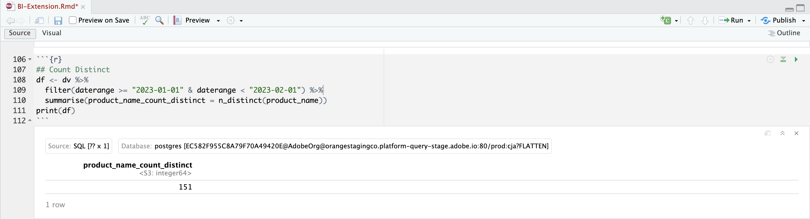

# Afmetingen van verschillende waarden tellen


In dit geval wilt u het duidelijke aantal productnamen ophalen waarop in januari 2023 is gerapporteerd.

+++ Customer Journey Analytics

Als u een duidelijke telling van productnamen wilt rapporteren, stelt u in Customer Journey Analytics een berekende metrische waarde in met **[!UICONTROL Title]** `Product Name (Count Distinct)` en **[!UICONTROL External Id]** `product_name_count_distinct` .


Vervolgens kunt u die metrische waarde gebruiken in een voorbeeldvenster van **[!UICONTROL Count Distinct Dimension Values]** voor het gebruik van hoofdletters en kleine letters:


+++

+++ BI-gereedschappen

>[!PREREQUISITES]
>
>Verzeker u [&#x200B; een succesvolle verbinding, gegevensmeningen, en gebruik een gegevensmening &#x200B;](connect-and-validate.md) voor het hulpmiddel van BI hebt bevestigd waarvoor u dit gebruiksgeval wilt uitproberen.
>

>[!BEGINTABS]

>[!TAB  Desktop van Power BI ]

1. Sleep **[!UICONTROL daterangeday]** van het deelvenster **[!UICONTROL Data]** aan **[!UICONTROL Filters]** op deze pagina om ervoor te zorgen dat het datumbereik van toepassing is op alle visualisaties.
   1. Selecteer de **[!UICONTROL daterangeday is (All)]** van **[!UICONTROL Filters on this page]**.
   1. Selecteer **[!UICONTROL Advanced filtering]** als de **[!UICONTROL Filter type]** .
   1. Definieer het filter naar **[!UICONTROL Show items when the value]** **[!UICONTROL is on or after]** `1/1/2023` **[!UICONTROL And]** **[!UICONTROL is before]** `2/1/2023` .
   1. Selecteer **[!UICONTROL Apply filter]**.

1. In het deelvenster **[!UICONTROL Data]** :
   1. Selecteer **[!UICONTROL datarangeday]**.
   1. Selecteer **[!UICONTROL sum cm_product_name_count_distinct]** . Dit is de berekende metrische waarde die in Customer Journey Analytics is gedefinieerd.

1. Als u het verticale staafdiagram wilt wijzigen in een tabel, zorgt u ervoor dat het diagram is geselecteerd en selecteert u **[!UICONTROL Table]** in het deelvenster **[!UICONTROL Visualizations]** .

   Je Power BI Desktop moet er hieronder uitzien.

   

1. Selecteer de tabelvisualisatie. Selecteer **[!UICONTROL Copy]** > **[!UICONTROL Copy visual]** in het contextmenu.
1. Plak de visualisatie met **[!UICONTROL ctrl-v]** . De exacte kopie van de visualisatie overlapt de originele versie. Verplaats het naar rechts in het rapportgebied.
1. Selecteer **[!UICONTROL Card]** in **[!UICONTROL Visualizations]** om de gekopieerde visualisatie van een tabel naar een kaart te wijzigen.

   Je Power BI Desktop moet er hieronder uitzien.

   

U kunt ook de functie Telling gebruiken, die anders is dan Power BI.

1. Selecteer de **[!UICONTROL product_name]** -dimensie.
1. Pas de functie **[!UICONTROL Count (Distinct)]** toe op de **[!UICONTROL product_name]** dimensie in **[!UICONTROL Columns]** .

   


>[!TAB  Desktop Tableau ]

1. Selecteer de tab **[!UICONTROL Sheet 1]** onderaan om te schakelen van **[!UICONTROL Data source]** . In de weergave **[!UICONTROL Sheet 1]** :
   1. Sleep de vermelding **[!UICONTROL Daterange]** uit de lijst **[!UICONTROL Tables]** in het deelvenster **[!UICONTROL Data]** en zet deze op de **[!UICONTROL Filters]** shelf neer.
   1. Selecteer **[!UICONTROL Filter Field \[Daterange\]]** in het dialoogvenster **[!UICONTROL Range of Dates]** van **[!UICONTROL Next >]** .
   1. Selecteer **[!UICONTROL Filter \[Daterange\]]** in het dialoogvenster **[!UICONTROL Range of dates]** en selecteer `01/01/2023` - `31/1/2023` . Selecteer **[!UICONTROL Apply]** en **[!UICONTROL OK]** .
   1. Sleep **[!UICONTROL Cm Product Name Count Distinct]** naar **[!UICONTROL Rows]** . De waarde verandert in **[!UICONTROL SUM(Cm Product Name Count Distinct)]** . Dit veld is de berekende maateenheid die u in Customer Journey Analytics hebt gedefinieerd.
   1. Sleep **[!UICONTROL Daterangeday]** en zet de muisknop los naast **[!UICONTROL Columns]** . Selecteer **[!UICONTROL Daterangeday]** en selecteer **[!UICONTROL Day]** in de vervolgkeuzelijst.
   1. Als u de lijnvisualisatie wilt wijzigen in een tabel, selecteert u **[!UICONTROL Text Table]** in **[!UICONTROL Show Me]** .
   1. Selecteer **[!UICONTROL Swap Rows and Columns]** op de werkbalk.
   1. Selecteer **[!UICONTROL Fit Width]** in de vervolgkeuzelijst **[!UICONTROL Fit]** .

      Uw Tableau Desktop moet er hieronder uitzien.

      

1. Selecteer **[!UICONTROL Duplicate]** in het contextmenu van de tab **[!UICONTROL Sheet 1]** om een tweede blad te maken.
1. Selecteer **[!UICONTROL Rename]** in het contextmenu van de tab **[!UICONTROL Sheet 1]** om de naam van het werkblad te wijzigen in `Data` .
1. Selecteer **[!UICONTROL Rename]** in het contextmenu van de tab **[!UICONTROL Sheet 1 (2)]** om de naam van het werkblad te wijzigen in `Card` .

1. Controleer of u de weergave **[!UICONTROL Card]** hebt geselecteerd.
1. Selecteer **[!UICONTROL DAY(Daterangeday)]** en selecteer **[!UICONTROL Month]** in de vervolgkeuzelijst. De waarde verandert in **[!UICONTROL MONTH(Daterangeday)]** .
1. Selecteer **[!UICONTROL SUM(Cm Product Name Count Distinct)]** in **[!UICONTROL Marks]** en selecteer **[!UICONTROL Format]** in de vervolgkeuzelijst.
1. Als u de tekengrootte wilt wijzigen, selecteert u in het deelvenster **[!UICONTROL Format SUM(CM Product Name Count Distinct)]** de optie **[!UICONTROL Font]** within **[!UICONTROL Default]** en selecteert u **[!UICONTROL 72]** voor de tekengrootte.
1. Als u het getal wilt uitlijnen, selecteert u **[!UICONTROL Automatic]** naast **[!UICONTROL Alignment]** en stelt u **[!UICONTROL Horizontal]** in op gecentreerd.
1. Als u hele getallen wilt gebruiken, selecteert u **[!UICONTROL 123.456]** naast **[!UICONTROL Numbers]** en selecteert u **[!UICONTROL Number (Custom)]** . Stel **[!UICONTROL Decimal places]** in op `0` .

   Uw Tableau Desktop moet er hieronder uitzien.

   

1. Selecteer **[!UICONTROL New Dashboard]** tabknop (onder) om een nieuwe **[!UICONTROL Dashboard 1]** -weergave te maken. In de weergave **[!UICONTROL Dashboard 1]** :
   1. Sleep en laat vallen het **[!UICONTROL Card]** blad van **[!UICONTROL Sheets]** plank op de **[!UICONTROL Dashboard 1]** mening die *Dropbladen hier* leest.
   1. Sleep het **[!UICONTROL Data]** -werkblad vanuit de **[!UICONTROL Sheets]** -plank onder het **[!UICONTROL Card]** -werkblad in de **[!UICONTROL Dashboard 1]** -weergave.

   De weergave **[!UICONTROL Dashboard 1]** ziet er hieronder ongeveer zo uit.

   


Alternatief, kunt u de telling verschillende functionaliteit van Desktop gebruiken Tableau.

1. Gebruik **[!UICONTROL Product Name]** in plaats van **[!UICONTROL Cm Product Name Count Distinct]** .
1. Pas **[!UICONTROL Measure]** > **[!UICONTROL Count (Distinct)]** on **[!UICONTROL Product Name]** toe in **[!UICONTROL Marks]** .

   


>[!TAB  Leider ]

1. Zorg ervoor dat u in de interface **[!UICONTROL Explore]** van Looker een schone instelling hebt. Als niet, uitgezochte  **[!UICONTROL Remove fields and filters]**.
1. Selecteer **[!UICONTROL + Filter]** onder **[!UICONTROL Filters]** .
1. In het dialoogvenster **[!UICONTROL Add Filter]** :
   1. Selecteren **[!UICONTROL ‣ Cc Data View]**
   1. Selecteer **[!UICONTROL ‣ Daterange Date]** en vervolgens **[!UICONTROL Daterange Date]** in de lijst met velden.
      
1. Geef het filter **[!UICONTROL Cc Data View Daterange Date]** op als **[!UICONTROL is in range]** **[!UICONTROL 2023/01/01]** **[!UICONTROL until (before)]** **[!UICONTROL 2023/02/01]** .
1. Vanuit het gedeelte **[!UICONTROL ‣ Cc Data View]** in de linkertrack:
   1. Selecteer **[!UICONTROL Daterange Date]** en vervolgens **[!UICONTROL Date]** .
   1. Selecteer **[!UICONTROL Aggregate ‣ Count Distinct]** in het contextmenu **⋮ Meer** in **[!UICONTROL Product Name]** .
      
1. Selecteer **[!UICONTROL Run]**.
1. Selecteer **[!UICONTROL ‣ Visualization]** en selecteer 6︎⃣ op de werkbalk om één waardenvisualisatie weer te geven.

U dient een visualisatie en tabel te zien zoals hieronder weergegeven.


>[!TAB  Jupyter Notitieboekje ]

1. Voer de volgende instructies in een nieuwe cel in.

   ```
   data = %sql SELECT COUNT(DISTINCT(product_name)) AS `Product Name` \
      FROM cc_data_view \
      WHERE daterange BETWEEN '2023-01-01' AND '2023-02-01';
   display(data)
   ```

1. Voer de cel uit. U zou output moeten zien gelijkend op het hieronder opgenomen schermschot.

   


>[!TAB  RStudio ]

1. Voer de volgende instructies tussen ` ` ``{r} ` en ` `` ` ` in een nieuw segment in.

   ```R
   ## Count Distinct
   df <- dv %>%
      filter(daterange >= "2023-01-01" & daterange < "2023-02-01") %>%
      summarise(product_name_count_distinct = n_distinct(product_name))
   print(df)
   ```

1. Voer het segment uit. U zou output moeten zien gelijkend op het hieronder opgenomen schermschot.

   


>[!ENDTABS]

+++

