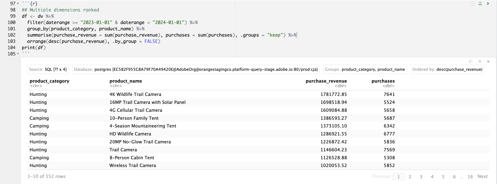

# Meerdere dimensies gerangschikt


In dit geval wilt u een tabel weergeven die de aankoopopbrengsten en -aankopen voor productnamen in productcategorieën opsplitst in 2023. Bovendien wilt u een aantal visualisaties gebruiken om zowel de distributie van de productcategorie als de bijdragen voor productnamen binnen elke productcategorie te illustreren.

+++ Customer Journey Analytics

Een voorbeeldvenster **[!UICONTROL Multiple Dimension Ranked]** voor het hoofdlettergebruik:


+++

+++ BI-gereedschappen

>[!PREREQUISITES]
>
>Verzeker u [ een succesvolle verbinding, gegevensmeningen, en gebruik een gegevensmening ](connect-and-validate.md) voor het hulpmiddel van BI hebt bevestigd waarvoor u dit gebruiksgeval wilt uitproberen.
>

>[!BEGINTABS]

>[!TAB  Desktop van Power BI ]

1. Sleep **[!UICONTROL daterangeday]** van het deelvenster **[!UICONTROL Data]** aan **[!UICONTROL Filters on this page]** om ervoor te zorgen dat het datumbereik van toepassing is op alle visualisaties.
   1. Selecteer de **[!UICONTROL daterangeday is (All)]** van **[!UICONTROL Filters on this page]**.
   1. Selecteer **[!UICONTROL Relative date]** als de **[!UICONTROL Filter type]** .
   1. Definieer het filter naar **[!UICONTROL Show items when the value]** **[!UICONTROL is in the last]** `1` **[!UICONTROL calendar years]** .
   1. Selecteer **[!UICONTROL Apply filter]**.

1. In het deelvenster **[!UICONTROL Data]** :
   1. Selecteer **[!UICONTROL datarangeday]**.
   1. Selecteer **[!UICONTROL product_category]**.
   1. Selecteer **[!UICONTROL product_name]**.
   1. Selecteren **[!UICONTROL sum purchase_revenue]**
   1. Selecteren **[!UICONTROL sum purchases]**

1. Als u het verticale staafdiagram wilt wijzigen in een tabel, zorgt u dat de tabel is geselecteerd en selecteert u **[!UICONTROL Matrix]** in het deelvenster **[!UICONTROL Visualizations]** .
   * Sleep **[!UICONTROL product_name]** vanuit **[!UICONTROL Columns]** en zet het veld onder **[!UICONTROL product_categor] **y neer in **[!UICONTROL Rows]** in het deelvenster **[!UICONTROL Visualization]** .

1. Selecteer **[!UICONTROL product_name is (All)]** in het deelvenster **[!UICONTROL Filters]** om het aantal weergegeven producten in de tabel te beperken.

   1. Selecteer **[!UICONTROL Advanced filtering]**.
   1. Selecteer **[!UICONTROL Filter type]** **[!UICONTROL Top N]** **[!UICONTROL Show items]** **[!UICONTROL Top]** `15` **[!UICONTROL By Value]** .
   1. Sleep **[!UICONTROL purchases]** vanuit het deelvenster **[!UICONTROL Data]** naar het deelvenster **[!UICONTROL Add data fields here]** .
   1. Selecteer **[!UICONTROL Apply filter]**.

1. Als u de leesbaarheid wilt verbeteren, selecteert u **[!UICONTROL View]** in het bovenste menu, selecteert u **[!UICONTROL Page View]** > **[!UICONTROL Actual size]** en wijzigt u de grootte van de tabelvisualisatie.

1. Selecteer **[!UICONTROL +]** op productcategorieniveau om elke categorie in de tabel op te splitsen. Je Power BI Desktop moet er hieronder uitzien.

   

1. Selecteer **[!UICONTROL Home]** in het bovenste menu en selecteer **[!UICONTROL New visual]** . Een nieuwe visuele wordt toegevoegd aan uw rapport.

1. In het deelvenster **[!UICONTROL Data]** :
   1. Selecteer **[!UICONTROL product_category]**.
   1. Selecteer **[!UICONTROL product_name]**.
   1. Selecteer **[!UICONTROL purchase_revenue]**.

1. Als u de visuele weergave wilt wijzigen, selecteert u het staafdiagram en selecteert u **[!UICONTROL Treemap]** in het deelvenster **[!UICONTROL Visualizations]** .
1. Zorg ervoor dat **[!UICONTROL product_category]** onder **[!UICONTROL Category]** en **[!UICONTROL product_name]** onder **[!UICONTROL Details]** in het deelvenster **[!UICONTROL Visualizations]** wordt weergegeven.

   Je Power BI Desktop moet er hieronder uitzien.

   

1. Selecteer **[!UICONTROL Home]** in het bovenste menu en selecteer **[!UICONTROL New visual]** . Een nieuwe visuele wordt toegevoegd aan uw rapport.

1. In het deelvenster **[!UICONTROL Data]** :
   1. Selecteer **[!UICONTROL product_category]**.
   1. Selecteer **[!UICONTROL purchase_revenue]**.
   1. Selecteer **[!UICONTROL purchase]**.

1. In het deelvenster **[!UICONTROL Visualizations]** :
   1. Selecteer **[!UICONTROL Line and stacked column chart]** als u de visualisatie wilt wijzigen.
   1. Sleep **[!UICONTROL sum_of_purchases]** van **[!UICONTROL Column y-axis]** naar **[!UICONTROL Line y-axis]** .

1. Wijzig in het rapport de volgorde van de afzonderlijke visualisaties.

   Je Power BI Desktop moet er hieronder uitzien.

   


>[!TAB  Desktop Tableau ]

1. Selecteer de tab **[!UICONTROL Sheet 1]** onderaan om te schakelen van **[!UICONTROL Data source]** . In de weergave **[!UICONTROL Sheet 1]** :
   1. Sleep de vermelding **[!UICONTROL Daterange]** uit de lijst **[!UICONTROL Tables]** in het deelvenster **[!UICONTROL Data]** en zet deze op de **[!UICONTROL Filters]** shelf neer.
   1. Selecteer **[!UICONTROL Filters Field \[Daterange\]]** in het dialoogvenster **[!UICONTROL Range of Dates]** van **[!UICONTROL Next >]** .
   1. Selecteer in het dialoogvenster **[!UICONTROL Filter \[Daterange\]]** de optie **[!UICONTROL Relative dates]** , selecteer **[!UICONTROL Years]** en geef **[!UICONTROL Previous year]** op. Selecteer **[!UICONTROL Apply]** en **[!UICONTROL OK]** .

      Uw Tableau Desktop moet er hieronder uitzien.

      

   1. Sleep **[!UICONTROL Product Category]** en zet de muisknop los naast **[!UICONTROL Columns]** .
   1. Sleep **[!UICONTROL Purchase Revenue]** en zet de muisknop los naast **[!UICONTROL Rows]** . De waarde verandert in **[!UICONTROL SUM(Purchase Revenue)]** .
   1. Sleep Aankopen en zet ze neer naast **[!UICONTROL Rows]** . De waarde verandert in **[!UICONTROL SUM(Purchases)]** .
   1. Selecteer **[!UICONTROL SUM(Purchases)]** en selecteer **[!UICONTROL Dual Axis]** in de vervolgkeuzelijst.
   1. Selecteer **[!UICONTROL SUM(Purchases)]** in **[!UICONTROL Marks]** en selecteer **[!UICONTROL Line]** in de vervolgkeuzelijst.
   1. Selecteer **[!UICONTROL SUM(Purchase Revenue)]** in **[!UICONTROL Marks]** en selecteer **[!UICONTROL Bar]** in de vervolgkeuzelijst.
   1. Selecteer **[!UICONTROL Entire View]** in het menu **[!UICONTROL Fit]** .
   1. Selecteer de titel **[!UICONTROL Purchase Revenue]** in het diagram en controleer of de aankoopopbrengsten oplopend zijn.

      Uw Tableau Desktop moet er hieronder uitzien.

      

1. Wijzig de naam van het huidige **[!UICONTROL Sheet 1]** blad in `Category` .
1. Selecteer **[!UICONTROL New Worksheet]** om een nieuw blad te maken en wijzig de naam in `Data` .

   1. Sleep de vermelding **[!UICONTROL Daterange]** uit de lijst **[!UICONTROL Tables]** in het deelvenster **[!UICONTROL Data]** en zet deze op de **[!UICONTROL Filters]** shelf neer.
   1. Selecteer **[!UICONTROL Filters Field \[Daterange\]]** in het dialoogvenster **[!UICONTROL Range of Dates]** van **[!UICONTROL Next >]** .
   1. Selecteer in het dialoogvenster **[!UICONTROL Filter \[Daterange\]]** de optie **[!UICONTROL Relative dates]** , selecteer **[!UICONTROL Years]** en geef **[!UICONTROL Previous year]** op. Selecteer **[!UICONTROL Apply]** en **[!UICONTROL OK]** .
   1. Sleep **[!UICONTROL Purchase Revenue]** van **[!UICONTROL Data]** deelvenster naar **[!UICONTROL Columns]** . De waarde verandert in **[!UICONTROL SUM(Purchase Revenue)]** .
   1. Sleep **[!UICONTROL Purchase]** van **[!UICONTROL Data]** deelvenster naar **[!UICONTROL Columns]** naast **[!UICONTROL Purchase Revenue]** . De waarde verandert in **[!UICONTROL SUM(Purchases)]** .
   1. Sleep **[!UICONTROL Product Category]** van het **[!UICONTROL Data]** deelvenster naar **[!UICONTROL Rows]** .
   1. Sleep **[!UICONTROL Product Name]** van het **[!UICONTROL Data]** deelvenster naar **[!UICONTROL Rows]** , naast **[!UICONTROL Product Category]** .
   1. Als u de twee horizontale balken in een tabel wilt wijzigen, selecteert u **[!UICONTROL Text Table]** in **[!UICONTROL Show Me]** .
   1. Selecteer **[!UICONTROL Purchases]** in **[!UICONTROL Measure Values]** om het aantal producten te beperken. Selecteer **[!UICONTROL Filter]** in het keuzemenu.
   1. Selecteer **[!UICONTROL Filter \[Purchases\]]** in het dialoogvenster **[!UICONTROL At least]** en voer `7000` in. Selecteer **[!UICONTROL Apply]** en **[!UICONTROL OK]** .
   1. Selecteer **[!UICONTROL Fit Width]** in de vervolgkeuzelijst **[!UICONTROL the]** Passend.

      Uw Tableau Desktop moet er hieronder uitzien.

      

1. Selecteer **[!UICONTROL New worksheet]** om een nieuw blad te maken en de naam ervan te wijzigen in **[!UICONTROL Treemap]** .
   1. Sleep de vermelding **[!UICONTROL Daterange]** uit de lijst **[!UICONTROL Tables]** in het deelvenster **[!UICONTROL Data]** en zet deze op de **[!UICONTROL Filters]** shelf neer.
   1. Selecteer **[!UICONTROL Filters Field \[Daterange\]]** in het dialoogvenster **[!UICONTROL Range of Dates]** van **[!UICONTROL Next >]** .
   1. Selecteer in het dialoogvenster **[!UICONTROL Filter \[Daterange\]]** de optie **[!UICONTROL Relative dates]** , selecteer **[!UICONTROL Years]** en geef **[!UICONTROL Previous year]** op. Selecteer **[!UICONTROL Apply]** en **[!UICONTROL OK]** .
   1. Sleep **[!UICONTROL Purchase Revenue]** van het **[!UICONTROL Data]** deelvenster naar **[!UICONTROL Rows]** . De waarden veranderen in **[!UICONTROL SUM(Purchase Revenue)]** .
   1. Sleep **[!UICONTROL Purchase]** van het **[!UICONTROL Data]** deelvenster naar **[!UICONTROL Rows]** , naast **[!UICONTROL Purchase Revenue]** . De waarde verandert in **[!UICONTROL SUM(Purchases)]** .
   1. Sleep **[!UICONTROL Product Category]** van het **[!UICONTROL Data]** deelvenster naar **[!UICONTROL Columns]** .
   1. Sleep **[!UICONTROL Product Name]** van het **[!UICONTROL Data]** deelvenster naar **[!UICONTROL Columns]** .
   1. Als u de twee verticale staafdiagrammen wilt wijzigen in een driehoek, selecteert u **[!UICONTROL Treemap]** in **[!UICONTROL Show Me]** .
   1. Selecteer **[!UICONTROL Purchases]** in **[!UICONTROL Measure Values]** om het aantal producten te beperken. Selecteer **[!UICONTROL Filter]** in het keuzemenu.
   1. Selecteer **[!UICONTROL Filter \[Purchases\]]** in het dialoogvenster **[!UICONTROL At least]** en voer `7000` in. Selecteer **[!UICONTROL Apply]** en **[!UICONTROL OK]** .
   1. Selecteer **[!UICONTROL Fit Width]** in de vervolgkeuzelijst **[!UICONTROL Fit]** .

      Uw Tableau Desktop moet er hieronder uitzien.

      

1. Selecteer **[!UICONTROL New Dashboard]** tabknop (onder) om een nieuwe **[!UICONTROL Dashboard 1]** -weergave te maken. In de weergave **[!UICONTROL Dashboard 1]** :
   1. Sleep en laat vallen het **[!UICONTROL Category]** blad van **[!UICONTROL Sheets]** plank op de **[!UICONTROL Dashboard 1]** mening die *Dropbladen hier* leest.
   1. Sleep het **[!UICONTROL Treemap]** -werkblad vanuit de **[!UICONTROL Sheets]** -plank onder het **[!UICONTROL Category]** -werkblad in de **[!UICONTROL Dashboard 1]** -weergave.
   1. Sleep het **[!UICONTROL Data]** -werkblad vanuit de **[!UICONTROL Sheets]** -plank onder het **[!UICONTROL Treemap]** -werkblad in de **[!UICONTROL Dashboard 1]** -weergave.
   1. Wijzig de grootte van elk blad in de weergave.

   De weergave **[!UICONTROL Dashboard 1]** ziet er hieronder ongeveer zo uit.

   


>[!TAB  Leider ]

1. Zorg ervoor dat u in de interface **[!UICONTROL Explore]** van Looker een schone instelling hebt. Als niet, uitgezochte  **[!UICONTROL Remove fields and filters]**.
1. Selecteer **[!UICONTROL + Filter]** onder **[!UICONTROL Filters]** .
1. In het dialoogvenster **[!UICONTROL Add Filter]** :
   1. Selecteren **[!UICONTROL ‣ Cc Data View]**
   1. Selecteer **[!UICONTROL ‣ Daterange Date]** en vervolgens **[!UICONTROL Daterange Date]** in de lijst met velden.
      
1. Geef het filter **[!UICONTROL Cc Data View Daterange Date]** op als **[!UICONTROL is in range]** **[!UICONTROL 2023/01/01]** **[!UICONTROL until (before)]** **[!UICONTROL 2024/01/01]** .
1. Vanuit het gedeelte **[!UICONTROL ‣ Cc Data View]** in de linkertrack:
   1. Selecteer **[!UICONTROL Product Category]**.
   1. Selecteer **[!UICONTROL Product Name]**.
1. Vanuit het gedeelte **[!UICONTROL ‣ Custom Fields]** in de linkertrack:
   1. Selecteer **[!UICONTROL Custom Measure]** in de vervolgkeuzelijst **[!UICONTROL + Add]** .
   1. In het dialoogvenster **[!UICONTROL Create custom measure]** :
      1. Selecteer **[!UICONTROL Purchase Revenue]** in de vervolgkeuzelijst **[!UICONTROL Field to measure]** .
      1. Selecteer **[!UICONTROL Sum]** in de vervolgkeuzelijst **[!UICONTROL Measure type]** .
      1. Voer een aangepaste veldnaam in voor **[!UICONTROL Name]** . Bijvoorbeeld: `Sum of Purchase Revenue` .
      1. Selecteer het tabblad **[!UICONTROL Field details]**. 
      1. Selecteer **[!UICONTROL Decimals]** in de vervolgkeuzelijst **[!UICONTROL Format]** en zorg ervoor dat `0` wordt ingevoerd in **[!UICONTROL Decimals]** .
         
      1. Selecteer **[!UICONTROL Save]**.
   1. Selecteer **[!UICONTROL Custom Measure]** nogmaals in de vervolgkeuzelijst **[!UICONTROL + Add]** . In het dialoogvenster **[!UICONTROL Create custom]** -meting:
      1. Selecteer **[!UICONTROL Purchases]** in de vervolgkeuzelijst **[!UICONTROL Field to measure]** .
      1. Selecteer **[!UICONTROL Sum]** in de vervolgkeuzelijst **[!UICONTROL Measure type]** .
      1. Voer een aangepaste veldnaam in voor **[!UICONTROL Name]** . Bijvoorbeeld: `Sum of Purchases` .
      1. Selecteer het tabblad **[!UICONTROL Field details]**. 
      1. Selecteer **[!UICONTROL Decimals]** in de vervolgkeuzelijst **[!UICONTROL Format]** en zorg ervoor dat `0` wordt ingevoerd in **[!UICONTROL Decimals]** .
      1. Selecteer **[!UICONTROL Save]**.
   1. Beide velden worden automatisch toegevoegd aan de gegevensweergave.
1. Selecteer **[!UICONTROL Filters]** in de sectie **[!UICONTROL + Filter]** . In het dialoogvenster **[!UICONTROL Add Filter]** . Selecteer **[!UICONTROL ‣ Custom Fields]** en vervolgens **[!UICONTROL Purchase Revenue]** .
1. Selecteer **[!UICONTROL is >]** en voer `800000` in om de resultaten te beperken.
1. Selecteer **[!UICONTROL Run]**.
1. Selecteer **[!UICONTROL ‣ Visualization]** om de lijnvisualisatie weer te geven.
1. Selecteer **[!UICONTROL Edit]** in **[!UICONTROL Visualization]** om de visualisatie bij te werken. In het dialoogvenster Pop-up:
   1. Selecteer het tabblad **[!UICONTROL Plot]**. 
   1. Schuif omlaag en selecteer **[!UICONTROL Edit Chart Config]** .
   1. Wijzig de JSON in **[!UICONTROL Chart Config (Override)]** zoals in de onderstaande schermafbeelding en selecteer vervolgens **[!UICONTROL Preview]** .

      

   1. Selecteer **[!UICONTROL Apply]**.
   1. Selecteer  naast **[!UICONTROL Edit]** om de popup dialoog te verbergen

U dient een visualisatie en tabel te zien zoals hieronder weergegeven.


>[!TAB  Jupyter Notitieboekje ]

1. Voer de volgende instructies in een nieuwe cel in.

   ```
   import seaborn as sns
   import matplotlib.pyplot as plt
   data = %sql SELECT product_category AS `Product Category`, product_name AS `Product Name`, SUM(purchase_revenue) AS `Purchase Revenue`, SUM(purchases) AS `Purchases` \
               FROM cc_data_view \
               WHERE daterange BETWEEN '2023-01-01' AND '2024-01-01' \
               GROUP BY 1, 2 \
               ORDER BY `Purchase Revenue` DESC \
               LIMIT 10;
   df = data.DataFrame()
   df = df.groupby(['Product Category', 'Product Name'], as_index=False).sum()
   plt.figure(figsize=(8, 8))
   sns.scatterplot(x='Product Category', y='Product Name', size='Purchase Revenue', sizes=(10, 200), hue='Purchases', palette='husl', data=df)
   plt.show()
   display(data)
   ```

1. Voer de cel uit. U zou output moeten zien gelijkend op het hieronder opgenomen schermschot.

   


>[!TAB  RStudio ]

1. Voer de volgende instructies tussen ` ```{r} ` en ` ``` ` in een nieuw segment in.

   ```R
   ## Multiple dimensions ranked
   df <- dv %>%
      filter(daterange >= "2023-01-01" & daterange < "2024-01-01") %>%
      group_by(product_category, product_name) %>%
      summarise(purchase_revenue = sum(purchase_revenue), purchases = sum(purchases), .groups = "keep") %>%
      arrange(desc(purchase_revenue), .by_group = FALSE)
   print(df)
   ```

1. Voer het segment uit. U zou output moeten zien gelijkend op het hieronder opgenomen schermschot.

   


>[!ENDTABS]

+++
