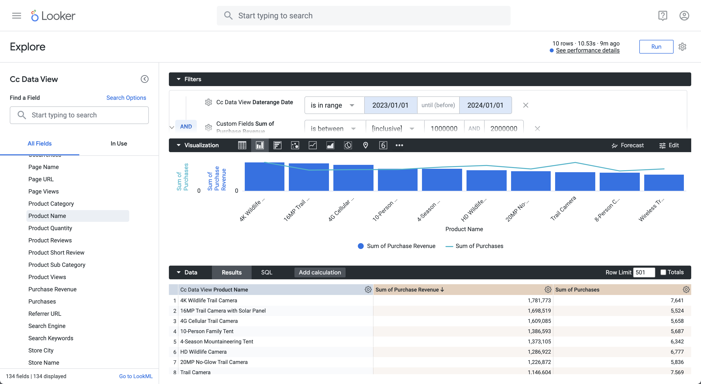

# Eén dimensie, gerangschikt


In dit gebruiksgeval wilt u een tabel en eenvoudige streepjesvisualisatie weergeven met de aankoop- en aankoopopbrengsten voor productnamen over 2023.

+++ Customer Journey Analytics

Een voorbeeldvenster **[!UICONTROL Single Dimension Ranked]** voor het hoofdlettergebruik:


+++

+++ BI-gereedschappen

>[!PREREQUISITES]
>
>Verzeker u [ een succesvolle verbinding, gegevensmeningen, en gebruik een gegevensmening ](connect-and-validate.md) voor het hulpmiddel van BI hebt bevestigd waarvoor u dit gebruiksgeval wilt uitproberen.
>

>[!BEGINTABS]

>[!TAB  Desktop van Power BI ]

1. In het deelvenster **[!UICONTROL Data]** :
   1. Selecteer **[!UICONTROL daterange]**.
   1. Selecteer **[!UICONTROL product_name]**.
   1. Selecteer **[!UICONTROL sum purchase_revenue]**.
   1. Selecteer **[!UICONTROL sum purchases]**.

   Er wordt een lege tabel weergegeven met alleen de kolomkoppen voor het geselecteerde element. Vergroot de visualisatie voor een betere zichtbaarheid.

1. In het deelvenster **[!UICONTROL Filters]** :

   1. Selecteer de **[!UICONTROL daterange is (All)]** van **[!UICONTROL Filters on this visual]**.
   1. Selecteer **[!UICONTROL Relative date]** als de **[!UICONTROL Filter type]** .
   1. Definieer het filter naar **[!UICONTROL Show items when the value]** **[!UICONTROL is in the last]** `1` **[!UICONTROL calendar years]** .
   1. Selecteer **[!UICONTROL Apply filter]**.

   De tabel wordt bijgewerkt met het toegepaste filter **[!UICONTROL daterange]** .

1. In het deelvenster **[!UICONTROL Visualization]** :

   1. Gebruik  om **[!UICONTROL daterange]** uit **[!UICONTROL Columns]** te verwijderen.
   1. Sleep **[!UICONTROL Sum of purchases_revenue]** onder **[!UICONTROL Sum of purchases]** in **[!UICONTROL Columns]** .

1. Voor de visualisatie van de Lijst:

   1. Selecteer **[!UICONTROL Sum of purchase_revenue]** om de productnamen te sorteren in aflopende volgorde van inkoopopbrengsten. Je Power BI Desktop moet er hieronder uitzien.

   

1. In het deelvenster **[!UICONTROL Filters]** :

   1. Selecteer **[!UICONTROL product_name is (All)]**.
   1. Stel **[!UICONTROL Filter type]** in op **[!UICONTROL Top N]** .
   1. Definieer het filter naar **[!UICONTROL Show items]** **[!UICONTROL Top]** `10` **[!UICONTROL By value]** .
   1. Sleep **[!UICONTROL purchase_revenue]** naar **[!UICONTROL By value]** **[!UICONTROL Add data fields here]** .
   1. Selecteer **[!UICONTROL Apply filter]**.

   U ziet de tabel die is bijgewerkt met waarden voor de aankoopopbrengsten, in overeenstemming met de visualisatie van de tabel Freeform in Analysis Workspace.

1. In het deelvenster **[!UICONTROL Visualizations]** :

   1. Selecteer de **[!UICONTROL Line and stacked column chart]** visualisatie.

   Een lijn en gestapelde kolomgrafiekvisualisatie vervangen de lijst terwijl het gebruiken van de zelfde gegevens zoals de lijst.

1. Sleep **[!UICONTROL purchases]** naar **[!UICONTROL Line y-axis]** in het deelvenster **[!UICONTROL Visualizations]** .

   De lijn en gestapelde kolomgrafiek worden bijgewerkt. Je Power BI Desktop moet er hieronder uitzien.

   

1. Op de Lijn en gestapelde kolomgrafiekvisualisatie:

   1. Selecteer .
   1. Selecteer **[!UICONTROL Show as a table]** in het contextmenu.

   De hoofdweergave wordt bijgewerkt om zowel een lijnvisualisatie als een tabel weer te geven.

   

>[!TAB  Desktop Tableau ]

1. Selecteer de tab **[!UICONTROL Sheet 1]** onderaan om te schakelen van **[!UICONTROL Data source]** . In de weergave **[!UICONTROL Sheet 1]** :
   1. Sleep de vermelding **[!UICONTROL Daterange]** uit de lijst **[!UICONTROL Tables]** in het deelvenster **[!UICONTROL Data]** en zet deze op de **[!UICONTROL Filters]** shelf neer.
   1. Selecteer **[!UICONTROL Filters Field \[Daterange\]]** in het dialoogvenster **[!UICONTROL Range of Dates]** van **[!UICONTROL Next >]** .
   1. Selecteer **[!UICONTROL Filter \[Daterange\]]** in het dialoogvenster **[!UICONTROL Range of dates]** en geef een punt op van `01/01/2023` - `31/12/2023` . Selecteer **[!UICONTROL Apply]** en **[!UICONTROL OK]** .

      

   1. Sleep **[!UICONTROL Product Name]** vanuit de lijst **[!UICONTROL Tables]** in het deelvenster **[!UICONTROL Data]** en zet de vermelding in het veld naast **[!UICONTROL Rows]** neer.
   1. De belemmering en laat vallen **[!UICONTROL Purchases]** van de **[!UICONTROL Tables (*Namen van de Maatregel *)]**lijst in de **[!UICONTROL Data]**ruit en laat vallen de ingang op het gebied naast **[!UICONTROL Rows]**. De waarde wordt automatisch omgezet in **[!UICONTROL SUM(Purchases)]**.
   1. De belemmering en laat vallen **[!UICONTROL Purchase Revenue]** van de **[!UICONTROL Tables (*Namen van de Maatregel *)]**lijst in de **[!UICONTROL Data]**ruit en laat vallen de ingang op het gebied naast **[!UICONTROL Columns]**en verlaten van **[!UICONTROL SUM(Purchases)]**. De waarde wordt automatisch omgezet in **[!UICONTROL SUM(Purchase Revenue)]**.
   1. Als u beide grafieken wilt bestellen in aflopende volgorde van inkoopopbrengsten, plaatst u de muisaanwijzer op de titel van **[!UICONTROL Purchase Revenue]** en selecteert u het sorteerpictogram.
   1. Als u het aantal items in de grafieken wilt beperken, selecteert u **[!UICONTROL SUM(Purchase Revenue)]** in **[!UICONTROL Rows]** en kiest u **[!UICONTROL Filter]** in het vervolgkeuzemenu.
   1. Selecteer **[!UICONTROL Filter \[Purchase Revenue\]]** in het dialoogvenster **[!UICONTROL Range of values]** en voer de gewenste waarden in. Bijvoorbeeld: `1,000,000` - `2,000,000` . Selecteer **[!UICONTROL Apply]** en **[!UICONTROL OK]** .
   1. Als u de twee staafdiagrammen wilt omzetten in een combinatieschema, selecteert u **[!UICONTROL SUM(Purchases)]** in **[!UICONTROL Rows]** en kiest u **[!UICONTROL Dual Axis]** in het keuzemenu. De staafdiagrammen worden omgezet in een spreidingsgrafiek.
   1. U wijzigt het spreidingsperceel als volgt in een staafdiagram:
      1. Selecteer **[!UICONTROL SUM(Purchases)]** in het **[!UICONTROL Marks]** -gebied en selecteer **[!UICONTROL Line]** in de vervolgkeuzelijst.
      1. Selecteer **[!UICONTROL SUM(Purchase Revenue)]** in het **[!UICONTROL Marks]** -gebied en selecteer **[!UICONTROL Bar]** in de vervolgkeuzelijst.

   Uw Tableau Desktop moet er hieronder uitzien.

   

1. Selecteer **[!UICONTROL Duplicate]** in het contextmenu van de tab **[!UICONTROL Sheet 1]** om een tweede blad te maken.
1. Selecteer **[!UICONTROL Rename]** in het contextmenu van de tab **[!UICONTROL Sheet 1]** om de naam van het werkblad te wijzigen in `Data` .
1. Selecteer **[!UICONTROL Rename]** in het contextmenu van de tab **[!UICONTROL Sheet 1 (2)]** om de naam van het werkblad te wijzigen in `Graph` .
1. Zorg ervoor dat het **[!UICONTROL Data]** -werkblad is geselecteerd.
   1. Selecteer **[!UICONTROL Show me]** rechtsboven en selecteer **[!UICONTROL Text table]** (visualisatie linksboven) om de inhoud van de twee grafieken aan een tabel aan te passen.
   1. Om koopopbrengst in dalende orde te opdracht geven, houd over **[!UICONTROL Purchase Revenue]** in de lijst en selecteer .
   1. Selecteer **[!UICONTROL Entire View]** in de vervolgkeuzelijst **[!UICONTROL Fit]** .

   Uw Tableau Desktop moet er hieronder uitzien.

   

1. Selecteer **[!UICONTROL New Dashboard]** tabknop (onder) om een nieuwe **[!UICONTROL Dashboard 1]** -weergave te maken. In de weergave **[!UICONTROL Dashboard 1]** :
   1. Sleep en laat vallen het **[!UICONTROL Graph]** blad van **[!UICONTROL Sheets]** plank op de **[!UICONTROL Dashboard 1]** mening die *Dropbladen hier* leest.
   1. Sleep het **[!UICONTROL Data]** -werkblad van de **[!UICONTROL Sheets]** -plank onder het **[!UICONTROL Graph]** -werkblad naar de **[!UICONTROL Dashboard 1]** -weergave.
   1. Selecteer het **[!UICONTROL Data]** -werkblad in de weergave en wijzig **[!UICONTROL Entire View]** in **[!UICONTROL Fix Width]** .

   De weergave **[!UICONTROL Dashboard 1]** ziet er hieronder ongeveer zo uit.

   


>[!TAB  Leider ]

1. Zorg ervoor dat u in de interface **[!UICONTROL Explore]** van Looker een schone instelling hebt. Als niet, uitgezochte  **[!UICONTROL Remove fields and filters]**.
1. Selecteer **[!UICONTROL + Filter]** onder **[!UICONTROL Filters]** .
1. In het dialoogvenster **[!UICONTROL Add Filter]** :
   1. Selecteren **[!UICONTROL ‣ Cc Data View]**
   1. Selecteer **[!UICONTROL ‣ Daterange Date]** en vervolgens **[!UICONTROL Daterange Date]** in de lijst met velden.
      
1. Geef het filter **[!UICONTROL Cc Data View Daterange Date]** op als **[!UICONTROL is in range]** **[!UICONTROL 2023/01/01]** **[!UICONTROL until (before)]** **[!UICONTROL 2024/01/01]** .
1. Selecteer **[!UICONTROL ‣ Cc Data View]** in het gedeelte **[!UICONTROL Product Name]** links in de sectie.
1. Vanuit het gedeelte **[!UICONTROL ‣ Custom Fields]** in de linkertrack:
   1. Selecteer **[!UICONTROL Custom Measure]** in de vervolgkeuzelijst **[!UICONTROL + Add]** .
   1. In het dialoogvenster **[!UICONTROL Create custom measure]** :
      1. Selecteer **[!UICONTROL Purchase Revenue]** in de vervolgkeuzelijst **[!UICONTROL Field to measure]** .
      1. Selecteer **[!UICONTROL Sum]** in de vervolgkeuzelijst **[!UICONTROL Measure type]** .
      1. Voer een aangepaste veldnaam in voor **[!UICONTROL Name]** . Bijvoorbeeld: `Purchase Revenue` .
      1. Selecteer het tabblad **[!UICONTROL Field details]**. 
      1. Selecteer **[!UICONTROL Decimals]** in de vervolgkeuzelijst **[!UICONTROL Format]** en zorg ervoor dat `0` wordt ingevoerd in **[!UICONTROL Decimals]** .
         
      1. Selecteer **[!UICONTROL Save]**.
   1. Selecteer **[!UICONTROL Custom Measure]** nogmaals in de vervolgkeuzelijst **[!UICONTROL + Add]** . In het dialoogvenster **[!UICONTROL Create custom]** -meting:
      1. Selecteer **[!UICONTROL Purchases]** in de vervolgkeuzelijst **[!UICONTROL Field to measure]** .
      1. Selecteer **[!UICONTROL Sum]** in de vervolgkeuzelijst **[!UICONTROL Measure type]** .
      1. Voer een aangepaste veldnaam in voor **[!UICONTROL Name]** . Bijvoorbeeld: `Sum of Purchases` .
      1. Selecteer het tabblad **[!UICONTROL Field details]**. 
      1. Selecteer **[!UICONTROL Decimals]** in de vervolgkeuzelijst **[!UICONTROL Format]** en zorg ervoor dat `0` wordt ingevoerd in **[!UICONTROL Decimals]** .
      1. Selecteer **[!UICONTROL Save]**.
   1. Beide velden worden automatisch toegevoegd aan de gegevensweergave.
1. Selecteer **[!UICONTROL + Filter]** om nog een **[!UICONTROL Filters]** toe te voegen en de gegevens te beperken.
1. Selecteer **[!UICONTROL Add Filter]** in het dialoogvenster **[!UICONTROL ‣ Custom Fields]** van **[!UICONTROL Purchase Revenue]** .
1. Maak de juiste selecties en voer de voorgestelde waarden in, zodat het filter **[!UICONTROL is between inclusive]** `1000000` **[!UICONTROL AND]** `2000000` leest.
1. Selecteer **[!UICONTROL Run]**.
1. Selecteer **[!UICONTROL ‣ Visualization]** om de lijnvisualisatie weer te geven.
1. Selecteer **[!UICONTROL Edit]** in **[!UICONTROL Visualization]** om de visualisatie bij te werken. In het dialoogvenster Pop-up:
   1. Selecteer het tabblad **[!UICONTROL Series]**. 
   1. Schuif omlaag om **[!UICONTROL Purchases]** weer te geven en wijzig de **[!UICONTROL Type]** in **[!UICONTROL Line]** .
   1. Selecteer het tabblad **[!UICONTROL Y]**. 
   1. Sleep **[!UICONTROL Purchases]** van de **[!UICONTROL Left 1]** container aan waar het **[!UICONTROL *reeksen van de Belemmering hier leest om een nieuwe linkeras *]**tot stand te brengen. Met deze actie maakt u een **[!UICONTROL Left 2]**-container.
      
   1. Selecteer  naast **[!UICONTROL Edit]** om de popup dialoog te verbergen

U dient een visualisatie en tabel te zien zoals hieronder weergegeven.




>[!TAB  Jupyter Notitieboekje ]

1. Voer de volgende instructies in een nieuwe cel in.

   ```
   import seaborn as sns
   import matplotlib.pyplot as plt
   data = %sql SELECT product_name AS `Product Name`, SUM(purchase_revenue) AS `Purchase Revenue`, SUM(purchases) AS `Purchases` \
               FROM cc_data_view \
               WHERE daterange BETWEEN '2023-01-01' AND '2024-01-01' \
               GROUP BY 1 \
               LIMIT 10;
   df = data.DataFrame()
   df = df.groupby('Product Name', as_index=False).sum()
   plt.figure(figsize=(15, 3))
   sns.barplot(x='Purchase Revenue', y='Product Name', data=df)
   plt.show()
   display(data)
   ```

1. Voer de cel uit. U zou output moeten zien gelijkend op het hieronder opgenomen schermschot.

   


>[!TAB  RStudio ]

1. Voer de volgende instructies tussen ` ```{r} ` en ` ``` ` in een nieuw segment in.

   ```R
   library(tidyr)
   
   ## Single dimension ranked
   df <- dv %>%
      filter(daterange >= "2023-01-01" & daterange < "2024-01-01") %>%
      group_by(product_name) %>%
      summarise(purchase_revenue = sum(purchase_revenue), purchases = sum(purchases)) %>%
      arrange(product_name, .by_group = FALSE)
   dfV <- df %>%
      head(5)
   ggplot(dfV, aes(x = purchase_revenue, y = product_name)) +
      geom_col(position = "dodge") +
      geom_text(aes(label = purchase_revenue), vjust = -0.5)
   print(df)
   ```

1. Voer het segment uit. U zou output moeten zien gelijkend op het hieronder opgenomen schermschot.

   

>[!ENDTABS]

+++

