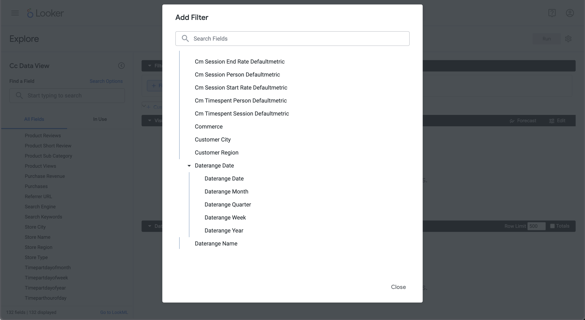

# Sorteren


In dit geval wilt u in januari 2023 voor productnamen de aankoopopbrengsten en -aankopen rapporteren, gesorteerd in aflopende inkoopopdracht.

+++ Customer Journey Analytics

Een voorbeeldvenster **[!UICONTROL Sort]** voor het hoofdlettergebruik:


+++

+++ BI-gereedschappen

>[!PREREQUISITES]
>
>Verzeker u [ een succesvolle verbinding, gegevensmeningen, en gebruik een gegevensmening ](connect-and-validate.md) voor het hulpmiddel van BI hebt bevestigd waarvoor u dit gebruiksgeval wilt uitproberen.
>

>[!BEGINTABS]

>[!TAB  Desktop van Power BI ]

1. In het deelvenster **[!UICONTROL Data]** :
   1. Selecteer **[!UICONTROL daterange]**.
   1. Selecteer **[!UICONTROL product_namr]**.
   1. Selecteer **[!UICONTROL sum purchase_revenue]**.
   1. Selecteer **[!UICONTROL sum purchases]**.

1. In het deelvenster **[!UICONTROL Filters]** :
   1. Selecteer **[!UICONTROL daterange is (All)]** in **[!UICONTROL Filters on this visual]** .
   1. Selecteer **[!UICONTROL Advanced filtering]** als de **[!UICONTROL Filter type]** .
   1. Definieer het filter naar **[!UICONTROL Show items when the value]** **[!UICONTROL is on or after]** `1/1/2023` **[!UICONTROL And]** **[!UICONTROL is before]** `2/1/2023` .

1. In het deelvenster Visualisaties:
   1. Selecteer  om daterange uit Kolommen te verwijderen.
   1. Sleep **[!UICONTROL Sum of purchase_revenue]** naar de onderkant van **[!UICONTROL Column]** -items.

1. Selecteer in het rapport **[!UICONTROL Sum of purchase_revenue]** om de tabel in aflopende volgorde van aankoop-inkomsten te sorteren.

   Je Power BI Desktop moet er hieronder uitzien.

   

De query die door Power BI Desktop wordt uitgevoerd met de BI-extensie bevat geen `sort` -instructie. Het ontbreken van een instructie `sort` betekent dat de sortering aan de clientzijde wordt uitgevoerd.

```sql
select "_"."product_name",
    "_"."a0",
    "_"."a1"
from 
(
    select "rows"."product_name" as "product_name",
        sum("rows"."purchases") as "a0",
        sum("rows"."purchase_revenue") as "a1"
    from 
    (
        select "_"."daterangeName",
            "_"."daterange",
            "_"."filterId",
            "_"."filterName",
            "_"."timestamp",
            "_"."affiliate_name",
            "_"."affiliate_url",
            "_"."commerce.order.priceTotal",
            "_"."customer_city",
            "_"."customer_region",
            "_"."daterangeday",
            "_"."daterangefifteenminute",
            "_"."daterangefiveminute",
            "_"."daterangehour",
            "_"."daterangeminute",
            "_"."daterangemonth",
            "_"."daterangequarter",
            "_"."daterangesecond",
            "_"."daterangethirtyminute",
            "_"."daterangeweek",
            "_"."daterangeyear",
            "_"."hitdatetime",
            "_"."page_name",
            "_"."page_url",
            "_"."product_category",
            "_"."product_name",
            "_"."product_short_review",
            "_"."product_subCategory",
            "_"."referrer_url",
            "_"."search_engine",
            "_"."search_keywords",
            "_"."store_city",
            "_"."store_name",
            "_"."store_region",
            "_"."store_type",
            "_"."timepartdayofmonth",
            "_"."timepartdayofweek",
            "_"."timepartdayofyear",
            "_"."timeparthourofday",
            "_"."timepartminuteofhour",
            "_"."timepartmonthofyear",
            "_"."timepartquarterofyear",
            "_"."timepartweekofyear",
            "_"."cm_session_end_rate_defaultmetric",
            "_"."cm_session_person_defaultmetric",
            "_"."cm_session_start_rate_defaultmetric",
            "_"."cm_timespent_person_defaultmetric",
            "_"."cm_timespent_session_defaultmetric",
            "_"."cm_product_name_count_distinct",
            "_"."ad_views",
            "_"."adobe_sessionends",
            "_"."adobe_sessionstarts",
            "_"."adobe_timespent",
            "_"."exchange_buybacks",
            "_"."exchange_cost",
            "_"."exchange_purchases",
            "_"."exchange_revenue",
            "_"."occurrences",
            "_"."page_views",
            "_"."product_quantity",
            "_"."product_reviews",
            "_"."product_views",
            "_"."purchase_revenue",
            "_"."purchases",
            "_"."visitors",
            "_"."visits"
        from "public"."cc_data_view" "_"
        where "_"."daterange" < date '2023-02-01' and "_"."daterange" >= date '2023-01-01'
    ) "rows"
    group by "product_name"
) "_"
where not "_"."a0" is null or not "_"."a1" is null
limit 1000001
```


>[!TAB  Desktop Tableau ]

1. Selecteer de tab **[!UICONTROL Sheet 1]** onderaan om te schakelen van **[!UICONTROL Data source]** . In de weergave **[!UICONTROL Sheet 1]** :
   1. Sleep **[!UICONTROL Daterange]** -item uit de lijst **[!UICONTROL Tables]** in de **[!UICONTROL Filters]** -lijst.
   1. Selecteer **[!UICONTROL Filter Field \[Daterange\]]** in het dialoogvenster **[!UICONTROL Range of Dates]** van **[!UICONTROL Next >]** .
   1. Selecteer **[!UICONTROL Filter \[Daterange\]]** in het dialoogvenster **[!UICONTROL Range of dates]** en selecteer `01/01/2023` - `1/2/2023` . Selecteer **[!UICONTROL Apply]** en **[!UICONTROL OK]** .
   1. Sleep **[!UICONTROL Product Name]** uit de lijst **[!UICONTROL Tables]** en zet de vermelding neer in het veld naast **[!UICONTROL Rows]** .
   1. Sleep **[!UICONTROL Purchases]** -item uit de **[!UICONTROL Tables]** -lijst en zet de vermelding in het veld naast **[!UICONTROL Columns]** neer. De waarde verandert in **[!UICONTROL SUM(Purchases)]** .
   1. Sleep **[!UICONTROL Purchase Revenue]** -item uit de **[!UICONTROL Tables]** -lijst en zet de vermelding in het veld naast **[!UICONTROL Columns]** , naast **[!UICONTROL SUM(Purchases)]** . De waarde verandert in **[!UICONTROL SUM(Purchase Revenue)]** .
   1. Selecteer **[!UICONTROL Text Table]** in **[!UICONTROL Show Me]** .
   1. Selecteer **[!UICONTROL Fit Width]** in de vervolgkeuzelijst **[!UICONTROL Fit]** .
   1. Selecteer de kolomkop **[!UICONTROL Purchase Revenue]** en sorteer de tabel in deze kolom in aflopende volgorde.

      Uw Tableau Desktop moet er hieronder uitzien.

      

De query die wordt uitgevoerd door Tableau Desktop met de BI-extensie bevat geen `sort` -instructie. Het ontbreken van deze instructie `sort` betekent dat de sortering aan de clientzijde wordt uitgevoerd.

```sql
SELECT CAST("cc_data_view"."product_name" AS TEXT) AS "product_name",
  SUM("cc_data_view"."occurrences") AS "sum:occurrences:ok",
  SUM("cc_data_view"."purchase_revenue") AS "sum:purchase_revenue:ok",
  SUM("cc_data_view"."purchases") AS "sum:purchases:ok"
FROM "public"."cc_data_view" "cc_data_view"
WHERE (("cc_data_view"."daterange" >= (DATE '2023-01-01')) AND ("cc_data_view"."daterange" <= (DATE '2023-02-01')))
GROUP BY 1
```

>[!TAB  Leider ]

1. Vernieuw de verbinding in de **[!UICONTROL Explore]** -interface van Looker. Selecteer  **[!UICONTROL Clear cache and refresh]**.
1. Zorg ervoor dat u in de interface **[!UICONTROL Explore]** van Looker een schone instelling hebt. Als niet, uitgezochte  **[!UICONTROL Remove fields and filters]**.
1. Selecteer **[!UICONTROL + Filter]** onder **[!UICONTROL Filters]** .
1. In het dialoogvenster **[!UICONTROL Add Filter]** :
   1. Selecteren **[!UICONTROL ‣ Cc Data View]**
   1. Selecteer **[!UICONTROL ‣ Daterange Date]** en vervolgens **[!UICONTROL Daterange Date]** in de lijst met velden.
      
1. Geef het filter **[!UICONTROL Cc Data View Daterange Date]** op als **[!UICONTROL is in range]** **[!UICONTROL 2023/01/01]** **[!UICONTROL until (before)]** **[!UICONTROL 2023/02/01]** .
1. Selecteer **[!UICONTROL ‣ Cc Data View]** in het gedeelte **[!UICONTROL Product Name]** links in de sectie.
1. Vanuit het gedeelte **[!UICONTROL ‣ Custom Fields]** in de linkertrack:
   1. Selecteer **[!UICONTROL Custom Measure]** in de vervolgkeuzelijst **[!UICONTROL + Add]** .
   1. In het dialoogvenster **[!UICONTROL Create custom measure]** :
      1. Selecteer **[!UICONTROL Purchase Revenue]** in de vervolgkeuzelijst **[!UICONTROL Field to measure]** .
      1. Selecteer **[!UICONTROL Sum]** in de vervolgkeuzelijst **[!UICONTROL Measure type]** .
      1. Voer een aangepaste veldnaam in voor **[!UICONTROL Name]** . Bijvoorbeeld: `Sum of Purchase Revenue` .
      1. Selecteer het tabblad **[!UICONTROL Field details]**. 
      1. Selecteer **[!UICONTROL Decimals]** in de vervolgkeuzelijst **[!UICONTROL Format]** en zorg ervoor dat `0` wordt ingevoerd in **[!UICONTROL Decimals]** .
         
      1. Selecteer **[!UICONTROL Save]**.
1. Selecteer **[!UICONTROL ↓]** (**[!UICONTROL Descending, Sort Order: 1]** ) in de kolom **[!UICONTROL Purchase Revenue]** .
1. Selecteer **[!UICONTROL Run]**.
1. Selecteer **[!UICONTROL ‣ Visualization]**.

U dient een visualisatie en tabel te zien zoals hieronder weergegeven.


De vraag die door het gebruiken van de uitbreiding van BI wordt geproduceerd van het plukker is met inbegrip van `ORDER BY`, wat impliceert dat de soort door de uitbreiding van het plukker en van BI wordt uitgevoerd.

```sql
-- Looker Query Context '{"user_id":6,"history_slug":"fc83573987b999306eaf6e1a3f2cde70","instance_slug":"71d4667f0b76c0011463658f45c3f7a3"}' 
SELECT
    cc_data_view."product_name"  AS "cc_data_view.product_name",
    COALESCE(SUM(CAST(( cc_data_view."purchase_revenue"  ) AS DOUBLE PRECISION)), 0) AS "purchase_revenue"
FROM
    "public"."cc_data_view" AS "cc_data_view"
WHERE ((( cc_data_view."daterange"  ) >= (DATE_TRUNC('day', DATE '2024-01-31')) AND ( cc_data_view."daterange"  ) < (DATE_TRUNC('day', DATE '2023-02-01'))))
GROUP BY
    1
ORDER BY
    2 DESC
FETCH NEXT 500 ROWS ONLY
```


>[!TAB  Jupyter Notitieboekje ]

1. Voer de volgende instructies in een nieuwe cel in.

   ```python
   data = %sql SELECT product_name AS `Product Name`, SUM(purchase_revenue) AS `Purchase Revenue`, SUM(purchases) AS `Purchases` \
               FROM cc_data_view \
               WHERE daterange BETWEEN '2023-01-01' AND '2023-02-01' \
               GROUP BY 1 \
               ORDER BY `Purchase Revenue` DESC \
               LIMIT 5;
   display(data)
   ```

1. Voer de cel uit. U zou output moeten zien gelijkend op het hieronder opgenomen schermschot.

   

De query wordt uitgevoerd door de BI-extensie zoals gedefinieerd in Jupyter Notebook.


>[!TAB  RStudio ]

1. Voer de volgende instructies tussen ` ```{r} ` en ` ``` ` in een nieuw segment in.

   ```R
   ## Dimension 1 Sorted
   df <- dv %>%
      filter(daterange >= "2023-01-01" & daterange < "2023-02-01") %>%
      group_by(product_name) %>%
      summarise(purchase_revenue = sum(purchase_revenue), purchases = sum(purchases), .groups = "keep") %>%
      arrange(desc(purchase_revenue), .by_group = FALSE)
   print(df)
   ```

1. Voer het segment uit. U zou output moeten zien gelijkend op het hieronder opgenomen schermschot.

   

De query die wordt gegenereerd door RStudio met de BI-extensie bevat `ORDER BY` . Dit houdt in dat de volgorde wordt toegepast via RStudio en de BI-extensie.

```sql
SELECT
  "product_name",
  SUM("purchase_revenue") AS "purchase_revenue",
  SUM("purchases") AS "purchases"
FROM (
  SELECT "cc_data_view".*
  FROM "cc_data_view"
  WHERE ("daterange" >= '2023-01-01' AND "daterange" < '2023-02-01')
) AS "q01"
GROUP BY "product_name"
ORDER BY "purchase_revenue" DESC
LIMIT 1000
```

>[!ENDTABS]

+++
