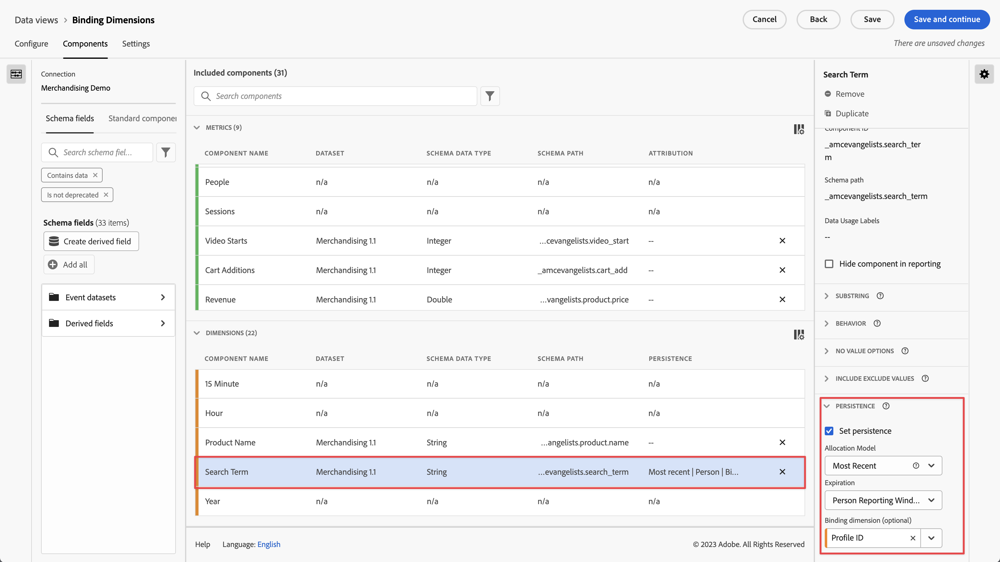

# Afmetingen en metriek van binding gebruiken

Customer Journey Analytics biedt verschillende manieren om waarden van dimensies aan te houden voorbij de hit waarop ze zijn ingesteld. Een van de persistentiemethoden die Adobe aanbiedt, wordt Binding genoemd. In vorige versies van Adobe Analytics werd dit concept ook wel &#39;merchandising&#39; genoemd.

Terwijl u bindende dimensies met top-level gebeurtenisgegevens kunt gebruiken, wordt dit concept best gebruikt wanneer het werken met [ Arrays van voorwerpen ](/help/use-cases/object-arrays.md). U kunt een dimensie aan één deel van een objecten serie zonder de dimensie op alle attributen in een bepaalde gebeurtenis toe te passen toeschrijven. U kunt bijvoorbeeld een zoekterm aan één product in de array met winkelwagentobjecten toewijzen zonder die zoekterm aan de gehele gebeurtenis te binden.

## Voorbeeld 1: Gebruik bindingsdimensies om aanvullende productkenmerken aan een aankoop toe te wijzen

U kunt dimensie-items binnen een objectarray aan een andere dimensie binden. Wanneer het gebonden afmetingspunt verschijnt, herinnert de Customer Journey Analytics de gebonden afmeting en omvat het in de gebeurtenis voor u. Overweeg de volgende klantenreis:

1. Een bezoeker bekijkt een productpagina op een wasmachine.

   ```json
   {
       "PersonID": "1",
       "product": [
           {
               "name": "Washing Machine 2000",
               "color": "white",
               "type": "front loader",
           },
       ],
       "timestamp": 1534219229
   }
   ```

1. De bezoeker bekijkt dan een productpagina op een droger.

   ```json
   {
       "PersonID": "1",
       "product": [
           {
               "name": "Dryer 2000",
               "color": "neon orange",
           },
       ],
       "timestamp": 1534219502
   }
   ```

1. Uiteindelijk doen ze een aankoop. De kleur van elk product is niet opgenomen in de aankoopgebeurtenis.

   ```json
   {
       "PersonID": "1",
       "orders": 1,
       "product": [
           {
               "name": "Washing Machine 2000",
               "price": 1600,
           },
           {
               "name": "Dryer 2000",
               "price": 499
           }
       ],
       "timestamp": 1534219768
   }
   ```

Als u de omzet in kleur wilt bekijken zonder een bindende dimensie, blijft de afmeting `product.color` bestaan en wordt deze ten onrechte toegewezen aan de kleur van de droger:

| product.color | omzet |
| --- | --- |
| neonoranje | 2099 |

Ga naar **[!UICONTROL Data views]** en koppel de [!DNL Product Color] dimensie aan [!DNL Product Name] :


Wanneer u dit persistentiemodel instelt, neemt de Customer Journey Analytics nota van de productnaam wanneer de productkleur wordt ingesteld. Als het dezelfde productnaam herkent in een volgende gebeurtenis voor deze persoon, wordt de productkleur ook overgedragen. Dezelfde gegevens wanneer u een productkleur bindt aan de productnaam, zien er ongeveer als volgt uit:

| product.color | omzet |
| --- | --- |
| wit | 1600 |
| neonoranje | 499 |

## Voorbeeld 2: Gebruik bindingsmetriek om een zoekterm aan een productaankoop te koppelen

Een van de meest gebruikte handelsmethoden in Adobe Analytics is het binden van een zoekterm aan een product, zodat elke zoekterm krediet krijgt voor het juiste product. Overweeg de volgende klantenreis:

1. Een bezoeker arriveert op uw site en zoekt naar `boxing gloves` . De metrische toename van zoekopdrachten wordt met één verhoogd en de bovenste drie zoekresultaten worden weergegeven.

   ```json
   {
       "PersonID": "1",
       "page_name": "Search results",
       "search": "1",
       "search_term": "boxing gloves",
       "product": [
           {
               "name": "Beginner gloves",
           },
           {
               "name": "Tier 3 gloves",
           },
           {
               "name": "Professional gloves",
           }
       ]
   }
   ```

2. Ze vinden een paar handschoenen die ze leuk vinden en voegen het toe aan hun kar.

   ```json
   {
       "PersonID": "1",
       "page_name": "Shopping cart",
       "cart_add": "1",
       "product": [
           {
               "name": "Tier 3 gloves",
           }
       ]
   }
   ```

3. De bezoeker zoekt vervolgens naar `tennis racket` . De metrische toename van zoekopdrachten wordt met één verhoogd en de bovenste drie zoekresultaten worden weergegeven.

   ```json
   {
       "PersonID": "1",
       "page_name": "Search results",
       "search": "1",
       "search_term": "tennis racket",
       "product": [
           {
               "name": "Shock absorb racket",
           },
           {
               "name": "Women's open racket",
           },
           {
               "name": "Extreme racket",
           }
       ]
   }
   ```

4. Ze vinden een racket die ze leuk vinden en voegen het toe aan hun winkelwagen.

   ```json
   {
       "PersonID": "1",
       "page_name": "Shopping cart",
       "cart_add": "1",
       "product": [
           {
               "name": "Tier 3 gloves",
           },
           {
               "name": "Shock absorb racket",
           }
       ]
   }
   ```

5. De bezoeker zoekt een derde keer naar `shoes` . De metrische toename van zoekopdrachten wordt met één verhoogd en de bovenste drie zoekresultaten worden weergegeven.

   ```json
   {
       "PersonID": "1",
       "page_name": "Search results",
       "search": "1",
       "search_term": "shoes",
       "product": [
           {
               "name": "Men's walking shoes",
           },
           {
               "name": "Tennis shoes",
           },
           {
               "name": "Skate shoes",
           }
       ]
   }
   ```

6. Ze vinden een paar schoenen die ze leuk vinden en voegen het toe aan hun winkelwagen.

   ```json
   {
       "PersonID": "1",
       "page_name": "Shopping cart",
       "cart_add": "1",
       "product": [
           {
               "name": "Tier 3 gloves",
           },
           {
               "name": "Shock absorb racket",
           },
           {
               "name": "Skate shoes",
           }
       ]
   }
   ```

7. De bezoeker doorloopt het afrekenproces en koopt deze drie objecten.

   ```json
   {
       "PersonID": "1",
       "page_name": "Thank you for your purchase",
       "purchase": "1",
       "product": [
           {
               "name": "Tier 3 gloves",
               "price": "89.99"
           },
           {
               "name": "Shock absorb racket",
               "price": "34.99"
           },
           {
               "name": "Skate shoes",
               "price": "79.99"
           }
       ]
   }
   ```

Als u een toewijzingsmodel gebruikt dat geen bindende dimensie met onderzoekstermijn omvat, kenmerken alle drie producten opbrengst aan slechts één enkele onderzoekstermijn. Als u bijvoorbeeld [!UICONTROL Original] -toewijzing hebt gebruikt met de dimensie van de zoekterm:

| search_term | omzet |
| --- | --- |
| bokshandschoenen | $ 204,97 |

Als u [!UICONTROL Most Recent] toewijzing met de dimensie van de onderzoekstermijn gebruikte, kenmerken alle drie producten nog opbrengst aan één enkele onderzoekstermijn:

| search_term | omzet |
| --- | --- |
| schoenen | $ 204,97 |

Hoewel dit voorbeeld slechts één persoon omvat, kunnen veel personen die naar verschillende dingen zoeken, zoektermen verkeerd aan verschillende producten toewijzen. Meerdere mensen zoeken naar verschillende dingen maken het moeilijk om te bepalen wat de beste zoekresultaten zijn.

U kunt nu [!DNL Search Term] aan [!DNL Product Name] binden wanneer [!DNL Searches] metrisch aanwezig is om de onderzoeksterminologie aan opbrengst correct toe te schrijven.


In Analysis Workspace zou het resulterende verslag er als volgt uitzien:

| search_term | omzet |
| --- | --- |
| bokshandschoenen | $ 89,99 |
| tennisracket | $ 34,99 |
| schoenen | $ 79,99 |

Customer Journey Analytics detecteert automatisch de relatie tussen de geselecteerde dimensie en de bindingsdimensie. Wanneer de bindingsdimensie zich in een objectenarray bevindt terwijl de geselecteerde dimensie zich op een hoger niveau bevindt, is een bindingsmetrische waarde vereist. Een bindende metrische handelingen als trekker voor een bindende afmeting, zodat bindt het zich slechts aan gebeurtenissen waar metrisch binden aanwezig is. In het bovenstaande voorbeeld bevat de pagina met zoekresultaten altijd een zoekterm en een metrische zoekopdracht.

Als u de zoekterm instelt op dit persistentiemodel, wordt de volgende logica uitgevoerd:

* Wanneer de dimensie van de zoekterm is ingesteld, controleert u of een productnaam aanwezig is.
* Als de productnaam er niet is, doet u niets.
* Als de productnaam er is, controleer de aanwezigheid van metrisch onderzoek.
* Als de metrische zoekopdracht er niet is, doet u niets.
* Als metrische zoekopdrachten daar zijn, bindt u de zoekterm aan alle productnamen in die gebeurtenis. Het kopieert zich tot het zelfde niveau zoals de productnaam voor die gebeurtenis. In dit voorbeeld wordt deze behandeld als `product.search_term` .
* Als dezelfde productnaam in een volgende gebeurtenis wordt weergegeven, wordt de gebonden zoekterm ook naar die gebeurtenis overgedragen.

## Voorbeeld 3: Videozoekterm binden aan gebruikersprofiel

U kunt een zoekterm aan een gebruikersprofiel binden, zodat de persistentie tussen de profielen volledig gescheiden blijft. Uw organisatie voert bijvoorbeeld een streamingservice uit waarbij een overkoepelende account meerdere profielen kan hebben. De bezoeker heeft een onderliggend profiel en een profiel voor volwassenen.

1. De account meldt zich aan onder het onderliggende profiel en zoekt naar de tv-show van een kind. De waarde `"ProfileID"` is `2` voor het onderliggende profiel.

   ```json
   {
       "PersonID": "7078",
       "ProfileID": "2",
       "Searches": "1",
       "search_term": "kids show"
   }
   ```

1. Ze vinden de show &quot;Orangey&quot; en spelen hem zodat hun kind het kan bekijken.

   ```json
   {
       "PersonID": "7078",
       "ProfileID": "2",
       "ShowName": "Orangey",
       "VideoStarts": "1"
   }
   ```

1. Later die avond schakelt de bovenliggende toepassing over naar het profiel en zoekt deze naar inhoud voor volwassenen. De `"ProfileID"` is `1` voor het profiel voor volwassenen. Beide profielen behoren tot hetzelfde account, dat wordt vertegenwoordigd door dezelfde `"PersonID"` .

   ```json
   {
       "PersonID": "7078",
       "ProfileID": "1",
       "Searches": "1",
       "search_term": "grownup movie"
   }
   ```

1. Zoek naar de show &quot;Analytics After Hours&quot; en geniet van hun avondeten.

   ```json
   {
       "PersonID": "7078",
       "ProfileID": "1",
       "ShowName": "Analytics After Hours",
       "VideoStarts": "1"
   }
   ```

1. De volgende dag zetten ze de show &quot;Orangey&quot; voor hun kind voort. Ze hoeven niet te zoeken omdat ze nu al op de hoogte zijn van de show.

   ```json
   {
       "PersonID": "7078",
       "ProfileID": "2",
       "ShowName": "Orangey",
       "VideoStarts": "1"
   }
   ```

Als u Recentste toewijzing gebruikt bij Person-vervaldatum, wordt de zoekterm `grownup movie` toegewezen aan de laatste weergave van de show van het kind.

| Zoekterm | Video start |
| --- | --- |
| gegroeide film | 2 |
| kindershow | 1 |

Als u `search_term` echter bindt aan `ProfileID` , worden de zoekopdrachten van elk profiel geïsoleerd aan hun eigen profiel. De correcte zoekopdracht wordt aan het profiel toegewezen.



Analysis Workspace wijst de tweede aflevering van Orangey toe aan de zoekterm `kids show` zonder dat er rekening wordt gehouden met zoekopdrachten vanuit andere profielen.

| Zoekterm | Video start |
| --- | --- |
| kindershow | 2 |
| gegroeide film | 1 |

## Voorbeeld 4: browse versus search behavior in een retail setting evalueren

U kunt waarden binden aan dimensies die zijn ingesteld bij vorige gebeurtenissen. Wanneer u een variabele met een bindende afmeting plaatst, houdt de Customer Journey Analytics rekening met de persisted waarde. Als dit ongewenste gedrag is, kunt u de persistentie-instellingen van de bindende dimensie aanpassen. Kijk in het volgende voorbeeld waar `product_finding_method` is ingesteld voor een gebeurtenis en vervolgens is gebonden aan de optie Cart voegt metrisch toe voor de volgende gebeurtenis.

1. Een bezoeker voert een zoekopdracht naar `camera` uit. Er zijn geen producten ingesteld op deze pagina.

   ```json
   {
       "search_term": "camera",
       "product_finding_method": "search"
   }
   ```

1. Ze klikken op een camera die ze leuk vinden en voegen deze toe aan hun winkelwagentje.

   ```json
   {
       "Product": [
           {
               "name": "DSLR Camera"
           }
       ],
       "CartAdd": "1"
   }
   ```

1. De bezoeker bladert dan in de categorie van de mangordels zonder een onderzoek uit te voeren. Er zijn geen producten ingesteld op deze pagina.

   ```json
   {
       "category": "Men's belts",
       "product_finding_method": "browse"
   }
   ```

1. Ze klikken op een gordel die ze leuk vinden en voegen het toe aan hun winkelwagen.

   ```json
   {
       "Product": [
           {
               "name": "Ratchet belt"
           }
       ],
       "CartAdd": "1"
   }
   ```

1. Ze doorlopen het afrekenproces en kopen deze twee objecten.

   ```json
   {
       "Product": [
           {
               "name": "DSLR Camera",
               "price": "399.99"
           },
           {
               "name": "Ratchet belt",
               "price": "19.99"
           }
       ],
       "Purchase": "1"
   }
   ```

Als persistentie wordt ingesteld op de meest recente toewijzing zonder een bindende dimensie, wordt alle $419,98 aan inkomsten toegewezen aan de `browse` finding methode.

| Productzoekmethode | Ontvangsten |
| --- | --- |
| doorbladeren | 419,98 |

Als persistentie wordt ingesteld met behulp van de oorspronkelijke toewijzing zonder een bindende dimensie, wordt alle $419,98 aan inkomsten toegewezen aan de `search` finding methode.

| Productzoekmethode | Ontvangsten |
| --- | --- |
| zoeken | 419,98 |

Als u `product_finding_method` echter bindt aan de optie Winkelwagentje, wordt metrisch toegevoegd, zodat het resulterende rapport elk product aan de juiste zoekmethode koppelt.

| Productzoekmethode | Ontvangsten |
| --- | --- |
| zoeken | 399,99 |
| doorbladeren | 19,99 |


>[!MORELIKETHIS]
>
>[ Bindende Dimensionen in de Mening van Gegevens ](https://experienceleague.adobe.com/docs/customer-journey-analytics-learn/tutorials/data-views/binding-dimensions-in-data-views.html) leerprogramma.
