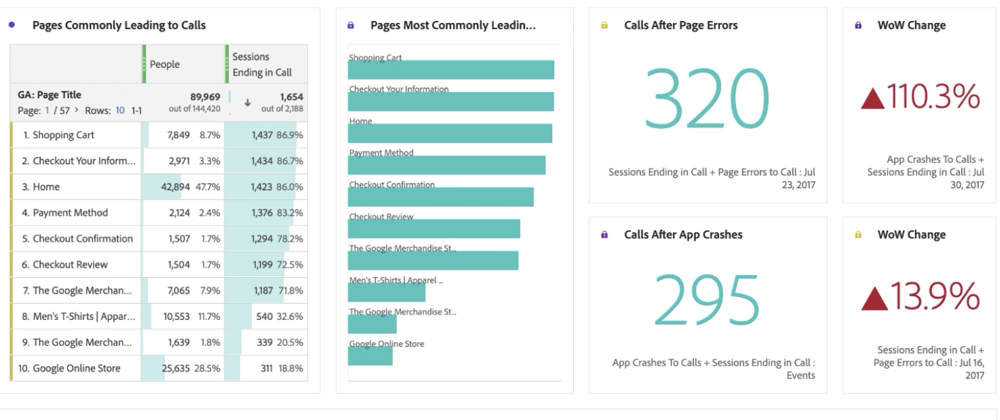

# Rapport over gegevens over Google Analytics in Customer Journey Analytics

Nu hebt u [de Google Analytics-gegevens zijn opgenomen in Experience Platform en Customer Journey Analytics (CJA)](/help/use-cases/ga-to-cja.md), zullen wij u enkele nuttige scenario&#39;s voor het melden van die gegevens tonen.

## Webgegevens en toepassingsgegevens visualiseren als gecombineerde gegevenssets

Dit diagram van Venn toont de overlapping van gebruikers op uw website (van uw gegevens van Google Analytics) en op uw mobiele app (van uw gegevens van de Vuurbasis) en van uw callcenter. U kunt ook de best presterende producten zien, niet alleen op het web, maar ook in de mobiele app. U kunt zelfs de totale opbrengst van allebei krijgen, gebruikend berekende metrisch. De belangrijkste producten vertellen een ander verhaal als je kijkt naar de gecombineerde inkomsten. Zonder de gecombineerde datasets zou je nooit hebben geweten dat de &#39;Twill cap&#39; zo&#39;n sterke presteerder was.

## Identificeer vraagredenen en verminder vraagvolume

Om te verifiëren dat u veel vraag hebt gekregen, kunt u onze tijd van het vraagcentrum voor over de periode van de laatste 2 maanden trenderen. De stijgende trend is duidelijk zichtbaar. Dit is verontrustend, aangezien elke minuut uw vraagcentrumvertegenwoordigers op de telefoon uw geld kost. Dit kan zeker van invloed zijn op je bodemlijn.

Kijk naar de belangrijkste redenen die de verhoogde vraag veroorzaken om centrum te roepen. De belangrijkste redenen hiervoor zijn: Afgewezen creditcard, Creditcard verwijderen en Beschadigd product. Dit kan al wijzen op manieren om de ervaring online te verbeteren. Je kunt ook de redenen van de roep doorlopen en zien welke het meest hebben bijgedragen aan de algemene piek. Het is interessant om te zien dat klanten met &quot;beschadigd product&quot; meer dan 3 minuten per oproep hebben doorgebracht.

Laten wij verder kijken en zien welke producten de meeste vraag aan uw callcenter veroorzaken en hoeveel klanten die vraag maakten. De bellengrafiek geeft aan dat 20.000 mensen die opgebeld werden, meer dan 4 uur 30 minuten doorbrachten en 33 eenheden van het product &quot;Men&#39;s short Slaapschutter&quot; teruggaven.

We kunnen dat inzicht onderbreken en zien waarom die mensen het product teruggaven door in de dimensie &quot;Reden van de Vraag&quot; te slepen. Zoals u kunt zien, is de reden dat dit product zoveel telefoontjes krijgt te wijten aan &quot;beschadigd product&quot;. De volgende stap zou zijn om de afdeling kwaliteitscontrole te contacteren en te zien waarom klanten beschadigde T-shirts hebben ontvangen.

Nu bekijken welke Web-pagina&#39;s de inkomende vraag bij het vraagcentrum leidden. Dit laat u weten waar ondermaatse ervaringen op de website zijn en helpt uw productmanagers deze uitdagingen op te lossen.

We doen dit door

* Het gebruiken van berekende metrisch om de gegevens neer aan slechts zittingen te filtreren die met een vraag van het vraagcentrum beëindigden.
* Het &quot;participatiemodel&quot; in CJA&#39;s gebruiken [Attribution IQ](https://experienceleague.adobe.com/docs/analytics-platform/using/cja-workspace/attribution/models.html?lang=en#cja-workspace).

U kunt gemakkelijk zien welke pagina&#39;s het vaakst aan een zitting deelnemen die in een vraag beëindigt. U kunt zien dat de pagina&#39;s &quot;Winkelwagentje&quot; en &quot;Afhandelingsinformatie&quot; de meeste vraag stelden. Aangezien u ook de gegevens van de mobiele app voor de firebase hebt opgenomen, kunt u zelfs paginafouten en toepassingscrashes zien die de aanroepen genereren. Dit is een heel belangrijk gegevenspunt als u geweldige ervaring met internet en mobiele apps wilt bieden.

Tot slot is het met de cohortingtabel in Analysis Workspace eenvoudig te zien hoe lang het normaal gesproken duurt voordat gebruikers ons callcenter bellen nadat ze de website hebben bezocht. Hier zie je dat de gemiddelde tijd tussen 3 en 4 weken ligt.

## Geavanceerde marketingtoewijzing gebruiken

Met CJA kunt u geavanceerde attributiemodellen gebruiken voor uw gegevens over meerdere kanalen. In het volgende voorbeeld ziet u een vergelijking van het toepassen van Laatste aanraking, eerste aanraking, u-vormig, en algoritmische attributie van opbrengst aan de dimensie van de Groepering van het Kanaal van Google Analytics.

Met behulp van een berekende maatstaf kunt u die toewijzing toepassen op uw webinkomsten, inkomsten uit mobiele apps en zelfs de geretourneerde producten verwijderen. Dientengevolge, kunt u ware netto opbrengst voor elk marketing kanaal zien.

Met Attribution IQ kunt u ook eenvoudig uw gegevens filteren. De attributie kan alleen worden weergegeven op basis van specifieke sets gebruikers, zoals gebruikers die meerdere apparaten gebruiken.

Ten slotte kunt u ook uw Web- en App-inkomsten toewijzen aan uw Google Ad Content. U zult zien dat u meer inkomsten hebt behaald van de mobiele app die wordt aangestuurd door onze online Google Ads dan van het web. Door advertenties te sorteren op internet en app-inkomsten krijgt u een heel ander beeld van wat uw best presterende Google-advertenties waren.

Zonder CJA kon u niet weten dat uw online advertenties invloed hadden op producten die op uw mobiele app zijn aangeschaft. Nu ziet u dat de inkomsten uit mobiele apps van Google Ads een extra $14k - $5k vertegenwoordigen, in vergelijking met alleen het web.

