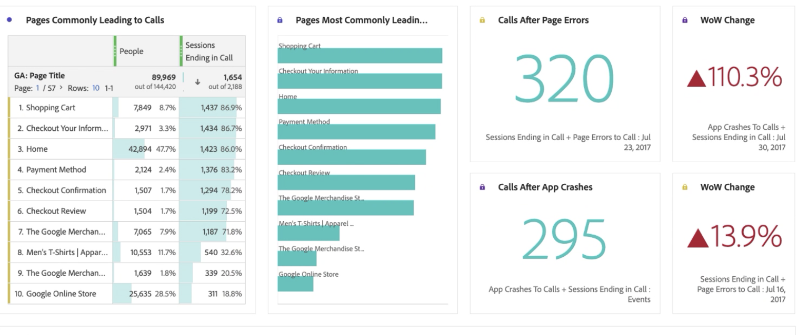
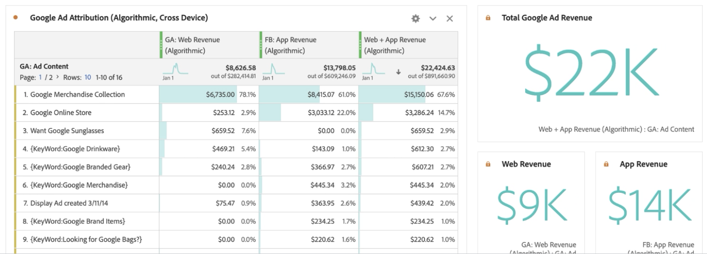

# Rapport over gegevens over Googles Analytics

Zodra u gegevens beschikbaar in Customer Journey Analytics hebt, verstrekken de volgende voorbeelden nuttige scenario&#39;s voor het melden van die gegevens.

## Webgegevens en toepassingsgegevens visualiseren als gecombineerde gegevenssets

Dit diagram van Venn toont de overlapping van gebruikers op uw website (van uw gegevens van Googles Analytics) en op uw mobiele app (van uw gegevens van de Vuurstand) en van uw callcenter. U kunt ook de best presterende producten zien, niet alleen op het web, maar ook in de mobiele app. U kunt zelfs de totale opbrengst van allebei krijgen door berekende metrisch te gebruiken. De belangrijkste producten vertellen een ander verhaal als je kijkt naar de gecombineerde inkomsten. Zonder de gecombineerde datasets zou je nooit hebben geweten dat de &#39;Twill cap&#39; zo&#39;n sterke performer was.

## Identificeer vraagredenen en verminder vraagvolume

U kunt de tijd van het vraagcentrum die in de laatste twee maanden wordt doorgebracht om vraagvolume te bepalen. In het volgende voorbeeld worden deze gegevens weergegeven die in de afgelopen twee maanden zijn doorgestuurd. Het volgende voorbeeld laat een stijgende trend zien, die organisatorische kosten kan beïnvloeden.

Het gebruik van de dimensie &#39;Roepreden&#39; kan wijzen op manieren om de webervaring te verbeteren, die mensen verhinderen in de eerste plaats te roepen. Het bovenstaande voorbeeld toont aan dat &quot;het product van de Schade&quot;een gemiddelde vraagtijd van bijna 3 minuten per vraag heeft, die uw organisatie een nauwkeurige manier geeft om de klantenervaring te verbeteren en vraagcentrum kosten te drijven.

U kunt bekijken welke producten de meeste vraag aan uw vraagcentrum veroorzaken en hoeveel klanten die vraag maakten. De bellengrafiek laat zien dat 20.000 mensen die gebeld werden, meer dan 4 uur 30 minuten doorbrachten en 33 eenheden van het product &quot;Men&#39;s short-hoes Tee&quot; teruggaven.

Wanneer u een afmetingsuitsplitsing van &#39;Oproepreden&#39; toepast, wordt in het voorbeeld een dimensie-item &#39;Beschadigd product&#39; weergegeven. De volgende stap zou zijn om de afdeling kwaliteitscontrole te contacteren en te zien waarom klanten beschadigde T-shirts hebben ontvangen.

U kunt bekijken welke websitepagina&#39;s vraag aan het vraagcentrum leidden. Dit rapport laat u weten waar de minder optimale ervaringen op de website zijn en helpt uw productmanagers deze uitdagingen op te lossen. Het volgende voorbeeld gebruikt berekende metrisch met een model van de deelnemingsattributie om de gegevens te filtreren neer aan slechts zittingen die met een vraag van het vraagcentrum beëindigden.

In het volgende voorbeeld wordt getoond dat de pagina&#39;s &quot;Winkelwagentje&quot; en &quot;Afhandelingsinformatie&quot; de meeste aanroepen aandrijft.

De cohortlijst staat u toe om te zien hoe lang het typisch voor gebruikers duurt om het vraagcentrum te roepen nadat het hebben de website bezocht. Het volgende voorbeeld wijst erop dat de gemiddelde tijd voor deze voorbeelddataset tussen drie tot vier weken is.

## Geavanceerde marketingtoewijzing gebruiken

Met Customer Journey Analytics kunt u geavanceerde attributiemodellen gebruiken voor gegevens over meerdere kanalen. In het volgende voorbeeld ziet u een vergelijking van het toepassen van Laatste aanraking, eerste aanraking, u-vormig, en algoritmische attributie van opbrengst aan de dimensie van de Groepering van het Kanaal van Googles Analytics.

Met behulp van een berekende maatstaf kunt u die toewijzing toepassen op uw webinkomsten, inkomsten uit mobiele apps en zelfs de geretourneerde producten verwijderen. Dientengevolge, kunt u ware netto opbrengst voor elk marketing kanaal zien.

Met Attribution IQ kunt u ook uw gegevens filteren. De attributie kan alleen worden weergegeven op basis van specifieke sets gebruikers, zoals gebruikers die meerdere apparaten gebruiken.

U kunt ook uw Web- en App-inkomsten toewijzen aan uw Google Ad Content. Het voorbeeld van deze dataset heeft meer inkomsten gekregen van de mobiele app die wordt aangestuurd door online Google Ads dan van het web. Door advertenties te sorteren op het web en op app-inkomsten krijgt u een ander beeld van wat uw best presterende Google-advertenties waren.

Door gegevenssets te combineren in Customer Journey Analytics, kunt u in dit voorbeeld zien dat online advertenties enig effect hadden op producten die zijn aangeschaft op uw mobiele app. De volgende visualisatie laat zien dat inkomsten uit mobiele apps van Google Ads een extra $14k - $15k vertegenwoordigen, in vergelijking met alleen het web.

