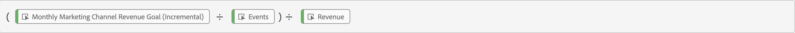

# Gebruik afgeleide gebieden om over doelstellingen te rapporteren

Dit gebruiksgeval beschrijft hoe te om de macht van afgeleide gebieden te gebruiken om doelstellingen voor een specifieke dimensie te plaatsen en dan deze doelstellingen in uw project van de Werkruimte te gebruiken.

Als u niet vertrouwd bent met afgeleide gebieden, verwijs naar [zelfstudie](https://experienceleague.adobe.com/docs/customer-journey-analytics-learn/tutorials/data-views/derived-fields-in-cja.html?lang=en) en [documentatie](../data-views/derived-fields/derived-fields.md) voor een inleiding.

## Doelstellingen definiëren

Als u doelen wilt definiëren, maakt u een nieuw afgeleid veld waarin u expliciet aangepaste numerieke waarden rechtstreeks of onrechtstreeks instelt met behulp van de waarden die het resultaat zijn van regels die eerder in uw afgeleide velddefinitie zijn opgenomen.

### Doelstellingen voor maandelijkse Cadeaubonnen

U wilt uitdrukkelijk doelstellingen voor uw bevelen van het giftecertificaat voor vier maanden, die van juli 2023 - oktober 2023 lopen plaatsen. Dit doet u als volgt:

1. Een nieuw afgeleid veld met de naam maken `Monthly Gift Certificate Orders Goal (Incremental)`.

1. Statische waarden instellen met een CASE WHERE-REGEL voor elke maand door een **[!UICONTROL Custom numeric value]**. Zie de regel Maandelijkse Productdoelen hieronder.

   

### Doelstellingen van inkomsten uit marketingkanalen

U wilt een maandelijks inkomstendoel voor elk van uw marketing kanalen plaatsen. Dit doet u als volgt:

1. Een nieuw afgeleid veld maken met de opdracht [Sjabloon voor marketingkanalen](/help/data-views/derived-fields/derived-fields.md#marketing-channels) met de naam `Monthly Marketing Channel Revenue Goal (Incremental)`.

1. Definieer alle regels om alle marketingkanalen correct te identificeren op basis van een combinatie van URL PARSE en CASE WHEN-regels. Bijvoorbeeld:

   

1. Expliciet statische waarden, die maandelijkse opbrengstdoelstellingen vertegenwoordigen, voor de specifieke marketing kanalen in definitiefGEVAL WANNEER regel, door te plaatsen **[!UICONTROL Custom numeric value]**. Zie de [!DNL Monthly Goal] lijn hieronder.

   

## Doelen gebruiken

Om doelstellingen in uw project van de Werkruimte te gebruiken, gebruikt u de berekende metrische functionaliteit om het afgeleide gebied terug naar zijn originele statische waarde &quot;te normaliseren. Deze normalisatie wordt vereist aangezien de statische waarden u voor de afgeleide gebieden die doelstellingen bepalen, met elke gebeurtenis worden verhoogd.

### Doelstellingen voor maandelijkse Cadeaubonnen

1. Een berekend metrisch veld maken met de naam `Monthly Gift Certificate Orders Goal`, gedefinieerd als:

   

1. U kunt bijvoorbeeld aanvullende berekende velden maken `% of Monthly Gift Certificate Orders Goal`om de werkelijke vooruitgang ten opzichte van de doelstellingen te laten zien, bijvoorbeeld:

   

U kunt deze berekende metriek gebruiken om over vooruitgang in vrije vormlijsten en visualisaties te rapporteren. Bijvoorbeeld:

### Doelstellingen van inkomsten uit marketingkanalen

1. Een berekend metrisch veld maken met de naam `Marketing Channel Revenue Goal`, gedefinieerd als:

   

1. U kunt bijvoorbeeld aanvullende berekende velden maken `% of Marketing Channel Revenue Goal`om de werkelijke vooruitgang ten opzichte van de doelstellingen te laten zien, bijvoorbeeld:

   

U kunt deze berekende metriek gebruiken om over vooruitgang in vrije vormlijsten en visualisaties te rapporteren. Bijvoorbeeld:

