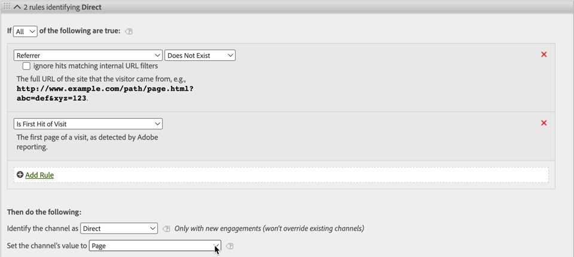
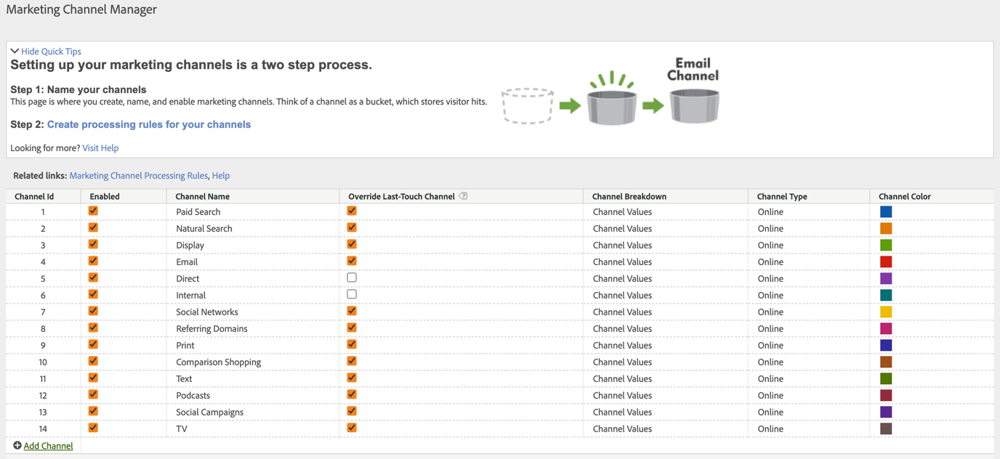
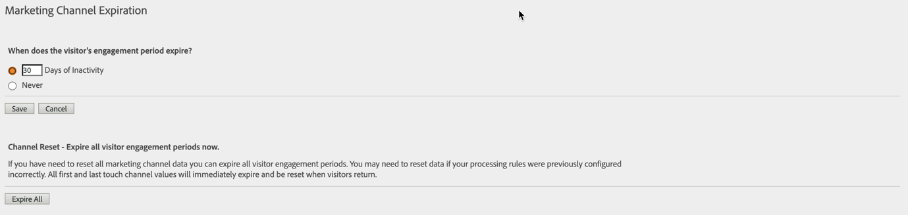

# Marketingkanaalafmetingen gebruiken in Adobe Experience Platform

Als uw organisatie [Analytics Data Connector](https://docs.adobe.com/content/help/en/experience-platform/sources/connectors/adobe-applications/analytics.html) gebruikt om rapportreeksgegevens in CJA te brengen, kunt u een verbinding in CJA vormen om op de dimensies van het Kanaal van de Marketing te rapporteren.

## Vereisten

* Gegevens uit de rapportsuite moeten al in Adobe Experience Platform worden geïmporteerd met de [Gegevensconnector voor analysemogelijkheden](https://docs.adobe.com/content/help/en/experience-platform/sources/connectors/adobe-applications/analytics.html). Andere gegevensbronnen worden niet ondersteund, omdat marketingkanalen vertrouwen op verwerkingsregels in een Analytics-rapportsuite.
* De verwerkingsregels voor marketingkanalen moeten al zijn ingesteld. Zie [Verwerkingsregels voor het in de handel brengen van Kanalen](https://docs.adobe.com/content/help/en/analytics/components/marketing-channels/c-rules.html) in de traditionele gids van de Componenten van Analytics.

## Schema-elementen marketingkanaal

Zodra u de Verbinding van Gegevens van de Analyse op een gewenste rapportreeks vestigt, wordt een schema XDM gecreeerd voor u. Dit schema bevat alle analytische afmetingen en metriek als onbewerkte gegevens. Deze onbewerkte gegevens bevatten geen kenmerk of persistentie. In plaats daarvan, loopt elke gebeurtenis door de verwerkingsregels van het marketing kanaal en registreert de eerste regel het aanpast. U geeft kenmerk en persistentie op wanneer u een gegevensweergave maakt in CJA.

1. [Creeer een ](/help/connections/create-connection.md) verbinding die een dataset omvat die op de Verbinding van Gegevens van de Analyse wordt gebaseerd.
2. [Maak een ](/help/data-views/create-dataview.md) gegevensweergave met de volgende afmetingen:
   * **`channel.typeAtSource`**: Equivalent met de dimensie  [Marketing ](https://docs.adobe.com/content/help/en/analytics/components/dimensions/marketing-channel.html) channelle.
   * **`channel._id`**: Gelijk aan de details van het  [marketingkanaal](https://docs.adobe.com/content/help/en/analytics/components/dimensions/marketing-detail.html)
3. Geef elke dimensie het gewenste attributiemodel en de persistentie. Als u zowel eerste als laatste aanraakafmetingen wilt, sleept u elke dimensie van het marketingkanaal meerdere keren naar het gebied met componenten. Geef elke dimensie het gewenste attributiemodel en de persistentie. Adobe raadt ook aan om elke dimensie een weergavenaam te geven om het gebruik in Workspace te vereenvoudigen.
4. Maak de gegevensweergave.

De afmetingen van uw marketingkanaal zijn nu beschikbaar voor gebruik in Analysis Workspace.

## Verschillen in verwerking en architectuur

>[!IMPORTANT]
>
>Er zijn verscheidene fundamentele gegevensverschillen tussen de gegevens van de rapportreeks en Platform. Adobe raadt u ten zeerste aan om de verwerkingsregels voor marketingkanalen van uw rapportsuite aan te passen om een correcte gegevensverzameling in Platform te vergemakkelijken.

De montages van het de verkoopkanaal werken verschillend tussen de gegevens van het Platform en rapportsuite gegevens. Houd rekening met de volgende verschillen bij het instellen van marketingkanalen voor CJA:

* **Is eerste pagina van Bezoek**: Deze regelcriteria gelden voor verschillende standaarddefinities van marketingkanalen. Een verwerkingsregel die deze criteria bevat, wordt in het Platform genegeerd (andere criteria in dezelfde regel blijven van toepassing). De zittingen worden bepaald bij de tijd van de gegevensvraag in plaats van op het tijdstip van gegevensinzameling, verhinderend Platform deze specifieke regelcriteria te gebruiken. Adobe raadt aan de criteria &#39;Is First Page of Visit&#39; te verwijderen uit elke regel voor verwerking van marketingkanalen.

   

* **Laatste aanraakkanaal** overschrijven: Deze instelling in de Marketing Channel Manager voorkomt normaal gesproken dat bepaalde kanalen het laatste aanraakkanaalkrediet krijgen. Platform negeert deze instelling, waardoor brede kanalen zoals Direct of Intern op mogelijk ongewenste manieren naar metriek kunnen worden gekarakteriseerd. Adobe raadt aan kanalen te verwijderen waarvoor Laatste aanraakkanaal overschrijven is uitgeschakeld.
   * U kunt het marketingkanaal &#39;Direct&#39; verwijderen in de Marketing Channel Manager en vervolgens vertrouwen op het &#39;Geen waarde&#39;-dimensie-item van CJA voor dat kanaal. U kunt dit afmetingspunt aan &quot;Direct&quot;ook anders noemen of het afmetingspunt volledig uitsluiten wanneer het vormen van een gegevensmening.
   * U kunt ook een classificatie voor marketingkanalen maken, waarbij elke waarde naar zichzelf wordt geclassificeerd, behalve voor kanalen die u in CJA wilt uitsluiten. U kunt deze classificatiedimensie dan gebruiken wanneer het creëren van een gegevensmening in plaats van `channel.typeAtSource`.

   

* **Verlopen marketingkanaal**: Deze instelling voor de serviceperiode bepaalt de periode van inactiviteit voordat een bezoeker een nieuw eerste aanraakkanaal in de rapportsuite-gegevens kan verkrijgen. Platform gebruikt eigen attributie-instellingen, zodat deze instelling volledig wordt genegeerd in CJA.

   

## Gegevens tussen CJA en traditionele Analytics vergelijken

Omdat de architectuur van Adobe Experience Platform anders is dan een traditionele Analytics-rapportensuite, zijn de resultaten niet gegarandeerd gelijk aan elkaar. U kunt echter de volgende tips gebruiken om deze vergelijking eenvoudiger te maken:

* Controleer of de architecturale verschillen die hierboven zijn vermeld, geen invloed hebben op uw vergelijking. Dit omvat het verwijderen van kanalen die het laatste aanraakkanaal niet overschrijven, en het verwijderen van regelcriteria die het eerste aanraakpunt van een bezoek (sessie) zijn.
* Controleer tweemaal of uw verbinding de zelfde rapportreeks zoals traditionele Analytics gebruikt. Als uw verbinding CJA veelvoudige rapportreeksen met hun eigen de verwerkingsregels van het Kanaal van de Marketing bevat, is er geen gemakkelijke manier om het met traditionele Analytics te vergelijken. U zou een afzonderlijke verbinding voor elke rapportreeks willen tot stand brengen om gegevens te vergelijken.
* Zorg ervoor dat u de zelfde datumwaaiers vergelijkt, en dat de tijdzone die in uw gegevensmening plaatst het zelfde als de tijdzone van de rapportreeks is.
* Gebruik een model van de douaneattributie wanneer het bekijken van de gegevens van de rapportreeks. Gebruik bijvoorbeeld de [Marketing channel](https://experienceleague.adobe.com/docs/analytics/components/dimensions/marketing-channel.html)-dimensie met meetgegevens die een niet-standaard attributiemodel gebruiken. Adobe adviseert tegen het vergelijken van de standaardafmetingen [First touch channel](https://experienceleague.adobe.com/docs/analytics/components/dimensions/first-touch-channel.html) of [Last touch channel](https://experienceleague.adobe.com/docs/analytics/components/dimensions/last-touch-channel.html), omdat zij op attributie baseren die in de rapportreeks wordt verzameld. CJA vertrouwt niet op de toewijzingsgegevens van een rapportsuite; in plaats daarvan, wordt het berekend wanneer een CJA- rapport in werking wordt gesteld.
* Sommige metriek hebben geen redelijke vergelijking wegens architecturale verschillen tussen de gegevens van de rapportreeks en de gegevens van het Platform. Voorbeelden zijn bezoeken/sessies, bezoekers/personen en voorvallen/gebeurtenissen.
